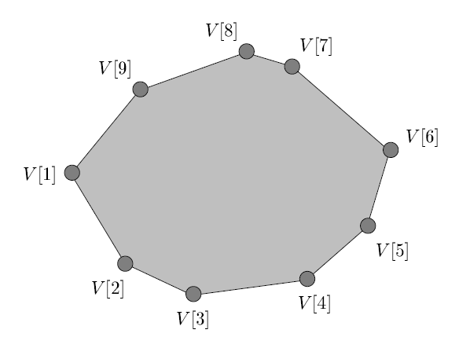

# Problem Unimodal Search

An array $A[1..n]$ is **unimodal** if it consists of an increasing sequence followed by a decreasing sequence, or more precisely, if there is an index $m\in\left\{1,2,...,n\right\}$ such that

- $A[i] < A[i+1]$ for all $ 1\leqslant i < m $, and

- $A[i] > A[i+1]$ for all $ m\leqslant i < n $.

In particular, $A[m]$ is the maximum element, and it is the unique “locally maximum” element surrounded by smaller elements ($A[m-1]$ and $A[m+1]$).

**(a)**     Give an algorithm to compute the maximum element of a unimodal input array $A[1..n]$ in $O(lgn)$ time. Prove the correctness of your algorithm, and prove the bound on its running time.

A polygon is **convex** if all of its internal angles are less than $180^{\circ}$ (and none of the edges cross each other).  **Figure 1** shows an example.  We  represent a convex polygon as  an array $V[1..n]$ where each element of the array represents a vertex of the polygon in the form of a coordinate pair $(x,y)$. We  are told that $V[1]$ is the vertex with the minimum $x$ coordinate and that the vertices are ordered counterclockwise, as in the figure.  You may also assume that the $x$ coordinates of the vertices are all distinct, as are the $y$ coordinates of the vertices

**Figure 1**:  An example of a convex polygon represented by the array $V[1..9]$ . $V[1]$ is the vertex with the minimum $x$-coordinate, and $V[1..9]$ are ordered counterclockwise.

**(b)**     Give an algorithm to find the vertex with the maximum $x$ coordinate in $O(lgn)$ time.

**(c)**     Give an algorithm to find the vertex with the maximum $y$ coordinate in $O(lgn)$ time.