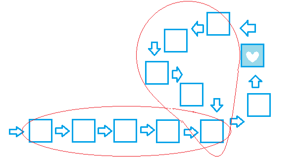

[TOC]

------

# 0. Preface

### 动态集合

- 在算法操作的整个过程中能够增大、减小或发生其他变化的集合。

### 动态集合的元素

- 一种很典型的实现，集合中的每一个元素均由一个对象来表示，并存在一个 指向对象的指针，对集合中元素的各个属性进行检查和操作。

### 动态集合上的操作

- 分为两类：简单返回有关集合信息的查询操作和改变集合的修改操作。
  - `Search(S,x) Insert(S,x) Delete(S,x) Minimum(S) Maximum(S) Successor(S,x) Predecessor(S,x)`

------

# 1. Basic Data Structure

## 栈（Stack）和队列（Queue）

### 概述

- 栈实现的是一种后进先出（last-in&first-out）策略，而队列实现的是一种先进先出（first-in&first-out）策略。

### 栈

- 栈的基本操作：Insert操作称为压入（Push），Delete操作称为弹出（Pop），查询一个栈是否是否为空的查询操作称为Stack-Empty（试图对空栈的弹出操作被称为下溢（underflow），而对满栈进行压入操作则被称为上溢（overflow））。

- 栈的属性：Stack.top，指向栈顶的最新插入元素的位置。

#### C++实现

```c++
template <class T>

class Stack{
  private:
    enum{
        MAX = 100 //标志栈的大小
    };
    T stack[MAX];
    int StackTop;

  public:
    Stack();
    bool StackEmpty() const;
    bool StackFull() const;
    bool Push(const T &Element);
    bool Pop(T &element);
    ~Stack();
};

template <class T>
Stack<T>::Stack()
{
    StackTop = 0; //栈内无元素
}

template <class T>
bool Stack<T>::StackEmpty() const
{
    return StackTop == 0;
}

template <class T>
bool Stack<T>::StackFull() const
{
    return StackTop == MAX;
}

template <class T>
bool Stack<T>::Push(const T &Element)
{
    if (this->StackFull() == false)
    {
        stack[StackTop++] = Element; //注意运算符的位置
        return true;
    }
    else
        return false;
}

template <class T>
bool Stack<T>::Pop(T &Element)
{
    if (this->StackEmpty() == false)
    {
        Element = stack[--StackTop]; //注意运算符的位置
        return true;
    }
    else
        return false;
}
```


#### 使用实例

- 表达式求值（如生成前缀或后缀表达式）。

### 队列

- 队列的基本操作：Insert操作称为入队（EnQueue），Delete操作称为出队（DeQueue）。

- 队列拥有队头（Queue.head）和队尾（Queue.tail）两个属性，前者指向队列中首位的元素位置，后者指向队列新插入元素的位置。当`Queue.head == Queue.tail`时，队列为空。初始时，二者皆等于首元素编号。

#### C++实现

一般的队列如果

```c++
template <class T>
class Queue
{
  private:
    enum limit
    {
        MAX = 100
    };
    T queue[MAX];
    int QueueHead;
    int QueueTail;
    int size; //用以记录队列中元素的个数

  public:
    Queue();
    bool QueueEmpty() const;
    bool QueueFull() const;
    int QueueSize() const;
    bool EnQueue(const T &Element);
    bool DeQueue(T &Element);
    ~Queue();
};

template <class T>
Queue<T>::Queue()
{
    QueueHead = QueueTail = 0;
    size = 0;
}

template <class T>
bool Queue<T>::QueueEmpty() const
{
    return size == 0;
}

template <class T>
bool Queue<T>::QueueFull() const
{
    return size == MAX;
}

template <class T>
int Queue<T>::QueueSize() const
{
    return size;
}

template <class T>
bool Queue<T>::EnQueue(const T &Element)
{
    if (*this->QueueFull == false)
    {
        queue[QueueTail++] = Element;
        QueueTail = QueueTail % MAX;
        return true;
    }
    else
        return false;
}

template <class T>
bool Queue<T>::DeQueue(T &Element)
{
    if (*this->QueueEmpty == false)
    {
        Element = queue[QueueHead++];
        QueueHead = QueueHead % MAX;
        return true;
    }
    else
        return false;
}
```


#### 使用实例

- 迷宫问题中求解最短路径、图的广度优先遍历。

### 变形

#### 双端队列（Deque）

- 特点是Insert和Delete可在双端进行。
- 可用于判断回文串或类似于回文串的结构。

#### 循环队列（Circular Queue）

- 对于顺序存储结构来说，使用假溢出的方法即可模拟，即利用`((Queue.tail+1)%Queue.maxlength)`。所以最好的存储结构是链式存储结构。

### 思考

- 如何在同一个数组S（大小为n）中实现两个栈，使得当两个栈的元素个数之和都不为n时，二者都不会发生上溢，同时要求Push和Pop操作的运行时间均为$O(1)$。	
  - 满足栈A的首元素位置为数组的S[0]，而栈B的首元素位置为数组的S[n-1]即可。需要注意的是进行Push操作时，判断上溢是基于`StackA.top > StackB.top`和`StackA.top < StackB.top`。
- 如何用两个栈实现一个队列以及用两个队列实现一个栈，分析各操作的时间复杂度。
  - 设有栈A、B，则入队操作可等同于压入栈A，出队操作可等同于先将栈A中所有元素弹出，同时压入栈B，再将栈B的所有元素弹出，除顶端元素外，其余全部再次压入栈A。可知出队操作的$T(n)=2n+2(n-1)=4n-2$，即$O(n)$。
  - 设有队列A、B，则入栈操作可等同于入队A，出栈操作可等同于先将队A中所有元素出队，同时除队尾元素外，其余全部入队B（如果此步操作后元素不再回到队A亦可，则$T(n)=n+n-1=2n-1$，但出栈和入栈操作之前要检查元素在哪个队列。），最后再将队B中所有元素出队并同时入队A。可知出栈操作的$T(n)=n+3(n-1)=4n-3$，即$O(n)$。

## 链表

### 概述

- 相比于数组由下标决定的线性顺序，链表是利用各个对象中的指针来决定的。类型分为带头和不带头，单向、双向和循环。
- 基本操作：ListSearch(L,k) ListInsert(L,k) ListDelete(L,x)

```c++
#include <iostream>
#ifndef LINKLIST_H
#define LINKLIST_H

template <class T>
struct Node
{
    T value;
    Node *next;
};

template <class T>
class LinkList
{
  private:
    Node<T> *phead;
    size_t length;

  public:
    LinkList();
    //头部插入
    void ListInsert(const T &Element);
    //线性搜索某元素并返回指向该元素的指针
    const Node<T> *ListSearch(const T &Element);
    //删除指定元素
    bool ListDelete(const T &Element);
    void ShowList();
    ~LinkList();
};

template <class T>
LinkList<T>::LinkList()
{
    phead = nullptr;
    length = 0;
}

template <class T>
void LinkList<T>::ListInsert(const T &Element)
{
    if (phead == nullptr)
    {
        phead = new Node<T>;
        if (phead == nullptr)
            exit(1);
        phead->value = Element;
        phead->next = nullptr;
        ++length;
    }
    else
    {
        Node<T> *temp = new Node<T>;
        if (temp == nullptr)
            exit(1);
        temp->value = Element;
        temp->next = phead;
        phead = temp;
        ++length;
    }
}

template <class T>
const Node<T> *LinkList<T>::ListSearch(const T &Element)
{
    Node<T> *p = phead;
    while (p != nullptr)
    {
        if (p->value == Element)
            return p;
        else
            p = p->next;
    }
    return nullptr;
}

template <class T>
bool LinkList<T>::ListDelete(const T &Element)
{
    Node<T> *last = phead;
    Node<T> *p = phead;
    while (p != nullptr)
    {
        if (p->value == Element)
        {
            last->next = p->next;
            delete p;
            --length;
            return true;
        }
        else
        {
            last = p;
            p = p->next;
        }
    }
    return false;
}

template <class T>
void LinkList<T>::ShowList()
{
    Node<T> *p = phead;
    if (p == nullptr)
        std::cout << "No element!" << std::endl;
    while (p != nullptr)
    {
        std::cout << p->value << " ";
        p = p->next;
    }
    std::cout << std::endl;
}

template <class T>
LinkList<T>::~LinkList()
{
    while (phead != nullptr)
    {
        Node<T> *temp = phead->next;
        delete phead;
        phead = temp;
    }
}

#endif
```

### 多数组及单数组模拟链表

#### 多数组模拟链表

- 利用三个数组，分别为*next、key、prev*来模拟前驱指针、元素和后继指针。

#### 单数组模拟链表

- 在不支持显式的指针数据类型的编程环境下，我们采用此方法。若管理同构对象，则可用单个数组中相邻的三个元素表示一个结点，即占用一段子数组。三个属性*next、key、prev*所对应的偏移量分别为0、1、2。这种方法很灵活，因为他允许我们将不同长度的对象存储于同一数组中，即管理异构对象，但是偏移量需要额外来记录。

#### 自由表

- 在多数组模拟链表中，各个数组长度为m，且在某一时刻该动态集合内含有$n≤m$个元素，则对于余下$m-n$个对象来说它们是自由的，同时这些自由对象可用来表示将要插入该动态集合的元素。
- 我们将这写自由对象保存在一个单链表中，即只使用*next*，形成一个自由表，自由表的头部保存在全局变量*free*中。需要注意的是该表示中数组中每一个对象都属于任意一个表而不同时属于两个表。
- 自由表的操作类似于栈，有AllocateElement和FreeElement，前者将free指向的第一个结点的对象分配给链表，连接在指定位置；后者将链表删除的结点回收，连接在自由表表头，由free指向。

### 特殊操作

- 判断是否有环
  - 设定两个指针*slow*和*quick*，其中在*slow*和*quick*同时遍历链表的时候，*slow*每次向前移动一步，*quick*每次向前移动两步，如果二者在遍历过程中存在相遇的情况，则链表存在环，否则*quick*先遇nullptr。
  - 因为*slow*和*quick*不是同时进入环，故设链表长$l$，环长$x$，因此在迭代$l-x$次时，二者都进入环，二者相距$l-x $，设在迭代k次时，*slow*向前走了$k$步，而*quick*向前走了$2k$步，*slow*指向$(k-(l-x))mod\ x$，*quick*指向$(2k-(l-x))mod\ x$，当二者相等时，即同余时，相遇。

- 获取成环部分的长度

  - 根据以上的确定的相遇点，再次启动*slow*和*quick*，使之按之前的速度运行，直至下一次相遇，同时记录*slow*走过的结点个数，即为$x$。答案是显然的，由于速度差值始终为$1$，那么相当于二者相距$x$，因此两次相遇间隔即为环长。

- 获取进入环的结点

  - 同样需要第一步得出相遇点，接着使用两个*slow*指针，分别从相遇点和链表头结点出发，直到二者相遇，相遇点即为环的入口结点。

  - 如下图所示❤处为相遇点，设相遇点到入口相距$y$，由第一步可知$2k=k+mx,k=(l-x+y),m\in N+$，即$(m-1)x+x-y=l-x$，而且由二者的相遇可知，一定有*slow*未转过一圈而*quick*转过第二圈的时候，那么$m=1$，故有$x-y=l-x$，我们很显然就可以看出$x-y$和$l-x$的几何意义。

    

- 取单向链表的中间元素

  - 同样使用*slow*和*quick*，则当*quick*遇到nullptr时，*slow*即指向中间元素。

- 单链表逆序(复杂度要求$O(n)$，额外使用的存储空间一定，非递归过程)

  - ```c++
    template <class T>
    void LinkList<T>::ListReverse()
    {
        if (phead == nullptr)
            std::cout << "No element!" << std::endl;
        Node<T> *p = nullptr;
        Node<T> *prev = nullptr;
        while (phead != nullptr) //画图理解更佳，或理解为每次剥离头结点后反向链接
        {
            p = phead;
            phead = p->next;
            p->next = prev;
            prev = p;
        }
        phead = p;
    }
    ```

### 思考（坑）

- 用一个单链表实现一个栈，Push和Pop的复杂度仍为$O(1)$。
  - PUSH - make element list's head，POP - remove list's head，both operations take O(1).
- 用一个单链表实现一个队列，EnQueue和DeQueue的复杂度仍为$O(1)$。
  - Keep two pointers: one will point to the beginning of the list, other to the end.
    - ENQUEUE - insert into end of the list,
    - DEQUEUE - remove list's head.
- 说明如何在每一个元素仅使用一个指针的情况下实现双向链表。
  - Assume that all pointer values can be interpreted as k-bit integers, and define `np[x]` to be `np[x] = next[x] XOR prev[x]`, the k-bit "exclusive-or" of `next[x]` and `prev[x]`. To reach the next node, we can just operate `XOR(np[x],prev[x])`, while to go back to the previous node we can also just operate `XOR(np[x],next[x])`.
- 我们往往希望双向链表的所有元素在存储器中保持紧凑，例如，在多数组表示中占用前$m$个下标位置。（在页式虚拟存储的计算环境下，即为此种情况。）假设除指向链表本身的指针外没有其他指针指向该链表元素，试说明如何实现过程AllocateElement和FreeElement，使得该表示保持紧凑。
  - 
- 设L是一个长度为$n$的双向链表，存储于长度为m的数组*next、key、prev*中。假设这些数组由维护双链自由表F的两个过程AllocateElement和FreeElement进行管理。又假设$m$个元素中，恰有$n$个元素在链表L上，$m-n$个在自由表F上。给定链表L和自由表F，试写出一个过程`CompactifyList(L,F)`，用来移动L中的元素使其占用数组中$1、2、3、……、n$的位置，调整自由表F以保持其正确性，并且占用数组中的$n+1、n+2、……、m$的位置。要求复杂度为$O(n)$，并且使用固定量的额外存储空间。
  - 

## 有根树

### 概述及一种表示法

- 一种链式数据结构，树的结点用对象来表示，每一个结点拥有一个关键字*key*，同时带有k个属性，即指向子结点的指针*child~1~、child~2~......child~k~*，其中k是被限制在一个大的常数以内，但多数结点只有少量孩子的时候，会浪费大量存储空间。
- 为解决以上问题，我们有一种巧妙的方法可以实现分支无限制的有根树——*left-child right-sibling representation*。具体来说，每个结点只有两个指针：
  - `x.left_child`指向结点x最左边的孩子结点
  - `x.right_sibling`指向结点x右侧相邻的兄弟结点
  - 若结点x没孩子，则`x.left_child=NULL`;若结点x是其父节点最右边的孩子，则`x.right_sibling=NULL`

### 二叉树

- 一种特殊的有根树，每个节点仅有两个指向子结点的指针*left、right*，一个指向父结点的指针。

### 思考（坑）

- Write an O(n)-time recursive procedure that, given an n-node binary tree, prints out the key of each node in the tree.
- Write an O(n)-time non-recursive procedure that, given an n-node binary tree, prints out the key of each node in the tree. Use a stack as an auxiliary data structure.

- Write an O(n)-time procedure that prints all the keys of an arbitrary rooted tree with n nodes, where the tree is stored using the left-child, right-sibling representation.
- Write an O(n)-time non-recursive procedure that, given an n-node binary tree, prints out the key of each node. Use no more than constant extra space outside of the tree itself and do not modify the tree, even temporarily, during the procedure.

- The left-child, right-sibling representation of an arbitrary rooted tree uses three pointers in each node: left-child, right-sibling, and parent. From any node, its parent can be reached and identified in constant time and all its children can be reached and identified in time linear in the number of children. Show how to use only two pointers and one boolean value in each node so that the parent of a node or all of its children can be reached and identified in time linear in the number of children.

## 堆

### 概述

- （二叉）堆是一个数组，或者说可以用数组来模拟，同样也可以看做是一种近似完全二叉树（除最底层外，其余层是被排满的，并且是从左向右依次填充）。

- 堆一般包含两个属性：Heap.size和Heap.length ($0\leqslant Heap.size\leqslant Heap.length$)

- 同时对于结点$i$有如下关系：其父结点*parent*数组下标为$parent(i)=[i/2]$；其左儿子*left*右儿子*right*数组下标分别为$left(i)=2i，right(i)=2i+1$。从零计数的话，则为$parent(i)=[(i-1)/2],left(i)=2i+1,right(i)=2i+2$。

- 堆分为两种：最大堆，即除根结点以外的所有结点$i$都满足$Value[parent(i)]\geq Value[i]$；最小堆，即除根结点以外的所有结点$i$都满足$Value[parent(i)]\leq Value[i]$。


### 基本操作

- MaxHeapify()用来维护最大堆的性质
- BuildMaxHeap() 用来构建最大堆
- HeapSort()堆排序

(MinHeapify() BuildMinHeap()实现只需修改不等号即可)

```c++
#include <iostream>
#ifndef HEAP_H
#define HEAP_H

template <class T>
class Heap
{
  private:
    enum
    {
        MAX = 100
    };
    size_t HeapSize;
    size_t HeapLength;
    T *heap;
    void swap(T *A, T *B)
    {
        T temp = *A;
        *A = *B;
        *B = temp;
    }

  public:
    Heap();
    Heap(const T *array, size_t length);
    void MaxHeapify(size_t pos);
    void BuildMaxHeap();
    void HeapSort();
    void ShowMem();
    ~Heap();
};

template <class T>
Heap<T>::Heap()
{
    HeapSize = 0;
    HeapLength = MAX;
    heap = new T[HeapLength];
    if (nullptr == heap)
        exit(1);
}

template <class T>
Heap<T>::Heap(const T *array, size_t length)
{
    HeapSize = length;
    HeapLength = MAX;
    heap = new T[HeapLength];
    if (nullptr == heap)
        exit(1);
    for (int i = 0; i < length; i++)
        *(heap + i) = *(array + i);
}

template <class T>
void Heap<T>::MaxHeapify(size_t pos)
{
    /*递归写法*/

    /* 
    size_t left = 2 * pos + 1;
    size_t right = 2 * pos + 2;
    size_t large = pos;
    if (right<HeapSize &&*(heap + right)> * (heap + pos))
        large = right;
    if (left<HeapSize &&*(heap + left)> * (heap + large))
        large = left;
    if (large != pos)
    {
        swap(heap + large, heap + pos);
        MaxHeapify(large);
    }
    */

    /*循环写法*/

    T temp = *(heap + pos);
    size_t child = 2 * pos + 1;
    while (child < HeapSize)
    {
        if (child + 1 < HeapSize && *(heap + child + 1) > *(heap + child))
            ++child; //右儿子更大就用右儿子
        if (*(heap + child) > *(heap + pos))
        {
            *(heap + pos) = *(heap + child);
            pos = child;
            child = 2 * child + 1;
        }
        else
            break;
        *(heap + pos) = temp;
    }
}

template <class T>
void Heap<T>::BuildMaxHeap()
{
    for (int i = HeapSize / 2; i >= 0; i--)
        MaxHeapify(i);
}

template <class T>
void Heap<T>::HeapSort()
{
    size_t temp = HeapSize;
    for (int i = HeapSize - 1; i >= 0; i--)
    {
        swap(heap, heap + i);
        --HeapSize;
        MaxHeapify(0);
    }
    HeapSize = temp;
}

template <class T>
void Heap<T>::ShowMem()
{
    for (int i = 0; i < HeapSize; i++)
        std::cout << *(heap + i) << " ";
    std::cout << std::endl;
}

template <class T>
Heap<T>::~Heap()
{
    delete heap;
}

#endif
```

### 优先队列（Priority Queue）

- 堆的常见应用，一种用来维护一组元素所构成的集合S的数据结构，其中每一个元素都有一个关键字*key*，有时是优先级。

- 常见操作：（最大优先队列）

  - Insert()用来把元素插入堆，即$S\cap \{ x\}$
  - Maximum()返回最大关键字
  - ExtractMax()删除最大关键字
  - IncreaseKey()将指定元素的关键字增加到指定值

  最小优先队列同理有Insert() Minimum() ExtractMin() DecreaseKey()

```c++

template <class T>
const T &Heap<T>::ExtractMax()
{
    if (HeapSize < 1)
        return 0; //这里应该返回错误
    swap(heap, heap + HeapSize - 1);
    --HeapSize;
    MaxHeapify(0);
    return *(heap + HeapSize);
}

template <class T>
void Heap<T>::IncreaseKey(const T &K, size_t pos)
{
    if (K < *(heap + pos))
        return;
    *(heap + pos) = K;
    size_t i = pos;
    while (i > 0 && *(heap + i / 2) < *(heap + i)) //这里不能等于，否则会死循环
    {
        swap(heap + i, heap + i / 2);
        i = i / 2;
    }
}

template <class T>
void Heap<T>::Insert(const T &Element)
{
    if (HeapSize >= HeapLength)
        return;
    ++HeapSize;
    *(heap + HeapSize - 1) = NegInf; //NegInf的定义如下
    //const int64_t __Neg_Infinity = 0xFFF0000000000000;
    //const double NegInf = *((double *)&__Neg_Infinity);
    //这里取无穷小不是必要的但是很有效，亦可取其他比集合内所有元素都小的值
    IncreaseKey(Element, HeapSize - 1);
}
```

### 思考（坑）

- The operation `HEAP-DELETE(A, i)` deletes the item in node `i `from heap` A`. Give an implementation of HEAP-DELETE that runs in $O(lg n) $time for an $n$-element max-heap.
- A d-ary heap is like a binary heap, but (with one possible exception) non-leaf nodes have d children instead of 2 children.
1. How would you represent a d-ary heap in an array?
2. What is the height of a d-ary heap of n elements in terms of n and d?
3. Give an efficient implementation of `EXTRACT-MAX` in a d-ary max-heap. Analyze its running time in terms of d and n.
4. Give an efficient implementation of `INSERT` in a d-ary max-heap. Analyze its running time in terms of d and n.
5. Give an efficient implementation of `INCREASE-KEY(A, i, k)`, which first sets `A[i] = max(A[i], k) `and then updates the d-ary max-heap structure appropriately. Analyze its running time in terms of d and n.

- An $m × n$ Young tableau is an $m × n$ matrix such that the entries of each row are in sorted order from left to right and the entries of each column are in sorted order from top to bottom. Some of the entries of a Young tableau may be $\infin$, which we treat as nonexistent elements. Thus, a Young tableau can be used to hold $r ≤ mn$ finite numbers.
1. Draw a $4×4$ Young tableau containing the elements $\{ 9, 16, 3, 2, 4, 8, 5, 14, 12 \}$.
2. Argue that an $m × n$ Young tableau $Y$ is empty if $Y[1, 1] = \infin$. Argue that Y is full (contains mn elements) if $Y[m, n] < \infin$.
3. Give an algorithm to implement `EXTRACT-MIN` on a nonempty m × n Young tableau that runs in $O(m + n)$ time. Your algorithm should use a recursive subroutine that solves an m × n problem by recursively solving either an $(m - 1) × n$ or an $m × (n - 1)$ subproblem. (Hint: Think about `MAX-HEAPIFY`.) Define $T(p)$, where $p = m + n$, to be the maximum running time of `EXTRACT-MIN` on any $m × n$ Young tableau. Give and solve a recurrence for $T(p)$ that yields the $O(m + n)$ time bound.
4. Show how to insert a new element into a nonfull $m × n$ Young tableau in $O(m + n)$ time.
5. Using no other sorting method as a subroutine, show how to use an $n × n$ Young tableau to sort $n^2$ numbers in $O(n^3)$ time.
6. Give an $O(m+n)$-time algorithm to determine whether a given number is stored in a given $m × n$ Young tableau.

## 散列表（Hash Table）

### 概述

- 首先引入两个域——关键字全域$U$和实际关键字域$K$，显然有$K\sub U$。对于$K$，我们将数据存储其中，同时需要对其实现高效的字典操作，（普通数组可以直接寻址，是非常快的，哈希表可看做其推广）因而便需要哈希表这种数据结构。

### 直接寻址表

- 当全域$U$的大小较小或者可通过映射关系压缩，同时实际关键字域$K$中没有重复关键字时，我们可以采用一个数组`T[0..n-1]`，来表示$U$，数组中的每一个位置都是一个槽，对应$U$中的一个关键字。如果$K$中不包含关键字为$k$的元素，则`T[k]=NULL`。

### 散列表

- 当$K$比$U$小的多的时候，散列表所占用的空间要小得多。
- 这里我们需要引入一个散列函数$h(k)$，来压缩全域$U$。
- 然而存在一个问题，当我们使用散列函数时，有可能将两个或两个以上的关键字压缩到一个槽里，这种情形称为冲突以下给出几种避免冲突的方法。
  - 链接法，具体实现的描述与思考的第二题差不多，即将散列到同一槽中的元素用链表串起来。以下对其进行分析：
    - 我首先假定一个散列表$T$，，它含有$m$个槽位，能够存放$n$个元素，那么对于这样一个散列表，我们引入装载因子$α=n/m$，从公式来看，它表示一个链平均存储的元素个数。
    - 以下我们假设任何一个给定元素能够等可能地散列到$m$个槽中的任何一个，且与其他元素被散列的情况无关，这种散列被称作为简单均匀散列。
    - 对于$j=0,1,...,m-1$，列表$T[j]$的长度用$n_j$表示，于是有$n=n_0+n_1+...+n_{m-1}$，同时我们可以得出对于$n_j$的期望值即为装载因子$α$。
    - 进而假定在$O(1)$时间内计算出散列值$h(k ) $，从而查找关键字为$k$的元素所需要的时间依赖于表的$T[h(k)]$槽的链表长度$n_{h(k)}$，据此我们很容易推知，在以上假设下，一次不成功的查找耗时$O(1+α)$。
    - 进而我们考虑一次成功的查找耗时，对于$n$个元素而言被查找的概率是等可能的，同时，此处利用期望值的线性性很简单即可推得。（这个地方还没搞清楚怎么推的。。。）

#### 散列函数（坑）

##### 一个好的散列函数的特点

- 满足或近似满足简单均匀散列假设
- 将相近的符号散列到相同槽中的可能性最小化，如*pt*和*pts*
- 其导出的散列值应在某种程度上独立于数据可能存在的任何模式

##### 将关键字转化为自然数

- 利用ASCII字符集设计映射关系即可，如$p=112,t=116$，然后以128为基数，*pt*即可表示为$(112*128)+116=14452$。

##### 几个散列函数实例

- 除法散列法
  - 将关键词$k$散列到$m$个槽上去，可设计散列函数$h(k)=k\ modm$。
  - $m$的取法要注意，最好不是$2$的幂，而常常选择一个不太接近$2$的幂的素数，同时考虑每条链的长度。
- 乘法散列法
- 全域散列法
- [康托展开与逆康托展开]()
- MD5算法

### 开放寻址法（挖坑待填）

### 完全散列

### 基本操作

``` c++

```

### 思考（坑）

- A **bit vector** is simply an array of bits (0's and 1's). A bit vector of length $m$ takes much less space than an array of m pointers. Describe how to use a bit vector to Represent a Dynamic Set of Distinct Elements with no Satellite Data. Dictionary Operations Should Run in $O(1)$ Time.

  - 这很简单，当某个槽含有数据只需将对应的位置为1，不含则置为0，当需要查找某一元素时，只需使用位运算即可，设置合适的掩码取出相对应的位置的位进行判断。

- Suggest how to implement a direct-address table in which the keys of stored elements do not need to be distinct and the elements can have satellite data. All three dictionary operations (INSERT, DELETE, and SEARCH) should run in $O(1)$ time. (Don't forget that DELETE takes as an argument a pointer to an object to be deleted, not a key.)

  - 该直接寻址表以一个指针数组为基础，每一个槽都连接一个双向链表，每一根链表存储具有同一关键字的元素，链表的每一个结点都表示一个含有不同卫星数据的元素，查找时要同时比对关键字和卫星数据。

- We wish to implement a dictionary by using direct addressing on a huge array. At the start, the array entries may contain garbage, and initializing the entire array is impractical because of its size. Describe a scheme for implementing a direct-address dictionary on a huge array. Each stored object should use $O(1)$ space; the operations SEARCH, INSERT, and DELETE should take $O(1)$ time each; and the initialization of the data structure should take $O(1)$ time. (Hint: Use an additional stack, whose size is the number of keys actually stored in the dictionary, to help determine whether a given entry in the huge array is valid or not.)
  - We denote the huge array by `T` and, taking the hint, we also have a stack implemented by an array `S`. The size of `S` equals the number of keys actually stored, so that `S` should be allocated at the dictionary‘s maximum size. The stack has an attribute `top[S]`, so that only entries `S[1 . . top[S]]` are valid.

  - The idea of this scheme is that entries of `T` and `S` validate each other. If key `k` is actually stored in `T` , then `T [k]` contains the index, say `j` , of a valid entry in `S`, and`S[ j ]` contains the value k. Let us call this situation, in which `1 ≤ T [k] ≤ top[S]`,`S[T [k]] = k`, and `T [S[ j ]] = j`, **a validating cycle**.

  - Assuming that we also need to store pointers to objects in our direct-address table, we can store them in an array that is parallel to either `T` or `S`. Since `S` is smaller than `T` , we'll use an array `_S`, allocated to be the same size as `S`, for these pointers. Thus, if the dictionary contains an object `x` with key `k`, then there is a validating cycle and `_S[T [k]]` points to `x`.

  - The operations on the dictionary work as follows:
      - Initialization: Simply set `top[S] = 0`, so that there are no valid entries in the stack.

      - SEARCH: Given key `k`, we check whether we have a validating cycle, i.e., whether `1 ≤ T [k] ≤ top[S]` and `S[T [k]] = k`. If so, we return `_S[T [k]]`, and otherwise we return NULL.

      - INSERT: To insert object `x` with key `k`, assuming that this object is not already in the dictionary, we increment `top[S]`, set `S[top[S]] = k`, set `_S[top[S]] = x`, and set `T [k] = top[S]`.

      - DELETE: To delete object `x` with key `k`, assuming that this object is in the dictionary, we need to break the validating cycle. The trick is to also ensure that we don't leave a 'hole' in the stack, and we solve this problem by moving the top entry of the stack into the position that we are vacating and then fixing up that entry's validating cycle. That is, we execute the following sequence of assignments:

        ```c++
        S[T [k]] = S[top[S]];
        _S[T [k]] = _S[top[S]];
        T [S[T [k]]] = T [k];
        T [k] = 0;
        top[S] = top[S] − 1;
        ```

  - Each of these operations (Initialization, SEARCH, INSERT, and DELETE) takes $O(1)$ time.

## 二叉搜索树

### 概述

- 对于二叉搜索树整体来说， 每一个对象即为树中的一个结点，包含五个属性：*key,left,right,parent,data*，同时对任意一个结点来说满足条件：所有左子叶结点的*key*值均小于该结点，所有右子叶结点的*key*值都大于该结点（假设没有相等的）。

### 基本操作

- TreeSearch()
- TreeMax() TreeMin()
- TreeSuccessor() TreePredecessor()
- TreeInsert() TreeDelete()
- TransPlant() 该操作是在二叉搜索树内移动子树的方法，用在TreeDelete()中。

---

#### 类定义：

```c++
#include <iostream>
#ifndef BINARYSEARCHTREE_H
#define BINARYSEARCHTREE_H

struct Node
{
  size_t key;
  Node *parent;
  Node *left;
  Node *right;
};

class BST
{
private:
  Node *Root;
  size_t TreeSize;

public:
  //创建二叉树，无初始数据
  BST();
  //获取树的大小
  size_t GetTreeSize();
  //创建二叉树，初始数据
  BST(const size_t *array, size_t length);
  //中序遍历,从头开始
  void TraversalInOrder();
  //中序遍历,从指定结点开始
  void TraversalInOrder(const Node *begin);
  //具体对象查找
  const Node *TreeSearch(const Node &object);
  //最大值查找
  const Node *TreeMax(const Node *node);
  const Node *MAX();
  //最小值查找
  const Node *TreeMin(const Node *node);
  const Node *MIN();
  //查找后继
  const Node *TreeSuccessor(const Node *node);
  //查找前驱
  const Node *TreePredecessor(const Node *node);
  //插入结点
  void TreeInsert(const size_t &object);
  //“移植”
  void TransPlant(const Node *node, Node *replace);
  //删除结点
  void TreeDelete(const Node *node);
  //后序遍历删除树
  void TraversalPreOrderDelete();
  void TraversalPreOrderDelete(const Node *begin);
  //销毁树
  ~BST();
};

#endif
```
---

#### 具体实现：


```c++
#include "BinarySearchTree.h"
BST::BST()
{
    Root = nullptr;
    NodeNum = 0;
}

size_t BST::TreeSize()
{
    return NodeNum;
}

BST::BST(const size_t *array, size_t length)
{
    Root = new Node;
    NodeNum = 0;
    Root->key = *(array + length / 2);
    Root->parent = Root->left = Root->right = nullptr;
    for (int i = 0; i < length; i++)
        if (i != length / 2)
            TreeInsert(*(array + i));
}
```

---
#### 中序遍历：(坑)

```c++
void BST::TraversalInOrder()
{
    const Node *trail = Root;
    if (trail != nullptr)
    {
        TraversalInOrder(trail->left);
        std::cout << trail->key << " ";
        TraversalInOrder(trail->right);
    }
}

void BST::TraversalInOrder(const Node *begin)
{
    if (begin != nullptr)
    {
        TraversalInOrder(begin->left);
        std::cout << begin->key << " ";
        TraversalInOrder(begin->right);
    }
}
```
---
#### 查找：(坑)

```c++
const Node *BST::TreeSearch(const Node &object)
{
    Node *trail = Root;
    //迭代写法
    while (trail != nullptr && trail->key != object.key)
    {
        if (object.key < trail->key)
            trail = trail->left;
        else
            trail = trail->right;
    }
    return trail;
}

const Node *BST::TreeMax(const Node *node)
{
    while (node->right != nullptr)
        node = node->right;
    return node;
}

const Node *BST::MAX()
{
    const Node *trail = Root;
    return TreeMax(trail);
}

const Node *BST::TreeMin(const Node *node)
{
    while (node->left != nullptr)
        node = node->left;
    return node;
}

const Node *BST::MIN()
{
    const Node *trail = Root;
    return TreeMax(trail);
}

const Node *BST::TreeSuccessor(const Node *node)
{
    if (node->right != nullptr)
        return TreeMin(node->right);
    const Node *Successor = node->parent;
    while (Successor != nullptr && node == Successor->right)
    {
        node = Successor;
        Successor = Successor->parent;
    }
    return Successor;
}

const Node *BST::TreePredecessor(const Node *node)
{
    if (node->left != nullptr)
        return TreeMax(node->left);
    const Node *Predecessor = node->parent;
    while (Predecessor != nullptr && node == Predecessor->left)
    {
        node = Predecessor;
        Predecessor = Predecessor->parent;
    }
    return Predecessor;
}
```
---
#### 插入：(坑)

```c++
void BST::TreeInsert(const size_t &object)
{
    Node *NewObject = new Node; //创建新的结点
    if (NewObject == nullptr)
        exit(1);
    NewObject->key = object;
    NewObject->left = NewObject->right = NewObject->parent = nullptr;

    Node *trail = nullptr;
    Node *path = Root;
    while (path != nullptr)
    {
        trail = path;
        if (NewObject->key < path->key) //保证二叉树的性质
            path = path->left;
        else
            path = path->right;
    }
    NewObject->parent = trail;
    if (trail == nullptr)
        this->Root = NewObject;
    else if (NewObject->key < trail->key)
        trail->left = NewObject;
    else
        trail->right = NewObject;
    ++NodeNum;
}
```

---
#### 删除：(坑)

```c++
void BST::TransPlant(const Node *node, Node *replace)
{
    if (node->parent == nullptr) //说明是空树
        Root = replace;
    else if (node == node->parent->left) //以下是将需删除的结点脱离母树
        node->parent->left = replace;
    else
        node->parent->right = replace;
    if (replace != nullptr)
        replace->parent = node->parent;
}

void BST::TreeDelete(const Node *node) //复杂的三种情况判断
{
    if (node->left == nullptr)
        TransPlant(node, node->right);
    else if (node->right == nullptr)
        TransPlant(node, node->left);
    else
    {
        Node *temp = (Node *)TreeMin(node->right);
        if (temp->parent != node)
        {
            TransPlant(temp, temp->right);
            temp->right = node->right;
            temp->right->parent = temp;
        }
        TransPlant(node, temp);
        temp->left = node->left;
        temp->left->parent = temp;
    }
    delete node;
    --NodeNum;
}

void BST::TraversalPreOrderDelete() //后序遍历可以保证依次删除结点，最后删除根
{
    const Node *trail = Root;
    if (trail != nullptr)
    {
        TraversalPreOrderDelete(trail->left);
        TraversalPreOrderDelete(trail->right);
        TreeDelete(trail);
    }
}

void BST::TraversalPreOrderDelete(const Node *trail)
{
    if (trail != nullptr)
    {
        TraversalPreOrderDelete(trail->left);
        TraversalPreOrderDelete(trail->right);
        TreeDelete(trail);
    }
}

BST::~BST()
{
    TraversalPreOrderDelete();
}
```

### 思考(坑)

- 

## 红黑树

### 概述

- 红黑树是许多平衡搜索树的一种，可以保证在最坏的情况下基本动态集合操作的时间复杂度为$O(lgn)$。
- 红黑树相较于二叉搜索树来说每一个结点都附加了一个性质，颜色，取值范围为*Red*和*Black*，通过对任意一条从根结点出发到叶节点的路径上各结点的颜色进行约束，**红黑树能够保证没有一条路径会比其他所有路径长出$2$倍**，因而是近乎平衡的。
- 红黑树在满足基本的二叉搜索树的性质之外还满足如下的几条性质：
  - 每一个结点的颜色是唯一确定的，或是*Red*，或是*Black*。
  - 根结点是*Black*。
  - 每一个叶结点，即树梢，指向为*Null*的指针，是*Black*。
  - 如果一个结点是*Red*，那么他的两个子结点都是*Black*。
  - 对于每一个结点，从该结点到其所有子结点的所有最短路径上，均包含数目相等的*Black*结点。
- 因为红黑树有除二叉树之外的五条性质，所以需要额外地去维护，操作会复杂很多。

### 基本操作(坑)

#### 类定义：

```c++
#include <iostream>
#ifndef RED_BLACKTREE_H
#define RED_BLACKTREE_H

typedef enum
{
  Red = 1,
  Black = 0
} Color;

struct Node
{
  size_t key;
  Node *parent;
  Node *left;
  Node *right;
  Color color;
};

class RBT
{
private:
  Node *Root;
  Node *TreeNull; //用来收束叶结点，初始时置黑
  size_t TreeSize;

public:
  //创建空树
  RBT();
  //获取树的大小
  size_t GetRBTreeSize();
  //中序遍历,从头开始
  void TraversalInOrder();
  //中序遍历,从指定结点开始
  void TraversalInOrder(const Node *begin);
  //具体对象查找
  Node *RBTreeSearch(const size_t &object);
  //最大值查找
  Node *RBTreeMax(Node *node);
  Node *MAX();
  //最小值查找
  Node *RBTreeMin(Node *node);
  Node *MIN();
  //查找后继
  const Node *RBTreeSuccessor(const Node *node);
  //查找前驱
  const Node *RBTreePredecessor(const Node *node);

  //旋转
  //这里不能使用const指针作为参数，旋转操作是需要对树的局部结构做修改
  void LeftRotate(Node *node);
  void RightRotate(Node *node);

  //维护
  void RBTreeInsertFixUp(Node *Newnode);
  void RBTreeDeleteFixUp(Node *pos);
  void RBTransPlant(const Node *node, Node *replace);

  //插入结点
  void RBTreeInsert(const size_t &object);
  //删除结点
  void RBTreeDelete(Node *node);

  //后序遍历删除树
  void TraversalPreOrderDelete();
  void TraversalPreOrderDelete(Node *trail);
  //销毁树
  ~RBT();
};

#endif
```

#### 二叉树常规操作：

```c++

RBT::RBT()
{
    TreeSize = 0;
    TreeNull = new Node;
    if (TreeNull == nullptr)
        exit(1);
    TreeNull->right = TreeNull->left = TreeNull->parent = nullptr;
    TreeNull->color = Black;

    Root = TreeNull;
}

size_t RBT::GetRBTreeSize()
{
    return TreeSize;
}

void RBT::TraversalInOrder()
{
    const Node *trail = Root;
    if (trail != TreeNull)
    {
        TraversalInOrder(trail->left);
        std::cout << trail->key << " ";
        TraversalInOrder(trail->right);
    }
}

void RBT::TraversalInOrder(const Node *begin)
{
    if (begin != TreeNull)
    {
        TraversalInOrder(begin->left);
        std::cout << begin->key << " ";
        TraversalInOrder(begin->right);
    }
}

Node *RBT::RBTreeSearch(const size_t &object)
{
    Node *trail = Root;
    //迭代写法
    while (trail != TreeNull && trail->key != object)
    {
        if (object < trail->key)
            trail = trail->left;
        else
            trail = trail->right;
    }
    if (trail == TreeNull)
        return nullptr;
    else
        return trail;
}

Node *RBT::RBTreeMax(Node *node)
{
    while (node->right != TreeNull)
        node = node->right;
    return node;
}

Node *RBT::MAX()
{
    Node *trail = Root;
    return RBTreeMax(trail);
}

Node *RBT::RBTreeMin(Node *node)
{
    while (node->left != TreeNull)
        node = node->left;
    return node;
}

Node *RBT::MIN()
{
    Node *trail = Root;
    return RBTreeMax(trail);
}

const Node *RBT::RBTreeSuccessor(const Node *node)
{
    if (node->right != TreeNull)
        return RBTreeMin(node->right);
    const Node *Successor = node->parent;
    while (Successor != TreeNull && node == Successor->right)
    {
        node = Successor;
        Successor = Successor->parent;
    }
    return Successor;
}

const Node *RBT::RBTreePredecessor(const Node *node)
{
    if (node->left != TreeNull)
        return RBTreeMax(node->left);
    const Node *Predecessor = node->parent;
    while (Predecessor != TreeNull && node == Predecessor->left)
    {
        node = Predecessor;
        Predecessor = Predecessor->parent;
    }
    return Predecessor;
}

void RBT::TraversalPreOrderDelete() //后序遍历可以保证依次删除结点，最后删除根和叶
{
    Node *trail = Root;
    if (trail != TreeNull)
    {
        TraversalPreOrderDelete(trail->left);
        TraversalPreOrderDelete(trail->right);
        RBTreeDelete(trail);
    }
}

void RBT::TraversalPreOrderDelete(Node *trail)
{
    if (trail != TreeNull)
    {
        TraversalPreOrderDelete(trail->left);
        TraversalPreOrderDelete(trail->right);
        RBTreeDelete(trail);
    }
}

RBT::~RBT()
{
    TraversalPreOrderDelete();
    delete TreeNull;
}
```

#### 旋转：

- 旋转是红黑树的一项很特殊的操作，用以保持二叉搜索树性质的搜索树局部操作

```c++
void RBT::LeftRotate(Node *node)
{
    if (node->right != TreeNull) //开始判断，右支是否为空
    {
        Node *temp = node->right;
        node->right = temp->left;
        if (temp->left != TreeNull)
            temp->left->parent = node; //交接中间的一支
        temp->parent = node->parent;
        if (node->parent == TreeNull)
            Root = temp;
        else if (node == node->parent->left)
            node->parent->left = temp;
        else
            node->parent->right = temp; //交接父结点
        temp->left = node;              //修改二者关系
        node->parent = temp;
    }
}

void RBT::RightRotate(Node *node)
{
    if (node->left != TreeNull) //开始判断，左支是否为空
    {
        Node *temp = node->left;
        node->left = temp->right;
        if (temp->right != TreeNull)
            temp->right->parent = node; //交接中间的一支
        temp->parent = node->parent;
        if (node->parent == TreeNull)
            Root = temp;
        else if (node == node->parent->left)
            node->parent->left = temp;
        else
            node->parent->right = temp; //交接父结点
        temp->right = node;             //修改二者关系
        node->parent = temp;
    }
}
```

#### 插入与维护：

```c++
void RBT::RBTreeInsertFixUp(Node *Newnode) //前提条件是新插入结点是红色
{
    while (Newnode->parent->color == Red) //这里是判断插入是否影响性质
    {
        if (Newnode->parent == Newnode->parent->parent->left) //隔代判断左右支
        {
            Node *temp = Newnode->parent->parent->right; //叔结点
            if (temp->color == Red)                      //叔结点为红色
            {
                Newnode->parent->color = temp->color = Black; //颜色修正
                Newnode->parent->parent->color = Red;
                Newnode = Newnode->parent->parent;
            }                                           //叔结点为黑色
            else if (Newnode == Newnode->parent->right) //判断是右孩子，通过左旋转成左孩子，合并情况
            {
                Newnode = Newnode->parent;
                LeftRotate(Newnode);
            }
            else //左孩子情况处理
            {
                Newnode->parent->color = Black;
                Newnode->parent->parent->color = Red; //局部性质修正
                RightRotate(Newnode->parent->parent); //通过右旋来维护黑高
            }
        }
        else
        {
            Node *temp = Newnode->parent->parent->left; //叔结点
            if (temp->color == Red)                     //叔结点为红色
            {
                Newnode->parent->color = temp->color = Black; //颜色修正
                Newnode->parent->parent->color = Red;
                Newnode = Newnode->parent->parent;
            }                                          //叔结点为黑色
            else if (Newnode == Newnode->parent->left) //判断是左孩子，通过右旋转成右孩子，合并情况
            {
                Newnode = Newnode->parent;
                RightRotate(Newnode);
            }
            else //右孩子情况处理
            {
                Newnode->parent->color = Black;
                Newnode->parent->parent->color = Red; //局部性质修正
                LeftRotate(Newnode->parent->parent);  //通过左旋来维护黑高
            }
        }
        Root->color = Black;
        //这一句的位置在插入操作之后，怕插入结点在根，其父结点是黑的，无法通过上述操作维护
    }
}

void RBT::RBTreeInsert(const size_t &object)
{
    Node *Newnode = new Node;
    if (Newnode == nullptr)
        exit(1);
    Newnode->key = object;
    Newnode->left = Newnode->right = TreeNull; //这里要注意
    Newnode->parent = nullptr;

    if (Root == TreeNull)
        Newnode->color = Black;
    else
        Newnode->color = Red; //默认插入红色结点

    Node *trail = Root;
    Node *pos = TreeNull; //寻找插入位点
    while (trail != TreeNull)
    {
        pos = trail;
        if (Newnode->key > trail->key)
            trail = trail->right;
        else
            trail = trail->left;
    }

    Newnode->parent = pos; //修改邻近结点的关系
    if (pos == TreeNull)
        Root = Newnode;
    else if (Newnode->key < pos->key)
        pos->left = Newnode;
    else
        pos->right = Newnode;

    ++TreeSize;

    RBTreeInsertFixUp(Newnode); //维护红黑树的整体性质
}
```

#### 删除与维护：

```c++
void RBT::RBTreeDeleteFixUp(Node *pos) //四种情况
{
    while (pos != Root && pos->color == Black) //入口条件指出，维护至根结束
    {
        Node *sibling;
        if (pos == pos->parent->left)
        {
            sibling = pos->parent->right;
            if (sibling->color == Red) //case 1:维护结点的兄弟是红色的，这说明黑高不等
            {
                sibling->color = Black;
                pos->parent->color = Red;
                LeftRotate(pos->parent);
                sibling = pos->parent->right; //新兄弟
            }
            if (sibling->left->color == Black && sibling->right->color == Black) //case 2:兄弟的俩儿子都是黑结点
            {                                                                    //这种情况黑高不等
                sibling->color = Red;
                pos = pos->parent;
            }
            else
            {
                if (sibling->right->color == Black) //case 3:兄弟的俩儿子右黑左红
                {
                    sibling->left->color = Black;
                    sibling->color = Red;         //交换兄弟和左儿子的颜色
                    RightRotate(sibling);         //拧成第四种情况
                    sibling = pos->parent->right; //新兄弟
                }                                 //case 4:兄弟的俩儿子左黑右红
                sibling->color = pos->parent->color;
                pos->parent->color = Black; //交换兄弟和父母的颜色
                sibling->right->color = Black;
                LeftRotate(pos->parent);
                pos = Root;
            }
        }
        else
        {
            sibling = pos->parent->left;
            if (sibling->color == Red)
            {
                sibling->color = Black;
                pos->parent->color = Red;
                RightRotate(pos->parent);
                sibling = pos->parent->left;
            }
            if (sibling->right->color == Black && sibling->left->color == Black)
            {
                sibling->color = Red;
                pos = pos->parent;
            }
            else
            {
                if (sibling->left->color == Black)
                {
                    sibling->right->color = Black;
                    sibling->color = Red;
                    LeftRotate(sibling);
                    sibling = pos->parent->left;
                }
                sibling->color = pos->parent->color;
                pos->parent->color = Black;
                sibling->left->color = Black;
                RightRotate(pos->parent);
                pos = Root;
            }
        }
    }

    pos->color = Black;
}

void RBT::RBTransPlant(const Node *node, Node *replace) //移植
{
    if (node->parent == TreeNull)
        Root = replace;
    else if (node == node->parent->left)
        node->parent->left = replace;
    else
        node->parent->right = replace;
    replace->parent = node->parent;
}

void RBT::RBTreeDelete(Node *node)
{
    Node *Trail = node; //用来确定删除位点
    Node *FixPos;       //用来记录需要维护的位点
    Color NodeOrg = node->color;
    //对于前两种情况而言，被删除结点就是需要记录的
    if (node->left == TreeNull) //case 1：无左儿子，右儿子有没有都无所谓
    {
        FixPos = node->right;
        RBTransPlant(node, node->right);
    }
    else if (node->right == TreeNull) //case 2：无右儿子
    {
        FixPos = node->left;
        RBTransPlant(node, node->left);
    }    //以上两种情况只需要把相对应的另一个儿子移过来就好
    else //case 3：俩儿子都有
    {
        Trail = RBTreeMin(node->right);
        NodeOrg = Trail->color; //对第三种情况而言，被删除结点的后继是需要记录的
        FixPos = Trail->right;  //trail所指向的可能会有右儿子
        if (Trail->parent == node)
            FixPos->parent = Trail; //这个地方可能将TreeNull连入，但是是必要的，为维护做准备
        else
        {
            RBTransPlant(Trail, Trail->right); //后继的右儿子填补后继的位置
            Trail->right = node->right;        //这个地方也可能将TreeNull连入
            Trail->right->parent = Trail;
        }
        RBTransPlant(node, Trail); //移植后继
        Trail->left = node->left;
        Trail->left->parent = Trail;
        Trail->color = node->color; //交接颜色
    }
    delete node;

    --TreeSize;

    if (NodeOrg == Black) //若是红色则性质不可能被破坏
        RBTreeDeleteFixUp(FixPos);
}
```

### 思考(坑)

- 