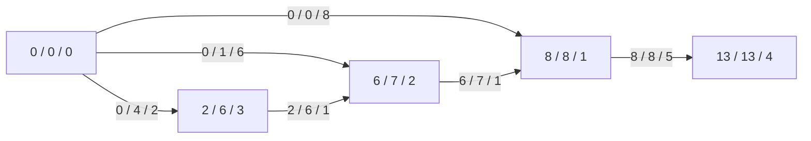

# AOE网络

## 定义

含环有向带权图中，有向边表示一个活动，权值代表活动持续时间，顶点代表事件，且只有一个源节点和一个终节点，这样的图叫AOE网络，工程实施进程经常用AOE网络进行建模。

## 提出问题

- 完成整个工程至少需要多少时间？
- 为缩短完成工程所需时间，应当加快那些活动？

## 分析问题

从源节点到终节点的路径不止一条，长度亦不相同，但只有当各条路径上的活动全部完成，整个工程才算完成。所以，完成整个工程所需时间取决于从源节点到终节点的最长路径长度，该路径被称为**关键路径**，构成关键路径的边被称为**关键活动**，如果这些活动不按期完成会影响工程的结束。

根据上述分析，只需要找到所有关键活动即可得到关键路径。

为了找关键活动，引入以下概念：

1. 一个事件`V[i]`（节点）最早可能发生的时间`Ve[i]`（vertex-early）
2. 一个事件`V[i]`（节点）最晚可能发生的时间`Vl[i]`（vertex-late）
3. 一个活动`E[i]`（边）最早可能开始的时间`Ee[i]`（Edge-early）
4. 一个活动`E[i]`（边）最晚可能开始的时间`El[i]`（Edge-late）
5. 时间余量`Ee[i] - El[i]`

根据以上定义，可以讲关键活动的定义形式化为：时间余量为0的边即为关键活动。

所以算出所有活动的时间余量即可。

## 解决问题

设含环有向带权图`G`，源节点`V[0]`，终节点`V[n]`，其余节点`V[i] (0 < i < n)`，边`E[i] (0 <= i <= m)`，对应权值为`w[i] (0 <= i <= m)`，则有：

1. `Ve[i]`的计算

   - `Ve[0] = 0`

   - `Ve[i] = max(Ve[k] + w[j]) (0 < i  <= n)`，边`E[j]`是从`V[k]`指向`V[i]`的边。

   - 理解：对于源节点，最早可能发生时间肯定就是0，因为没有入边。对于之后的顶点，从左向右，只看入边，然后计算增量。

   - 例子：

     ```mermaid
     graph LR
     	0 -- 8 --> 1 
     	0 -- 6 --> 2
     	2 -- 1 --> 1
     	0 -- 2 --> 3
     	3 -- 1 --> 2
     	1 -- 5 --> 4
     ```

     根据上图可以有如下计算：

     `Ve[0] = 0`

     `Ve[3] = Ve[0] + 2 = 2`，3号节点只有一个入边，因此就直接计算。

     `Ve[2] = max(6, Ve[3] + 1) = 6`，2号节点有两个入边，因此需要分别计算。

     `Ve[1] = max(8, Ve[2] + 1) = 8`

     `Ve[4] = Ve[1] + 5 = 13`

2. `Vl[i] `的计算

   - `Vl[n] = Ve[n]`

   - `Vl[i] = min(Vl[k] - w[j]) (0 <= i < n)`，边`E[j]`是从`V[i]`指向`V[k]`的边。

   - 理解：对于终节点，最晚发生的时间肯定也是最早发生的时间，因为工程已经结束了。对于之前的节点，从右往左，只看出边，然后计算减量。

   - 例子：同上图：

     `Vl[4] = Ve[4] = 13`

     `Vl[1] = Vl[4] - 5 = 8`

     `Vl[2] = Vl[1] - 1 = 7`

     `Vl[3] = Vl[2] - 1 = 6`

     `Vl[0] = min(Vl[3] - 2, Vl[2] - 6, Vl[1] - 8) = 0`

3. `Ee[i]`的计算

   - `Ee[i] = Ve[j] (0 <= i <= m)`，`V[j]`是边`E[i]`的起点。

   - 理解：只有事件发生了，活动才能开始。

   - 例子：同上图，下图中边上的值表示`Ee[i]`，点中的值表示`Ve[j]`。

     ```mermaid
     graph LR
     	0[0] -- 0 --> 1[8]
     	0 -- 0 --> 2[6]
     	2 -- 6 --> 1
     	0 -- 0 --> 3[2]
     	3 -- 2 --> 2
     	1 -- 8 --> 4[13]
     ```

4. `El[i]`的计算

   - `El[i] = Vl[k] - W[i]`，`V[k]`是边`E[i]`的终点。

   - 理解：活动的最晚开始时间要保证接下来的事件开始，不能延误，所以要看终点事件的最晚开始时间并减去。

   - 例子：同上图，下图中边上值表示`El[i] / w[i]`，点中值表示`Vl[i]`。

     ```mermaid
     graph LR
     	0[0] -- 0 / 8 --> 1[8]
     	0 -- 1 / 6 --> 2[7]
     	2 -- 7 / 1 --> 1
     	0 -- 4 / 2 --> 3[6]
     	3 -- 6 / 1 --> 2
     	1 -- 8 / 5 --> 4[13]
     ```

5. 综合上述信息，即可得出关键路径，对于例子，如下图所示：

点中值表示`Ve[i] / Vl[i] / i`，边中值表示`Ee[j] / El[j] / w[j]`



所以关键活动就是`Ee[j] == El[j]`的活动，因此路径有`0 --> 1 --> 4`，长度为13。