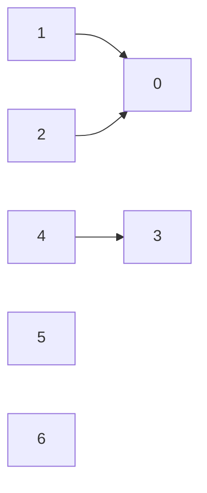
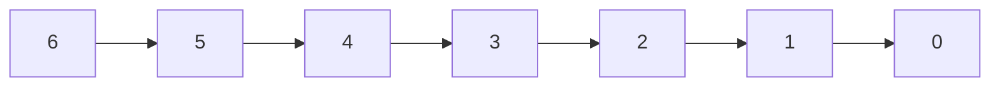

# 并查集

用集合中的一个元素来表示整个集合的简要表示法。

例

| Element        | 0    | 1    | 2    | 3    | 4    | 5    | 6    |
| -------------- | ---- | ---- | ---- | ---- | ---- | ---- | ---- |
| Representation | 0    | 0    | 0    | 3    | 3    | 5    | 6    |



故未优化的版本如下

```c++
class DisjointSet
{
private:
    vector<int> parent;

public:
    DisjointSet(int maxSize) : parent(vector<int>(maxSize))
    {
        for (int i = 0; i < maxSize; ++i)
            parent[i] = i;
    }
    int findElement(int x) { return parent[x] == x ? x : findElement(parent[x]); }
    void getUnion(int x1, int x2) { parent[findElement(x1)] = findElement(x2); }
    bool isUnion(int e1, int e2) { return findElement(e1) == findElement(e2); }
};
```

其中，存在如下的情形



这样的话，我们的`find`函数便是$O(n)$的时间复杂度，显然是不可的。

下面进行优化：

1. 按秩合并

   这里定义树的高度为秩，两树合并时，将秩较小的树并至秩较大的树中，这样秩的增长会减缓至最低。

2. 路径压缩

   在执行`find`过程中，将路径上的所有结点都直接连接到根节点上。

优化后的代码如下：

```c++
class DisjointSet
{
private:
    vector<int> parent;
    vector<int> rank;

public:
    DisjointSet(int maxSize) : parent(vector<int>(maxSize)),
                               rank(vector<int>(maxSize, 0))
    {
        for (int i = 0; i < maxSize; ++i)
            parent[i] = i;
    }
    int findElement(int x) { return parent[x] == x
                                        ? x
                                        : (parent[x] = findElement(parent[x])); }
    void getUnion(int x1, int x2)
    {
        int p1 = findElement(x1), p2 = findElement(x2);
        if (rank[p1] > rank[p2])
            parent[p2] = p1;
        else
        {
            parent[p1] = p2;
            if (rank[p1] == rank[p2])
                ++rank[p2]; //only modify the parent tree's rank
        }
    }
    bool isUnion(int e1, int e2) { return findElement(e1) == findElement(e2); }
};
```

