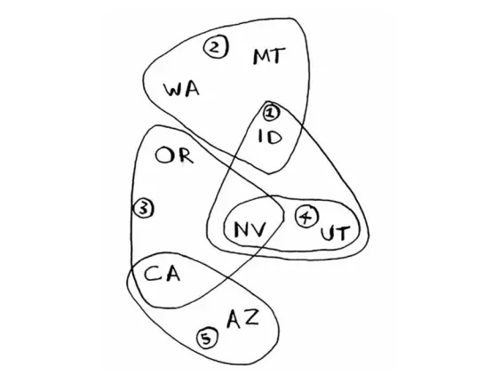

# **GREEDY ALGORITHM**

## **Outline**

​	贪婪算法(贪心算法)是指在对问题进行求解时，在每一步选择中都采取最好或者最优(即最有利)的选择，从而希望能够导致结果是最好或者最优的算法。

​	贪婪算法所得到的结果`往往不是最优的结果(有时候会是最优解)`，但是都是`相对近似(接近)最优解的结果`。

​	贪婪算法并没有固定的算法解决框架，算法的关键是`贪婪策略`的选择，根据不同的问题选择不同的策略。

​	必须注意的是策略的选择必须具备`无后效性`，即某个状态的选择不会影响到之前的状态，只与当前状态有关，所以对采用的贪婪的策略一定要仔细分析其是否满足无后效性。

其基本的解题思路为：

1. 建立数学模型来描述问题

2. 把求解的问题分成若干个子问题

3. 对每一子问题求解，得到子问题的局部最优解

4. 把子问题对应的局部最优解合成原来整个问题的一个近似最优解

贪婪算法可解决的问题通常大部分都有如下的特性：

​	随着算法的进行，将积累起其它两个集合：

​	一个包含已经被考虑过并被选出的候选对象，另一个包含已经被考虑过但被丢弃的候选对象。

​	有一个函数来检查一个候选对象的集合是否提供了问题的解答。该函数不考虑此时的解决方法是否最优。

​	还有一个函数检查是否一个候选对象的集合是可行的，也即是否可能往该集合上添加更多的候选对象以获得一个解。和上一个函数一样，此时不考虑解决方法的最优性。

​	选择函数可以指出哪一个剩余的候选对象最有希望构成问题的解。

​	最后，目标函数给出解的值。

​	为了解决问题，需要寻找一个构成解的候选对象集合，它可以优化目标函数，贪婪算法一步一步的进行。
起初，算法选出的候选对象的集合为空。接下来的每一步中，根据选择函数，算法从剩余候选对象中选出`最有希望构成解的对象`。
​	如果集合中加上该对象后不可行，那么该对象就被丢弃并不再考虑；否则就加到集合里。每一次都扩充集合，并检查该集合是否构成解。
​	如果贪婪算法正确工作，那么找到的第一个解通常是最优的。

## **First-Interval Scheduling**

### 问题抽象：

​	数轴上有n个区间，选出最多的区间，使得这些区间不互相重叠。

### 算法：

​	将所有区间按右端点坐标从小到大排序，顺序处理每个区间。

​	如果它与当前已选的所有区间都没有重叠，则选择该区间，否则不选。

### 证明：

​	显然，该算法最后选出的区间不互相重叠，下面证明所选出区间的数量是最多的。

​	设f~i~为该算法所接受的第i个区间的右端点坐标，g~i~ 为某最优解中的第i个区间的右端点坐标。

#### 命题1.1

​	**当i >= 1时，该算法所接受的第i个区间的右端点坐标f~i~<=某最优解中的第i个区间的右端点坐标g~i~。**

​	该命题可以运用数学归纳法来证明。

​	对于i=1，命题显然为真，因为算法第一个选择的区间拥有最小右端点坐标。

​	令i>1，假定论断对i-1为真，即f~i-1~<=g~i-1~。则最优解的第i个可选区间所组成的集合包含于执行该算法时第i个可选区间所组成的集合；而当算法选择第i个区间时，选的是在可选区间中右端点坐标最小的一个，所以有f~i~ <= g~i~。

​	证毕。

​	设该算法选出了k个区间，而最优解选出了m个区间。

#### 命题1.2

​	**最优解选出的区间数量 m = 该算法选出的区间数量 k。**

​	假设m>k，根据命题1.1，有f~k~ <= g~k~。由于m > k，必然存在某区间，在 g~k~ 之后开始，故也在 f~k~ 之后开始。

​	而该算法一定不会在选了第k个区间后停止，还会选择更多的区间，产生矛盾。

​	所以m <= k,又因为m是最优解选出区间个数，所以m = k。

​	综上所述，算法选出的区间是最优解。

### **Example**

假设有如下课程，希望尽可能多的将课程安排在一间教室里：

| 课程   | 开始时间 | 结束时间 |
| ------ | -------- | -------- |
| 美术   | 9:00     | 10:00    |
| 英语   | 9:30     | 10:30    |
| 数学   | 10:00    | 11:00    |
| 计算机 | 10:30    | 11:30    |
| 音乐   | 11:00    | 12:00    |

### C语言实现：

```C
#include <stdio.h>
#include <stdlib.h>

typedef struct interval
{
    float begin;
    float end;
} INTERVAL;

int main(void)
{
    INTERVAL class[5] = {{9, 10}, {9.5, 10.5}, {10, 11}, {10.5, 11.5}, {11, 12}}; //已经排好序了
    int i, last, count[5] = {0, 0, 0, 0, 0};
    for (i = 0, last = 0; i < 5; i++) //注意last的初始化
    {
        if (last <= class[i].begin) //last 表示上一个已选区间的 end, 同时注意不等号
        {
            count[i]++;
            last = class[i].end;
        }
    }
    for (i = 0; i < 5; i++)
        printf("%d ", count[i]);
    printf("\n");
    system("pause");
    return 0;
}
```

## **Second-01Bag Problem**

### **Example**

有一个背包，容量为35磅，现有如下物品：

| 物品       | 重量 | 价格 |
| ---------- | ---- | ---- |
| 吉他       | 15   | 1500 |
| 音响       | 30   | 3000 |
| 笔记本电脑 | 20   | 2000 |
| 显示器     | 29   | 2999 |
| 笔         | 1    | 200  |

要求达到的目标为装入的背包的总价值最大，并且重量不超出。

### 分析：

贪婪策略有很多：

1. 选择价值最大的——音响+笔=3200
2. 选择重量最小的——吉他和笔记本=3500
3. 选择单位质量价值最大的——笔+显示器=3199

​	如上最终的结果并不一定是最优解，在这个案例中贪婪算法并一定得出最优解，只能得到近似最优解，这也算是该算法的局限性之一，所以背包问题主要用动态规划做。

## **Third-Set Cover Problem**

### Example

假设存在如下表的需要付费的广播台，以及广播台信号可以覆盖的地区。

如何选择最少的广播台，让所有的地区都可以接收到信号。

| 广播台 | 覆盖地区 |
| ------ | -------- |
| K1     | ID,NV,UT |
| K2     | WA,ID,MT |
| K3     | OR,NV,CA |
| K4     | NV,UT    |
| K5     | CA,AZ    |
| ...    | ...      |



### 分析：

如何找出覆盖所有地区的广播台的集合呢，听起来容易，实现起来很复杂，使用穷举法实现：

1. 列出每个可能的广播台的集合，这被称为幂集。假设总的有n个广播台，则广播台的组合总共有2ⁿ个。

2. 在这些集合中，选出覆盖全部地区的最小的集合，假设n不在，但是当n非常大的时候，假设每秒可以计算10个子集。

目前并没有算法可以快速计算得到准备的值，而使用贪婪算法，则可以得到非常接近的解，并且效率高。

选择策略上，因为需要覆盖全部地区的最小集合:

1. 选出一个广播台，即它覆盖了最多未覆盖的地区即便包含一些已覆盖的地区也没关系。
2. 重复第一步直到覆盖了全部的地区。

这是一种近似算法（approximation algorithm，贪婪算法的一种）。

在获取到精确的最优解需要的时间太长时，便可以使用近似算法，判断近似算法的优劣标准如下:

1. 速度

2. 得到的近似解与最优解的接近程度

在本例中贪婪算法是个不错的选择，不仅运行速度快，本例运行时间O(n²)，最坏的情况，假设n个广播台，每个广播台就覆盖1个地区，n个地区，总计需要查询n*n=O(n²)。

| 广播台数量n | 子集总数2ⁿ   | 穷举需要时间  | 贪婪算法/s |
| :---------- | ------------ | :------------ | ---------- |
| 5           | 32           | 3.2s          | 2.5        |
| 10          | 1024         | 102.4s        | 10         |
| 32          | 4294967296   | 13.6years     | 102.4      |
| 100         | 1.26*100^30^ | 4x10^23^years | 1000       |

### C语言实现：

```c
#include <stdio.h>
#include <stdlib.h>
#include <string.h>
enum places
{
    ID = 1,
    NV,
    UT,
    WA,
    MT,
    OR,
    CA,
    AZ
}; //编号
int main(void)
{
    int K[5][3] = {
        {ID, NV, UT},
        {ID, WA, MT},
        {NV, OR, CA},
        {NV, UT, 0},
        {CA, AZ, 0}};
    int i, j;
    int cover[AZ + 1] = {0}, max = 0, count, location, result[5] = {0};
    cover[0] = AZ;//第0位保存剩余未覆盖的城市数,其余为编号后的城市，01表示是否被选择
    while (cover[0] != 0)
    {
        for (i = 0, location = -1, max = 0; i < 5; i++)
        {
            if (result[i] == 1)//判断该城市是否被选入，是则跳过
                continue;
            for (j = 0, count = 0; j < 3; j++)
            {
                if (K[i][j] != 0 && cover[K[i][j]] == 0)
                    count++;//表示该基站覆盖范围占未被覆盖的城市个数
            }
            if (count > max)//max记录每次循环最优的情况，location记录是哪一个
            {
                max = count;
                location = i;
            }
        }
        for (j = 0; j < 3; j++)
            if (K[location][j] != 0)
                cover[K[location][j]] = 1;//差集运算
        cover[0] -= max;
        result[location] = 1;//输入结果数组
    }
    printf("%d %d %d %d %d\n", result[0], result[1], result[2], result[3], result[4]);
    printf("\n");
    system("pause");
    return 0;
}
```

输出结果为：11101

该贪心策略得出的结果为K1,K2,K3,K5，覆盖了所有地区。

