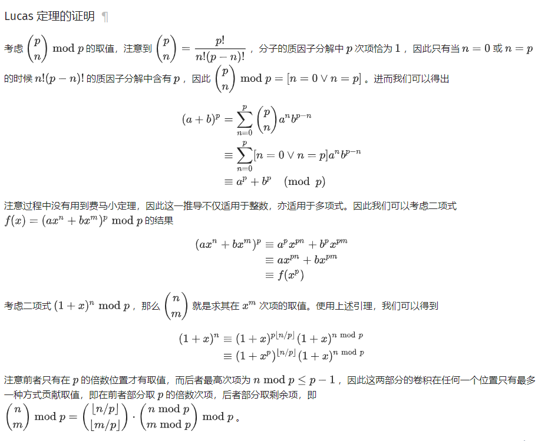

# Lucas

用来求大组合数取素数模，没什么好分析的，直接上推导和代码。

对于质数$p$，有
$$
\left(\begin{array}{l}
n \\
m
\end{array}\right) \bmod p=\left(\begin{array}{l}
\lfloor n / p\rfloor \\
\lfloor m / p\rfloor
\end{array}\right) \cdot\left(\begin{array}{l}
n \bmod p \\
m \bmod p
\end{array}\right) \bmod p
$$

前面一项可以继续使用Lucas定理递归求，后者就直接组合数了。

证明摘自[OI-Wiki](https://oi-wiki.org/)：



自己写的板子：

```c++
using ll = long long;
const int mod = xxx;
ll fp(ll b, ll e) {
    ll ans = 1;
    while (e > 0) {
        if (e & 1)
            ans = ans * b % mod;
        b = b * b % mod;
        e >>= 1;
    }
    return ans % mod;
}
ll inv(ll x) { return fp(x, mod - 2); }
ll C(ll n, ll m) {
    if (n < m) return 0;
    ll up = 1, down = 1;
    for (int i = n - m + 1; i <= n; ++i)
        up = up * i % mod;
    for (int i = 1; i <= m; ++i)
        down = down * i % mod;
    return up * inv(down) % mod;
}
ll Lucas(ll n, ll m) {
    if (m == 0)
        return 1;
    else
        return Lucas(n / mod, m / mod) * C(n % mod, m % mod) % mod;
}
```


