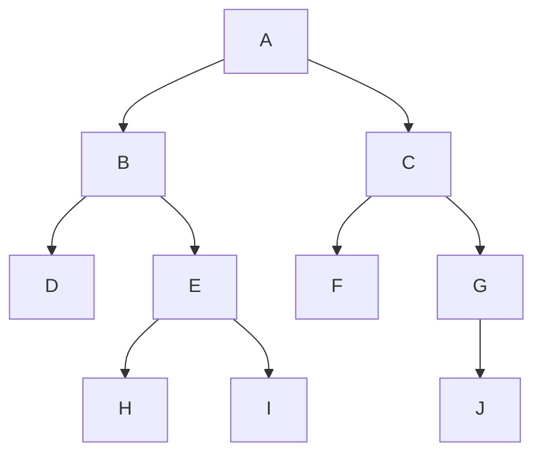
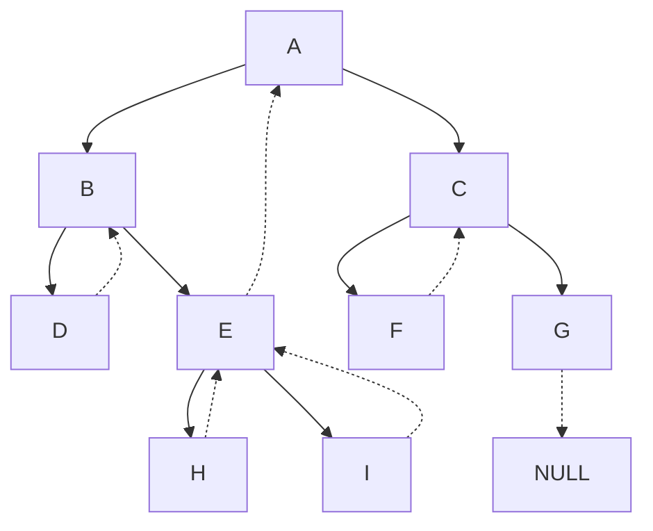

# 莫里斯遍历

实质上是将当前普通二叉树转化为所需要的前、中、后线索二叉树再进行还原遍历。

# 线索二叉树

将叶子结点的空指针域指向该结点的前驱后继，定义规则如下：

> 若结点的左子树为空，则该结点的左孩子指针指向其前驱结点。
> 若结点的右子树为空，则该结点的右孩子指针指向其后继结点。

这种指向前驱和后继的指针称为线索。将一棵普通二叉树以某种次序遍历，并添加线索的过程称为线索化。

## 例子：中序遍历二叉树

如下图所示的二叉树：

根据上述规则线索化二：

