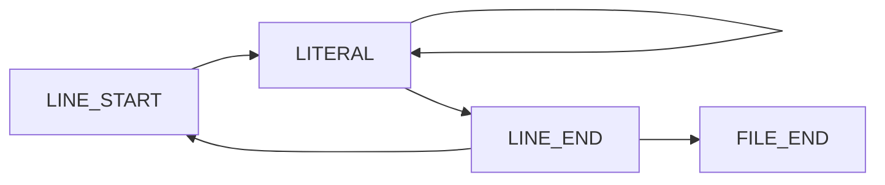
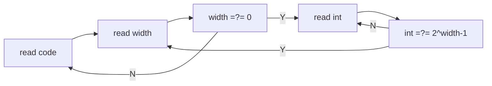

## 7.31 - 8.9

### 周期串(Periodic Strings)(UVa455)

> 对于一个字符串`abcabcabc`求其最小周期子串。

- 条件
  - 字符串长度和周期成整数倍关系。
  - `str[location] == str[location % period]`，其中`location`从`period + 1`到`strlen(str)`。

```c
#include <stdio.h>
#include <string.h>

#define BUFFER_SIZE 100

int judge(char *begin, int forward, int period)
{
    while (begin[forward] != '\0')
    {
        if (begin[forward] != begin[forward % period])
            return 0;
        ++forward;
    }
    return 1;
}

int main(void)
{
    int n;
    char str[BUFFER_SIZE];
    scanf("%d", &n);
    for (int i = 0; i < n; ++i)
    {
        scanf("%s", str);
        int len = strlen(str);
        for (int j = 1; j <= len; ++j)
        {
            if (str[j] == str[0] && len % j == 0 && judge(str, j + 1, j))
            {
                printf("%d\n", j);
                break;
            }
            else if (j == len)
                printf("%d\n", j);
        }
        if (i != n - 1)
            printf("\n");
    }
    return 0;
}
```


### 环状序列(Circular Sequence)(UVa1584)

> 长度为$n$的环状串有$n$中表示法，分别是从某个位置开始顺时针得到。对于给定环状串，给出其字典序最小的表示。

枚举即可。

```c
#include <stdio.h>
#include <string.h>

#define BUFFER_SIZE 100

int compare(char *str, int pc1, int pc2, int length)
{
    char *p, *q;
    for (int i = 0; i < length; ++i)
    {
        p = str + (pc1 + i) % length;
        q = str + (pc2 + i) % length;
        if (*p != *q)
            return *p - *q;
    }
    return 0;
}

int main(void)
{
    // FILE *f = freopen("output.txt", "w", stdout);
    char str[BUFFER_SIZE];
    int loc, T, length, temp;
    scanf("%d", &T);
    for (int i = 0; i < T; ++i)
    {
        loc = 0;
        scanf("%s", str);
        length = strlen(str);
        for (temp = 1; temp < length; ++temp)
            if (compare(str, loc, temp, length) > 0)
                loc = temp;
        printf("%s", str + loc);
        str[loc] = '\0';
        printf("%s\n", str);
    }
    // fclose(f);
    return 0;
}
```

### 浮点数(Floating-Point Numbers)(UVa11809)

> 

题目如上，这里我们复习了浮点数的表示hhh，从变量的取值范围来看，$0\le M\le9,1\le E\le 30$，不大。

读题之后我们可以得到一个等式
$$
(2^{-1}+2^{-2}+\cdots +2^{-M-1})\times 2^{2^E-1}=A \times 10^B显然我们很难去计算$2^{2^{30}-1}$的值，所以等式两边取$\log_{10}$，有
$$
我们很难去计算$2^{2^{30}-1}$的值，所以等式两边取$\log_{10}$，有
$$
\log_{10}(1-2^{-(M+1)})+(2^E-1)\log_{10}2=\log_{10}A+B
$$
这样打表之后枚举匹配就好啦！注意$B$要用`long long`。

```c
#include <stdio.h>
#include <string.h>
#include <math.h>

#define BUFFER_SIZE 80
int main(void)
{
    // FILE *b = freopen("output.txt", "w", stdout);
    const double log_10_2 = log10(2);
    int M, E;
    double tab[10][30];
    for (M = 0; M <= 9; ++M)
        for (E = 1; E <= 30; ++E)
            tab[M][E - 1] = log10(1.0 - pow(0.5, M + 1)) + (pow(2, E) - 1) * log_10_2;

    double A, temp;
    long long B;
    char buffer[BUFFER_SIZE], *e;
    int flag;
    while (scanf("%s", buffer) && *buffer != '0' && *(buffer + 1) != 'e')
    {
        flag = 0;
        e = strchr(buffer, 'e');
        *e = '\0';
        sscanf(buffer, "%lf", &A);
        sscanf(e + 1, "%lld", &B);
        temp = log10(A) + B;
        for (M = 0; M <= 9; ++M)
        {
            for (E = 1; E <= 30; ++E)
                if (fabs(temp - tab[M][E - 1]) < 1e-4)
                {
                    printf("%d %d\n", M, E);
                    flag = 1;
                    break;
                }
            if (flag)
                break;
        }
    }
    // fclose(b);
    return 0;
}
```

### 循环小数(Repeating Decimals)(UVa202)

> 计算有理分数的循环节

这里用一个小小的数学知识即可。

当余数第一次重复出现，即为第一个循环节的结束。

### 信息解码(Message Decoding)(UVa213)

> 

个人对于解码方面的题喜欢往有限状态机方面想，这里考虑以下思路：



```c
#include <stdio.h>
#include <string.h>

const int offset[] = {0, 1, 4, 11, 26, 57, 120};
const int end[] = {1, 3, 7, 15, 31, 63, 127};

typedef enum
{
    LINE_START,
    LINE_END,
    LITERAL,
    FILE_END
} status;

status get_literal(char *header, char *ansp, int width)
{
    char ch;
    int loc = 0, wid = width;
    while (wid > 0)
    {
        ch = getchar();
        if (ch == '\n' || ch == '\r')
            continue;
        if (ch == '1')
            loc += 1 << (wid - 1);
        wid--;
    }
    if (loc == end[width - 1])
        return LINE_END;
    else
    {
        *ansp = *(header + offset[width - 1] + loc);
        return LITERAL;
    }
}

#define BUFFER_SIZE 10000

int main(void)
{
    //FILE *a = freopen("input.txt", "r", stdin);
    //FILE *b = freopen("output.txt", "w", stdout);
    char header[BUFFER_SIZE], ans[BUFFER_SIZE];
    char ch, *p;
    int width, temp;
    status flag;
    while (scanf("%[^\n]", header) == 1)
    {
        flag = LINE_START;
        p = ans;
        while (1)
        {
            switch (flag)
            {
            case LINE_START:

                for (temp = 3, width = 0; temp > 0;)
                {
                    ch = getchar();
                    if (ch == '\n' || ch == '\r')
                        continue;
                    if (ch == '1')
                        width += 1 << (temp - 1);
                    // width = (width << 1) + ch - '0';
                    --temp;
                }

                if (width != 0)
                    flag = LITERAL;
                else
                    flag = FILE_END;

                break;
            case LITERAL:
                flag = get_literal(header, p, width);
                if (flag == LITERAL)
                    ++p;
                break;
            case LINE_END:
                flag = LINE_START;
                break;
            }
            if (flag == FILE_END)
            {
                *p = '\0';
                printf("%s\n", ans);
                break;
            }
        }
        getchar();
    }
    //fclose(a);
    //fclose(b);
    return 0;
}
```

注意这个题在OJ上的输入会有很多的换行，注意`\n`和`\r`都应考虑在内。

刘汝佳老师的紫书中是使用一个二维数组`int code[8][1 << 8]`来保存编码所对应的字符，而我则直接将编码存在字符串里，利用偏移值`offset`和宽度界`end`来解码。

| width  | 1    | 2    | 2    | 2    | 3    | 3    | 3    | 3    | 3    | 3    | 3    | 4    | ...  |
| ------ | ---- | ---- | ---- | ---- | ---- | ---- | ---- | ---- | ---- | ---- | ---- | ---- | ---- |
| count  | 1    |      |      | 3    |      |      |      |      |      |      | 7    |      |      |
| `code` | 0    | 00   | 01   | 10   | 000  | 001  | 010  | 011  | 100  | 101  | 110  | 0000 | ...  |
| `arr`  | 0    | 1    | 2    | 3    | 4    | 5    | 6    | 7    | 8    | 9    | 10   | 11   | ...  |

可以发现对于宽度为$width$的编码共有$2^{width}-1$个码，对于字符数组的下标来讲，每一个长度的编码的区间在
$$
\bigg[\sum_{i=1}^{width-1}(2^{i}-1),\sum_{i=1}^{width}(2^{i}-1)\bigg]
$$
所以对于宽度为`width`的偏移值为`offect[width - 1]`，即$\sum_{i=1}^{width-1}(2^{i}-1)=2^{width}-width-1$，编码段的宽度界即为`end[width - 1]`，即$2^{width}-1$。

因此当读出的二进制数化为十进制后先与`end[width - 1]`比较，如果相等，则说明到达段尾，如果不相等，则加上偏移值`offset[width - 1]`解码。

一般来说状态机的编程思路要清晰一些，代码要长很多，状态的转换需要的步骤比直接跳出要麻烦的多，紫书思路如下：



