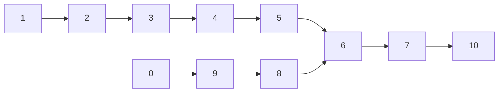
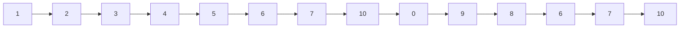
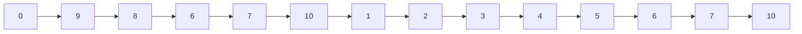

# 链表

## 707.设计链表

### Question

> 设计链表的实现。您可以选择使用单链表或双链表。单链表中的节点应该具有两个属性：`val` 和 `next`。`val` 是当前节点的值，`next` 是指向下一个节点的指针/引用。如果要使用双向链表，则还需要一个属性 `prev` 以指示链表中的上一个节点。假设链表中的所有节点都是 0-index 的。
>
> 在链表类中实现这些功能：
>
> - get(index)：获取链表中第 `index` 个节点的值。如果索引无效，则返回`-1`。
> - addAtHead(val)：在链表的第一个元素之前添加一个值为 `val` 的节点。插入后，新节点将成为链表的第一个节点。
> - addAtTail(val)：将值为 `val` 的节点追加到链表的最后一个元素。
> - addAtIndex(index,val)：在链表中的第 `index` 个节点之前添加值为 `val`  的节点。如果 `index` 等于链表的长度，则该节点将附加到链表的末尾。如果 `index` 大于链表长度，则不会插入节点。如果`index`小于0，则在头部插入节点。
> - deleteAtIndex(index)：如果索引 `index` 有效，则删除链表中的第 `index` 个节点。
>
> **示例：**
>
> ```
> MyLinkedList linkedList = new MyLinkedList();
> linkedList.addAtHead(1);
> linkedList.addAtTail(3);
> linkedList.addAtIndex(1,2);   //链表变为1-> 2-> 3
> linkedList.get(1);            //返回2
> linkedList.deleteAtIndex(1);  //现在链表是1-> 3
> linkedList.get(1);            //返回3
> ```
>
> **提示：**
>
> - 所有`val`值都在 `[1, 1000]` 之内。
> - 操作次数将在  `[1, 1000]` 之内。
> - 请不要使用内置的 LinkedList 库。

### Solution

单链表

```c++
class MyLinkedList
{
private:
    // Definition for singly-linked list.
    struct SinglyListNode
    {
        int val;
        SinglyListNode *next;
        SinglyListNode(int x) : val(x), next(nullptr) {}
    };
    SinglyListNode *head;
    SinglyListNode *tail;
    int Size;

public:
    /** Initialize your data structure here. */
    MyLinkedList() : head(nullptr), tail(nullptr), Size(0) {}

    /** Get the value of the index-th node in the linked list. If the index is invalid, return -1. */
    int get(int index)
    {
        if (index >= Size || index < 0)
            return -1;
        SinglyListNode *traversal = head;
        for (int i = 0; i < index; ++i)
            traversal = traversal->next;
        return traversal->val;
    }

    /** Add a node of value val before the first element of the linked list. After the insertion, the new node will be the first node of the linked list. */
    void addAtHead(int val)
    {
        if (head == nullptr)
        {
            tail = head = new SinglyListNode(val);
            ++Size;
        }
        else
        {
            SinglyListNode *temp = head;
            head = new SinglyListNode(val);
            head->next = temp;
            ++Size;
        }
    }

    /** Append a node of value val to the last element of the linked list. */
    void addAtTail(int val)
    {
        if (tail == nullptr)
        {
            tail = head = new SinglyListNode(val);
            ++Size;
        }
        else
        {
            SinglyListNode *NewNode = new SinglyListNode(val);
            tail->next = NewNode;
            tail = tail->next;
            ++Size;
        }
    }

    /** Add a node of value val before the index-th node in the linked list. If index equals to the length of linked list, the node will be appended to the end of linked list. If index is greater than the length, the node will not be inserted. */
    void addAtIndex(int index, int val)
    {
        if (index > Size)
            return;
        else if (index == Size)
            addAtTail(val);
        else if (index <= 0)
            addAtHead(val);
        else
        {
            SinglyListNode *traversal = head;
            for (int i = 0; i < index - 1; ++i)
                traversal = traversal->next;
            SinglyListNode *NewNode = new SinglyListNode(val), *temp = traversal->next;
            traversal->next = NewNode;
            NewNode->next = temp;
            ++Size;
        }
    }

    /** Delete the index-th node in the linked list, if the index is valid. */
    void deleteAtIndex(int index)
    {
        if (index >= Size || index < 0)
            return;
        if (index == 0)
        {
            SinglyListNode *temp = head;
            head = head->next;
            delete temp;
            --Size;
            if (Size == 0)
                tail = head = nullptr;
        }
        else
        {
            SinglyListNode *traversal = head;
            for (int i = 0; i < index - 1; ++i)
                traversal = traversal->next;
            if (index + 1 == Size)
                tail = traversal;
            SinglyListNode *loc = traversal->next;
            traversal->next = loc->next;
            delete loc;
            --Size;
        }
    }
};
```

双链表

```c++
class MyLinkedList
{
private:
    // Definition for Double-linked list.
    struct DoubleListNode
    {
        int val;
        DoubleListNode *next;
        DoubleListNode *prev;
        DoubleListNode(int x) : val(x), next(nullptr), prev(nullptr) {}
    };
    DoubleListNode *head;
    DoubleListNode *tail;
    int Size;

public:
    /** Initialize your data structure here. */
    MyLinkedList() : head(nullptr), tail(nullptr), Size(0) {}

    /** Get the value of the index-th node in the linked list. If the index is invalid, return -1. */
    int get(int index)
    {
        if (index >= Size || index < 0)
            return -1;
        DoubleListNode *traversal = head;
        for (int i = 0; i < index; ++i)
            traversal = traversal->next;
        return traversal->val;
    }

    /** Add a node of value val before the first element of the linked list. After the insertion, the new node will be the first node of the linked list. */
    void addAtHead(int val)
    {
        if (head == nullptr)
        {
            tail = head = new DoubleListNode(val);
            ++Size;
        }
        else
        {
            DoubleListNode *temp = head;
            head = new DoubleListNode(val);
            temp->prev = head;
            head->next = temp;
            ++Size;
        }
    }

    /** Append a node of value val to the last element of the linked list. */
    void addAtTail(int val)
    {
        if (tail == nullptr)
        {
            tail = head = new DoubleListNode(val);
            ++Size;
        }
        else
        {
            DoubleListNode *NewNode = new DoubleListNode(val);
            tail->next = NewNode;
            NewNode->prev = tail;
            tail = tail->next;
            ++Size;
        }
    }

    /** Add a node of value val before the index-th node in the linked list. If index equals to the length of linked list, the node will be appended to the end of linked list. If index is greater than the length, the node will not be inserted. */
    void addAtIndex(int index, int val)
    {
        if (index > Size)
            return;
        else if (index == Size)
            addAtTail(val);
        else if (index <= 0)
            addAtHead(val);
        else
        {
            DoubleListNode *traversal = head;
            for (int i = 0; i < index - 1; ++i)
                traversal = traversal->next;

            DoubleListNode *NewNode = new DoubleListNode(val);

            NewNode->next = traversal->next;
            NewNode->prev = traversal;

            traversal->next->prev = NewNode;
            traversal->next = NewNode;

            ++Size;
        }
    }

    /** Delete the index-th node in the linked list, if the index is valid. */
    void deleteAtIndex(int index)
    {
        if (index >= Size || index < 0)
            return;
        if (index == 0)
        {
            DoubleListNode *temp = head;
            if(Size!=1)
                temp->next->prev = nullptr;
            head = head->next;
            delete temp;
            --Size;
            if (Size == 0)
                tail = head = nullptr;
        }
        else
        {
            DoubleListNode *traversal = head;
            for (int i = 0; i < index - 1; ++i)
                traversal = traversal->next;
            DoubleListNode *loc = traversal->next;
            traversal->next = loc->next;
            if (index + 1 == Size)
                tail = traversal;
            else
                loc->next->prev = traversal;
            delete loc;
            --Size;
        }
    }
};
```

## 多数组及单数组模拟链表

### 多数组模拟链表

- 利用三个数组，分别为*next、key、prev*来模拟前驱指针、元素和后继指针。

### 单数组模拟链表

- 在不支持显式的指针数据类型的编程环境下，我们采用此方法。若管理同构对象，则可用单个数组中相邻的三个元素表示一个结点，即占用一段子数组。三个属性*next、key、prev*所对应的偏移量分别为0、1、2。这种方法很灵活，因为他允许我们将不同长度的对象存储于同一数组中，即管理异构对象，但是偏移量需要额外来记录。

### 自由表

- 在多数组模拟链表中，各个数组长度为m，且在某一时刻该动态集合内含有$n≤m$个元素，则对于余下$m-n$个对象来说它们是自由的，同时这些自由对象可用来表示将要插入该动态集合的元素。
- 我们将这写自由对象保存在一个单链表中，即只使用*next*，形成一个自由表，自由表的头部保存在全局变量*free*中。需要注意的是该表示中数组中每一个对象都属于任意一个表而不同时属于两个表。
- 自由表的操作类似于栈，有AllocateElement和FreeElement，前者将free指向的第一个结点的对象分配给链表，连接在指定位置；后者将链表删除的结点回收，连接在自由表表头，由free指向。

## 特殊操作

- 判断是否有环

  - 设定两个指针*slow*和*quick*，其中在*slow*和*quick*同时遍历链表的时候，*slow*每次向前移动一步，*quick*每次向前移动两步，如果二者在遍历过程中存在相遇的情况，则链表存在环，否则*quick*先遇`nullptr`。
  - 因为*slow*和*quick*不是同时进入环，故设链表长$l$，环长$x$，因此在迭代$l-x$次时，二者都进入环，二者相距$l-x $，设在迭代k次时，*slow*向前走了$k$步，而*quick*向前走了$2k$步，*slow*指向$(k-(l-x))mod\ x$，*quick*指向$(2k-(l-x))mod\ x$，当二者相等时，即同余时，相遇。

- 获取成环部分的长度

  - 根据以上的确定的相遇点，再次启动*slow*和*quick*，使之按之前的速度运行，直至下一次相遇，同时记录*slow*走过的结点个数，即为$x$。答案是显然的，由于速度差值始终为$1$，那么相当于二者相距$x$，因此两次相遇间隔即为环长。

- 获取进入环的结点

  - 同样需要第一步得出相遇点，接着使用两个*slow*指针，分别从相遇点和链表头结点出发，直到二者相遇，相遇点即为环的入口结点。

  - 如下图所示❤处为相遇点，设相遇点到入口相距$y$，由第一步可知$2k=k+mx,k=(l-x+y),m\in N+$，即$(m-1)x+x-y=l-x$，而且由二者的相遇可知，一定有*slow*未转过一圈而*quick*转过第二圈的时候，那么$m=1$，故有$x-y=l-x$，我们很显然就可以看出$x-y$和$l-x$的几何意义。

    

- 取单向链表的中间元素

  - 同样使用*slow*和*quick*，则当*quick*遇到`nullptr`时，*slow*即指向中间元素。

## 141.环形链表

### Question

> 给定一个链表，判断链表中是否有环。
>
> 为了表示给定链表中的环，我们使用整数 `pos` 来表示链表尾连接到链表中的位置（索引从 0 开始）。 如果 `pos` 是 `-1`，则在该链表中没有环。
>
>  
>
> **示例 1：**
>
> ```
> 输入：head = [3,2,0,-4], pos = 1
> 输出：true
> 解释：链表中有一个环，其尾部连接到第二个节点。
> ```
>
> 
>
> **示例 2：**
>
> ```
> 输入：head = [1,2], pos = 0
> 输出：true
> 解释：链表中有一个环，其尾部连接到第一个节点。
> ```
>
> 
>
> **示例 3：**
>
> ```
> 输入：head = [1], pos = -1
> 输出：false
> 解释：链表中没有环。
> ```
>
> 
>
>  
>
> **进阶：**
>
> 你能用 *O(1)*（即，常量）内存解决此问题吗？

### Solution

```c++
class Solution
{
public:
    bool hasCycle(ListNode *head)
    {
        if(head == nullptr)
            return false;
        ListNode *slow, *quick;
        slow = quick = head;
        while (quick->next != nullptr && quick->next->next != nullptr)
        {
            slow = slow->next;
            quick = quick->next->next;
            if (quick == slow)
                return true;
        }
        return false;
    }
};
```

## 142.环形链表 II

### Question

> 给定一个链表，返回链表开始入环的第一个节点。 如果链表无环，则返回 `null`。
>
> 为了表示给定链表中的环，我们使用整数 `pos` 来表示链表尾连接到链表中的位置（索引从 0 开始）。 如果 `pos` 是 `-1`，则在该链表中没有环。
>
> **说明：**不允许修改给定的链表。
>
>  
>
> **示例 1：**
>
> ```
> 输入：head = [3,2,0,-4], pos = 1
> 输出：tail connects to node index 1
> 解释：链表中有一个环，其尾部连接到第二个节点。
> ```
>
> 
>
> **示例 2：**
>
> ```
> 输入：head = [1,2], pos = 0
> 输出：tail connects to node index 0
> 解释：链表中有一个环，其尾部连接到第一个节点。
> ```
>
> 
>
> **示例 3：**
>
> ```
> 输入：head = [1], pos = -1
> 输出：no cycle
> 解释：链表中没有环。
> ```
>
> 
>
>  
>
> **进阶：**
> 你是否可以不用额外空间解决此题？

### Solution1

```c++
class Solution
{
public:
    ListNode *detectCycle(ListNode *head)
    {
        if (head == nullptr)
            return nullptr;
        ListNode *slow = head, *quick = head;
        while (quick->next != nullptr && quick->next->next != nullptr)
        {
            slow = slow->next;
            quick = quick->next->next;
            if (quick == slow)
            {
                quick = head;
                while (quick != slow)
                {
                    quick = quick->next;
                    slow = slow->next;
                }
                return slow;
            }
        }
        return nullptr;
    }
};
```

### Solution2

哈希表法，相当于遍历一次。

```c++
class Solution
{
public:
    ListNode *detectCycle(ListNode *head)
    {
        if (head == nullptr)
            return nullptr;
        ListNode *traversal = head;
        unordered_set<ListNode *> visited;
        while (traversal->next != nullptr)
        {
            if (!visited.count(traversal))
                visited.insert(traversal);
            else
                return traversal;
            traversal = traversal->next;
        }
        return nullptr;
    }
};
```

## 160.相交链表

### Question

> 编写一个程序，找到两个单链表相交的起始节点。
>
> 如下面的两个链表**：**
>
> [](https://assets.leetcode-cn.com/aliyun-lc-upload/uploads/2018/12/14/160_statement.png)
>
> 在节点 c1 开始相交。
>
>  
>
> **示例 1：**
>
> [](https://assets.leetcode.com/uploads/2018/12/13/160_example_1.png)
>
> ```
> 输入：intersectVal = 8, listA = [4,1,8,4,5], listB = [5,0,1,8,4,5], skipA = 2, skipB = 3
> 输出：Reference of the node with value = 8
> 输入解释：相交节点的值为 8 （注意，如果两个列表相交则不能为 0）。从各自的表头开始算起，链表 A 为 [4,1,8,4,5]，链表 B 为 [5,0,1,8,4,5]。在 A 中，相交节点前有 2 个节点；在 B 中，相交节点前有 3 个节点。
> ```
>
>  
>
> **示例 2：**
>
> [](https://assets.leetcode.com/uploads/2018/12/13/160_example_2.png)
>
> ```
> 输入：intersectVal = 2, listA = [0,9,1,2,4], listB = [3,2,4], skipA = 3, skipB = 1
> 输出：Reference of the node with value = 2
> 输入解释：相交节点的值为 2 （注意，如果两个列表相交则不能为 0）。从各自的表头开始算起，链表 A 为 [0,9,1,2,4]，链表 B 为 [3,2,4]。在 A 中，相交节点前有 3 个节点；在 B 中，相交节点前有 1 个节点。
> ```
>
>  
>
> **示例 3：**
>
> [](https://assets.leetcode.com/uploads/2018/12/13/160_example_3.png)
>
> ```
> 输入：intersectVal = 0, listA = [2,6,4], listB = [1,5], skipA = 3, skipB = 2
> 输出：null
> 输入解释：从各自的表头开始算起，链表 A 为 [2,6,4]，链表 B 为 [1,5]。由于这两个链表不相交，所以 intersectVal 必须为 0，而 skipA 和 skipB 可以是任意值。
> 解释：这两个链表不相交，因此返回 null。
> ```
>
>  
>
> **注意：**
>
> - 如果两个链表没有交点，返回 `null`.
> - 在返回结果后，两个链表仍须保持原有的结构。
> - 可假定整个链表结构中没有循环。
> - 程序尽量满足 O(*n*) 时间复杂度，且仅用 O(*1*) 内存。

### Solution1

哈希表，比较慢，且费空间。思路类似于递俩有序数组合并。

```c++
class Solution
{
public:
    ListNode *getIntersectionNode(ListNode *headA, ListNode *headB)
    {
        unordered_set<ListNode *> visited;
        if (headA == nullptr || headB == nullptr)
            return nullptr;
        while (headA != nullptr && headB != nullptr)
        {
            if (!visited.count(headA))
                visited.insert(headA);
            else
                return headA;

            if (!visited.count(headB))
                visited.insert(headB);
            else
                return headB;
            headA = headA->next;
            headB = headB->next;
        }
        if (headA == nullptr)
        {
            while (headB != nullptr)
            {

                if (!visited.count(headB))
                    visited.insert(headB);
                else
                    return headB;
                headB = headB->next;
            }
        }
        if (headB == nullptr)
        {
            while (headA != nullptr)
            {
                if (!visited.count(headA))
                    visited.insert(headA);
                else
                    return headA;
                headA = headA->next;
            }
        }
        return nullptr;
    }
};
```

### Solution2

这种方法和含环链表的判定有相似的地方，依据追及相遇问题的框架来的。

```c++
class Solution
{
public:
    ListNode *getIntersectionNode(ListNode *headA, ListNode *headB)
    {
        if (headA == nullptr || headB == nullptr)
            return nullptr;
        ListNode *pA = headA, *pB = headB;
        while (pA != pB)
        {
            pA = pA == nullptr ? headB : pA->next;
            pB = pB == nullptr ? headA : pB->next;
        }
        return pA;
    }
};
```

两个指针的遍历是两个链表交替一次的遍历。



则`pA`的遍历为



而`pB`的遍历为



由以上的对比可知两个指针将在`6`处相遇。

## 19.删除链表的倒数第N个节点

### Question

> 给定一个链表，删除链表的倒数第 *n* 个节点，并且返回链表的头结点。
>
> **示例：**
>
> ```
> 给定一个链表: 1->2->3->4->5, 和 n = 2.
> 
> 当删除了倒数第二个节点后，链表变为 1->2->3->5.
> ```
>
> **说明：**
>
> 给定的 *n* 保证是有效的。
>
> **进阶：**
>
> 你能尝试使用一趟扫描实现吗？

### Solution

快慢指针

```c++
class Solution
{
public:
    ListNode *removeNthFromEnd(ListNode *head, int n)
    {
        ListNode *traversal = head, *last = head, *temp;
        while (n-- > 0)
            traversal = traversal->next;
        if (traversal == nullptr)
        {
            temp = head;
            head = head->next;
            delete temp;
            return head;
        }
        else
        {
            while (traversal->next != nullptr)
            {
                traversal = traversal->next;
                last = last->next;
            }
            temp = last->next;
            last->next = temp->next;
            delete temp;
            return head;
        }
    }
};
```

## 206.反转链表

### Question

> 反转一个单链表。
>
> **示例:**
>
> ```
> 输入: 1->2->3->4->5->NULL
> 输出: 5->4->3->2->1->NULL
> ```
>
> **进阶:**
> 你可以迭代或递归地反转链表。你能否用两种方法解决这道题？

### Solution1

递归

```c++
class Solution
{
public:
    ListNode *reverseList(ListNode *head)
    {
        if (head == nullptr || head->next == nullptr)
            return head;
        ListNode *rest = reverseList(head->next);
        head->next->next = head;
        head->next = nullptr;
        return rest;
    }
};
```

### Solution2

迭代

```c++
class Solution
{
public:
    ListNode *reverseList(ListNode *head)
    {
        if (head == nullptr || head->next == nullptr)
            return head;
        ListNode *traversal = head, *prev = nullptr, *temp;
        while (traversal != nullptr)
        {
            temp = traversal->next;
            traversal->next = prev;
            prev = traversal;
            traversal = temp;
        }
        return prev;
    }
};
```

## 203.移除链表元素

### Question

> 删除链表中等于给定值 **val** 的所有节点。
>
> **示例:**
>
> ```
> 输入: 1->2->6->3->4->5->6, val = 6
> 输出: 1->2->3->4->5
> ```

### Solution1

递归，但我觉得不好，内存泄露。

```c++
class Solution {
public:
    ListNode* removeElements(ListNode* head, int val) {
        if (head == nullptr) return head;
        head->next = removeElements(head->next, val);
        return head->val == val ? head->next : head;
    }
};
```

### Solution2

迭代，添加头节点法。

```c++
class Solution
{
public:
    ListNode *removeElements(ListNode *head, int val)
    {
        if (head == nullptr)
            return nullptr;
        ListNode *traversal = head, *prev = new ListNode(0);
        prev->next = head;
        head = prev;
        while (traversal != nullptr)
        {
            if (traversal->val == val)
            {
                prev->next = traversal->next;
                delete traversal;
            }
            else
                prev = traversal;
            traversal = prev->next;
        }
        prev = head;
        head = head->next;
        delete prev;
        return head;
    }
};
```

## 328.奇偶链表

### Question

> 给定一个单链表，把所有的奇数节点和偶数节点分别排在一起。请注意，这里的奇数节点和偶数节点指的是节点编号的奇偶性，而不是节点的值的奇偶性。
>
> 请尝试使用原地算法完成。你的算法的空间复杂度应为 O(1)，时间复杂度应为 O(nodes)，nodes 为节点总数。
>
> **示例 1:**
>
> ```
> 输入: 1->2->3->4->5->NULL
> 输出: 1->3->5->2->4->NULL
> ```
>
> **示例 2:**
>
> ```
> 输入: 2->1->3->5->6->4->7->NULL 
> 输出: 2->3->6->7->1->5->4->NULL
> ```
>
> **说明:**
>
> - 应当保持奇数节点和偶数节点的相对顺序。
> - 链表的第一个节点视为奇数节点，第二个节点视为偶数节点，以此类推。

### Solution1

```c++
class Solution
{
public:
    void addAtTail(ListNode *node, ListNode *&head, ListNode *&tail)
    {
        if (tail == nullptr)
            tail = head = node;
        else
        {
            tail->next = node;
            tail = tail->next;
        }
    }
    ListNode *oddEvenList(ListNode *head)
    {
        if (head == nullptr)
            return head;
        ListNode *odd = nullptr, *even = nullptr, *traversal = head,
                 *oddTail = nullptr, *evenTail = nullptr, *tempNext;
        bool flag = 1;
        while (traversal != nullptr)
        {
            tempNext = traversal->next;
            traversal->next = nullptr;
            if (flag)
                addAtTail(traversal, odd, oddTail);
            else
                addAtTail(traversal, even, evenTail);
            flag = !flag;
            traversal = tempNext;
        }
        oddTail->next = even;
        return odd;
    }
};
```

### Solution2

双指针交替链接。

```c++
class Solution
{
public:
    ListNode *oddEvenList(ListNode *head)
    {
        if (head == nullptr || head->next == nullptr)
            return head;
        ListNode *odd = head, *even = head->next, *connect = head->next;
        while (even != nullptr && even->next != nullptr && odd->next != nullptr)
        {
            odd->next = even->next;
            odd = odd->next;
            even->next = odd->next;
            even = even->next;
        }
        odd->next = connect;
        return head;
    }
};
```

