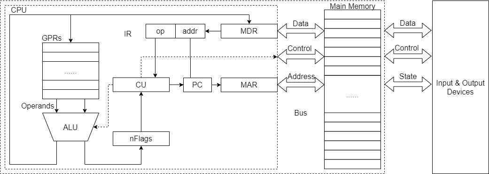
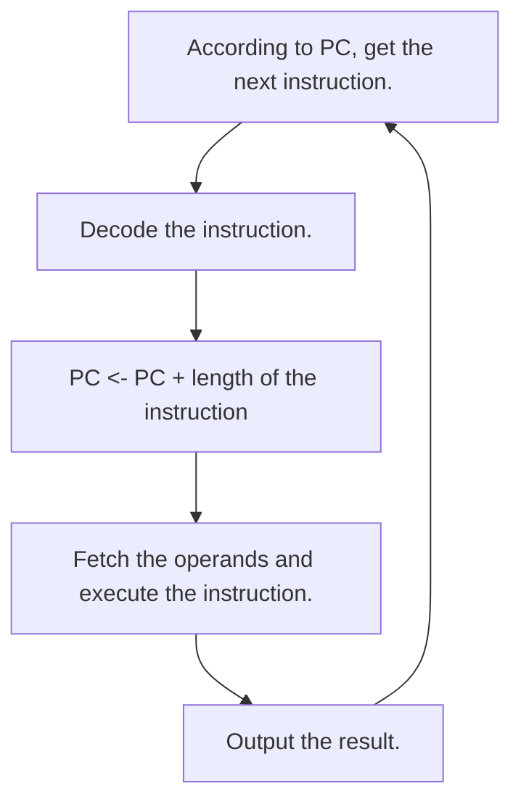
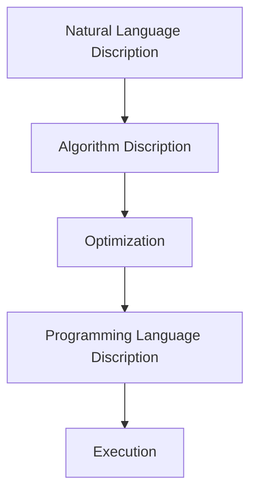
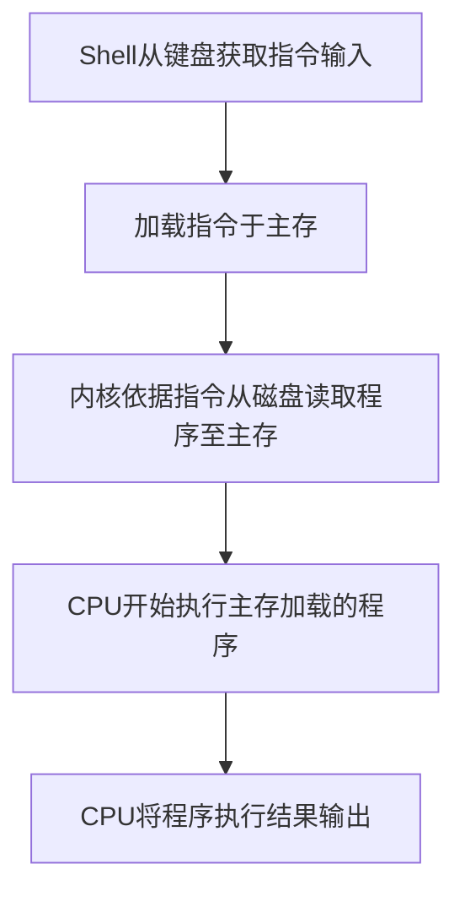

# 计算机系统概述

## 基本工作原理

### 冯诺依曼结构

1. 采用存储程序的工作方式，即将事先编写好的程序和原始数据送入主存后才能执行程序，一旦程序被启动执行，计算机能在不需要操作人员的干预下自动完成逐条指令取处和执行的任务。
2. 计算机由运算器、控制器、存储器、输入设备和输出设备组成。
3. 存储器内，数据和指令平权，存储形式没有区别，但计算机可以区分他们。控制器可以自动执行指令。运算器可以进行算术运算和逻辑运算。操作人员可以通过输入输出设备实现人机交互。

上图就是冯诺依曼结构的基本构造。

- 主存（内存，Main Memory）：存放指令和数据，主存被划分为若干单元并编号，即主存单元地址。
- 中央处理器（CPU，Central Programming Unit）：控制部件、运算部件、各种寄存器组成。
- 通用寄存器组（GPRs，General Purpose Registers）：临时存放从主存取出的数据和运算结果。
- 算术逻辑单元（ALU，Arithmetic Logic Unit）：进行算术逻辑运算。
- 标志寄存器（nFlags）：记录运算结果的标志信息。
- 指令寄存器（IR，Instruction Register）：临时存储从主存中读取的指令。
- 程序计数器（PC，Program Counter）：保存下一条指令的地址
- 控制器（Control Unit）：自动逐条读取指令并译码。
- 总线（Bus）：连接不同部件进行信息传输的介质（地址信息、数据信息、控制信息）。
- 主存地址寄存器（MAR，Memory Address Register）：连接CPU和地址总线。
- 主存数据寄存器（MDR，Memory Data Register）：连接CPU和数据总线。
- 输入输出设备（Input & Output Devices）：人机交互。

### 程序和指令的执行过程

- 指令：一串0和1组成的序列，指示CPU完成一项特定的原子操作。通常被分为若干字段，如操作码字段、地址码字段等。操作码字段指出指令的操作类型；地址码字段指出指令所处理的操作数的地址，如寄存器编号、主存单元编号等

程序的执行过程：

类似于链表的遍历过程，或者说程序的存储格式就是类似于链表。

指令执行的各阶段都包含若干个微操作，即CPU内部的各个部件之间的数据或地址信号交流，它们需要有相应控制信号来控制，可以理解为信号在总线上的传递过程。各个微操作之间具有先后顺序，因此CPU通过另外的时钟信号来进行定时执行，其宽度为一个时钟周期，一条指令的执行事件为一个或多个时钟周期。

### 程序的开发与运行

程序开发过程：

- 机器语言：计算机能理解并执行的使用特定格式的01序列，属于机器级语言。
- 汇编语言：机器语言的符号表示语言，必须转换为机器语言才能运行，属于机器级语言。
- 高级编程语言
- 翻译程序：源语言&源程序$\Rightarrow$目标语言&目标程序，有3类，汇编器、解释器、编译器。

源程序到可执行文件的“翻译过程”：

程序运行过程：

一个程序的执行必须依靠操作系统的支持，包括人机接口环境和内核服务例程。

### 计算机系统的层次结构

- 软件层面：软件应用、算法、编程语言、操作系统/虚拟机，即软件的开发与运行所必要的环境，偏重于使用计算机。
- 软硬件桥梁：指令级体系结构（ISA，Instruction Set Architecture），软件和硬件之间接口的完整定义，即一台计算机可以执行的所有指令的集合，其内容包括：数据类型及格式、指令格式、寻址方式和可访问地址空间大小，程序可访问的通用寄存器个数、位数和编号，控制寄存器的定义，I/O空间的编址方式，中断结构，机器工作状态的定义和切换，输入/输出结构和数据传送方式，存储保护方式等。
- 硬件层面：微体系结构、功能部件、电路、器件。微体系结构（微架构，microarchitecture）与ISA不同，是软件不可感知的部分，最终是由逻辑电路实现的，而逻辑电路则是由特定的器件实现的，偏重于构造计算机。

两个名词

- 应用程序二进制接口（ABI，Application Binary Interface）：它是为了运行在特定的ISA及特定操作系统之上的应用程序规定的一种机器级目标代码层接口，包含了运行在特定ISA及特定操作系统之上的应用程序所对应的目标代码生成时必须遵循的约定。如过程之间的调用约定（如参数与返回值传递方法）、系统调用约定（如系统调用的参数和调用号的传递方法）、目标文件二进制格式和函数库使用约定、机器中寄存器的使用规定、程序的虚拟地址空间划分等。
- 应用程序编程接口（API，Application Programming Interface）：它定义了较高层次的源程序代码和库之间的接口，通常是硬件无关的接口。