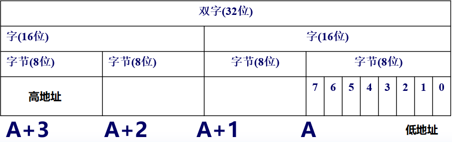
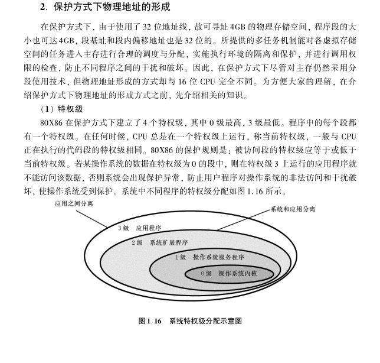
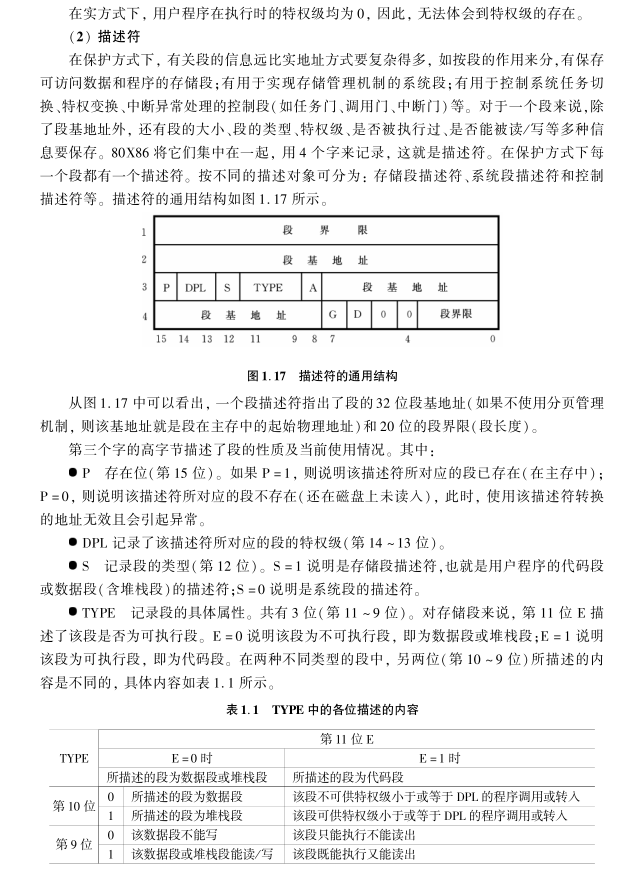
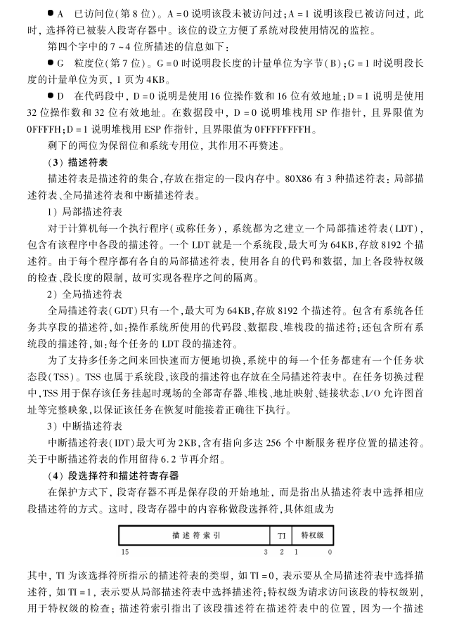
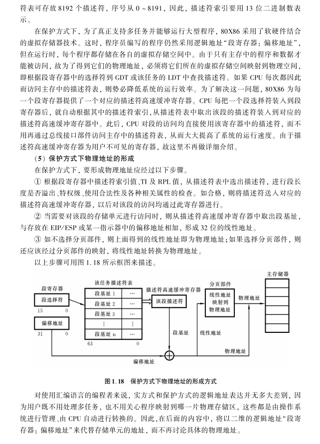

[toc]

# 汇编复习

## 预备知识

### 机器语言与汇编语言

机器指令（硬指令）：指挥计算机完成某一基本操作的命令，是面向机器的。

指令系统：每台计算机都规定了自己所特有的、一定数量的基本命令，这批指令的全体为计算机的指令系统。

机器语言：机器指令的集合。由0和1组成的二进制码，能为计算机识别并执行，依赖于某一类型的机器。不同类型的CPU都有自己特有的、一定数量的基本指令。

机器语言程序：用机器语言编写的程序。

汇编语言：一种用符号书写的、其主要操作与机器指令一一对应，并遵循一定语法规则的计算机语言。

汇编源程序：用汇编语言编写的程序。

汇编程序：把汇编源程序翻译成目标程序的语言加工程序。

汇编：汇编程序进行翻译的过程。

### Intel系列机简介

#### 冯诺依曼结构

冯诺依曼结构主要由运算器、控制器、存储器和输入输出设备组成。

特点：

1. 程序以二进制代码的形式存放在存储器中；

2. 所有的指令都是由操作码和地址码组成；

3. 指令在其存储过程中按照执行的顺序执行；

4. 以运算器和控制器作为计算机结构的中心。

#### 80x86

##### 总线接口部件

CPU与整个计算机系统之间的高速接口，接受所有的总线操作请求，并按优先权进行选择，最大限度地利用本身的资源为这些请求服务。

##### 执行部件

寄存器组、标志寄存器、算术逻辑部件、控制部件等组成，功能即为从译码指令队列中取出指令并且执行。

- 寄存器组
  - 数据寄存器组（EAX（累加器）（Accumulator）、EBX（基址寄存器）（Base）、ECX（计数寄存器）（Count）、EDX（数据寄存器）（Data））。
  - 指示器变址寄存器组（ESI（source index）（源变址寄址器）、EDI（destination index）（目的变址寄存器）、ESP（stack pointer）（堆栈指示器）、EBP（base pointer）（堆栈操作的基址寄存器））。
  - 段寄存器（CS（代码段）（code segment）、SS（堆栈段）（stack segment）、DS（数据段）（data segment）、ES（附加段）（extra segment）、FS（附加段）、GS（附加段））

##### 指令预取部件和指令译码部件

指令预取部件：通过总线接口部件，把将要执行的指令从主存中取出，送入指令排队机构中排队。

指令译码部件：从指令预取部件中读出指令并译码，再送入译码指令队列排队供执行部件使用。

指令指示器（IP/EIP）：它总是保存着下一条将要被CPU执行的指令的偏移地址（简称EA），其值为该指令到所在段首址的字节距离。不能供程序直接访问。`JMP`、`JZ`、`CALL`、`RET`等可以间接改变。

##### 分段部件和分页部件

使用分段部件和分页部件实现虚拟存储空间映射到物理存储空。

分段部件：段地址+段内偏移地址>>>>一维线性地址。

分页部件：虚拟线性地址>>>>主存储器地址。

##### 三种工作方式

1. 实方式（实际地址）

在实地址方式（简称实方式）下， 可以使用 ３２ 位寄存器和 ３２ 位操作数， 也可以采用 ３２位的寻址方式。 但是， ３２ 位 ＣＰＵ 与 １６ 位 ＣＰＵ 一样， 只能寻址 １ＭＢ 物理存储空间， 程序段的大小不超过 ６４ＫＢ， 段基址和偏移地址都是 １６ 位的， 这样的段也称为“１６ 位段”。

2. 保护方式（虚拟地址）

在保护方式下， 使用 ３２ 位地址线， 寻址 ４ＧＢ 的物理存储空间， 虚拟存储空间可达４ＴＢ。 段基址和段内偏移量都是 ３２ 位的， 程序段的大小可达 ４ＧＢ， 这样的段也称为“３２ 位段”。该方式提供了支持多任务的硬件机构， 能为每个任务提供一台虚拟处理器来仿真多台处理器， 此时， 操作系统将 ＣＰＵ 轮流分配给每一个虚拟处理器运行该空间中的任务， 并在各种任务之间来回快速而方便地切换。 分段和分页的存储管理功能能对各个任务分配不同的虚拟存储空间， 实施执行环境的隔离和保护， 对不同的段设立特权级并进行访问权限检查， 以防不同的用户程序之间、用户程序与系统程序之间的非法访问和干扰破坏， 使操作系统和各应用程序都受到保护。 这也是将该工作方式称为保护方式的原因。

3. 虚拟8086方式

虚拟 ８０８６ 方式是一种在保护方式下运行的类似实方式的工作环境， 因此， 能充分利用保护方式提供的多任务硬件机构、强大的存储管理和保护能力。 例如， 多个 ８０８６ 程序可以通过分页存储管理机制， 将各自的 １ＭＢ 地址空间映射到 ４ＧＢ 物理地址的不同位置， 从而共存于主存且并行运行， 每个程序就像在自己的 ８０８６ 中单独运行一样。 ＣＰＵ 不但可以执行多个虚拟 ８０８６ 任务， 还可以将虚拟 ８０８６ 任务与其他 ３２ 位 ＣＰＵ 任务一起执行。

### 主存储器和物理地址

存储器：用来存放程序和数据的装置，包括主存和外存。

#### 主存储器

主存储器：主机内部的半导体存储器，相对外存，容量小，速度快，成本高。

主存储器的基本存贮单位是位，它能容纳一个二进制数字0或1。8位组成一个字节，一个字节是一个存储单元。为了区别不同的单元，每一字节都被指定一个编号，即为此单位的物理地址。

字：由2个字节组成，字地址由两字节中地址较小的一个即低字节的地址决定。存放的方式是低8位存放低字节，高8位存放高字节。

双字：由2个字组成，双字的地址也由四个字节中的最低地址确定。32位中，低16位存放在低地址字，高16位存放在相邻的高地址字地址中。



#### 堆栈

从逻辑上来看：是内存中开辟的一片存贮区，这片存贮区采用的存贮方式是一端固定，一端活动，即只允许在一端插入或删除(访问可任意)。堆栈中数据的存取原则: “先进后出”， 堆栈中的数据也称元素或栈项。元素进栈称压入，出栈称弹出。

从硬件的观点看堆栈必须由一片存贮单元和一个指示器组成。固定端叫栈底。栈指针用来指示栈顶进栈和出栈时偏移地址的变化，指针所指示的最后存入信息的单元叫栈顶，所有信息的存取都在栈顶进行，栈指针总是指向栈顶的。注意，栈底为高地址。

堆栈的作用：程序中经常用到子程序或处理中断，此时，主程序需要把子程序调用指令或中断指令的下一条指令地址保存在堆栈中，以便子程序或中断返回后，主程序能够从调用点或中断点处继续执行。此外还用于：保护和恢复现场、主程序和子程序之间传递参数、子程序中的局部变量。

`PUSH OPS`：将立即数、寄存器、段寄存器或存贮器中的一个字/双字数据压入堆栈。

`POP  OPD`：将栈顶元素弹出送至某一寄存器、段寄存器（除CS外）或字/双字存贮单元中。

#### 存储地址

分段管理的方法：段首地址 + 段内偏移地址。

段首地址分别存放在段寄存器CS、DS、ES、SS、FS、GS中，段寄存器虽然都是16位的，但由于系统规定它们所表示的起始地址最低四位均为0。因此它们实际上代表20位的地址码。 实方式下，物理地址（PA）=段首地址左移四位补零+段内偏移地址（EA）。
段内偏移地址是段内相对于段起始地址的偏移值，往往由16位寄存器SP、BP、SI、DI、IP给出。离开段地址，孤立地谈偏移地址是没有任何意义的。 

分段的实际作用：

1. 实现了16位表示20位的地址；

2. 当程序和数据的大小<64KB时，编制的程序可只关心EA，而不用管它的起始地址在哪（便于程序在主存中任何位置运行）；

3. 便于不同目的的程序或数据分开存放，使程序各部分的含义更加明确。

实方式下的段特点：

1. 每段最多64K（16位段）（2^16）。
2. CPU在某一时刻只能同时访问6个段，这六个段称当前段，其段首址必须放在某个段寄存器中。
3. CS，SS由系统自动设置，DS、ES、FS和GS必须由用户编程设置。
4. 分段并不是唯一的，对于一片具体的存贮单元来说，它可以属于一个逻辑段，也可同时属于几个逻辑段。换言之，每个段可以以任意顺序分布在1M的地址空间中，可以完全重叠或者部分重叠。多个段在主存中并不一定是连续存放的。
5. 段的四种类型
   1. 代码段（Code Segment）：用于保存程序代码的段。一个应用程序必须至少定义一个代码段。规定代码段的段起始地址必须放在代码段寄存器CS中，而下一条将被执行的指令的偏移量必须存放在指令寄存器IP中，所以下一条将被在执行的指令永远位于CS:IP所指向的内存单元中。 
   2. 堆栈段（Stack Segment）：用于存放调用子程序主程序的返回地址等。一个应用程序的堆栈段是可选的。规定栈段的段起始地址必须放在栈段寄存器SS中，而当前栈顶的位置必须由栈顶指针寄存器SP表示。 
   3. 数据段（Data Segment）：用于存放程序中用到的数据。一个应用程序的数据段是可选的。规定数据段的段起始地址必须放在数据段寄存器DS中。 数据段首址一定要用户自已置。
   4. 附加数据段（Extra Segment）：有时为程序设计方便（特别是字符串处理程序），可使用附加段。一个应用程序的附加段是可选的。规定附加段的段起始地址必须放在附加段寄存器ES中。

保护模式下的物理地址：









### 数据表示

略

### 标志寄存器

标志寄存器用来保存在一条指令执行之后，CPU所处状态的信息及运算结果的特征。16位标志寄存器：FLAGS，32位标志寄存器：EFLAGS。

条件标志位：反映算术、逻辑运算等指令执行完毕后，运算结果的特征SF（符号标志）、ZF（零标志）、OF（溢出标志）、CF（进位标志）、AF（辅助进位标志）、PF（奇偶标志） 。

控制标志位：控制CPU的运行方式，工作状态DF（方向标志）、IF（中断允许标志）、TF（跟踪标志）。

系统标志位：实方式下不起作用。

对有符号数，加、减法运算结果只有OF=0时才是正确的；对于无符号数，只有CF=0时，运算结果才是正确的。

相关指令：

1. `LAHF`：将标志寄存器的低8位赋给AH，本指令不带操作数，也不影响标志位。
2. `SAHF`：讲AH的值赋给标志寄存器低8位，标志寄存器原来低8位的内容全部被冲掉，以AH的内容来取代。但它算不影响高字节内容。（因高字节中以控制标志为主，不能随便改变）
3. `PUSHF`：将标志寄存器的内容压入栈。
4. `POPF`：将栈顶内容送入标志寄存器。
5. 关于CF的指令：`CLC`（清零）、`CMC`（取反）、`STC`（置一）。
6. 关于DF的指令：`CLD`（清零）、`STD`（置一）。
7. 关于IF的指令：`CLI`（清零）、`STI`（置一）。

### 汇编语言语句

基本格式：`[名字] <操作符> [操作数] [<;>注释]`

一条带有操作数的指令需要指明两个问题：

1. 进行什么操作，由操作符和操作数综合来说明。
2. 用什么方式寻找操作数的存放地址，由寻址方式来说明。

## 寻址方式

寻址方式：

1. 寄存器方式（操作数存储在寄存器中）
2. 存贮器方式
   1. 寄存器间接方式
   2. 变址方式
   3. 基址加变址方式
   4. 直接方式
   5. 立即方式
3. 端口方式

考虑方面：

1. 语法
2. 类型
3. 段的确定
4. 偏移地址的确定

### 立即寻址

格式：`常数或者确定数值表达式（立即数）`

紧跟在指令操作码后面的一个可用8位、16位或32位二进制补码表示的有符号数，构成了指令的一部分，位于代码段中。

立即数只能作为双操作数指令的源操作数，不能作为目的操作数；立即数不能作为单操作数指令的操作数。

立即数只有大小，没有数据类型，占用的字节数由指令指定（目的操作数）。

立即寻址方式主要用于给寄存器或存储器赋初值。它是随指令取到CPU内部的，不需要再单独运行总线周期访问存储器，速度快，表达简单明了、清晰直观。

### 寄存器寻址

格式：`寄存器`

操作对象在CPU的寄存器中，不在内存。

寄存器既可以作为源操作数，也可以作为目的操作数。

操作数的类型由寄存器的位数决定：8位寄存器是字节类型；16位寄存器是字类型；32位寄存器是双字类型。

在双操作数的指令中，当两个操作数类型均明确时，必须一致。

寄存器寻址的指令执行速度快，在编程中，应该充分利用寄存器存放经常使用的操作数。

### 直接寻址

格式：`段寄存器:[偏移地址]`或`段寄存器:含有变量的地址表达式`

操作数存放在指定的段中。操作数的偏移地址EA（16位或32位）紧跟在指令操作码后面，存放在内存的代码段中，构成了指令的一部分，通过指令指示器IP/EIP获取。 

第一种形式下，偏移地址是一个数值或数值表达式，直接表明操作数的偏移地址值，是一个无符号数。操作对象在段寄存器指定的段中，不可省略段寄存器。

第二种形式下，段寄存器可以省略。含有变量的地址表达式在汇编过程中将转换成第一种形式，偏移地址由汇编程序计算地址表达式得到，段寄存器名根据变量定义所在的段，以及段假定伪指令共同决定。

对于第一种形式，操作数是无类型的。

对于第二种形式，类型由变量的类型决定。

### 寄存器间接寻址

格式：`段寄存器:[寄存器]`，限定为BX、BX、SI、DI、EAX、EBX、ECX、EDX、EDI、ESI、EBP、ESP。

操作数的偏移地址在指令指明的寄存器中。

段寄存器省略的情况，当寄存器是BP、EBP、ESP，则操作对象在当前堆栈段中。即操作数地址为`SS:[]`；为其它规定的寄存器时，则操作对象在当前数据段中，即操作数为`DS:[]`。

此种寻址无类型，在操作数类型不明确时，一定要指出操作数类型。

### 变址寻址

格式：`段寄存器：[R*F+V]`、`段寄存器：[R*F]+V`、`段寄存器：V[R*F]`

计算：`EA = (R) * F + V`，R为寄存器，F为比例因子，V为位移量，操作对象在内存中,变址寄存器R的内容乘以指定的比例因子F后加上给定的位移量V作为操作数的偏移地址。

寄存器限定为BX、BP、SI、DI、EAX、EBX、ECX、EDX、EDI、ESI、EBP、ESP。同上。

F为指定的比例因子，可为1，2，4或8。当R为16位寄存器或ESP时，F只能取1并省略不写。

V为位移量V是不超过16位（R为16位寄存器时）或不超过32位（R为32位寄存器时）的二进制补码表示的有符号数，也可以是合乎语法规则的数值表达式、变量或标号名（取其偏移地址计算）（不可以是寄存器名）。

当段寄存器省略时，有，当V为常数或数值表达式时，操作对象所在的段由R决定（与寄存器间接寻址方式相同）；当V为变量或标号时，操作数对象所在的段就是变量或标号所在的段（不由R决定）。汇编程序根据段指定伪指令来决定翻译源程序时使用哪个段寄存器。

当V为常量时，此种寻址无类型；当V为含有变量或者标号的表达式时，则有类型，其类型与变量或标号类型相同。

### 基址加变址寻址

格式：`段寄存器:[BR+IR*F+V]`、`段寄存器:V[BR][IR*F]`、`段寄存器:V[BR+IR*F]`

计算：`EA = (BR) + (IR)*F + V`，操作对象在内存中，变址寄存器IR的内容乘以比例因子F，与基址寄存器BR的内容和位移量V相加，作为操作数的偏移地址。

基址寄存器限定为BX，BP和所有32位通用寄存器。

变址寄存器限定为SI，DI和除ESP之外的32位通用寄存器。

对于16位寄存器，F只能为1并省略不写，对于32位寄存器，则无限制，1、2、4、8都可以。

基址寄存器和变址寄存器必须位数相同。

当段寄存器省略时，有，当V为常数时，默认的段寄存器由基址寄存器器BR决定。即BR为BP，ESP，EBP默认段为SS，其它默认段为DS。当V为变量或标号表达式时，操作对象所在的段就是变量或标号所在的段。

当V为常数时，操作数无类型。当V为变量或标号表达式时，操作对象与变量或标号类型相同。

### 寻址方式的问题

| 目的操作数 | 源操作数 | 示例                 | 正误           |
| -------------- | ------------ | ------------------------ | ------------------------ |
| 寄存器     | 寄存器   | `MOV AX, BX`       | 正确     |
| 寄存器     | 存储器   | `MOV AX, [BX]`       | 正确     |
| 寄存器     | 立即数   | `MOV AX, 0`          | 正确        |
| 存储器     | 寄存器   | `MOV [SI], EAX`      | 正确    |
| 存储器     | 存储器   | `MOV [SI], A`        | 错误      |
| 存储器     | 立即数   | `MOV WORD PTR [SI], 0` | 正确 |
| 立即数     | 寄存器   | `MOV 1, AX`          | 错误        |
| 立即数     | 存储器   | `MOV 1, [BX][SI]`    | 错误  |
| 立即数     | 立即数   | `MOV 1, 2`           | 错误         |

存储器间之所以不可以进行数据交换，是因为总线不可能同时读写。

目的操作数显然不能是立即数。

指令中的操作数类型都不明确时，用类型说明伪指令（字节类型`BYTE  PTR`、字类型`WORD  PTR`、双字类型`DWORD PTR`）指明（只对存储器方式有效）。

单操作数的类型一定要明确。

双操作数的源、目的操作数中至少有一个的类型要明确（一般问题出在一个是存储器方式寻址的操作数，另一个是立即寻址方式）。

对双操作数指令来说，如果两个操作数的类型都是明确的，则源、目的操作数的类型要一致。

## 宏汇编语言

### 常量

汇编时已有确定的数值的量（不是程序运行的时候才能确定的）。

用途：

1. 机器指令语句中的立即操作数
2. 存贮器操作数的组成部分（位移量V）
3. 在数据定义伪指令语句中给变量赋初值

分类：

1. 数值常量：直接以数值形式出现。
2. 符号常量：给数值常量赋以名字。
   1. 定义方法：`EQU`或`=`
   2. 符号常量不分配存贮单元，只建立等价代换关系, 可出现在任何段。汇编程序在汇编过程中将符号常量直接代换为等价的数值常量。
   3. 用`EQU`语句定义的符号常量在该程序中不能再重新赋值，而用`=`定义的符号常量可多次重新赋值，使用时，以最后一次定义的值为准。

### 数值表达式

常量与运算符（算术运算、逻辑运算、关系运算）组成的有确定意义的式子。

运算：

1. `+ - * / MOD SHR SHL`（移位都补0）
2. `AND OR XOR NOT`
3. `EQ NE LT GT LE GE`（关系成立则为0，否则为全1（-1补码））

数值表达式将在汇编期间运算得出结果，结果即为数值常量。

数值表达式中如果有变量和标号，均是取其EA参加运算。

### 变量

数据段或附加数据段中一个数据存贮单元的名字，是这个存储单元的地址的符号表示，也可代表一批存储单元的首址。

变量具有的属性：

1. 段属性：定义变量所在段的段首址，当访问该变量时该段首址应在某一段寄存器中，即为CPU当前可访问段。
2. 偏移地址：变量所占存储单元到所在段的段首址的字节距离。
3. 类型：类型是指存取该变量中的数据单元所需要的字节数，变量的类型由定义该变量时所使用的伪指令确定。

变量的定义：`变量名 伪指令 表达式[....]`，`所占字节数=表达式个数*变量的类型`

伪指令有`.BYTE（字节）DB`、`.WORD（字）DW`、`.DWORD（双字）DD`、`.FWORD（三字）DF`、`.QWORD（四字）DQ`、`.TBYTE（十字节）DT`。

变量初始化：

1. 数值表达式
2. ASCII字符串
3. 地址表达式：
   - 只适用于`DW`和`DD`
   - 对于`DW`，定义的变量被初始化为地址表达式的偏移地址。
   - 对于`DD`，定义的变量的低字被初始化为地址表达式的偏移地址，高字被初始化为地址表达式对应变量所在的段地址
4. 随机不定：使用`?`即可
5. 重复赋值：使用`n DUP(表达式)`，n为数值常量。可嵌套，从内向外展开。

### 标号

机器指令语句存放地址的符号表示，也可以是子程序名，即子程序入口地址的符号表示，在代码段中定义和引用。

标号具有的属性：

1. 段属性：标号的段属性是指定义该标号所在段的段首址。
2. 偏移地址：标号的偏移地址是指它所在段的段首址到该标号所代表存储单元的字节距离。
3. 类型：分`NEAR`和`FAR`两类型，近标号在定义该标号的段内使用，远标号无此限制。

### 地址表达式

地址表达式是由变量、标号、常量、寄存器（名字加方括号）及一些运算符（数值表达式的运算符和特殊运算符）所组成的有意义的式子。变量、标号是地址表达式的特例。 

直接寻址方式、寄存器间接寻址方式、变址方式、基址加变址方式中遇到的就是地址表达式。

注意：

1. 指令中的地址表达式不允许出现不带方括号。
2. 在定义变量时，其后表达式不能带寄存器符号和方括号。

### 类型运算符

由来：什么样的操作数类型是明确的？

1. 寄存器寻址是明确的，因为寄存器的字长的明确的。
2. 含变量的存储其寻址方式是明确的，因为变量定义时已经指明了类型。

格式：`类型 PTR 地址表达式`

用来指明紧跟其后的地址表达式的类型属性，但保持它原来的段属性和偏移地址属性不变或者使它们临时兼有与原定义所不同的类型属性。

要点：

1. 使语句中类型模糊的操作数类型变得明确。
2. 临时改变某一操作数地址的类型，使得类型不一致的两地址变为一致。 
3. 不带方括号的寄存器符号不是地址表达式，不能用PTR改变寄存器的类型。

### 属性分离运算符

格式：`运算符 变量或标号`

属性分离算符可分离出变量、标号的段、偏移地址、类型的属性值。运算结果为数值常量。

1. 取段地址运算符`SEG`
2. 取偏移地址运算符`OFFSET`

## 基本指令

- `MOV`
  - 目的和源操作数不能同时为存贮器地址。
  - 不能向`CS`送数据；不能使用`IP`。
  - 不能直接传立即数到贮存器。
  - 不能在段寄存器之间传送。
- `movsx`
  - 将源操作数的符号向前扩展成与目的操作数相同的数据类型再送入目的地址。（补码扩展）
  - 源操作数不能是立即数。
  - 目的操作数必须是16位或32位寄存器。
  - 源操作数的位数要小于目的操作数的位数。
- `movzx`
  - 将源操作数的高位全部补0，扩展成与目的操作数相同的数据类型再送入目的地址中。 
  - 同上三条注意点。
- `xchg`
  - 数据交换
- `lea`
  - 按源操作数的寻址方式计算偏移地址，并送入目的操作数所指的寄存器。
  - 目的操作数一定是16位或32位通用寄存器。
  - 源操作数一定是一个存贮器地址，可是寄存器间接寻址、基址加变址、变址寻址、直接寻址。
  - 如果偏移地址位32位，但传给16位寄存器，则取低16位。
  - 如果偏移地址位16位，但传给32位寄存器，则高位补零。
- `ADD`
- `INC`
- `SUB`
- `DEC`
- `NEG`：求补
- `CMP`：比较目的操作数与源操作数，然后根据比较的结果设置标志位，但该结果并不存入目的地址
- `IMUL`：有符号
  - `IMUL OPD, OPS`
    - 源和目的寄存器为同类型寄存器、存储器操作数或立即数。
    - 计算`OPS * OPD`并赋给`OPD`
  - `IMUL OPD, OPS, n`
    - 寄存器限制同上。
    - 计算`OPS * n`并赋给`OPD`
  - `IMUL OPS`
    - `OPD`隐含为`AL AX EAX`，具体是哪一个要看`OPS`的类型。
    - `OPS`为字节类型，则计算`AL * OPS`并赋给`AX`。
    - `OPS`为字类型，则计算`AX * OPS`并赋给`DX、AX`。
    - `OPS`为双字类型，则计算`EAX * OPS`并赋给`EDX、EAX`。
    - 如果乘积的高一半位（字节相乘指AH，字相乘指DX，双字相乘指EDX）不是低一半位的符号扩展，即在AH（或DX/EDX）中包含有乘积的有效位，则CF＝1、OF＝1；否则，CF＝0，OF＝0。
- `MUL`：无符号
  - `MUL OPS`
  - 同上`IMUL`第三种。
  - 如果乘积的高位不为0，即在AH（或DX/EDX）中包含有乘积的有效位，则CF＝1、OF＝1；否则，CF＝0，OF＝0。
- `CBW`：将AL中的符号扩展至AH中，操作数隐含且固定。
- `CWD`：将AX中的符号扩展至DX中，由 DX，AX组成双字。
- `CWDE`：将AX中的有符号数扩展到EAX。
- `CDQ`：将EAX中的有符号数扩展为64位数即EDX、EAX。
- `IDIV`：有符号
  - 同下。
  - 余数与被除数同号。
- `DIV`：无符号
  - `DIV OPS`
  - `OPS`为字节类型，计算`AX/OPS`并将商赋给`AL`余数赋给`AH`。
  - `OPS`为字类型，计算`DX,AX/OPS`并将商赋给`AX`余数赋给`DX`。
  - `OPS`为双字类型，计算`EDX,EAX/OPS`并将商赋给`EAX`余数赋给`EDX`。
  - 除法类型由OPS的类型决定。OPS不能是立即数，且指令执行后，OPS的值不变。
  - 如果除数为0或运算结果溢出，则会产生溢出中断，立即中止程序的运行。但系统未定义除法指令影响条件标志位。
- `NOT`：求反
- `AND`
- `TEST`
  - `TEST OPD, OPS`
  - 检测与源操作数中为1的位相对应的目的操作数中的那几位是否为0或为1，根据测试结果置OF、CF、SF、ZF位，后面往往跟着转移指令，根据测试结果确定转移方向。操作结束后，OPD、OPS的内容并不改变。
- `BT`
  - `BT OPD, OPS`
  - 将目的操作数中的指定位的值赋给CF，位编号由源操作数指定。操作结束后，OPD、OPS的内容并不改变。
  - OPD必须为16/32位的寄存器或存储单元，如果使用字节类型的OPD，系统并不报错，而是自动转换为对应的16位寄存器或字类型存储单元完成相应的操作。
  - OPS只可为立即数或与OPD同类型的寄存器操作数，不能是存储器操作数。
  - OPS的值应在—128 ~ +127之间。当OPS的绝对值大于OPD的位数时，系统则取OPS除16或32（由OPD的类型决定）后的余数作为OPD的位号。
- `OR`
- `XOR`
- 移位指令：
  - S开头为单向移位，R开头为循环移位。
  - S开头后接H则为逻辑移位，后接A则为算术移位。
  - R开头后接O则为普通循环移位，后接C则为含CF的循环移位。
  - 末尾L和R分别表示方向。
  - 不管哪种方式的移位都会将所移出的最后一位放入CF位。
  - 仅当仅当n=1时候，OF有定义，当移位后如果最高符号位发生了变化，则OF=1，否则OF=0。
- 字符串指令：
  - 带操作数的指令类型由操作数决定
    - `MOVS`：传送字节/字/双字串指令
    - `SCAS`：搜索字节/字/双字串指令
    - `CMPS`：比较字节/字/双字串指令
    - `LODS`：取字节/字/双字串指令
    - `STOS`：存储字节/字/双字串指令
  - 不带操作数的类型由指令后缀决定，后缀有`B/W/D`对应字节/字/双字。
  - 串操作指令隐含使用相同的寄存器、标志位和符号
    - 源串指针：`DS：SI/ESI`即源串在当前数据段
    - 目的串指针：`ES：DI/EDI`即目的串在当前附加数据段
    - 重复计数器： `CX/ECX`
    - 中间寄存器：`EAX/AX/AL`
    - 比较/传送方向：DF来指明，`DF=0`，`SI/ESI,DI/EDI`自增；`DF=1`，自减。
- 重复前缀：
  - `REP`：无条件重复CX/ECX次
  - `REPE/REPZ`：相等时重复，`CX/ECX!=0&&ZF=1`。
  - `REPNE/REPNZ`：不相等时重复，`CX/ECX!=0&&ZF=0`。

## 伪指令

汇编源程序中控制汇编程序应如何工作的命令是伪指令，或称汇编控制命令。

在目标程序中没有对应的机器代码，在将源程序翻译成目标程序后，伪指令就不存在了。

- 处理器选择伪指令：`.X80[P]`，`.MMX`

  - 在源程序中，告诉汇编程序选择何种CPU所支持的指令系统；
  - 一般放在程序的开始处，表示后面的段使用该处理器所支持的指令系统；
  - 放在段中，表示从紧接着的语句开始，使用新指定的处理器指令系统，直到遇到一个新的处理器选择伪指令为止；
  - 缺省情况下是`.8086`

- 数据定义伪指令：见变量

- 符号定义伪指令：

  - 见符号常量
  - `LABEL`：`[变量名或标号] LABEL 类型`
    - 为当前存贮单元（下一个能分配的存储单元）定义一个指定类型的变量或标号，等同于`[变量名或标号] EQU THIS 类型`。
    - 这种方式相当于取别名，段属性和偏移地址与之前的相同，但类型可能不同。

- 段定义伪指令：

  - ```asm
    段名 SEGMENT [使用类型] [定位方式] [组合方式] [类别]
    	......
    段名 ENDS
    ```

    - 一个程序模块可以由若干段组成，段名可以各不相同，也可以重复，汇编程序将一个程序中的同名段处理成一个段；
    - 段的定义还可以嵌套，但不能交叉；
    - 使用类型只有对使用`.386`及以上处理器选择伪指令的段才起作用。`USE16 USE32`
    - `.386`及以上处理器选择伪指令，段使用类型默认为`USE32`。所以在实方式和虚拟`8086`方式中必须指明`USE16`，只有保护模式才能使用32位的段。

  - `ASSUME 段寄存器:段名[,段寄存器:段名]`

    - 用来设定段寄存器与段之间的对应关系，即告诉汇编程序，该段中的变量或标号用哪个段寄存器作段首址指示器。这样程序里访问该段的变量或标号时，可以省略显式的跨段前缀。
    - 在代码段的开始，就要用ASSUME语句建立CS、SS与代码段、堆栈段的对应关系，否则就会出错。
    - ASSUME语句不可能将段首址置入对应的段寄存器中，这一工作要到目标程序最后投入运行时，系统装载的时候，CS和SS会自动设置到对应段的段首位置，不用用户程序处理。
    - 对于数据段和附加数据段，若用ASSUME语句建立它们与DS、ES的关系，则其后语句如需访问这些段内的变量，均可直接使用段内寻址，而不必带跨段前缀。若不用ASSUME语句建立它们与DS、ES的对应关系，则其后语句如需访问这些段内的变量，都必须带跨段前缀才可使用段内寻址。
    - 对于数据段和辅助数据段，必须由用户程序自行将段首址放入DS和ES中，一旦在程序中用ASSUME假设或重新假设了DS或ES与某个数据段的关系，下面就要将新段首址放入DS或ES中。否则的话即使语法没有错误，执行结果也不对。

  - `END [表达式]`

    - 该语句为汇编源程序的最后一个语句，用以标志源程序的结束。即告诉汇编程序翻译到此为止。
    - 表达式指出了该程序运行时，第一条被执行指令的地址。如果不带表达式，说明该程序是一个子模块，不能单独执行，往往供另外的程序调用。

  - `$`

    - 地址计数器：记录正在被汇编程序翻译的语句的地址。

  - `ORG <数值表达式>`

    - 表达式的值为0 ~ 65535（16位段）0~ 4G（32位段）。
    - 指定一个地址，后面的程序或数据从这个地址值开始分配。

- 过程定义伪指令：见分支结构

- 模块定义与通讯伪指令：见模块

- 宏定义伪指令：见宏定义

- 条件汇编伪指令：见循环

- 格式控制、列表控制及其他功能伪指令

伪指令与机器指令的区别：

- 功能不同，机器指令控制CPU的工作，伪指令控制汇编程序工作。
- 格式不同，机器指令标号后面带冒号，而伪指令的名字后面没有。
- 被执行时CPU所处状态不同，用户程序在运行时执行机器指令，汇编程序运行时，执行伪指令。
- 机器指令是用硬件线路来实现其功能的，它有目的代码。而伪指令是用来控制汇编程序操作的，是用程序来实现其功能的，它在汇编期间被执行，在目的代码中已不存在了。

## 系统调用

DOS的系统功能调用：系统将对计算机外部设备（键盘输入、屏幕输出）的控制过程编写成程序，事先存放在系统盘上，用户在需要时只要按规定的格式设置好参数，直接调用。

分类：设备管理、文件管理、目录管理、其他功能

一般过程：设置入口参数、置AH为子程序功能编号、`INT 21H`、成功调用`CF=0`否则`CF=1`且`AX`返回错误码。

- 一号调用：获取字符输入

  - ```asm
    MOV	AH, 1
    INT	21H
    ```

  - 等待从键盘输入一个字符并传给AL，同时将此字符在屏幕上显示出来。

- 二号调用：屏幕显示字符

  - ```asm
    MOV DL, 待显示字符的ASCII码
    MOV AH, 2
    INT 21H
    ```

  - 将DL中的字符在屏幕上显示出来。

- 九号调用：屏幕显示字符串

  - ```asm
    LEA DX, 字符串首址偏移地址
    MOV AH, 9
    INT 21H
    ```

  - 将当前数据段中指定的（DS:DX）字符串输出（该字符串必须以`$`为结束符，且字符`$`不输出）。

- 十号调用：获取字符串输入

  - ```asm
    LEA DX, 缓冲区首址偏移地址
    MOV AH, 10
    INT 21H
    ```

  - 从键盘上向当前数据段中指定的（DS:DX）输入缓冲区输入字符串，并送屏幕显示。

  - 缓冲区的定义：

    - 第一个字节必须初始化为缓冲区大小n。

    - 第二个字节留空，在调用结束后将获取实际填入的字符个数。

    - 之后的n个字节为缓冲区。

    - ```asm
      DATA SEGMENT USE16
      	BUF DB 50
      		DB ?
      		DB 50 DUP(0)
      DATA ENDS
      ```

  - 缓冲区必须按照规定的格式定义，而且一定要定义在数据段DS中。

## 程序设计

汇编语言程序设计的一般步骤：

1. 分析问题，选择合适的解题方法。
2. 根据具体问题，确定输入输出数据的格式。
3. 分配存贮区并给变量命名（包括分配寄存器）。
4. 绘制程序的流程图，即将解题方法和步骤用程序流程图的形式表示出来。
5. 根据流程图编写程序。
6. 静态检查与动态调试

### 分支结构

分支由条件转移指令产生，不同条件通过EFLAGS的标志位状态（0或1）反映出来。

转移指令不影响EFLAGS的标志位，可连续使用转移指令，产生多个分支。

#### 条件转移指令

前缀为`J`。格式均为`JX 标号`。

功能：条件满足则跳转至标号处，即将标号地址传给IP或EIP。

特点：

- 只能是段内直接跳转，不改变CS的值。
- 汇编阶段会直接将标号和当前位置进行运算得出位移量，-128至127区间会设为8位有符号数，-32768至32767区间会设为16位有符号数（16位段），-2G至2G区间设为32位有符号数（32位段）。
- 超出转移范围可以使用无条件转移指令进行搭桥。

##### 简单条件转移指令

根据单个标志位 CF、ZF、SF、OF、PF的值确定是否转移。

`JX`，`X`为`Z S O C P`，对应相应的`XF = 1`的情况下跳转。

`JNX`，`X`同上，对应`XF = 0`的情况下跳转。

特殊的几个：`JE`与`JZ`等价，`JNE`等价`JNZ`，`JPE`等价`JP`，`JPO`等价`JNP`。

- 用在TEST、CMP、AND、OR后面，测试某一标志位是否满足条件。
- 用在算术运算指令后面，测试某一标志位是否满足条件。
- 在循环计数控制中，用来判断循环是否结束`(JZ/JE/JNZ/JNE)`。

##### 无符号数条件转移指令

无符号数条件转移指令往往跟在比较指令之后，根据与无符号数特征有关条件标志CF和ZF的组合决定转移方向。

A表示above，N表示not，B表示below，E表示equal。

`JA/JNBE`：`CF=0&&ZF=0`

`JAE/JNB`：`CF=0||ZF=1`

`JB/JNAE`：`CF=1&&ZF=0`

`JBE/JNA`：`CF=1||ZF=1`

- 用作无符号数的比较——地址的比较、ASCII码比较。
- 用于循环控制。

##### 有符号数条件转移指令

G表示greater，L表示less，N表示not，E表示equal。

`JG/JNLE`：`SF=OF&&ZF=0`

`JGE/JNL`：`SF=OF||ZF=1`

`JL/JNGE`：`SF!=OF&&ZF=0`

`JLE/JNG`：`SF!+OF||ZF=1`

- 用在CMP后面，比较带符号数大小，确定转移方向。
- 用在算术运算指令后面，根据运算结果正负确定转移方向。
- 用在OR，AND后面，根据结果正负确定转移方向。

#### 无条件转移指令

`JMP 标号/OPD`

- 可以实现段内和段间转移，OPD为地址表达式，不能为立即数。
- 对于段内转移，直接将标号或将地址表达式的内容赋给IP/EIP。可以为寄存器间接寻址，变址寻址，基址加变址寻址，直接寻址。
- 对于段间转移，直接将标号和标号对应的段首址分别赋给IP/EIP和CS，对于地址表达式则将地址表达式的前一个字或双字的内容赋给IP/EIP，后一个字或双字的内容赋给CS。只能用存储器寻址，即变址寻址，基址加变址寻址，直接寻址。

- 使CPU无条件地转移到指令指明的目的地址处(标号指定)执行；转移的范围大，灵活性大。
- 不能构成分支程序，但可将各分支的出口重新汇集在一起。
- 某些条件转移指令转移的范围超过它规定的范围时, 用JMP搭桥。

分支比较多时，框图对每个分支的判断先后次序应尽量与问题提出的先后次序一致。而程序对各分支的安排也需要与框图的安排次序一致，这样在编写程序时就不会漏掉某一分支，而且写出的程序清晰，容易阅读和检查。

在调试分支程序时，要假定各种可能的输入数据，沿着每一支路逐一检查，测试程序是否正确。只有所有分支都满足设计要求时，才能保证整个程序满足设计要求。

### 循环结构

#### 计数控制

- `LOOP 标号`：等价于`DEC  CX/ECX `+`JNZ 标号`，但对标志位无影响。
- `LOOPE/LOOPZ 标号`：`CX/ECX!=0&&ZF=1`。
- `LOOPNE/LOOPNZ 标号`：`CX/ECX!=0&&ZF=0`。

- `JCXZ/JECXZ 标号`：若 （CX / ECX) 为0，则转标号处执行。该指令常放在循环开始前，用于检查循环次数是否为0，为0时跳过循环体。
- 标号均为短标号即NEAR类型。

#### 条件控制

1. 置循环初值（循环体工作变量／寄存器的初值，控制循环结束条件的变量／寄存器的初值）

2. 工作部分（重复执行的程序段－循环体）
3. 修改部分（修改操作数值／地址和控制变量/寄存器）
4. 判断控制部分（根据循环结束条件决定是否继续循环）

### 子程序

#### 格式

```asm
子程序名 PROC [类型]
	......
子程序名 ENDP
```

- 子程序名也具有段属性，偏移地址属性和类型属性 （FAR和NEAR（缺省））。NEAR类型为段内调用，即主子程序在同一个代码段内，子程序一般定义为NEAR，NEAR可省略。FAR类型为段间调用，被另外代码段调用的过程要定义为FAR过程。

#### 调用方法

- 段内调用：`CALL 子程序名`
  - 将`CALL`指令之后的下一条指令的偏移地址入栈，将目标子程序的偏移地址传给IP/EIP。
- 段间调用：`CALL FAR PTR 子程序名`
  - 将当前CS和`CALL`指令之后的下一条指令的偏移地址入栈，将目标子程序的段首址和偏移地址分别传给CS和IP/EIP。
- 段内间接调用：`CALL WORD PTR OPD`（16位段）
  - 将IP/EIP入栈后将地址表达式的内容赋给IP/EIP。可以为寄存器间接寻址，变址寻址，基址加变址寻址，直接寻址。
- 段间间接调用：`CALL DWORD PTR OPD`（16位段）
  - 将CS和IP/EIP入栈后将地址表达式的前一个字或双字的内容赋给IP/EIP，后一个字或双字的内容赋给CS。只能用存储器寻址，即变址寻址，基址加变址寻址，直接寻址。

#### 返回

`RET`和`RET n`

- 将压入栈的CS和IP/EIP弹出。
- 特别注意：为了能正确返回主程序，在执行子程序过程中，不管是否使用过堆栈，必须保证进入子程序时的栈顶与执行RET时的栈顶一样，否则不能正确返回。
- 对于RET  n 表示返回时，清除堆栈中栈顶的n/2或 n/4个无用参数（n为偶数）。在上述动作之后再作`(SP) + 2`赋给SP，当使用堆栈传递子程序参数的时候经常使用。

#### 保护现场

现场：执行到某一条指令时，各寄存器的值。存储单元中的内容等等。

保护现场：主要指调用子程序前后，现场的值不因子程序的调用而被破坏。

可以在调用前后进行入栈出栈操作进行保护，也可以在子程序的开始与结尾进行入栈出栈操作进行保护。常用后者。

#### 参数传递

1. 主程序为子程序提供入口参数

2. 子程序根据入口参数进行一系列处理

3. 子程序返回结果给主程序

##### 寄存器法

- 将所需参数放在寄存器中带入子程序。
- 利用寄存器传送入口、出口参数，适合于参数少的情况。该方法较简单，就像DOS的系统功能调用入口参数一样。
- 传递信息快，编程简单方便，节省存贮单元。
- 因为寄存器数量有限，参数不能太多，要避免出错。
- 出口参数是子程序交给主程序的处理结果，千万不可将其所在寄存器列在需要保护的现场寄存器之中。而入口参数是否要保护，可依实际情况事先约定。

##### 约定单元法

- 将数据与运行好的结果放入事先规定好的存贮单元中，如采用模块程序设计，这些单元的变量名称要定义成全程符号与外部符号，使用时，要在当前可访问的数据段中。
- 输入和输出参数都使用独立的存储单元，不占用寄存器，编写程序简单易懂，不易出错，参数数量灵活，可多可少。
- 占用一定数量的存储单元。

##### 堆栈法

- 堆栈法指将传递的参数放在堆栈中，进入子程序或返回主程序后，再利用变址寻址将参数从堆栈中送入指定的寄存器。

- 当参数个数较多时，一般用堆栈法传递参数，在使用堆栈时要注意栈顶的变化，要回收堆栈中传递参数的单元。

- C，PASCAL等高级语言一般都是使用堆栈法来传递参数。
- 采用堆栈法可传递大量参数，数量灵活，可多可少，不占据寄存器资源，不需要额外定义变量。是高级语言常采用的方法。
- 参数和子程序的返回地址都在堆栈中，使用时要小心，防止返回地址被破坏，或者子程序返回的时候，返回地址不在栈顶。

### 宏

对于程序中的重复部分，定义成子程序有时间和空间上的开销。对于程序中较简单的重复部分设计成子程序其调用开销本身就要超过这个语句序列，这是不合算的。为此，现在的机器均提供了宏汇编语言。

#### 格式

```asm
宏指令名 MACRO 形参[,形参]
	......
ENDM
```

- 宏名字可以与其他变量，标号，保留字同名，汇编程序在处理时宏名字优先级最高。利用这一特点，程序员可以设计新的指令系统。
- 形参可有可无个数不限,但总字符长度不超过132个，各参数之间用逗号隔开。
- 宏指令必须先定义后调用 ，即一定要放在它的第一次调用之前，因为它是在汇编期间处理的。

#### 调用

```asm
宏指令名 [实参[,实参]]
```

- 实参与形参应按位置关系一一对应。实参个数多形参，多余实参被忽略；实参个数小于形参，缺少的实参被处理成空白（无字符）。
- 在宏调用中，有时实参是一串带间隔符的字符串，为了不致混淆，应该尖括号将它们括起来，说明为一个参数。
- 宏体中定义的的变量与标号会因为多次调用某一个宏而出现重复，使用伪指令`LOCAL`，让机器自动生成不同标号。该语句只能做宏体中的第一个语句。
- 对于经常使用的宏定义，用户可将它们集中在一起，建成宏库供自己或别人随时调用。由于宏库为文本文件，可用一般编辑程序建立或修改，文件名也可由用户任意指定。 将宏库加入源文件一起进行汇编可用伪指令INCLUDE实现。

宏指令与子程序：

- 处理时间不同：宏指令是在汇编时进行宏扩展，子程序是在执行时运行。
- 处理方式不同：宏必须先定义、后调用，汇编结束，宏定义也消失。子程序调用，是CPU将控制方向由主程序转向子程序。
- 代码长度不同：宏调用的次数越多，占用的内存也增加。而子程序占用空间不随调用次数增加。
- 运行速度不同：子程序慢，宏调用执行速度快。
- 参数传递方式不同：宏调用可实现参数代换，参数形式不受限制，使用方便、灵活。子程序参数传递由编程时具体安排，容易出错。

### 模块

一个以END语句为结束的源程序称为一个模块。一个模块是一个独立的汇编源文件，一个模块汇编后生成一个目标文件（*.obj），或称目标模块。

用于大型程序系统的设计。通过模块的划分，将复杂的问题合理分配到各子模块中去解决，便于多人合作，编程的质量和效率都会提高。

#### 段定义

```asm
段名 SEGMENT [使用类型] [定位方式] [组合方式] [类别]
	......
段名 ENDS
```

#### 定位方式

- `PARA`：段从能被16整除的地址开始存放。
- `WORD`：段从一个偶数地址开始存放。
- `BYTE`：对段存放的首地址不作要求。
- `PAGE`：段从能被256整除的地址开始存放。

#### 使用类型

使用类型只有对使用`.386`及以上处理器选择伪指令的段才起作用。

- `USE16`：在实方式和虚拟`8086`方式中必须指明`USE16`，只有保护模式才能使用32位的段。
- `USE32`：`.386`及以上处理器选择伪指令，段使用类型默认为`USE32`。

#### 类别

类别是用单引号括起来的字符串，该字符串可以是任何合法的名称。连接程序在进行连接处理时，将类别相同的段（它们不一定同名），按出现的先后次序连续存放（但仍是不同名的段），且每段都有自已的首址。

#### 组合方式

组合方式向连接程序提供了本段同其它段的组合关系。

- `NONE`：本段与其它段不发生任何逻辑上的联系，自己有自己的段首址。（隐含的）
- `PUBLIC`：表示应将本段与其它模块中的同名、同类别段按各模块连接的顺序相邻地连接在一起，组成一个物理段， 大小不超过64K。合并的好处：以数据段为例，当组合成一个段后，在子模块中就不用再对DS送首址，方便而又有效。
- `STACK`：仅对堆栈段，功能同PUBLIC。 
- `COMMON`：表示本段与同名、同类别的其它段应具有相同段首址，即相覆盖。长度取决于最长的COMMON段。
- `AT`表达式：表示该段应放在表达式所指定的绝对地址上。
- `MEMORY`：表示该段应放所有段之上（最高地址上）。

#### 通讯方式

- 局部符号：仅在定义自己的模块中被访问的符号为局部符号。
- 公共符号：不仅被定义自己的模块访问，还要供其它模块访问的符号为公共符号。要用PUBLIC伪指令说明。格式：`PUBLIC 符号[,符号]`
- 外部符号：只在模块内访问而不在该模块内定义的符号为外部符号。要用EXTRN伪指令说明。格式：`EXTRN 符号:类型[,符号:类型]`

#### 链接和地址分配文件

链接：将制定的若干个目标模块（.OBJ）和子程序库（.LIB）中的子程序模块连接在一起，生成可执行的文件（.EXE）

地址分配文件（.MAP）：用以描述执行文件中各段的浮动起始地址、结束地址、所占用空间大小、段名及类别，还可列出各模块中所定义的公共符号及其偏移地址，它主要用于程序调试及资料归档。

### 输入输出以及数据传送

#### 设备寄存器

设备寄存器的端口分类：

设备状态寄存器（状态端口）：状态寄存器用来描述当前设备所处的工作状态。
设备控制寄存器（控制端口）：存放为控制设备当前工作方式所需的信息。
数据寄存器（数据端口）：暂存与CPU交换的数据。

#### 输入

从外部设备向计算机传送信息，也即将外部设备寄存器中的数据送至AL/AX/EAX或主存储器中。

格式：`IN OPD, OPS`

- 当外设寄存器的地址小于等于255时，OPS可用立即数或者DX表示待访问的端口地址。当外设寄存器的地址大于255时，OPS只能用DX表示。
- OPD只能时累加器AL/AX/EAX。
- 60H是键盘将当前按键的键码输入到计算机内的端口的地址。

串输入指令：`INS OPD, DX`，同样有串指令特有的后缀形式。

#### 输出

从计算机向外部设备传送信息，也即将AL/AX/EAX或主存储器中的数据送至外设寄存器中。

格式：`OUT OPD, OPS`

- OPD只能时立即数（小于等于255）或者DX（大于255）。
- OPS只能是累加器AL/AX/EAX。

串输出指令：`OUTS DX, OPD`，同样有串指令特有的后缀形式。

特点：

1. I/O空间的访问不存在分段的问题
2. 用立即数表示的端口地址形式实际相当于直接寻址方式；用寄存器表示的端口地址形式实际相当于寄存器间接寻址方式

#### 数据传送方式

- 无条件传送方式
  - 不考虑外设的工作状态，直接I/O数据
  - 一般用于低速外设
  - 使用这种方式必须对外设工作状态的变化很了解或外设工作状态的变化时间是固定的情况。也就是要求外设的数据始终是可用的，或具有已知的固定时间，即这时CPU与外设同步工作，直接用IN和OUT传送数据。

- 查询传送方式
  - 在输入之前，要查询数据是否已经准备好，若准备好，便可输入；否则，继续等待，直到数据准备好才能进行数据的输入。
  - 输出之前要查询外设是否处于“忙”状态，若处于“忙”状态则等待，直到“不忙”为止。
  - 输出设备的状态寄存器：BUSY位，为1表示空闲，为0表示占用。置1置0都是设备自动进行。
  - 输入设备的状态寄存器：READY位，为1表示准备就绪，为0表示空闲无输入。自动置位。
- 直接存储器传送方式（DMA）
  - 直接存贮器方式是在主存和外部设备之间开辟了一条直接传送数据的通道，供主存和高速运行的外设不通过CPU而直接成组的交换数据，它以硬件为代价换取了传送的高速度。
- 中断传送方式
  - CPU与外部设备并行工作，CPU利用IN、OUT指令启动I/O设备后，不再查询I/O设备的工作状态。
  - CPU执行其他程序。
  - 当外设的数据准备好了或可以接受数据时，外设向CPU发出中断请求，CPU就挂起正在执行的程序，转去执行相应中断处理程序中的输入或输出操作，在完成相关操作后，返回被挂起的程序继续往下执行。
  - 只要数据传输过程没有结束，就可以不断地重复第三步的处理，否则，关闭相应的中断处理硬件和外部设备，结束中断方式的数据传递过程。

### 中断与异常

- 中断是CPU所具有的能打断当前执行的程序，转而为临时出现的事件服务，事后又能自动按要求恢复执行原来程序的一种功能。
- 中断系统：实现这种功能的软、硬件装置 。
- 中断处理程序（或中断服务程序）：某事件的处理程序。
- 中断源：引起中断的事件。
  - 外部中断：简称中断，具有随机性。
    - 不可屏蔽中断：电源掉电、存储器出错或者总线奇偶校验错等硬件故障。
    - 可屏蔽中断：各种外部设备的中断请求
      开中断状态（STI，IF=1）；CLI
  - 内部中断：俗称异常，与CPU的状态和当前执行的指令有关。
    - CPU可检测：如除法出错、单步中断、协处理器段超越等。
    - 程序检测：软中断，包括指令INTO、INT n和BOUND等。

实现数据的中断传送方式时需要完成的步骤：安装服务程序、初始化硬件、做别的事情、中断来时处理IO。

#### 中断过程中出现的问题

- 几个中断同时发生时怎么办？采用优先级的办法。
- 如何得到中断处理程序的入口地址？通过中断号和中断矢量表实现。
- 怎样编写中断处理程序？通过相关指令及编写、安装方法。

#### 中断矢量表

中断类型码与对应的中断处理程序之间的连接表，存放的是中断处理程序的入口地址（也称为中断矢量或中断向量）。 （实方式下1KB，起始位置固定地从物理地址0开始） 

- 每一项占四个字节，共占用1KB主存空间。
- 中断矢量表的起始位置固定从物理地址0开始，不能修改。
- 已知中断号n怎样获得中断处理程序的入口地址？`n*4`赋给IP，`n*4+2`赋给CS即可。

#### 外部中断响应过程

1. 外部设备向CPU发出中断请求，若此时CPU开中断，CPU取中断号n（中断源识别）

2. CPU保存当前正在运行的程序的标志寄存器，CS， IP，将它们按顺序放入堆栈

3. 标志寄存器中的IF和TF标志位清0（关中断，取消单步跟踪）
4. CPU根据中断号n查找中断矢量表，得到中断处理程序的入口地址。
5. 跳转至中断处理程序执行。
6. 执行完中断处理程序，中断处理程序的最后，有一条指令IRET作为结束，实现从堆栈中找出中断响应前的标志寄存器，CS， IP，恢复原来程序的执行。

1-4步为硬件自动完成。

#### 软中断

通过程序中的软中断指令实现，所以又称它为程序自中断。

指令：

- `INT n`，n为中断号，取值范围为`0-255`。

过程：

1. 标志寄存器入栈，IF和TF置0。
2. CS入栈，赋值4*n+2处的值。
3. IP入栈，赋值4*n处的值。

中断返回：

指令：

- `IRET`

过程：

1. IP出栈。
2. CS出栈。
3. 标志寄存器出栈。

#### 中断处理程序的设计

为尚未分配功能的中断号设计一个中断处理程序（新增）或修改已有的中断处理程序以扩充其功能。

1. 新增一个中断处理程序的步骤：

   - 根据功能编制中断处理程序，编制方法与子程序的编制方法类似，远过程，IRET。
   - 为软中断找到一个空闲的中断号m；或根据硬件确定中断号。
   - 将新编制的中断处理程序装入内存，将其入口地址送入中断矢量表`4*m-4*m+3`的四个字节中。
   - 使用方法：`INT m`或者硬件中断或者CPU异常。

2. 修改（接管）已有的中断处理程序以扩充其功能：

   - 根据扩充功能的要求编制程序段。

   - 将新编制的程序段装入内存，把待扩充功能的已有中断处理程序的入口地址登记到新编制的程序段中，用新编制程序段的入口地址取代中断矢量表中已有中断处理程序的入口地址。

   - 两种方法：

     1. 进入已有中断处理程序，完成原有功能，执行IRET返回新增程序段，完成新增程序，最后再执行IRET真正退出中断程序。即在新增程序段中增加如下代码：

        ```asm
        PUSHF
        CALL DWORD PTR OLD_INT
        ```

     2. 完成新增程序，进入已有中断处理程序，完成原有功能，执行IRET退出中断程序。增加如下代码：

        ```asm
        JMP DWORD PTR OLD_INT
        ```

   - 在修改中断矢量表时注意要关闭中断。

### win32汇编

#### win32程序结构

1. 主程序：OS首先执行主程序，获得与本程序有关的基本信息后再调用窗口主程序。
2. 窗口主程序：创建指定窗口后，将该窗口收到的消息通过OS转发到窗口消息处理程序
3. 窗口消息处理程序：判断收到的消息种类，决定应该调用用户处理程序中的哪一个或几个函数完成相应的功能
4. 用户处理程序：完成用户实际需求的各种函数的集合

两个问题

1. WIN-API是高级语言函数形式，放在子程序库中；参数多，取值复杂。
   1. 集中放到头文件中定义；
   2. 使用结构体来表达复杂参数；
   3. 提供新的子程序定义、调用方法来调用WIN-API。
2. 32位段使程序可以直接访问所有内存空间，一般不必用定义多个段的方法获得较大的空间，因此，完整的段定义方法显得复杂不必要。
   1. 简化段定义的方法。

#### 段的简化定义

`.MODEL  存储模型  [,语言类型] [,系统类型] [,堆栈选项] `

- 存储模型指定内存管理模式，语言类型指定了函数命名、调用和返回的方法，例如C、PASCAL或STDCALL（采用堆栈法传递参数，参数进栈次序为：函数原型描述的参数中最右边的参数最先入栈、最左边的最后入栈；由被调用者在返回时清除参数占用的堆栈空间（RET n））等。

- 该指令必须放在源文件中所有其它段定义伪指令之前且只能使用一次。
- 存储类型使用`FLAT`，32位段，均为NEAR访问。还有别的均为16位段。

`.CODE [段名]`

- 说明一个代码段的开始，同时也表示上一个段的结束。如果指定了段名，则该段就以此名字命名。否则，在TINY、SMALL、COMPACT和FLAT模式时，段名为_TEXT。 

`.DATA ` 或 `.DATA ? `

- 说明一个数据段的开始，同时也表示上一个段的结束。
- 前者定义的数据段，段内的变量是经过初始化的，都会占用执行文件的磁盘存储空间（即使变量的初始值为？）；其段名被指定为_DATA。
- 后者定义的数据段，段内的变量是未初始化的，可以减少执行文件的磁盘存储空间并能增强与其它语言的兼容性；其段名被指定为_BSS。

`.STACK  [堆栈字节数]`

- 字节数缺省为1024。

`.CONST`

- 只读数据段

其他注意事项：

1. 源程序最后还需使用`END`结尾。
2. FLAT模式下，`DS ES SS`将被设为同一个有效值。

#### 新的原型声明、定义与调用

`函数名 PROTO [函数类型][语言类型][[参数名]:参数类型],[[参数名]:参数类型]...`

- 用于说明本模块中要调用的过程或函数。
- 函数类型一般都是NEAR。
- 语言类型使用`.MODEL`之后设置的语言类型。
- 参数名可以省略，但冒号和参数类型不能。

`函数名 PROC [函数类型][语言类型][USES 寄存器表][,参数名[:类型]]...`

- 定义一个新的函数（函数体应紧跟其后）。参数名是用来传递数据的，可以在程序中直接引用，故不能省略。
- USES后面所列的寄存器是需要在子程序中入栈保护的（由汇编程序自动加入入栈保护和出栈恢复的指令语句）
- 局部变量的定义（紧跟在PROC语句之后）：
  `LOCAL  变量名[[数量]][：类型]`
  括号中的数量用于说明重复单元的数量，类似DUP的效果。局部变量所指的单元在堆栈中。

`INVOKE 函数名 [,参数]...`

- 调用函数。其中，参数可以是各种表达式。
- INVOKE必须在PROTO语句或完整的PROC语句说明之后使用。

#### 结构

结构说明：

```asm
结构名  STRUCT
	数据定义语句序列
结构名  ENDS
```

结构定义：

```asm
变量名  结构名  <字段赋值表>
```

变量名：是当前定义的结构变量的名称，可以省略。

字段赋值表：用来给结构变量的各字段重新赋初值，其中各字段值的排列顺序及类型应与结构说明时的各字段相一致，中间用逗号分隔。如果某个字段采用在结构说明时指定的初值，那么可简单地用逗号表示；如果不打算对结构变量重新赋值，则可省去字段赋值表，但仍必须保留一对尖括号。

结构体访问内部数据：

- `结构变量名.结构字段名`
- 结构首址先存入某个寄存器，然后用`[寄存器]`来代替结构变量名亦可。