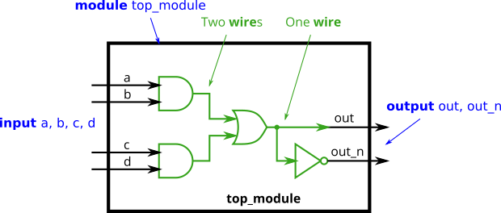
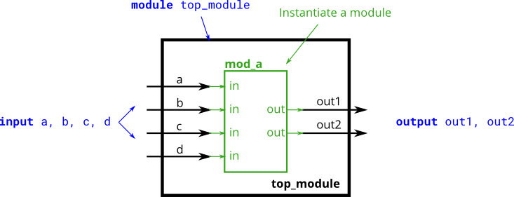
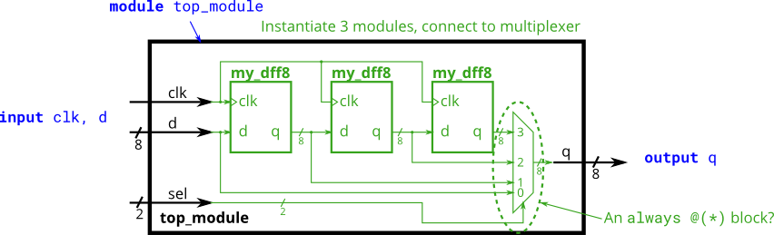
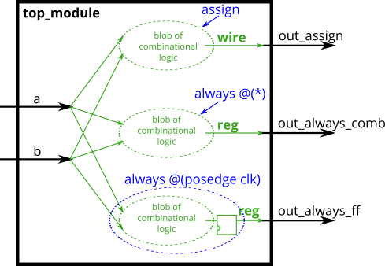
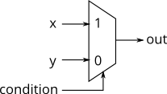
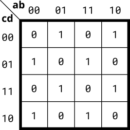
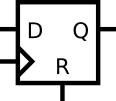
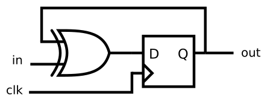

# HDLBits 刷题记录

[TOC]

## Getting Started

### Step one

Welcome to HDLBits!

Getting started in digital logic design can be overwhelming at first because you need to learn new concepts, a new **H**ardware **D**escription **L**anguage (e.g. Verilog), several new software packages, and often an FPGA board, *all at the same time*. HDLBits provides a way to practice designing and debugging simple circuits with a single click of "Simulate".

Designing a circuit requires several steps: Writing HDL (Verilog) code, compiling the code to produce a circuit, then simulating the circuit and fixing bugs.

#### Writing Code

The easiest way to write your code is to do so in the code editor box below. For this problem, we have filled in most of the code for you already. Go ahead and finish the code for this circuit.

Click **Simulate** to compile and simulate your design.

#### Compiling (Logic Synthesis)

Your code is compiled using Altera Quartus to produce a circuit. Quartus produces a large number of messages. Click **Show Quartus messages** to show/hide them. It's good practice to reduce the number of warnings, but it is sometimes not practical to remove them all.

#### Simulation

Your compiled circuit is simulated to test whether it functions correctly. HDLBits use ModelSim to simulate your circuit and our reference solution in parallel, then compares the outputs of the modules. The simulation reports back two things:

First, it reports whether your circuit matches the reference circuit exactly (zero "mismatches") or how many "mismatches" occurred. A mismatch is the number of samples where the output of your circuit does not match the reference output.

Second, it may produce timing diagrams that show your circuit outputs when running our test vectors. The simulation waveform is grouped into three sections: "Inputs", "Yours", and "Ref". In a correct circuit, "Your" outputs will be the same as the "Ref" outputs. The "Mismatch" signals tells you which samples have a mismatch.

The module name and port names of the top-level `top_module` must not be changed, or you will get a simulation error.

#### Final Status

If your circuit was correct, you will see **Status: Success!**. There are a few other possibilities:

- **Compile Error** — Circuit did not compile.
- **Simulation Error** — Circuit compiled successfully, but simulation did not complete.
- **Incorrect** — Circuit compiled and simulated, but the outputs did not match the reference.
- **Success!** — Circuit was correct

You can track or share your progress on the My Stats page.

#### Problem Statement

We're going to start with a small bit of HDL to get familiar with the interface used by HDLBits. Here's the description of the circuit you need to build for this exercise:

Build a circuit with no inputs and one output. That output should always drive 1 (or logic high).

**Expected solution length:** Around 1 line.

```verilog
module top_module( output one );
// Insert your code here
    assign one = 1;
endmodule
```

### Zero

Build a circuit with no inputs and one output that outputs a constant `0`

Now that you've worked through the previous problem, let's see if you can do a simple problem without the hints.

HDLBits uses Verilog-2001 ANSI-style port declaration syntax because it's easier to read and reduces typos. You may use the older Verilog-1995 syntax if you wish. For example, the two module declarations below are acceptable and equivalent:

```verilog
module top_module ( zero );
    output zero;
    // Verilog-1995
endmodule

module top_module ( output zero );

    // Verilog-2001
endmodule
```

**Expected solution length:** Around 1 line.

```verilog
module top_module(
    output zero
);// Module body starts after semicolon
	assign zero = 0;
endmodule
```

## Verilog Language

### Basics

#### Wire

Create a module with one input and one output that behaves like a wire.

Unlike physical wires, wires (and other signals) in Verilog are *directional*. This means information flows in only one direction, from (usually one) *source* to the *sinks* (The source is also often called a *driver* that *drives* a value onto a wire). In a Verilog "continuous assignment" (`assign left_side = right_side;`), the value of the signal on the right side is driven onto the wire on the left side. The assignment is "continuous" because the assignment continues all the time even if the right side's value changes. A continuous assignment is not a one-time event.

The ports on a module also have a direction (usually input or output). An input port is *driven by* something from outside the module, while an output port *drives* something outside. When viewed from inside the module, an input port is a driver or source, while an output port is a sink.

The diagram below illustrates how each part of the circuit corresponds to each bit of Verilog code. The module and port declarations create the black portions of the circuit. Your task is to create a wire (in green) by adding an `assign` statement to connect `in` to `out`. The parts outside the box are not your concern, but you should know that your circuit is tested by connecting signals from our test harness to the ports on your `top_module`.


In addition to continuous assignments, Verilog has three other assignment types that are used in procedural blocks, two of which are synthesizable. We won't be using them until we start using procedural blocks.

**Expected solution length:** Around 1 line.

```verilog 
module top_module( input in, output out );
	assign out = in;
endmodule
```

#### Wire4

Create a module with 3 inputs and 4 outputs that behaves like wires that makes these connections:

```
a -> w
b -> x
b -> y
c -> z
```

The diagram below illustrates how each part of the circuit corresponds to each bit of Verilog code. From outside the module, there are three input ports and four output ports.

When you have multiple `assign` statements, the **order** in which they appear in the code **does not matter**. Unlike a programming language, `assign` statements ("continuous assignments") describe *connections* between things, not the *action* of copying a value from one thing to another.

One potential source of confusion that should perhaps be clarified now: The green arrows here represent connections *between* wires, but are not wires in themselves. The module itself *already* has 7 wires declared (named a, b, c, w, x, y, and z). This is because `input` and `output` declarations actually declare a wire unless otherwise specified. Writing `input wire a` is the same as `input a`. Thus, the `assign` statements are not creating wires, they are creating the connections between the 7 wires that already exist.


**Expected solution length:** Around 4 lines.

```verilog 
module top_module( 
    input a,b,c,
    output w,x,y,z 
);
	assign w = a;
    assign x = b;
    assign y = b;
    assign z = c;
endmodule
```

#### Notgate

Create a module that implements a NOT gate.

This circuit is similar to [wire](#wire), but with a slight difference. When making the connection from the wire `in` to the wire `out` we're going to implement an inverter (or "NOT-gate") instead of a plain wire.

Use an assign statement. The `assign` statement will *continuously drive* the inverse of `in` onto wire `out`.


**Expected solution length:** Around 1 line.

```verilog
module top_module( input in, output out );
	assign out = !in; 
    // assign out = ~in;
endmodule
```

Verilog has separate bitwise-NOT (`~`) and logical-NOT (`!`) operators, like C. Since we're working with a one-bit here, it doesn't matter which we choose.

#### Andgate

Create a module that implements an AND gate.

This circuit now has three wires (`a`, `b`, and `out`). Wires `a` and `b` already have values driven onto them by the input ports. But wire `out` currently is not driven by anything. Write an `assign` statement that drives `out` with the AND of signals `a` and `b`.

Note that this circuit is very similar to the [NOT gate](#Notgate), just with one more input. If it sounds different, it's because I've started describing signals as being *driven* (has a known value determined by something attached to it) or *not driven* by something. `Input wires` are driven by something outside the module. `assign` statements will drive a logic level onto a wire. As you might expect, a wire cannot have more than one driver (what is its logic level if there is?), and a wire that has no drivers will have an undefined value (often treated as 0 when synthesizing hardware).


**Expected solution length:** Around 1 line.

```verilog
module top_module( 
    input a, 
    input b, 
    output out 
);
	assign out = a & b;
    // assign out = a && b;
endmodule
```

Verilog has separate bitwise-AND (`&`) and logical-AND (`&&`) operators, like C. Since we're working with a one-bit here, it doesn't matter which we choose.

#### Norgate

Create a module that implements a NOR gate. A NOR gate is an OR gate with its output inverted. A NOR function needs two operators when written in Verilog.

An `assign` statement drives a wire (or "net", as it's more formally called) with a value. This value can be as complex a function as you want, as long as it's a *combinational* (i.e., memory-less, with no hidden state) function. An `assign` statement is a *continuous assignment* because the output is "recomputed" whenever any of its inputs change, forever, much like a simple logic gate.


**Expected solution length:** Around 1 line.

```verilog
module top_module( 
    input a, 
    input b, 
    output out 
);
    assign out = ~(a | b);
    // assign out = !(a || b);
endmodule
```

Verilog has separate bitwise-OR (`|`) and logical-OR (`||`) operators, like C. Since we're working with a one-bit here, it doesn't matter which we choose.

#### Xnorgate

Create a module that implements an XNOR gate.


**Expected solution length:** Around 1 line.

```verilog
module top_module( 
    input a, 
    input b, 
    output out 
);
    assign out = ~(a ^ b);
endmodule
```

#### Wire decl

##### Declaring wires

The circuits so far have been simple enough that the outputs are simple functions of the inputs. As circuits become more complex, you will need wires to connect internal components together. When you need to use a wire, you should declare it in the body of the module, somewhere before it is first used. (In the future, you will encounter more types of signals and variables that are also declared the same way, but for now, we'll start with a signal of type `wire`).

##### Example


```verilog
module top_module (
    input in,              // Declare an input wire named "in"
    output out             // Declare an output wire named "out"
);

    wire not_in;           // Declare a wire named "not_in"

    assign out = ~not_in;  // Assign a value to out (create a NOT gate).
    assign not_in = ~in;   // Assign a value to not_in (create another NOT gate).

endmodule   // End of module "top_module"
```

In the above module, there are three wires (`in`, `out`, and `not_in`), two of which are already declared as part of the module's input and output ports (This is why you didn't need to declare any wires in the earlier exercises). The wire `not_in` needs to be declared inside the module. It is not visible from outside the module. Then, two NOT gates are created using two `assign` statements. Note that it doesn't matter which of the NOT gates you create first: You still end up with the same circuit.

##### Practice

Implement the following circuit. Create two intermediate wires (named anything you want) to connect the AND and OR gates together. Note that the wire that feeds the NOT gate is really wire `out`, so you do not necessarily need to declare a third wire here. Notice how wires are driven by exactly one source (output of a gate), but can feed multiple inputs.

If you're following the circuit structure in the diagram, you should end up with four assign statements, as there are four signals that need a value assigned.

(Yes, it is possible to create a circuit with the same functionality without the intermediate wires.)



**Expected solution length:** Around 5 lines.

```verilog 
`default_nettype none
module top_module(
    input a,
    input b,
    input c,
    input d,
    output out,
    output out_n   
); 
    wire a_b_and, c_d_and;
	assign a_b_and = a & b;
    assign c_d_and = c & d;
    assign out = a_b_and | c_d_and;
    assign out_n = ~out;
endmodule
```

``default_nettype none` means you have to declare all wires explicitly.

#### 7458

The 7458 is a chip with four AND gates and two OR gates. This problem is slightly more complex than [7420](#7420).

Create a module with the same functionality as the 7458 chip. It has 10 inputs and 2 outputs. You may choose to use an `assign` statement to drive each of the output wires, or you may choose to declare (four) wires for use as intermediate signals, where each internal wire is driven by the output of one of the AND gates. For extra practice, try it both ways.


**Expected solution length:** Around 2–10 lines.

```verilog
module top_module ( 
    input p1a, p1b, p1c, p1d, p1e, p1f,
    output p1y,
    input p2a, p2b, p2c, p2d,
    output p2y
);
	wire p2a_b_and = p2a & p2b;
    wire p2c_d_and = p2c & p2d;
    assign p2y = p2a_b_and | p2c_d_and;
    
    wire p1a_b_c_and = p1a & p1b & p1c;
    wire p1d_e_f_and = p1d & p1e & p1f;
    assign p1y = p1a_b_c_and | p1d_e_f_and;
endmodule
```

### Vectors

#### Vector0

Vectors are used to group related signals using one name to make it more convenient to manipulate. For example, `wire [7:0] w;` declares an 8-bit vector named `w` that is functionally equivalent to having 8 separate wires.

Notice that the *declaration* of a vector places the dimensions *before* the name of the vector, which is unusual compared to C syntax. However, the *part select* has the dimensions *after* the vector name as you would expect.

```verilog
wire [99:0] my_vector;      // Declare a 100-element vector
assign out = my_vector[10]; // Part-select one bit out of the vector 
```

Build a circuit that has one 3-bit input, then outputs the same vector, and also splits it into three separate 1-bit outputs. Connect output `o0` to the input vector's position 0, `o1` to position 1, etc.

In a diagram, a tick mark with a number next to it indicates the width of the vector (or "bus"), rather than drawing a separate line for each bit in the vector.


```verilog
module top_module ( 
    input wire [2:0] vec,
    output wire [2:0] outv,
    output wire o2,
    output wire o1,
    output wire o0
); // Module body starts after module declaration
	assign outv = vec;
    // assign o2 = vec[2];
    // assign o1 = vec[1];
    // assign o0 = vec[0];
    assign {o2, o1, o0} = vec;
endmodule
```

#### Vector1

Vectors are used to group related signals using one name to make it more convenient to manipulate. For example, `wire [7:0] w;` declares an 8-bit vector named `w` that is equivalent to having 8 separate wires.

##### Declaring Vectors

Vectors must be declared:

```verilog
type [upper:lower] vector_name;
```

`type` specifies the datatype of the vector. This is usually `wire` or `reg`. If you are declaring a input or output port, the type can additionally include the port type (e.g., `input` or `output`) as well. Some examples:

```verilog
wire [7:0] w;         // 8-bit wire
reg  [4:1] x;         // 4-bit reg
output reg [0:0] y;   // 1-bit reg that is also an output port (this is still a vector)
input wire [3:-2] z;  // 6-bit wire input (negative ranges are allowed)
output [3:0] a;       // 4-bit output wire. Type is 'wire' unless specified otherwise.
wire [0:7] b;         // 8-bit wire where b[0] is the most-significant bit.
```

The *endianness* (or, informally, "direction") of a vector is whether the the least significant bit has a lower index (little-endian, e.g., [3:0]) or a higher index (big-endian, e.g., [0:3]). In Verilog, once a vector is declared with a particular endianness, it must always be used the same way. e.g., writing `vec[0:3]` when `vec` is declared `wire [3:0] vec;` is illegal. Being consistent with endianness is good practice, as weird bugs occur if vectors of different endianness are assigned or used together.

###### Implicit nets

Implicit nets are often a source of hard-to-detect bugs. In Verilog, net-type signals can be implicitly created by an `assign` statement or by attaching something undeclared to a module port. Implicit nets are always one-bit wires and causes bugs if you had intended to use a vector. Disabling creation of implicit nets can be done using the ``default_nettype none` directive.

```verilog
wire [2:0] a, c;    // Two vectors 
assign a = 3'b101;  // a = 101 
assign b = a;       // b =   1  implicitly-created wire 
assign c = b;       // c = 001  <-- bug 
my_module i1 (d,e); // d and e are implicitly one-bit wide if not declared.                    
					// This could be a bug if the port was intended to be a vector. 
```

Adding ``default_nettype none` would make the second line of code an error, which makes the bug more visible.

###### Unpacked vs. Packed Arrays

You may have noticed that in *declarations*, the vector indices are written *before* the vector name. This declares the "packed" dimensions of the array, where the bits are "packed" together into a blob (this is relevant in a simulator, but not in hardware). The *unpacked* dimensions are declared *after* the name. They are generally used to declare memory arrays. Since ECE253 didn't cover memory arrays, we have not used packed arrays in this course. See http://www.asic-world.com/systemverilog/data_types10.html for more details.

```verilog
reg [7:0] mem [255:0];   // 256 unpacked elements, each of which is a 8-bit packed vector of reg.
reg mem2 [28:0];         // 29 unpacked elements, each of which is a 1-bit reg.
```

##### Accessing Vector Elements: Part-Select

Accessing an entire vector is done using the vector name. For example:

```verilog
assign w = a;
```

takes the entire 4-bit vector *a* and assigns it to the entire 8-bit vector *w* (declarations are taken from above). If the lengths of the right and left sides don't match, it is zero-extended or truncated as appropriate.

The part-select operator can be used to access a portion of a vector:

```verilog
w[3:0]      // Only the lower 4 bits of w
x[1]        // The lowest bit of x
x[1:1]      // ...also the lowest bit of x
z[-1:-2]    // Two lowest bits of z
b[3:0]      // Illegal. Vector part-select must match the direction of the declaration.
b[0:3]      // The *upper* 4 bits of b.
assign w[3:0] = b[0:3];    // Assign upper 4 bits of b to lower 4 bits of w. w[3]=b[0], w[2]=b[1], etc.
```

##### A Bit of Practice

Build a combinational circuit that splits an input half-word (16 bits, [15:0] ) into lower [7:0] and upper [15:8] bytes.

```verilog
`default_nettype none     // Disable implicit nets. Reduces some types of bugs.
module top_module( 
    input wire [15:0] in,
    output wire [7:0] out_hi,
    output wire [7:0] out_lo
);
    assign {out_hi, out_lo} = in;
endmodule
```

#### Vector2

A 32-bit vector can be viewed as containing 4 bytes (bits [31:24], [23:16], etc.). Build a circuit that will reverse the *byte* ordering of the 4-byte word.

```
AaaaaaaaBbbbbbbbCcccccccDddddddd => DdddddddCcccccccBbbbbbbbAaaaaaaa
```

This operation is often used when the [endianness](https://en.wikipedia.org/wiki/Endianness) of a piece of data needs to be swapped, for example between little-endian x86 systems and the big-endian formats used in many Internet protocols.

```verilog 
module top_module( 
    input [31:0] in,
    output [31:0] out
);
    // assign out = {in[0:7], in[8:15], in[16:23], in[24:31]}; WRONG !!!!!!
    assign out = {in[7:0], in[15:8], in[23:16], in[31:24]};
endmodule
```

#### Vectorgates

Build a circuit that has two 3-bit inputs that computes the bitwise-OR of the two vectors, the logical-OR of the two vectors, and the inverse (NOT) of both vectors. Place the inverse of `b` in the upper half of `out_not` (i.e., bits [5:3]), and the inverse of `a` in the lower half.

##### Bitwise vs. Logical Operators

Earlier, we mentioned that there are bitwise and logical versions of the various boolean operators (e.g., [norgate](#Norgate)). When using vectors, the distinction between the two operator types becomes important. A bitwise operation between two N-bit vectors replicates the operation for each bit of the vector and produces a N-bit output, while a logical operation treats the entire vector as a boolean value (true = non-zero, false = zero) and produces a 1-bit output.

Look at the simulation waveforms at how the bitwise-OR and logical-OR differ.


```verilog
module top_module( 
    input [2:0] a,
    input [2:0] b,
    output [2:0] out_or_bitwise,
    output out_or_logical,
    output [5:0] out_not
);
	assign out_or_bitwise = a | b;
	assign out_or_logical = a || b;
    assign out_not = {~b, ~a};
endmodule
```

#### Gates4

Build a combinational circuit with four inputs, `in[3:0]`.

There are 3 outputs:

- out_and: output of a 4-input AND gate.
- out_or: output of a 4-input OR gate.
- out_xor: output of a 4-input XOR gate.

To review the AND, OR, and XOR operators, see [andgate](#Andgate), [norgate](#Norgate), and [xnorgate](#Xnorgate).

See also: [Even wider gates](#Gates100).

```verilog
module top_module( 
    input [3:0] in,
    output out_and,
    output out_or,
    output out_xor
);
    assign out_and = in[0] & in[1] & in[2] & in[3];
    assign out_or = in[0] | in[1] | in[2] | in[3];
    assign out_xor = in[0] ^ in[1] ^ in[2] ^ in[3];
endmodule
```

#### Vector3

[Part selection](#Vector1) was used to select portions of a vector. The concatenation operator `{a,b,c}` is used to create larger vectors by concatenating smaller portions of a vector together.

```verilog
{3'b111, 3'b000} => 6'b111000
{1'b1, 1'b0, 3'b101} => 5'b10101
{4'ha, 4'd10} => 8'b10101010     // 4'ha and 4'd10 are both 4'b1010 in binary
```

Concatenation needs to know the width of every component (or how would you know the length of the result?). Thus, `{1, 2, 3}` is illegal and results in the error message: `unsized constants are not allowed in concatenations`.

The concatenation operator can be used on both the left and right sides of assignments.

```verilog
input [15:0] in;
output [23:0] out;
assign {out[7:0], out[15:8]} = in;        	// Swap two bytes. Right side and left side are both 16-bit vectors.
assign out[15:0] = {in[7:0], in[15:8]};    	// This is the same thing.
assign out = {in[7:0], in[15:8]};       	// This is different. The 16-bit vector on the right is extended to
                                        	// match the 24-bit vector on the left, so out[23:16] are zero.
                                        	// In the first two examples, out[23:16] are not assigned.
```

##### A Bit of Practice

Given several input vectors, concatenate them together then split them up into several output vectors. There are six 5-bit input vectors: a, b, c, d, e, and f, for a total of 30 bits of input. There are four 8-bit output vectors: w, x, y, and z, for 32 bits of output. The output should be a concatenation of the input vectors followed by two `1` bits:


```verilog 
module top_module (
    input [4:0] a, b, c, d, e, f,
    output [7:0] w, x, y, z
);
    assign {w, x, y, z} = {a, b, c, d, e, f, 2'b11};
endmodule
```

#### Vectorr

Given an 8-bit input vector [7:0], reverse its bit ordering.

See also: [Reversing a longer vector](#Vector100r).

##### Module Declaration

```verilog
module top_module( 
    input [7:0] in,
    output [7:0] out
);
```

```verilog
module top_module( 
    input [7:0] in,
    output [7:0] out
);
    assign out = {in[0],in[1],in[2],in[3],in[4],in[5],in[6],in[7]};
endmodule
```

#### Vector4

The [concatenation operator](#Vector3) allowed concatenating together vectors to form a larger vector. But sometimes you want the same thing concatenated together many times, and it is still tedious to do something like `assign a = {b,b,b,b,b,b};`. The replication operator allows repeating a vector and concatenating them together:

```verilog
{num{vector}}
```

This replicates *vector* by *num* times. *num* must be a constant. Both sets of braces are required.

Examples:

```verilog
{5{1'b1}}           // 5'b11111 (or 5'd31 or 5'h1f)
{2{a,b,c}}          // The same as {a,b,c,a,b,c}
{3'd5, {2{3'd6}}}   // 9'b101_110_110. It's a concatenation of 101 with
                    // the second vector, which is two copies of 3'b110.
```

##### A Bit of Practice

One common place to see a replication operator is when sign-extending a smaller number to a larger one, while preserving its signed value. This is done by replicating the sign bit (the most significant bit) of the smaller number to the left. For example, sign-extending `4'b0101` (5) to 8 bits results in `8'b00000101` (5), while sign-extending `4'b1101` (-3) to 8 bits results in `8'b11111101` (-3).

Build a circuit that sign-extends an 8-bit number to 32 bits. This requires a concatenation of 24 copies of the sign bit (i.e., replicate bit[7] 24 times) followed by the 8-bit number itself.

```verilog
module top_module (
    input [7:0] in,
    output [31:0] out
);
    assign out = {{24{in[7]}}, in};
endmodule
```

#### Vector5

Given five 1-bit signals (a, b, c, d, and e), compute all 25 pairwise one-bit comparisons in the 25-bit output vector. The output should be 1 if the two bits being compared are equal.

```verilog
out[24] = ~a ^ a;   // a == a, so out[24] is always 1.
out[23] = ~a ^ b;
out[22] = ~a ^ c;
...
out[ 1] = ~e ^ d;
out[ 0] = ~e ^ e;
```


As the diagram shows, this can be done more easily using the [replication](#Vector4) and concatenation operators.

- The top vector is a concatenation of 5 repeats of each input
- The bottom vector is 5 repeats of a concatenation of the 5 inputs

```verilog
module top_module (
    input a, b, c, d, e,
    output [24:0] out 
);
    // assign out = ~{{5{a, b, c, d, e}}} ^ {{5{a}}, {5{b}}, {5{c}}, {5{d}}, {5{e}}};
    wire [24:0] top, bottom;
	assign top    = { {5{a}}, {5{b}}, {5{c}}, {5{d}}, {5{e}} };
	assign bottom = {5{a,b,c,d,e}};
	assign out = ~top ^ bottom;	// Bitwise XNOR
endmodule
```

### Modules: Hierarchy

#### Module

By now, you're familiar with a `module`, which is a circuit that interacts with its outside through input and output ports. Larger, more complex circuits are built by *composing* bigger modules out of smaller modules and other pieces (such as assign statements and always blocks) connected together. This forms a hierarchy, as modules can contain instances of other modules.

The figure below shows a very simple circuit with a sub-module. In this exercise, create one *instance* of module `mod_a`, then connect the module's three pins (`in1`, `in2`, and `out`) to your top-level module's three ports (wires `a`, `b`, and `out`). The module `mod_a` is provided for you — you must instantiate it.

When connecting modules, only the ports on the module are important. You do not need to know the code inside the module. The code for module `mod_a` looks like this:


```verilog
module mod_a ( input in1, input in2, output out );
    // Module body
endmodule
```

The hierarchy of modules is created by instantiating one module inside another, as long as all of the modules used belong to the same project (so the compiler knows where to find the module). The code for one module is not written *inside* another module's body (Code for different modules are not nested).

You may connect signals to the module by port name or port position. For extra practice, try both methods.


##### Connecting Signals to Module Ports

There are two commonly-used methods to connect a wire to a port: by position or by name.

###### By position

The syntax to connect wires to ports by position should be familiar, as it uses a C-like syntax. When instantiating a module, ports are connected left to right according to the module's declaration. For example:

```verilog
mod_a instance1 ( wa, wb, wc );
```

This instantiates a module of type `mod_a` and gives it an *instance name* of "instance1", then connects signal `wa` (outside the new module) to the **first** port (`in1`) of the new module, `wb` to the **second** port (`in2`), and `wc` to the **third** port (`out`). One drawback of this syntax is that if the module's port list changes, all instantiations of the module will also need to be found and changed to match the new module.

###### By name

Connecting signals to a module's ports *by name* allows wires to remain correctly connected even if the port list changes. This syntax is more verbose, however.

```verilog
mod_a instance2 ( .out(wc), .in1(wa), .in2(wb) );
```

The above line instantiates a module of type `mod_a` named "instance2", then connects signal `wa` (outside the module) to the port **named** `in1`, `wb` to the port **named** `in2`, and `wc` to the port **named** `out`. Notice how the ordering of ports is irrelevant here because the connection will be made to the correct name, regardless of its position in the sub-module's port list. Also notice the period immediately preceding the port name in this syntax.

**Expected solution length:** Around 1 line.

```verilog
module top_module ( input a, input b, output out );
    // mod_a instance1 (a,b,out);
    mod_a instance2 (.out(out),.in1(a),.in2(b));
endmodule
```

#### Module pos

This problem is similar to the previous one ([module](#module)). You are given a module named `mod_a` that has 2 outputs and 4 inputs, in that order. You must connect the 6 ports *by position* to your top-level module's ports `out1`, `out2`, `a`, `b`, `c`, and `d`, in that order.

You are given the following module:

```verilog
module mod_a ( output, output, input, input, input, input );
```



**Expected solution length:** Around 1 line.

```verilog 
module top_module ( 
    input a, 
    input b, 
    input c,
    input d,
    output out1,
    output out2
);
    mod_a INS(out1, out2, a, b, c, d);
endmodule
```

#### Module name

This problem is similar to [module](#module). You are given a module named `mod_a` that has 2 outputs and 4 inputs, in some order. You must connect the 6 ports *by name* to your top-level module's ports:

| Port in `mod_a` | Port in `top_module` |
| :-------------- | :------------------- |
| `output out1`   | `out1`               |
| `output out2`   | `out2`               |
| `input in1`     | `a`                  |
| `input in2`     | `b`                  |
| `input in3`     | `c`                  |
| `input in4`     | `d`                  |

You are given the following module:

```verilog
module mod_a ( output out1, output out2, input in1, input in2, input in3, input in4);
```


**Expected solution length:** Around 1 line.

```verilog 
module top_module ( 
    input a, 
    input b, 
    input c,
    input d,
    output out1,
    output out2
);
    mod_a instance1 (.out1(out1), .out2(out2), .in1(a), .in2(b), .in3(c), .in4(d));
endmodule
```

#### Module shift

You are given a module `my_dff` with two inputs and one output (that implements a D flip-flop). Instantiate three of them, then chain them together to make a shift register of length 3. The `clk` port needs to be connected to all instances.

The module provided to you is: `module my_dff ( input clk, input d, output q );`

Note that to make the internal connections, you will need to declare some wires. Be careful about naming your wires and module instances: the names must be unique.


```verilog 
module top_module ( input clk, input d, output q );
    wire q1, q2;
    my_dff INS1(.clk(clk), .d(d), .q(q1));
    my_dff INS2(.clk(clk), .d(q1), .q(q2));
    my_dff INS3(.clk(clk), .d(q2), .q(q));
endmodule
```

#### Module shift8

This exercise is an extension of [module_shift](#module_shift). Instead of module ports being only single pins, we now have modules with vectors as ports, to which you will attach wire vectors instead of plain wires. Like everywhere else in Verilog, the vector length of the port does not have to match the wire connecting to it, but this will cause zero-padding or trucation of the vector. This exercise does not use connections with mismatched vector lengths.

You are given a module `my_dff8` with two inputs and one output (that implements a set of 8 D flip-flops). Instantiate three of them, then chain them together to make a 8-bit wide shift register of length 3. In addition, create a 4-to-1 multiplexer (not provided) that chooses what to output depending on `sel[1:0]`: The value at the input d, after the first, after the second, or after the third D flip-flop. (Essentially, `sel` selects how many cycles to delay the input, from zero to three clock cycles.)

The module provided to you is: `module my_dff8 ( input clk, input [7:0] d, output [7:0] q );`

The multiplexer is not provided. One possible way to write one is inside an `always` block with a `case` statement inside. (See also: [mux9to1v](#mux9to1v))



```verilog 
module top_module ( 
    input clk, 
    input [7:0] d, 
    input [1:0] sel, 
    output reg [7:0] q 
);
    wire [7:0] q1, q2, q3;
    my_dff8 INS1(.clk(clk), .d(d), .q(q1));
    my_dff8 INS2(.clk(clk), .d(q1), .q(q2));
    my_dff8 INS3(.clk(clk), .d(q2), .q(q3));
    
    always@(*)begin
        case(sel)
            2'b00: q = d;
            2'b01: q = q1;
            2'b10: q = q2;
            2'b11: q = q3;
        endcase
	end
endmodule
```

#### Module add

You are given a module `add16` that performs a 16-bit addition. Instantiate two of them to create a 32-bit adder. One add16 module computes the lower 16 bits of the addition result, while the second add16 module computes the upper 16 bits of the result, after receiving the carry-out from the first adder. Your 32-bit adder does not need to handle carry-in (assume 0) or carry-out (ignored), but the internal modules need to in order to function correctly. (In other words, the `add16` module performs 16-bit a + b + cin, while your module performs 32-bit a + b).

Connect the modules together as shown in the diagram below. The provided module `add16` has the following declaration:

```verilog
module add16 ( input[15:0] a, input[15:0] b, input cin, output[15:0] sum, output cout );
```


```verilog 
module top_module(
    input [31:0] a,
    input [31:0] b,
    output [31:0] sum
);
    wire c;
    wire [15:0] sum_lo, sum_hi;
    add16 INS1(.cin(1'b0), .a(a[15:0]), .b(b[15:0]), .sum(sum_lo), .cout(c));
    add16 INS2(.cin(c), .a(a[31:16]), .b(b[31:16]), .sum(sum_hi));
    assign sum = {sum_hi, sum_lo};
endmodule
```

#### Module fadd

In this exercise, you will create a circuit with two levels of hierarchy. Your `top_module` will instantiate two copies of `add16` (provided), each of which will instantiate 16 copies of `add1` (which you must write). Thus, you must write *two* modules: `top_module` and `add1`.

Like [module_add](#Module add), you are given a module `add16` that performs a 16-bit addition. You must instantiate two of them to create a 32-bit adder. One `add16` module computes the lower 16 bits of the addition result, while the second `add16` module computes the upper 16 bits of the result. Your 32-bit adder does not need to handle carry-in (assume 0) or carry-out (ignored).

Connect the `add16` modules together as shown in the diagram below. The provided module `add16` has the following declaration:

```verilog
module add16 ( input[15:0] a, input[15:0] b, input cin, output[15:0] sum, output cout );
```

Within each `add16`, 16 full adders (module `add1`, not provided) are instantiated to actually perform the addition. You must write the full adder module that has the following declaration:

```verilog
module add1 ( input a, input b, input cin, output sum, output cout );
```

Recall that a full adder computes the sum and carry-out of a+b+cin.

In summary, there are three modules in this design:

- `top_module` — Your top-level module that contains two of...
- `add16`, provided — A 16-bit adder module that is composed of 16 of...
- `add1` — A 1-bit full adder module.


If your submission is missing a `module add1`, you will get an error message that says `Error (12006): Node instance "user_fadd[0].a1" instantiates undefined entity "add1"`.


```verilog 
module top_module (
    input [31:0] a,
    input [31:0] b,
    output [31:0] sum
);
    wire c;
    wire [15:0] sum_lo, sum_hi;
    add16 INS1(.cin(1'b0), .a(a[15:0]), .b(b[15:0]), .sum(sum_lo), .cout(c));
    add16 INS2(.cin(c), .a(a[31:16]), .b(b[31:16]), .sum(sum_hi));
    assign sum = {sum_hi, sum_lo};
endmodule

module add1 ( 
    input a, input b, input cin, 
    output sum, output cout 
);
	assign sum = a ^ b ^ cin;
    assign cout = (a & b) | (a & cin) | (b & cin);
endmodule
```

#### Module cseladd

One drawback of the ripple carry adder (See [previous exercise](#Module add)) is that the delay for an adder to compute the carry out (from the carry-in, in the worst case) is fairly slow, and the second-stage adder cannot begin computing *its* carry-out until the first-stage adder has finished. This makes the adder slow. One improvement is a carry-select adder, shown below. The first-stage adder is the same as before, but we duplicate the second-stage adder, one assuming carry-in=0 and one assuming carry-in=1, then using a fast 2-to-1 multiplexer to select which result happened to be correct.

In this exercise, you are provided with the same module `add16` as the previous exercise, which adds two 16-bit numbers with carry-in and produces a carry-out and 16-bit sum. You must instantiate *three* of these to build the carry-select adder, using your own 16-bit 2-to-1 multiplexer.

Connect the modules together as shown in the diagram below. The provided module `add16` has the following declaration:

```verilog
module add16 ( input[15:0] a, input[15:0] b, input cin, output[15:0] sum, output cout );
```


```verilog
module top_module(
    input [31:0] a,
    input [31:0] b,
    output [31:0] sum
);
	wire c;
    reg [15:0] sum_hi;
    wire [15:0] sum_lo, se_sum0, se_sum1;
    add16 INS1 (.cin(1'b0), .a(a[15:0]), .b(b[15:0]), .sum(sum_lo), .cout(c));
    add16 INS2 (.cin(1'b0), .a(a[31:16]), .b(b[31:16]), .sum(se_sum0));
    add16 INS3 (.cin(1'b1), .a(a[31:16]), .b(b[31:16]), .sum(se_sum1));
    always@(*)begin
        case(c)
            1'b0: sum_hi = se_sum0;
            1'b1: sum_hi = se_sum1;
        endcase
    end
    assign sum = {sum_hi, sum_lo};
endmodule
```

#### Module addsub

An adder-subtractor can be built from an adder by optionally negating one of the inputs, which is equivalent to inverting the input then adding 1. The net result is a circuit that can do two operations: (a + b + 0) and (a + ~b + 1). See [Wikipedia](https://en.wikipedia.org/wiki/Adder–subtractor) if you want a more detailed explanation of how this circuit works.

Build the adder-subtractor below.

You are provided with a 16-bit adder module, which you need to instantiate twice:

```verilog
module add16 ( input[15:0] a, input[15:0] b, input cin, output[15:0] sum, output cout );
```

Use a 32-bit wide XOR gate to invert the `b` input whenever `sub` is 1. (This can also be viewed as `b[31:0]` XORed with sub replicated 32 times. See [replication operator](#Vector4).). Also connect the `sub` input to the carry-in of the adder.


```verilog
module top_module(
    input [31:0] a,
    input [31:0] b,
    input sub,
    output [31:0] sum
);
    wire c;
    wire [15:0] sum_lo, sum_hi;
    wire [31:0] sub_b_xor = b ^ {{32{sub}}};
    add16 INS1 (.cin(sub), .a(a[15:0]), .b(sub_b_xor[15:0]), .cout(c), .sum(sum_lo));
    add16 INS2 (.cin(c), .a(a[31:16]), .b(sub_b_xor[31:16]), .sum(sum_hi));
    assign sum = {sum_hi, sum_lo};
endmodule
```

An XOR gate can also be viewed as a programmable inverter, where one input controls whether the other should be inverted. The following two circuits are both XOR gates: 

### Procedure

#### Alwaysblock1

Since digital circuits are composed of logic gates connected with wires, any circuit can be expressed as some combination of modules and assign statements. However, sometimes this is not the most convenient way to describe the circuit. *Procedures* (of which `always` blocks are one example) provide an alternative syntax for describing circuits.

For synthesizing hardware, two types of always blocks are relevant:

- Combinational: `always @(*)`
- Clocked: `always @(posedge clk)`

Combinational always blocks are equivalent to assign statements, thus there is always a way to express a combinational circuit both ways. The choice between which to use is mainly an issue of which syntax is more convenient. **The syntax for code inside a procedural block is different from code that is outside.** Procedural blocks have a richer set of statements (e.g., if-then, case), cannot contain continuous assignments*, but also introduces many new non-intuitive ways of making errors. (**Procedural continuous assignments* do exist, but are somewhat different from *continuous assignments*, and are not synthesizable.)

For example, the assign and combinational always block describe the same circuit. Both create the same blob of combinational logic. Both will recompute the output whenever any of the inputs (right side) changes value. ` assign out1 = a & b | c ^ d; always @(*) out2 = a & b | c ^ d; `


For combinational always blocks, always use a sensitivity list of `(*)`. Explicitly listing out the signals is error-prone (if you miss one), and is ignored for hardware synthesis. If you explicitly specify the sensitivity list and miss a signal, the synthesized hardware will still behave as though `(*)` was specified, but the simulation will not and not match the hardware's behaviour. (In SystemVerilog, use `always_comb`.)

A note on wire vs. reg: The left-hand-side of an assign statement must be a *net* type (e.g., `wire`), while the left-hand-side of a procedural assignment (in an always block) must be a *variable* type (e.g., `reg`). These types (wire vs. reg) have nothing to do with what hardware is synthesized, and is just syntax left over from Verilog's use as a hardware *simulation* language.

##### A bit of practice

Build an AND gate using both an assign statement and a combinational always block. (Since assign statements and combinational always blocks function identically, there is no way to enforce that you're using both methods. But you're here for practice, right?...)

```verilog
// synthesis verilog_input_version verilog_2001
module top_module(
    input a, 
    input b,
    output wire out_assign,
    output reg out_alwaysblock
);
	assign out_assign = a & b;
    always@(*)begin
		out_alwaysblock = a & b;
    end
endmodule
```

#### Alwaysblock2

For hardware synthesis, there are two types of `always` blocks that are relevant:

- Combinational: `always @(*)`
- Clocked: `always @(posedge clk)`

Clocked always blocks create a blob of combinational logic just like combinational always blocks, but also creates a set of flip-flops (or "registers") at the output of the blob of combinational logic. Instead of the outputs of the blob of logic being visible immediately, the outputs are visible only immediately after the next (posedge clk).

##### Blocking vs. Non-Blocking Assignment

There are three types of assignments in Verilog:

- **Continuous** assignments (`assign x = y;`). Can only be used when **not** inside a procedure ("always block").
- Procedural **blocking** assignment: (`x = y;`). Can only be used inside a procedure.
- Procedural **non-blocking** assignment: (`x <= y;`). Can only be used inside a procedure.

In a **combinational** always block, use **blocking** assignments. In a **clocked** always block, use **non-blocking** assignments. A full understanding of why is not particularly useful for hardware design and requires a good understanding of how Verilog simulators keep track of events. Not following this rule results in extremely hard to find errors that are both non-deterministic and differ between simulation and synthesized hardware.

##### A bit of practice

Build an XOR gate three ways, using an assign statement, a combinational always block, and a clocked always block. Note that the clocked always block produces a different circuit from the other two: There is a flip-flop so the output is delayed.



```verilog
// synthesis verilog_input_version verilog_2001
module top_module(
    input clk,
    input a,
    input b,
    output wire out_assign,
    output reg out_always_comb,
    output reg out_always_ff   
);
	assign out_assign = a ^ b;
    
    always @(*) begin
    	out_always_comb = a ^ b;
    end
    
    always @(posedge clk) begin
    	out_always_ff <= a ^ b;
    end
endmodule
```

#### Always if

An `if` statement usually creates a 2-to-1 multiplexer, selecting one input if the condition is true, and the other input if the condition is false.



```verilog
always @(*) begin
    if (condition) begin
        out = x;
    end
    else begin
        out = y;
    end
end
```

This is equivalent to using a continuous assignment with a conditional operator:

```verilog
assign out = (condition) ? x : y;
```

However, the procedural `if` statement provides a new way to make mistakes. The circuit is combinational only if `out` is always assigned a value.

##### A bit of practice

Build a 2-to-1 mux that chooses between `a` and `b`. Choose `b` if *both* `sel_b1` and `sel_b2` are true. Otherwise, choose `a`. Do the same twice, once using `assign` statements and once using a procedural if statement.

| sel_b1 | sel_b2 | out_assign out_always |
| :----- | :----- | :-------------------- |
| 0      | 0      | a                     |
| 0      | 1      | a                     |
| 0      | 0      | a                     |
| 1      | 1      | b                     |

```verilog
// synthesis verilog_input_version verilog_2001
module top_module(
    input a,
    input b,
    input sel_b1,
    input sel_b2,
    output wire out_assign,
    output reg out_always   
); 
	wire sel = sel_b1 & sel_b2;
    assign out_assign = sel ? b : a;
    always @(*) begin
        if (sel) out_always = b;
        else out_always = a;
    end
endmodule
```

#### Always if2

##### A common source of errors: How to avoid making latches

When designing circuits, you *must* think first in terms of circuits:

- I want this logic gate
- I want a combinational blob of logic that has these inputs and produces these outputs
- I want a combinational blob of logic followed by a set of flip-flops

What you *must not* do is write the code first, then hope it generates a proper circuit.

- If (cpu_overheated) then shut_off_computer = 1;
- If (~arrived) then keep_driving = ~gas_tank_empty;

Syntactically-correct code does not necessarily result in a reasonable circuit (combinational logic + flip-flops). The usual reason is: "What happens in the cases other than those you specified?". Verilog's answer is: Keep the outputs unchanged.

This behaviour of "keep outputs unchanged" means the current state needs to be *remembered*, and thus produces a *latch*. Combinational logic (e.g., logic gates) cannot remember any state. Watch out for `Warning (10240): "... inferring latch(es)"` messages. Unless the latch was intentional, it almost always indicates a bug. Combinational circuits must have a value assigned to all outputs under all conditions. This usually means you always need `else` clauses or a default value assigned to the outputs.

##### Demonstration

The following code contains incorrect behaviour that creates a latch. Fix the bugs so that you will shut off the computer only if it's really overheated, and stop driving if you've arrived at your destination or you need to refuel.


```verilog
always @(*) begin
    if (cpu_overheated)
       shut_off_computer = 1;
end

always @(*) begin
    if (~arrived)
       keep_driving = ~gas_tank_empty;
end
```

```verilog
// synthesis verilog_input_version verilog_2001
module top_module (
    input      cpu_overheated,
    output reg shut_off_computer,
    input      arrived,
    input      gas_tank_empty,
    output reg keep_driving  
); 

    always @(*) begin
        if (cpu_overheated) shut_off_computer = 1;
        else shut_off_computer = 0;
    end

    always @(*) begin
        if (~arrived) keep_driving = ~gas_tank_empty;
        else keep_driving = 0;
    end

endmodule
```

#### Always case

Case statements in Verilog are nearly equivalent to a sequence of if-elseif-else that compares one expression to a list of others. Its syntax and functionality differs from the `switch` statement in C.

```verilog
always @(*) begin     // This is a combinational circuit
    case (in)
      1'b1: begin 
               out = 1'b1;  // begin-end if >1 statement
            end
      1'b0: out = 1'b0;
      default: out = 1'bx;
    endcase
end
```

- The case statement begins with `case` and each "case item" ends with a colon. There is no "switch".
- Each case item can execute *exactly one* statement. This makes the "break" used in C unnecessary. But this means that if you need more than one statement, you must use `begin ... end`.
- Duplicate (and partially overlapping) case items are permitted. The first one that matches is used. C does not allow duplicate case items.

##### A bit of practice

Case statements are more convenient than if statements if there are a large number of cases. So, in this exercise, create a 6-to-1 multiplexer. When `sel` is between 0 and 5, choose the corresponding data input. Otherwise, output 0. The data inputs and outputs are all 4 bits wide.

Be careful of inferring latches (See.[always_if2](#Always if2))

```verilog
// synthesis verilog_input_version verilog_2001
module top_module ( 
    input [2:0] sel, 
    input [3:0] data0,
    input [3:0] data1,
    input [3:0] data2,
    input [3:0] data3,
    input [3:0] data4,
    input [3:0] data5,
    output reg [3:0] out   
);

    always@(*) begin  // This is a combinational circuit
        case(sel) 
            3'b000: out = data0;
            3'b001: out = data1;
            3'b010: out = data2;
            3'b011: out = data3;
            3'b100: out = data4;
            3'b101: out = data5;
            default: out = 4'b0;
        endcase
    end

endmodule
```

#### Always case2

A *priority encoder* is a combinational circuit that, when given an input bit vector, outputs the position of the first `1` bit in the vector. For example, a 8-bit priority encoder given the input `8'b10010000` would output `3'd4`, because bit[4] is first bit that is high.

Build a 4-bit priority encoder. For this problem, if none of the input bits are high (i.e., input is zero), output zero. Note that a 4-bit number has 16 possible combinations.

```verilog 
// synthesis verilog_input_version verilog_2001
module top_module (
    input [3:0] in,
    output reg [1:0] pos  
);
    always @(*) begin
        case(in)
            4'b0000: pos = 2'd0;
			4'b0001: pos = 2'd0;
            4'b0010: pos = 2'd1;
            4'b0011: pos = 2'd0;
            4'b0100: pos = 2'd2;
            4'b0101: pos = 2'd0;
            4'b0110: pos = 2'd1;
            4'b0111: pos = 2'd0;
            4'b1000: pos = 2'd3;
            4'b1001: pos = 2'd0;
            4'b1010: pos = 2'd1;
            4'b1011: pos = 2'd0;   
            4'b1100: pos = 2'd2;
            4'b1101: pos = 2'd0;
            4'b1110: pos = 2'd1;
            4'b1111: pos = 2'd0;
        endcase
    end
endmodule
```

#### Always casez

Build a priority encoder for 8-bit inputs. Given an 8-bit vector, the output should report the first bit in the vector that is `1`. Report zero if the input vector has no bits that are high. For example, the input `8'b10010000` should output `3'd4`, because bit[4] is first bit that is high.

From the previous exercise ([always_case2](#Always case2)), there would be 256 cases in the case statement. We can reduce this (down to 9 cases) if the case items in the case statement supported don't-care bits. This is what `case**z**` is for: It treats bits that have the value `z` as don't-care in the comparison.

For example, this would implement the 4-input priority encoder from the previous exercise:

```verilog
always @(*) begin
    casez (in[3:0])
        4'bzzz1: out = 0;   // in[3:1] can be anything
        4'bzz1z: out = 1;
        4'bz1zz: out = 2;
        4'b1zzz: out = 3;
        default: out = 0;
    endcase
end
```

A case statement behaves as though each item is checked sequentially (in reality, it does something more like generating a giant truth table then making gates). Notice how there are certain inputs (e.g., `4'b1111`) that will match more than one case item. The first match is chosen (so `4'b1111` matches the first item, `out = 0`, but not any of the later ones).

- There is also a similar `casex` that treats both `x` and `z` as don't-care. I don't see much purpose to using it over `casez`.
- The digit `?` is a synonym for `z`. so `2'bz0` is the same as `2'b?0`

```verilog
// synthesis verilog_input_version verilog_2001
module top_module (
    input [7:0] in,
    output reg [2:0] pos  
);
    always @(*) begin
    	casez (in)
        	8'bzzzzzzz1: pos = 3'd0;
        	8'bzzzzzz1z: pos = 3'd1;
        	8'bzzzzz1zz: pos = 3'd2;
        	8'bzzzz1zzz: pos = 3'd3;
            8'bzzz1zzzz: pos = 3'd4;
            8'bzz1zzzzz: pos = 3'd5;
            8'bz1zzzzzz: pos = 3'd6;
            8'b1zzzzzzz: pos = 3'd7;
        	default: pos = 3'd0;
    	endcase
	end
endmodule
```

Binary literals have to be used here because you need to specify `z` for some bits.

#### Always nolatches

Suppose you're building a circuit to process scancodes from a PS/2 keyboard for a game. Given the last two bytes of scancodes received, you need to indicate whether one of the arrow keys on the keyboard have been pressed. This involves a fairly simple mapping, which can be implemented as a case statement (or if-elseif) with four cases.

| Scancode [15:0] | Arrow key   |
| :-------------- | :---------- |
| `16'he06b`      | left arrow  |
| `16'he072`      | down arrow  |
| `16'he074`      | right arrow |
| `16'he075`      | up arrow    |
| Anything else   | none        |

Your circuit has one 16-bit input, and four outputs. Build this circuit that recognizes these four scancodes and asserts the correct output.

To avoid creating latches, all outputs must be assigned a value in all possible conditions (See also [always_if2](#Always if2)). Simply having a `default` case is not enough. You must assign a value to all four outputs in all four cases and the default case. This can involve a lot of unnecessary typing. One easy way around this is to assign a "default value" to the outputs *before* the case statement:

```verilog
always @(*) begin
    up = 1'b0; down = 1'b0; left = 1'b0; right = 1'b0;
    case (scancode)
        ... // Set to 1 as necessary.
    endcase
end
```

This style of code ensures the outputs are assigned a value (of 0) in all possible cases unless the case statement overrides the assignment. This also means that a `default:` case item becomes unnecessary.

**Reminder:** The logic synthesizer generates a combinational circuit that *behaves* equivalently to what the code describes. Hardware does not "execute" the lines of code in sequence.

```verilog
// synthesis verilog_input_version verilog_2001
module top_module (
    input [15:0] scancode,
    output reg left,
    output reg down,
    output reg right,
    output reg up  
); 
	always @(*) begin
    	up = 1'b0; down = 1'b0; left = 1'b0; right = 1'b0;
    	case (scancode)
			16'he06b: left = 1'b1;
        	16'he072: down = 1'b1;
            16'he074: right = 1'b1;
            16'he075: up = 1'b1;
    	endcase
	end
endmodule
```

###  More Verilog Features

#### Conditional

Verilog has a ternary conditional operator ( ? : ) much like C:

```verilog
(condition ? if_true : if_false)
```

This can be used to choose one of two values based on *condition* (a mux!) on one line, without using an if-then inside a combinational always block.

Examples:

```verilog
(0 ? 3 : 5)     // This is 5 because the condition is false.
(sel ? b : a)   // A 2-to-1 multiplexer between a and b selected by sel.

always @(posedge clk)         // A T-flip-flop.
  q <= toggle ? ~q : q;

always @(*)                   // State transition logic for a one-input FSM
  case (state)
    A: next = w ? B : A;
    B: next = w ? A : B;
  endcase

assign out = ena ? q : 1'bz;  // A tri-state buffer

((sel[1:0] == 2'h0) ? a :     // A 3-to-1 mux
 (sel[1:0] == 2'h1) ? b :
                      c )
```

##### A Bit of Practice

Given four unsigned numbers, find the minimum. Unsigned numbers can be compared with standard comparison operators (a < b). Use the conditional operator to make two-way *min* circuits, then compose a few of them to create a 4-way *min* circuit. You'll probably want some wire vectors for the intermediate results.

**Expected solution length:** Around 5 lines.

```verilog
module top_module (
    input [7:0] a, b, c, d,
    output [7:0] min
);
    // assign intermediate_result1 = compare? true: false;
	wire [7:0] min_a_b = a < b ? a : b;
    wire [7:0] min_c_d = c < d ? c : d;
    assign min = min_a_b < min_c_d ? min_a_b : min_c_d;
endmodule
```

#### Reduction

You're already familiar with bitwise operations between two values, e.g., `a & b` or `a ^ b`. Sometimes, you want to create a wide gate that operates on all of the bits of *one* vector, like `(a[0] & a[1] & a[2] & a[3] ... )`, which gets tedious if the vector is long.

The *reduction* operators can do AND, OR, and XOR of the bits of a vector, producing one bit of output:

```verilog
& a[3:0]     // AND: a[3]&a[2]&a[1]&a[0]. Equivalent to (a[3:0] == 4'hf)
| b[3:0]     // OR:  b[3]|b[2]|b[1]|b[0]. Equivalent to (b[3:0] != 4'h0)
^ c[2:0]     // XOR: c[2]^c[1]^c[0]
```

These are *unary* operators that have only one operand (similar to the NOT operators ! and ~). You can also invert the outputs of these to create NAND, NOR, and XNOR gates, e.g., `(~& d[7:0])`.

Now you can revisit [4-input gates](#Gates4) and [100-input gates](#Gates100).

##### A Bit of Practice

Parity checking is often used as a simple method of detecting errors when transmitting data through an imperfect channel. Create a circuit that will compute a parity bit for a 8-bit byte (which will add a 9th bit to the byte). We will use "even" parity, where the parity bit is just the XOR of all 8 data bits.

**Expected solution length:** Around 1 line.

```verilog
module top_module (
    input [7:0] in,
    output parity
); 
    assign parity = ^ in[7:0];
endmodule
```

#### Gates100

Build a combinational circuit with 100 inputs, `in[99:0]`.

There are 3 outputs:

- out_and: output of a 100-input AND gate.
- out_or: output of a 100-input OR gate.
- out_xor: output of a 100-input XOR gate.

```verilog
module top_module( 
    input [99:0] in,
    output out_and,
    output out_or,
    output out_xor 
);
    assign out_and = & in[99:0];
    assign out_or = | in[99:0];
    assign out_xor = ^ in[99:0];
endmodule
```

#### Vector100r

Given a 100-bit input vector [99:0], reverse its bit ordering.

A for loop (in a combinational always block or generate block) would be useful here. I would prefer a combinational always block in this case because module instantiations (which require generate blocks) aren't needed.

```verilog
module top_module (
	input [99:0] in,
	output reg [99:0] out
);
	
	always @(*) begin
		for (int i=0;i<$bits(out);i++)		// $bits() is a system function that returns the width of a signal.
			out[i] = in[$bits(out)-i-1];	// $bits(out) is 100 because out is 100 bits wide.
	end
	
endmodule
```

#### Popcount255

A "population count" circuit counts the number of '1's in an input vector. Build a population count circuit for a 255-bit input vector.

```verilog
module top_module( 
    input [254:0] in,
    output reg [7:0] out 
);
    always @(*) begin
        out = 8'd0;
        for (int i = 0; i < $bits(in); i++) begin
            out = out + in[i];
        end
    end
endmodule
```

#### Adder100i

Create a 100-bit binary ripple-carry adder by instantiating 100 [full adders](#Fadd). The adder adds two 100-bit numbers and a carry-in to produce a 100-bit sum and carry out. To encourage you to actually instantiate full adders, also output the carry-out from *each* full adder in the ripple-carry adder. cout[99] is the final carry-out from the last full adder, and is the carry-out you usually see.

```verilog
module top_module( 
    input [99:0] a, b,
    input cin,
    output [99:0] cout,
    output [99:0] sum 
);
    fadder INS0(.a(a[0]), .b(b[0]), .cin(cin), 
             	.cout(cout[0]), .sum(sum[0]));
    
	genvar i;
    generate
        for (i = 1; i < $bits(sum); i++) begin:fadder100
            fadder INS(.a(a[i]), .b(b[i]), .cin(cout[i - 1]),
                       .cout(cout[i]), .sum(sum[i]));
        end
    endgenerate
	
endmodule
module fadder ( 
    input a, input b, input cin, 
    output sum, output cout 
);
	assign sum = a ^ b ^ cin;
    assign cout = (a & b) | (a & cin) | (b & cin);
endmodule
```

#### Bcdadd100

You are provided with a BCD one-digit adder named `bcd_fadd` that adds two BCD digits and carry-in, and produces a sum and carry-out.

```verilog
module bcd_fadd {
    input [3:0] a,
    input [3:0] b,
    input     cin,
    output   cout,
    output [3:0] sum );
```

Instantiate 100 copies of `bcd_fadd` to create a 100-digit BCD ripple-carry adder. Your adder should add two 100-digit BCD numbers (packed into 400-bit vectors) and a carry-in to produce a 100-digit sum and carry out.

```verilog
module top_module( 
    input [399:0] a, b,
    input cin,
    output cout,
    output [399:0] sum 
);
    wire out[99:0];
    bcd_fadd INS0(.a(a[3:0]), .b(b[3:0]), .cin(cin), 
                  .cout(out[0]), .sum(sum[3:0]));
    
	genvar i;
    generate
        for (i = 4; i < $bits(sum); i = i + 4) begin:bcd_fadd100
            bcd_fadd INS(.a(a[(i + 3):i]), .b(b[(i + 3):i]), .cin(out[i / 4 - 1]),
                         .cout(out[i / 4]), .sum(sum[(i + 3):i]));
        end
    endgenerate
    
    assign cout = out[99];
endmodule
```

## Circuits

### Combinational Logic

#### Basic Gates

##### Exams/m2014 q4h

Implement the following circuit:


```verilog
module top_module (
    input in,
    output out
);
	assign out = in;
endmodule
```

##### Exams/m2014 q4i

Implement the following circuit:


```verilog
module top_module (
    output out
);
	assign out = 1'b0;
endmodule
```

##### Exams/m2014 q4e

Implement the following circuit:


```verilog
module top_module (
    input in1,
    input in2,
    output out
);
    assign out = ~(in1 | in2);
endmodule
```

##### Exams/m2014 q4f

Implement the following circuit:


```verilog
module top_module (
    input in1,
    input in2,
    output out
);
    assign out = in1 & ~in2;
endmodule
```

##### Exams/m2014 q4g

Implement the following circuit:


```verilog
module top_module (
    input in1,
    input in2,
    input in3,
    output out
);
    assign out = ~(in1 ^ in2) ^ in3;
endmodule
```

##### Gates

Ok, let's try building several logic gates at the same time. Build a combinational circuit with two inputs, `a` and `b`.

There are 7 outputs, each with a logic gate driving it:

- out_and: a and b
- out_or: a or b
- out_xor: a xor b
- out_nand: a nand b
- out_nor: a nor b
- out_xnor: a xnor b
- out_anotb: a and-not b

**Expected solution length:** Around 7 lines.

```verilog
module top_module( 
    input a, b,
    output out_and,
    output out_or,
    output out_xor,
    output out_nand,
    output out_nor,
    output out_xnor,
    output out_anotb
);
    assign out_and = a & b;
    assign out_or = a | b;
    assign out_xor = a ^ b;
    assign out_nand = ~(a & b);
    assign out_nor = ~(a | b);
    assign out_xnor = ~(a ^ b);
    assign out_anotb = a & ~b;
endmodule
```

##### 7420

The 7400-series integrated circuits are a series of digital chips with a few gates each. The 7420 is a chip with two 4-input NAND gates.

Create a module with the same functionality as the 7420 chip. It has 8 inputs and 2 outputs.


**Expected solution length:** Around 2 lines.

```verilog
module top_module ( 
    input p1a, p1b, p1c, p1d,
    output p1y,
    input p2a, p2b, p2c, p2d,
    output p2y 
);
    assign p1y = ~(p1a & p1b & p1c & p1d);
    assign p2y = ~(p2a & p2b & p2c & p2d);
endmodule
```

##### Truthtable1

In the previous exercises, we used simple logic gates and combinations of several logic gates. These circuits are examples of *combinational* circuits. Combinational means the outputs of the circuit is a function (in the mathematics sense) of only its inputs. This means that for any given input value, there is only one possible output value. Thus, one way to describe the behaviour of a combinational function is to explicitly list what the output should be for every possible value of the inputs. This is a truth table.

For a boolean function of N inputs, there are 2N possible input combinations. Each row of the truth table lists one input combination, so there are always 2N rows. The output column shows what the output should be for each input value.

| number | x3       | x2        | x1   | f    |
| :----- | :------- | :-------- | :--- | :--- |
| 0      | 0        | 0         | 0    | 0    |
| 1      | 0        | 0         | 1    | 0    |
| 2      | 0        | 1         | 0    | 1    |
| 3      | 0        | 1         | 1    | 1    |
| 4      | 1        | 0         | 0    | 0    |
| 5      | 1        | 0         | 1    | 1    |
| 6      | 1        | 1         | 0    | 0    |
| 7      | 1        | 1         | 1    | 1    |

The above truth table is for a three-input, one-output function. It has 8 rows for each of the 8 possible input combinations, and one output column. There are four inputs combinations where the output is 1, and four where the output is 0.

###### Synthesizing a circuit from a truth table

Suppose we want to build the above circuit, but we're limited to using only the set of standard logic gates. How would you build arbitrary logic functions (expressed as a truth table)?

One simple method to create a circuit that implements the truth table's function is to express the function in sum-of-products form. **Sum** (meaning OR) of **products** (meaning AND) means using one *N*-input AND gate per row of the truth table (to detect when the input matches each row), followed by an OR gate that chooses only those rows that result in a '1' output.

For the above example, the output is '1' if the input matches row 2 **or** row 3 **or** row 5 **or** row 7 (This is a 4-input OR gate). The input matches row 2 if x3=0 **and** x2=1 **and** x1=0 (This is a 3-input AND gate). Thus, this truth table can be implemented in canonical form by using 4 AND gates that are ORed together.

###### A Bit of Practice

Create a combinational circuit that implements the above truth table.


**Expected solution length:** Around 1 line.

```verilog 
module top_module (
	input x3,
	input x2,
	input x1,
	output f
);
	// This truth table has four minterms. 
	assign f = ( ~x3 & x2 & ~x1 ) | 
				( ~x3 & x2 & x1 ) |
				( x3 & ~x2 & x1 ) |
				( x3 & x2 & x1 ) ;
				
	// It can be simplified, by boolean algebra or Karnaugh maps.
	// assign f = (~x3 & x2) | (x3 & x1);
	
	// You may then notice that this is actually a 2-to-1 mux, selected by x3:
	// assign f = x3 ? x1 : x2;
endmodule
```

##### Mt2015 eq2

Taken from 2015 midterm question 1k

Create a circuit that has two 2-bit inputs `A[1:0]` and `B[1:0]`, and produces an output `z`. The value of `z` should be 1 if `A = B`, otherwise `z` should be 0.

```verilog
module top_module ( input [1:0] A, input [1:0] B, output z ); 
    assign z = (A[1:0] == B[1:0]);
endmodule
```

##### Mt2015 q4a

Taken from 2015 midterm question 4

Module A is supposed to implement the function `z = (x^y) & x`. Implement this module.

```verilog
module top_module (input x, input y, output z);
    assign z = (x ^ y) & x;
endmodule
```

##### Mt2015 q4b

Taken from 2015 midterm question 4

Circuit B can be described by the following simulation waveform: 

Implement this circuit.

```verilog
module top_module ( input x, input y, output z );
    assign z = ~(x ^ y);
endmodule
```

##### Mt2015 q4

Taken from 2015 midterm question 4

See [mt2015_q4a](#Mt2015 q4a) and [mt2015_q4b](#Mt2015 q4b) for the submodules used here. The top-level design consists of two instantiations each of subcircuits A and B, as shown below.


Implement this circuit.

```verilog
module top_module (input x, input y, output z);
	wire zIA1, zIA2, zIB1, zIB2;
    A IA1(x, y, zIA1), 
      IA2(x, y, zIA2);
    B IB1(x, y, zIB1), 
      IB2(x, y, zIB2);
    assign z = (zIA1 | zIB1) ^ (zIA2 & zIB2);
endmodule
module A (input x, input y, output z);
    assign z = (x ^ y) & x;
endmodule
module B ( input x, input y, output z );
    assign z = ~(x ^ y);
endmodule
```

##### Ringer

Suppose you are designing a circuit to control a cellphone's ringer and vibration motor. Whenever the phone needs to ring from an incoming call (`input ring`), your circuit must either turn on the ringer (`output ringer = 1`) or the motor (`output motor = 1`), but not both. If the phone is in vibrate mode (`input vibrate_mode = 1`), turn on the motor. Otherwise, turn on the ringer.

Try to use only `assign` statements, to see whether you can translate a problem description into a collection of logic gates.

**Design hint:** When designing circuits, one often has to think of the problem "backwards", starting from the outputs then working backwards towards the inputs. This is often the opposite of how one would think about a (sequential, imperative) programming problem, where one would look at the inputs first then decide on an action (or output). For sequential programs, one would often think "If (inputs are ___ ) then (output should be ___ )". On the other hand, hardware designers often think "The (output should be ___ ) when (inputs are ___ )".

The above problem description is written in an imperative form suitable for software programming (*if ring then do this*), so you must convert it to a more declarative form suitable for hardware implementation (`assign ringer = ___`). Being able to think in, and translate between, both styles is one of the most important skills needed for hardware design.


**Expected solution length:** Around 2 lines.

```verilog
module top_module (
    input ring,
    input vibrate_mode,
    output ringer,       // Make sound
    output motor         // Vibrate
);
    assign motor = vibrate_mode & ring;
    assign ringer = ring & ~vibrate_mode;
endmodule
```

##### Thermostat

A heating/cooling thermostat controls both a heater (during winter) and an air conditioner (during summer). Implement a circuit that will turn on and off the heater, air conditioning, and blower fan as appropriate.

The thermostat can be in one of two modes: heating (`mode = 1`) and cooling (`mode = 0`). In heating mode, turn the heater on when it is too cold (`too_cold = 1`) but do not use the air conditioner. In cooling mode, turn the air conditioner on when it is too hot (`too_hot = 1`), but do not turn on the heater. When the heater or air conditioner are on, also turn on the fan to circulate the air. In addition, the user can also request the fan to turn on (`fan_on = 1`), even if the heater and air conditioner are off.

Try to use only `assign` statements, to see whether you can translate a problem description into a collection of logic gates.

**Expected solution length:** Around 3 lines.

```verilog
module top_module (
    input too_cold,
    input too_hot,
    input mode,
    input fan_on,
    output heater,
    output aircon,
    output fan
); 
	assign heater = mode & too_cold;
    assign aircon = ~mode & too_hot;
    assign fan = fan_on | heater | aircon;
endmodule
```

##### Popcount3

A "population count" circuit counts the number of '1's in an input vector. Build a population count circuit for a 3-bit input vector.

```verilog
module top_module (
	input [2:0] in,
	output [1:0] out
);

	// This is a function of 3 inputs. One method is to use a 8-entry truth table:
	// in[2:0] out[1:0]
	// 000      00
	// 001      01
	// 010      01
	// 011      10
	// 100      01
	// 101      10
	// 110      10
	// 111      11
	assign out[0] = (~in[2] & ~in[1] & in[0]) | (~in[2] & in[1] & ~in[0]) | (in[2] & ~in[1] & ~in[0]) | (in[2] & in[1] & in[0]);
	assign out[1] = (in[1] & in[0]) | (in[2] & in[0]) | (in[2] & in[1]);
	
	// Using the addition operator works too:
	// assign out = in[0]+in[1]+in[2];
	
	// Yet another method uses behavioural code inside a procedure (combinational always block)
	// to directly implement the truth table:
	/*
	always @(*) begin
		case (in)
			3'd0: out = 2'd0;
			3'd1: out = 2'd1;
			3'd2: out = 2'd1;
			3'd3: out = 2'd2;
			3'd4: out = 2'd1;
			3'd5: out = 2'd2;
			3'd6: out = 2'd2;
			3'd7: out = 2'd3;
		endcase
	end
	*/
	
endmodule
```

##### Gatesv

You are given a four-bit input vector in[3:0]. We want to know some relationships between each bit and its neighbour:

- **out_both**: Each bit of this output vector should indicate whether *both* the corresponding input bit and its neighbour to the **left** (higher index) are '1'. For example, `out_both[2]` should indicate if `in[2]` and `in[3]` are both 1. Since `in[3]` has no neighbour to the left, the answer is obvious so we don't need to know `out_both[3]`.
- **out_any**: Each bit of this output vector should indicate whether *any* of the corresponding input bit and its neighbour to the **right** are '1'. For example, `out_any[2]` should indicate if either `in[2]` or `in[1]` are 1. Since `in[0]` has no neighbour to the right, the answer is obvious so we don't need to know `out_any[0]`.
- **out_different**: Each bit of this output vector should indicate whether the corresponding input bit is different from its neighbour to the **left**. For example, `out_different[2]` should indicate if `in[2]` is different from `in[3]`. For this part, treat the vector as wrapping around, so in[3]'s neighbour to the left is in[0].

The *both*, *any*, and *different* outputs use two-input AND, OR, and XOR operations, respectively. Using vectors, this can be done in 3 assign statements.

```verilog
module top_module (
	input [3:0] in,
	output [2:0] out_both,
	output [3:1] out_any,
	output [3:0] out_different
);
	assign out_any = in[3:1] | in[2:0];
	assign out_both = in[2:0] & in[3:1];
	assign out_different = in ^ {in[0], in[3:1]};
endmodule
```

##### Gatesv100

See also the shorter version: [Gates and vectors](#Gatesv).

You are given a 100-bit input vector in[99:0]. We want to know some relationships between each bit and its neighbour:

- **out_both**: Each bit of this output vector should indicate whether *both* the corresponding input bit and its neighbour to the **left** are '1'. For example, `out_both[2]` should indicate if `in[2]` and `in[3]` are both 1. Since `in[3]` has no neighbour to the left, the answer is obvious so we don't need to know `out_both[3]`.
- **out_any**: Each bit of this output vector should indicate whether *any* of the corresponding input bit and its neighbour to the **right** are '1'. For example, `out_any[2]` should indicate if either `in[2]` or `in[1]` are 1. Since `in[0]` has no neighbour to the right, the answer is obvious so we don't need to know `out_any[0]`.
- **out_different**: Each bit of this output vector should indicate whether the corresponding input bit is different from its neighbour to the **left**. For example, `out_different[2]` should indicate if `in[2]` is different from `in[3]`. For this part, treat the vector as wrapping around, so in[99]'s neighbour to the left is in[0].

```verilog
module top_module( 
    input [99:0] in,
    output [98:0] out_both,
    output [99:1] out_any,
    output [99:0] out_different 
);
    assign out_any = in[99:1] | in[98:0];
    assign out_both = in[98:0] & in[99:1];
    assign out_different = in ^ {in[0], in[99:1]};
endmodule
```

#### Multiplexers

##### Mux2to1

Create a one-bit wide, 2-to-1 multiplexer. When sel=0, choose a. When sel=1, choose b.

**Expected solution length:** Around 1 line.

```verilog
module top_module (
	input a,
	input b,
	input sel,
	output out
);

	assign out = (sel & b) | (~sel & a);	// Mux expressed as AND and OR
	// Ternary operator is easier to read, especially if vectors are used:
	// assign out = sel ? b : a;
endmodule
```

##### Mux2to1v

Create a 100-bit wide, 2-to-1 multiplexer. When sel=0, choose a. When sel=1, choose b.

**Expected solution length:** Around 1 line.

```verilog
module top_module (
	input [99:0] a,
	input [99:0] b,
	input sel,
	output [99:0] out
);
	assign out = sel ? b : a;
	// The following doesn't work.
	// assign out = (sel & b) | (~sel & a);
endmodule
```

##### Mux9to1v

Create a 16-bit wide, 9-to-1 multiplexer. sel=0 chooses a, sel=1 chooses b, etc. For the unused cases (sel=9 to 15), set all output bits to '1'.

**Expected solution length:** Around 15 lines.

```verilog
module top_module( 
    input [15:0] a, b, c, d, e, f, g, h, i,
    input [3:0] sel,
    output [15:0] out 
);
    always @(*) begin
    	case(sel)
    		4'h0 : out = a;
    		4'h1 : out = b;
    		4'h2 : out = c;
        	4'h3 : out = d;
        	4'h4 : out = e;
        	4'h5 : out = f;
        	4'h6 : out = g;
        	4'h7 : out = h;
        	4'h8 : out = i;
        	default : out = 16'hFFFF;
    	endcase
    end
endmodule
```

##### Mux256to1

Create a 1-bit wide, 256-to-1 multiplexer. The 256 inputs are all packed into a single 256-bit input vector. sel=0 should select `in[0]`, sel=1 selects bits `in[1]`, sel=2 selects bits `in[2]`, etc.

**Expected solution length:** Around 1 line.

- With this many options, a case statement isn't so useful.
- Vector indices can be variable, as long as the synthesizer can figure out that the width of the bits being selected is constant. In particular, selecting one bit out of a vector using a variable index will work.

```verilog
module top_module (
	input [255:0] in,
	input [7:0] sel,
	output  out
);
	// Select one bit from vector in[]. The bit being selected can be variable.
	assign out = in[sel];
endmodule
```

##### Mux256to1v

Create a 4-bit wide, 256-to-1 multiplexer. The 256 4-bit inputs are all packed into a single 1024-bit input vector. sel=0 should select bits `in[3:0]`, sel=1 selects bits `in[7:4]`, sel=2 selects bits `in[11:8]`, etc.

**Expected solution length:** Around 1–5 lines.

- With this many options, a case statement isn't so useful.
- Vector indices can be variable, as long as the synthesizer can figure out that the width of the bits being selected is constant. It's not always good at this. An error saying "... is not a constant" means it couldn't prove that the select width is constant. In particular, `in[ sel*4+3 : sel*4 ]` does not work.
- Bit slicing ("Indexed vector part select", since Verilog-2001) has an even more compact syntax.

```verilog
module top_module (
	input [1023:0] in,
	input [7:0] sel,
	output [3:0] out
);

	// We can't part-select multiple bits without an error, but we can select one bit at a time,
	// four times, then concatenate them together.
	assign out = {in[sel*4+3], in[sel*4+2], in[sel*4+1], in[sel*4+0]};

	// Alternatively, "indexed vector part select" works better, but has an unfamiliar syntax:
	// assign out = in[sel*4 +: 4];		// Select starting at index "sel*4", then select a total width of 4 bits with increasing (+:) index number.
	// assign out = in[sel*4+3 -: 4];	// Select starting at index "sel*4+3", then select a total width of 4 bits with decreasing (-:) index number.
	// Note: The width (4 in this case) must be constant.

endmodule
```

#### Arithmetic Circuits

##### Hadd

Create a half adder. A half adder adds two bits (with no carry-in) and produces a sum and carry-out.

**Expected solution length:** Around 2 lines.

```verilog
module top_module( 
    input a, b,
    output cout, sum 
);
    // assign {cout, sum} = a + b;
    assign cout = a & b;
    assign sum = a ^ b;
endmodule
```

##### Fadd

Create a full adder. A full adder adds three bits (including carry-in) and produces a sum and carry-out.

**Expected solution length:** Around 2 lines.

```verilog
module top_module( 
    input a, b, cin,
    output cout, sum 
);
    //assign {cout, sum} = a + b + cin;
    assign cout = (a & b) | (a & cin) | (b & cin);
    assign sum = a ^ b ^ cin;
endmodule
```

##### Adder3

Now that you know how to build a [full adder](#Fadd), make 3 instances of it to create a 3-bit binary ripple-carry adder. The adder adds two 3-bit numbers and a carry-in to produce a 3-bit sum and carry out. To encourage you to actually instantiate full adders, also output the carry-out from *each* full adder in the ripple-carry adder. cout[2] is the final carry-out from the last full adder, and is the carry-out you usually see.

```verilog
module top_module( 
    input [2:0] a, b,
    input cin,
    output [2:0] cout,
    output [2:0] sum 
);
    fadd INS0(.a(a[0]), .b(b[0]), .cin(cin), .cout(cout[0]), .sum(sum[0])),
    INS1(.a(a[1]), .b(b[1]), .cin(cout[0]), .cout(cout[1]), .sum(sum[1])),
    INS2(.a(a[2]), .b(b[2]), .cin(cout[1]), .cout(cout[2]), .sum(sum[2]));
endmodule

module fadd( 
    input a, b, cin,
    output cout, sum 
);
    //assign {cout, sum} = a + b + cin;
    assign cout = (a & b) | (a & cin) | (b & cin);
    assign sum = a ^ b ^ cin;
endmodule
```

##### Exams/m2014 q4j

Implement the following circuit:


```verilog
module top_module (
    input [3:0] x,
    input [3:0] y, 
    output [4:0] sum
);
    wire [2:0] cout;
    FA INS0(.a(x[0]), .b(y[0]), .cin(1'b0), .cout(cout[0]), .sum(sum[0]));
    FA INS1(.a(x[1]), .b(y[1]), .cin(cout[0]), .cout(cout[1]), .sum(sum[1]));
    FA INS2(.a(x[2]), .b(y[2]), .cin(cout[1]), .cout(cout[2]), .sum(sum[2]));
    FA INS3(.a(x[3]), .b(y[3]), .cin(cout[2]), .cout(sum[4]), .sum(sum[3]));
endmodule

module FA( 
    input a, b, cin,
    output cout, sum 
);
    //assign {cout, sum} = a + b + cin;
    assign cout = (a & b) | (a & cin) | (b & cin);
    assign sum = a ^ b ^ cin;
endmodule
```

##### Exams/ece241 2014 q1c

Assume that you have two 8-bit 2's complement numbers, a[7:0] and b[7:0]. These numbers are added to produce s[7:0]. Also compute whether a (signed) overflow has occurred.

A *signed* overflow occurs when adding two positive numbers produces a negative result, or adding two negative numbers produces a positive result. There are several methods to detect overflow: It could be computed by comparing the signs of the input and output numbers, or derived from the carry-out of bit n and n-1.

```verilog
module top_module (
    input [7:0] a,
    input [7:0] b,
    output [7:0] s,
    output overflow
);
    assign s = a + b;
    assign overflow = ~(a[7] ^ b[7]) & (a[7] ^ s[7]);
endmodule
```

##### Adder100

Create a 100-bit binary adder. The adder adds two 100-bit numbers and a carry-in to produce a 100-bit sum and carry out.

```verilog
module top_module( 
    input [99:0] a, b,
    input cin,
    output cout,
    output [99:0] sum 
);
    assign {cout, sum} = a + b + cin;
endmodule
```

##### Bcdadd4

You are provided with a BCD (binary-coded decimal) one-digit adder named `bcd_fadd` that adds two BCD digits and carry-in, and produces a sum and carry-out.

```verilog
module bcd_fadd {
    input [3:0] a,
    input [3:0] b,
    input     cin,
    output   cout,
    output [3:0] sum 
);
```

Instantiate 4 copies of `bcd_fadd` to create a 4-digit BCD ripple-carry adder. Your adder should add two 4-digit BCD numbers (packed into 16-bit vectors) and a carry-in to produce a 4-digit sum and carry out.

- The BCD representation for the 5-digit decimal number `12345` is `20'h12345`. This is not the same as `14'd12345` (which is `14'h3039`).
- The circuit is structured just like a binary ripple-carry adder, except the adders are base-10 rather than base-2.

```verilog
module top_module( 
    input [15:0] a, b,
    input cin,
    output cout,
    output [15:0] sum 
);
    wire [2:0] couti;
    bcd_fadd INS0(.a(a[3:0]), .b(b[3:0]), .cin(cin), .cout(couti[0]), .sum(sum[3:0]));
    bcd_fadd INS1(.a(a[7:4]), .b(b[7:4]), .cin(couti[0]), .cout(couti[1]), .sum(sum[7:4]));
    bcd_fadd INS2(.a(a[11:8]), .b(b[11:8]), .cin(couti[1]), .cout(couti[2]), .sum(sum[11:8]));
    bcd_fadd INS3(.a(a[15:12]), .b(b[15:12]), .cin(couti[2]), .cout(cout), .sum(sum[15:12]));
endmodule
```

#### Karnaugh Map to Circuit

##### Kmap

Implement the circuit described by the Karnaugh map below.


*Try to simplify the k-map before coding it. Try both product-of-sums and sum-of-products forms. We can't check whether you have the optimal simplification of the k-map. But we can check if your reduction is equivalent, and we can check whether you can translate a k-map into a circuit.*

```verilog
module top_module(
    input a,
    input b,
    input c,
    output out  
); 
	assign out = a | b | c;
endmodule
```

##### Kmap2

Implement the circuit described by the Karnaugh map below.


*Try to simplify the k-map before coding it. Try both product-of-sums and sum-of-products forms. We can't check whether you have the optimal simplification of the k-map. But we can check if your reduction is equivalent, and we can check whether you can translate a k-map into a circuit.*

```verilog
module top_module(
    input a,
    input b,
    input c,
    input d,
    output out  
); 
    assign out = ~(~a & ~b & c & d) & ~(b & ~c & d) & ~(a & b & ~c) & ~(a & c & ~d);
endmodule
```

##### Kmap3

Implement the circuit described by the Karnaugh map below.


*Try to simplify the k-map before coding it. Try both product-of-sums and sum-of-products forms. We can't check whether you have the optimal simplification of the k-map. But we can check if your reduction is equivalent, and we can check whether you can translate a k-map into a circuit.*

```verilog
module top_module(
    input a,
    input b,
    input c,
    input d,
    output out  
); 
    assign out = a | (~b & c);
endmodule
```

##### Kmap4

Implement the circuit described by the Karnaugh map below.



*Try to simplify the k-map before coding it. ~~Try both product-of-sums and sum-of-products forms.~~ We can't check whether you have the optimal simplification of the k-map. But we can check if your reduction is equivalent, and we can check whether you can translate a k-map into a circuit.*

```verilog
module top_module(
    input a,
    input b,
    input c,
    input d,
    output out  
); 
    assign out = a ^ b ^ c ^d;
endmodule
```

##### Exams/ece241 2013 q2

A single-output digital system with four inputs (a,b,c,d) generates a logic-1 when 2, 7, or 15 appears on the inputs, and a logic-0 when 0, 1, 4, 5, 6, 9, 10, 13, or 14 appears. The input conditions for the numbers 3, 8, 11, and 12 never occur in this system. For example, 7 corresponds to a,b,c,d being set to 0,1,1,1, respectively.

Determine the output out_sop in minimum SOP form, and the output out_pos in minimum POS form.

```verilog
module top_module (
    input a,
    input b,
    input c,
    input d,
    output out_sop,
    output out_pos
); 
    assign out_sop = (~a & ~b & c) | (b & c & d) | (a & c & d);
    assign out_pos = ~((a | b | ~c) & (~b | ~c | ~d) & (~a | ~c | ~d));
endmodule
```

##### Exams/m2014 q3

Consider the function *f* shown in the Karnaugh map below.


mplement this function. **d** is don't-care, which means you may choose to output whatever value is convenient.

```verilog
module top_module (
    input [4:1] x, 
    output f 
);
    assign f = (~x[1] & x[3]) | (x[2] & x[4]);
endmodule

```

##### Exams/2012 q1g

Consider the function *f* shown in the Karnaugh map below. Implement this function.

(The original exam question asked for simplified SOP and POS forms of the function.)


```verilog
module top_module (
    input [4:1] x,
    output f
); 
    assign f = (~x[1] & x[3]) | (~x[2] & ~x[4]) | (x[2] & x[3] & x[4]);
endmodule
```

##### Exams/ece241 2014 q3

For the following Karnaugh map, give the circuit implementation using one 4-to-1 multiplexer and as many 2-to-1 multiplexers as required, but using as few as possible. You are not allowed to use any other logic gate and you must use *a* and *b* as the multiplexer selector inputs, as shown on the 4-to-1 multiplexer below.

You are implementing just the portion labelled **top_module**, such that the entire circuit (including the 4-to-1 mux) implements the K-map.


(The requirement to use only 2-to-1 multiplexers exists because the original exam question also wanted to test logic function simplification using K-maps and how to synthesize logic functions using only multiplexers with constant inputs. If you wish to treat this as purely a Verilog exercise, you may ignore this constraint and write the module any way you wish.)

```verilog
module top_module (
	input c,
	input d,
	output [3:0] mux_in
);
	
	// After knowing how to split the truth table into four columns,
	// the rest of this question involves implementing logic functions
	// using only multiplexers (no other gates).
	// I will use the conditional operator for each 2-to-1 mux: (s ? a : b)
	assign mux_in[0] = (c ? 1 : (d ? 1 : 0));	// 2 muxes: c|d
	assign mux_in[1] = 0;						// No muxes:  0
	assign mux_in[2] = d ? 0 : 1;				// 1 mux:    ~d
	assign mux_in[3] = c ? (d ? 1 : 0) : 0;		// 2 muxes: c&d
	
endmodule
```

### Sequential Logic

#### Latches and Flip-Flops

##### Dff

A D flip-flop is a circuit that stores a bit and is updated periodically, at the (usually) positive edge of a clock signal.


D flip-flops are created by the logic synthesizer when a clocked always block is used (See [alwaysblock2](#Alwaysblock2)). A D flip-flop is the simplest form of "blob of combinational logic followed by a flip-flop" where the combinational logic portion is just a wire.

Create a single D flip-flop.

```verilog
module top_module (
    input clk,    // Clocks are used in sequential circuits
    input d,
    output reg q 
);

    // Use a clocked always block
    //   copy d to q at every positive edge of clk
    //   Clocked always blocks should use non-blocking assignments
    always @(posedge clk) begin
    	q <= d;
    end

endmodule
```

##### Dff8

Create 8 D flip-flops. All DFFs should be triggered by the positive edge of `clk`.

```verilog
module top_module(
	input clk,
	input [7:0] d,
	output reg [7:0] q);
	
	// Because q is a vector, this creates multiple DFFs.
	always @(posedge clk)
		q <= d;
	
endmodule
```

##### Dff8r

Create 8 D flip-flops with active high synchronous reset. All DFFs should be triggered by the positive edge of `clk`.

```verilog
module top_module (
    input clk,
    input reset,            // Synchronous reset
    input [7:0] d,
    output [7:0] q
);
    always @(posedge clk) begin
        if (reset) q <= 8'd0;
        else q <= d;
    end
endmodule
```

##### Dff8p

Create 8 D flip-flops with active high synchronous reset. The flip-flops must be reset to 0x34 rather than zero. All DFFs should be triggered by the **negative** edge of `clk`.

```verilog
module top_module (
    input clk,
    input reset,
    input [7:0] d,
    output [7:0] q
);
    always @(negedge clk) begin
        if (reset) q <= 8'h34;
        else q <= d;
    end
endmodule
```

##### Dff8ar

Create 8 D flip-flops with active high asynchronous reset. All DFFs should be triggered by the positive edge of `clk`.

The only difference in code between synchronous and asynchronous reset flip-flops is in the sensitivity list.

```verilog
module top_module (
    input clk,
    input areset,   // active high asynchronous reset
    input [7:0] d,
    output [7:0] q
);
    always @(posedge clk, posedge areset) begin
        if (areset) q <= 8'd0;
        else q <= d;
    end
endmodule
```

##### Dff16e

Create 16 D flip-flops. It's sometimes useful to only modify parts of a group of flip-flops. The byte-enable inputs control whether each byte of the 16 registers should be written to on that cycle. `byteena[1]` controls the upper byte `d[15:8]`, while `byteena[0]` controls the lower byte `d[7:0]`.

`resetn` is a synchronous, active-low reset.

All DFFs should be triggered by the positive edge of `clk`.

```verilog
module top_module (
    input clk,
    input resetn,
    input [1:0] byteena,
    input [15:0] d,
    output [15:0] q
);
    always @(posedge clk) begin
        if (~resetn) q <= 16'd0;
        else begin
            q[15:8] <= byteena[1] ? d[15:8] : q[15:8];
            q[7:0] <= byteena[0] ? d[7:0] : q[7:0];
        end
    end
endmodule
```

##### Exams/m2014 q4a

Implement the following circuit:


Note that this is a latch, so a Quartus warning about having inferred a latch is expected.

- Latches are level-sensitive (not edge-sensitive) circuits, so in an always block, they use level-sensitive sensitivity lists.
- However, they are still sequential elements, so should use non-blocking assignments.
- A D-latch acts like a wire (or non-inverting buffer) when enabled, and preserves the current value when disabled.

```verilog
module top_module (
    input d, 
    input ena,
    output reg q
);
    always @(*) begin
        if(ena) q <= d;
    end
endmodule
```

##### Exams/m2014 q4b

Implement the following circuit:


```verilog
module top_module (
    input clk,
    input d, 
    input ar,   // asynchronous reset
    output q
);
    always @(posedge clk or posedge ar) begin
        if (ar) q <= 1'b0;
        else q <= d;
    end
endmodule
```

##### Exams/m2014 q4c

Implement the following circuit:



```verilog
module top_module (
    input clk,
    input d, 
    input r,   // synchronous reset
    output q
);
	always @(posedge clk) begin
        if (r) q <= 1'b0;
        else q <= d;
    end
endmodule
```

##### Exams/m2014 q4d

Implement the following circuit:



```verilog
module top_module (
    input clk,
    input in, 
    output out
);
    wire d = in ^ q;
    reg q;
    always @(posedge clk) begin
    	q <= d;
    end
    assign out = q;
endmodule
```

##### Mt2015 muxdff

Taken from ECE253 2015 midterm question 5

Consider the sequential circuit below:

Assume that you want to implement hierarchical Verilog code for this circuit, using three instantiations of a submodule that has a flip-flop and multiplexer in it. Write a Verilog module (containing one flip-flop and multiplexer) named `top_module` for this submodule.

```verilog
module top_module (
    input clk,
    input L,
    input r_in,
    input q_in,
    output reg Q
);
    
    always @(posedge clk) begin
        Q <= L ? r_in : q_in;
    end

endmodule
```

##### Exams/2014 q4a

Consider the *n*-bit shift register circuit shown below:

Write a Verilog module named top_module for one stage of this circuit, including both the flip-flop and multiplexers.

```verilog
module top_module (
    input clk,
    input w, R, E, L,
    output reg Q
);
    always @(posedge clk) begin
        Q <= L ? R : (E ? w : Q);
    end
endmodule
```

##### Exams/ece241 2014 q4

Given the finite state machine circuit as shown, assume that the D flip-flops are initially reset to zero before the machine begins.

Build this circuit.


```verilog
module top_module (
    input clk,
    input x,
    output z
); 
    reg [2:0] Q;
    initial z = 1;
    always @(posedge clk) begin
        Q[0] = Q[0] ^ x;
        Q[1] = ~Q[1] & x;
        Q[2] = ~Q[2] | x;
        z = ~(Q[0] | Q[1] | Q[2]); 
    end
endmodule
```

#### Counters

##### Count15

Build a 4-bit binary counter that counts from 0 through 15, inclusive, with a period of 16. The reset input is synchronous, and should reset the counter to 0.


```verilog
module top_module (
    input clk,
    input reset,      // Synchronous active-high reset
    output [3:0] q
);
    always @(posedge clk) begin
        if (reset) q <= 4'b0000;
        else q <= q + 4'b0001;
    end
endmodule
```

##### Count10

Build a decade counter that counts from 0 through 9, inclusive, with a period of 10. The reset input is synchronous, and should reset the counter to 0.

```verilog
module top_module (
    input clk,
    input reset,        // Synchronous active-high reset
    output [3:0] q
);
    always @(posedge clk) begin
        if (reset || q == 4'b1001) q <= 4'b0000;
        else q <= q + 4'b0001;
    end
endmodule
```

##### Count1to10

Make a decade counter that counts 1 through 10, inclusive. The reset input is synchronous, and should reset the counter to 1.

.svg)

```verilog
module top_module (
    input clk,
    input reset,
    output [3:0] q
);
    always @(posedge clk) begin
        if (reset || q == 4'b1010) q <= 4'b0001;
        else q <= q + 4'b0001;
    end
endmodule
```

##### Countslow

Build a decade counter that counts from 0 through 9, inclusive, with a period of 10. The reset input is synchronous, and should reset the counter to 0. We want to be able to pause the counter rather than always incrementing every clock cycle, so the `slowena` input indicates when the counter should increment.

.svg)

```verilog
module top_module (
    input clk,
    input slowena,
    input reset,
    output [3:0] q
);
    always @(posedge clk) begin
        if (reset) q <= 4'b0000;
        else begin
            if(slowena) begin
                if (q == 4'b1001) q <= 4'b0000;
                else q <= q + 4'b0001;
            end
        end
    end
endmodule
```


#### Shift Registers

##### Shift4

Build a 4-bit shift register (right shift), with asynchronous reset, synchronous load, and enable.

- `areset`: Resets shift register to zero.
- `load`: Loads shift register with `data[3:0]` instead of shifting.
- `ena`: Shift right (`q[3]` becomes zero, `q[0]` is shifted out and disappears).
- `q`: The contents of the shift register.

If both the `load` and `ena` inputs are asserted (1), the `load` input has higher priority.

```verilog
module top_module(
    input clk,
    input areset,  // async active-high reset to zero
    input load,
    input ena,
    input [3:0] data,
    output reg [3:0] q
); 
    always @(posedge clk or posedge areset) begin
        if (areset) q <= 4'b0000;
        else if (load) q <= data;
        else if (ena) q <= {1'b0, q[3:1]};
    end
endmodule
```

##### Rotate100

Build a 100-bit left/right rotator, with synchronous load and left/right enable. A rotator shifts-in the shifted-out bit from the other end of the register, unlike a shifter that discards the shifted-out bit and shifts in a zero. If enabled, a rotator rotates the bits around and does not modify/discard them.

- `load`: Loads shift register with `data[99:0]` instead of rotating.

- ena[1:0]

  : Chooses whether and which direction to rotate.

  - `2'b01` rotates right by one bit
  - `2'b10` rotates left by one bit
  - `2'b00` and `2'b11` do not rotate.

- `q`: The contents of the rotator.

```verilog
module top_module(
	input clk,
	input load,
	input [1:0] ena,
	input [99:0] data,
	output reg [99:0] q);
	
	// This rotator has 4 modes:
	//   load
	//   rotate left
	//   rotate right
	//   do nothing
	// I used vector part-select and concatenation to express a rotation.
	// Edge-sensitive always block: Use non-blocking assignments.
	always @(posedge clk) begin
		if (load)		// Load
			q <= data;
		else if (ena == 2'h1)	// Rotate right
			q <= {q[0], q[99:1]};
		else if (ena == 2'h2)	// Rotate left
			q <= {q[98:0], q[99]};
	end
endmodule
```

##### Shift18

Build a 64-bit *arithmetic* shift register, with synchronous load. The shifter can shift both left and right, and by 1 or 8 bit positions, selected by `amount`.

An *arithmetic* right shift shifts in the sign bit of the number in the shift register (`q[63]` in this case) instead of zero as done by a *logical* right shift. Another way of thinking about an arithmetic right shift is that it assumes the number being shifted is signed and preserves the sign, so that arithmetic right shift divides a signed number by a power of two.

There is no difference between logical and arithmetic *left* shifts.

- `load`: Loads shift register with `data[63:0]` instead of shifting.

- `ena`: Chooses whether to shift.

- amount

  : Chooses which direction and how much to shift.

  - `2'b00`: shift left by 1 bit.
  - `2'b01`: shift left by 8 bits.
  - `2'b10`: shift right by 1 bit.
  - `2'b11`: shift right by 8 bits.

- `q`: The contents of the shifter.

A 5-bit number `11000` arithmetic right-shifted by 1 is `11100`, while a logical right shift would produce `01100`.

Similarly, a 5-bit number `01000` arithmetic right-shifted by 1 is `00100`, and a logical right shift would produce the same result, because the original number was non-negative.

```verilog
module top_module(
    input clk,
    input load,
    input ena,
    input [1:0] amount,
    input [63:0] data,
    output reg [63:0] q
); 
    always @(posedge clk) begin
        if (load) q <= data;
        else if (ena) begin
            if (amount == 2'b00) q <= {q[62:0], 1'b0};
            else if (amount == 2'b01) q <= {q[55:0], 8'b00000000};
            else if (amount == 2'b10) q <= {q[63], q[63:1]};
            else if (amount == 2'b11) q <= {{8{q[63]}}, q[63:8]};
        end
    end
endmodule
```

##### Lfsr5

A [linear feedback shift register](https://en.wikipedia.org/wiki/Linear_feedback_shift_register) is a shift register usually with a few XOR gates to produce the next state of the shift register. A Galois LFSR is one particular arrangement where bit positions with a "tap" are XORed with the output bit to produce its next value, while bit positions without a tap shift. If the taps positions are carefully chosen, the LFSR can be made to be "maximum-length". A maximum-length LFSR of n bits cycles through 2n-1 states before repeating (the all-zero state is never reached).

The following diagram shows a 5-bit maximal-length Galois LFSR with taps at bit positions 5 and 3. (Tap positions are usually numbered starting from 1). Note that I drew the XOR gate at position 5 for consistency, but one of the XOR gate inputs is 0.


```verilog
module top_module(
	input clk,
	input reset,
	output reg [4:0] q);
	
	reg [4:0] q_next;		// q_next is not a register

	// Convenience: Create a combinational block of logic that computes
	// what the next value should be. For shorter code, I first shift
	// all of the values and then override the two bit positions that have taps.
	// A logic synthesizer creates a circuit that behaves as if the code were
	// executed sequentially, so later assignments override earlier ones.
	// Combinational always block: Use blocking assignments.
	always @(*) begin
		q_next = q[4:1];	// Shift all the bits. This is incorrect for q_next[4] and q_next[2]
		q_next[4] = q[0];	// Give q_next[4] and q_next[2] their correct assignments
		q_next[2] = q[3] ^ q[0];
	end
	
	// This is just a set of DFFs. I chose to compute the connections between the
	// DFFs above in its own combinational always block, but you can combine them if you wish.
	// You'll get the same circuit either way.
	// Edge-triggered always block: Use non-blocking assignments.
	always @(posedge clk) begin
		if (reset)
			q <= 5'h1;
		else
			q <= q_next;
	end
	
endmodule
```


#### Finite State Machines

##### Fsm1

This is a Moore state machine with two states, one input, and one output. Implement this state machine. Notice that the reset state is B.

This exercise is the same as [fsm1s](#fsm1s), but using asynchronous reset.


```verilog
module top_module(
    input clk,
    input areset,    // Asynchronous reset to state B
    input in,
    output out
);
    parameter A = 1'b0, B = 1'b1; 
    reg state, next_state;

    always @(*) begin    // This is a combinational always block
        // State transition logic
        case ({state, in})
            {B, 1'b1}: next_state = B;
            {B, 1'b0}: next_state = A;
            {A, 1'b1}: next_state = A;
            {A, 1'b0}: next_state = B;
        endcase
		// case (state)
		//	   A: next = in ? A : B;
		//	   B: next = in ? B : A;
		// endcase
    end

    always @(posedge clk, posedge areset) begin    // This is a sequential always block
        // State flip-flops with asynchronous reset
        if(areset) state <= B;
        else state <= next_state;
    end

    // Output logic
    // assign out = (state == ...);
    assign out = (state == A) ? 0 : 1;
    // assign out = (state == B);
endmodule
```

##### Fsm1s

This is a Moore state machine with two states, one input, and one output. Implement this state machine. Notice that the reset state is B.

This exercise is the same as [fsm1](#fsm1), but using synchronous reset.


```verilog
// Note the Verilog-1995 module declaration syntax here:
module top_module(clk, reset, in, out);
    input clk;
    input reset;    // Synchronous reset to state B
    input in;
    output out;
    reg out;

    // Fill in state name declarations
    parameter A = 1'b1, B = 1'b0;

    reg present_state, next_state;

    always @(posedge clk) begin
        if (reset) present_state <= B;
        else present_state <= next_state;
    end
    always @(*) begin
        case (present_state)
            // Fill in state transition logic
            B: next_state = (in == 1'b1) ? B : A;
            A: next_state = (in == 1'b0) ? B : A;
        endcase
    end
    assign out = (present_state == B);
endmodule
```

##### Fsm2

This is a Moore state machine with two states, two inputs, and one output. Implement this state machine.

This exercise is the same as [fsm2s](#fsm2s), but using asynchronous reset.


```verilog
module top_module(
    input clk,
    input areset,    // Asynchronous reset to OFF
    input j,
    input k,
    output out
);
    parameter OFF = 1'b0, ON = 1'b1; 
    reg state, next_state;

    always @(*) begin
        // State transition logic
        case (state)
            OFF: next_state = (j == 1'b1) ? ON : OFF;
            ON: next_state = (k == 1'b1) ? OFF : ON;
        endcase
    end

    always @(posedge clk, posedge areset) begin
        // State flip-flops with asynchronous reset
        if (areset) state <= OFF;
        else state <= next_state;
    end

    // Output logic
    // assign out = (state == ...);
    assign out = (state == ON);
endmodule
```

##### Fsm2s

This is a Moore state machine with two states, two inputs, and one output. Implement this state machine.

This exercise is the same as [fsm2](#fsm2), but using synchronous reset.


```verilog
module top_module(
    input clk,
    input reset,    // Synchronous reset to OFF
    input j,
    input k,
    output out
);  
    parameter OFF = 1'b0, ON = 1'b1; 
    reg state, next_state;

    always @(*) begin
        // State transition logic
        case (state)
            OFF: next_state = (j == 1'b1) ? ON : OFF;
            ON: next_state = (k == 1'b1) ? OFF : ON;
        endcase
    end

    always @(posedge clk) begin
        // State flip-flops with synchronous reset
        if (reset) state <= OFF;
        else state <= next_state;
    end

    // Output logic
    // assign out = (state == ...);
    assign out = (state == ON);
endmodule
```

##### Fsm3comb

The following is the state transition table for a Moore state machine with one input, one output, and four states. Use the following state encoding: A=2'b00, B=2'b01, C=2'b10, D=2'b11.

**Implement only the state transition logic and output logic** (the combinational logic portion) for this state machine. Given the current state (`state`), compute the `next_state` and output (`out`) based on the state transition table.

<table class="fsm3">
<tr><th rowspan="2">State</th><th colspan="2">Next state</th><th rowspan="2">Output</th></tr>
<tr><th>in=0</th><th>in=1</th></tr>
<tr><td>A</td><td>A</td><td>B</td><td>0</td></tr>
<tr><td>B</td><td>C</td><td>B</td><td>0</td></tr>
<tr><td>C</td><td>A</td><td>D</td><td>0</td></tr>
<tr><td>D</td><td>C</td><td>B</td><td>1</td></tr>
</table>
```verilog
module top_module(
    input in,
    input [1:0] state,
    output [1:0] next_state,
    output out
);
    parameter A = 2'd0, B = 2'd1, C = 2'd2, D = 2'd3;

    // State transition logic: next_state = f(state, in)
    always @(*) begin
        case (state)
            A: next_state = in ? B : A;
            B: next_state = in ? B : C;
            C: next_state = in ? D : A;
            D: next_state = in ? B : C;
        endcase
    end

    // Output logic:  out = f(state) for a Moore state machine
    assign out = (state == D);

endmodule
```

##### Fsm3onehot

The following is the state transition table for a Moore state machine with one input, one output, and four states. Use the following one-hot state encoding: A=4'b0001, B=4'b0010, C=4'b0100, D=4'b1000.

**Derive state transition and output logic equations by inspection** assuming a one-hot encoding. Implement only the state transition logic and output logic (the combinational logic portion) for this state machine. (The testbench will test with non-one hot inputs to make sure you're not trying to do something more complicated).

<table class="fsm3">
<tr><th rowspan="2">State</th><th colspan="2">Next state</th><th rowspan="2">Output</th></tr>
<tr><th>in=0</th><th>in=1</th></tr>
<tr><td>A</td><td>A</td><td>B</td><td>0</td></tr>
<tr><td>B</td><td>C</td><td>B</td><td>0</td></tr>
<tr><td>C</td><td>A</td><td>D</td><td>0</td></tr>
<tr><td>D</td><td>C</td><td>B</td><td>1</td></tr>
</table>

| State | Next State | in   | out  |
| ----- | ---------- | ---- | ---- |
| 0001  | 0001       | 0    | 0    |
| 0001  | 0010       | 1    | 0    |
| 0010  | 0100       | 0    | 0    |
| 0010  | 0010       | 1    | 0    |
| 0100  | 0001       | 0    | 0    |
| 0100  | 1000       | 1    | 0    |
| 1000  | 0100       | 0    | 1    |
| 1000  | 0010       | 1    | 1    |

```verilog
module top_module(
    input in,
    input [3:0] state,
    output [3:0] next_state,
    output out
);
    parameter A = 0, B = 1, C = 2, D = 3;

    // State transition logic: Derive an equation for each state flip-flop.
    assign next_state[A] = state[A] & (~in) | state[C] & (~in);
    assign next_state[B] = state[A] & in | state[B] & in | state[D] & in;
    assign next_state[C] = state[B] & (~in) | state[D] & (~in);
    assign next_state[D] = state[C] & in;

    // Output logic: 
    assign out = state[D];

endmodule
```

###### What does "derive equations by inspection" mean?

One-hot state machine encoding guarantees that exactly one state bit is 1. This means that it is possible to determine whether the state machine is in a particular state by examining only *one* state bit, not *all* state bits. This leads to simple logic equations for the state transitions by examining the incoming edges for each state in the state transition diagram.

For example, in the above state machine, how can the state machine can reach state A? It must use one of the two incoming edges: "Currently in state A and in=0" or "Currently in state C and in = 0". Due to the one-hot encoding, the logic equation to test for "currently in state A" is simply the state bit for state A. This leads to the final logic equation for the next state of state bit A: `next_state[0] = state[0]&(~in) | state[2]&(~in)`. The one-hot encoding guarantees that at most one clause (product term) will be "active" at a time, so the clauses can just be ORed together.

When an exercise asks for state transition equations "by inspection", use this particular method. The judge will test with non-one-hot inputs to ensure your logic equations follow this method, rather that doing something else (such as resetting the FSM) for illegal (non-one-hot) combinations of the state bits.

Although knowing this algorithm isn't necessary for RTL-level design (the logic synthesizer handles this), it is illustrative of why one-hot FSMs often have simpler logic (at the expense of more state bit storage), and this topic frequently shows up on exams in digital logic courses.

##### Fsm3

See also: [State transition logic for this FSM](#Fsm3comb)

The following is the state transition table for a Moore state machine with one input, one output, and four states. Implement this state machine. Include an asynchronous reset that resets the FSM to state A.

<table class="fsm3">
<tr><th rowspan="2">State</th><th colspan="2">Next state</th><th rowspan="2">Output</th></tr>
<tr><th>in=0</th><th>in=1</th></tr>
<tr><td>A</td><td>A</td><td>B</td><td>0</td></tr>
<tr><td>B</td><td>C</td><td>B</td><td>0</td></tr>
<tr><td>C</td><td>A</td><td>D</td><td>0</td></tr>
<tr><td>D</td><td>C</td><td>B</td><td>1</td></tr>
</table>
```verilog
module top_module(
    input clk,
    input in,
    input areset,
    output out
);
    reg [1:0] state, next_state;
    parameter A = 2'd0, B = 2'd1, C = 2'd2, D = 2'd3;
    // State transition logic
    always @(*) begin
        case(state)
            A: next_state = (in == 0) ? A : B;
            B: next_state = (in == 0) ? C : B;
            C: next_state = (in == 0) ? A : D;
            D: next_state = (in == 0) ? C : B;
        endcase
    end
    // State flip-flops with asynchronous reset
    always @(posedge clk, posedge areset) begin
        if (areset) state <= A;
        else state <= next_state;
    end
    // Output logic
    assign out = (state == D);
endmodule
```

##### Fsm3s

See also: [State transition logic for this FSM](#Fsm3comb)

The following is the state transition table for a Moore state machine with one input, one output, and four states. Implement this state machine. Include a synchronous reset that resets the FSM to state A. (This is the same problem as [Fsm3](https://hdlbits.01xz.net/wiki/Fsm3) but with a synchronous reset.)

<table class="fsm3">
<tr><th rowspan="2">State</th><th colspan="2">Next state</th><th rowspan="2">Output</th></tr>
<tr><th>in=0</th><th>in=1</th></tr>
<tr><td>A</td><td>A</td><td>B</td><td>0</td></tr>
<tr><td>B</td><td>C</td><td>B</td><td>0</td></tr>
<tr><td>C</td><td>A</td><td>D</td><td>0</td></tr>
<tr><td>D</td><td>C</td><td>B</td><td>1</td></tr>
</table>
```verilog
module top_module(
    input clk,
    input in,
    input reset,
    output out
);
    reg [1:0] state, next_state;
    parameter A = 2'd0, B = 2'd1, C = 2'd2, D = 2'd3;
    // State transition logic
    always @(*) begin
        case(state)
            A: next_state = (in == 0) ? A : B;
            B: next_state = (in == 0) ? C : B;
            C: next_state = (in == 0) ? A : D;
            D: next_state = (in == 0) ? C : B;
        endcase
    end
    // State flip-flops with synchronous reset
    always @(posedge clk) begin
        if (reset) state <= A;
        else state <= next_state;
    end
    // Output logic
    assign out = (state == D);
endmodule
```


##### Exams/m2014 q6c

Consider the state machine shown below, which has one input *w* and one output *z*.


For this part, assume that a one-hot code is used with the state assignment 'y[6:1] *= 000001, 000010, 000100, 001000, 010000, 100000 for states A, B,..., F, respectively.*

Write a logic expression for the next-state signals Y2 and Y4. (Derive the logic equations by inspection assuming a one-hot encoding. The testbench will test with non-one hot inputs to make sure you're not trying to do something more complicated).

| y      | w    | next y | Y2   | Y4   |
| ------ | ---- | ------ | ---- | ---- |
| 000001 | 1    | 000001 | 0    | 0    |
| 000001 | 0    | 000010 | 1    | 0    |
| 000010 | 1    | 001000 | 0    | 1    |
| 000010 | 0    | 000100 | 0    | 0    |
| 000100 | 1    | 001000 | 0    | 1    |
| 000100 | 0    | 010000 | 0    | 0    |
| 001000 | 1    | 000001 | 0    | 0    |
| 001000 | 0    | 100000 | 0    | 0    |
| 010000 | 1    | 001000 | 0    | 1    |
| 010000 | 0    | 010000 | 0    | 0    |
| 100000 | 1    | 001000 | 0    | 1    |
| 100000 | 0    | 000100 | 0    | 0    |

```verilog
module top_module (
    input [6:1] y,
    input w,
    output Y2,
    output Y4
);
    assign Y2 = y[1] & (~w);
    assign Y4 = (y[2] & w) | (y[3] & w) | (y[5] & w) | (y[6] & w);
endmodule
```

