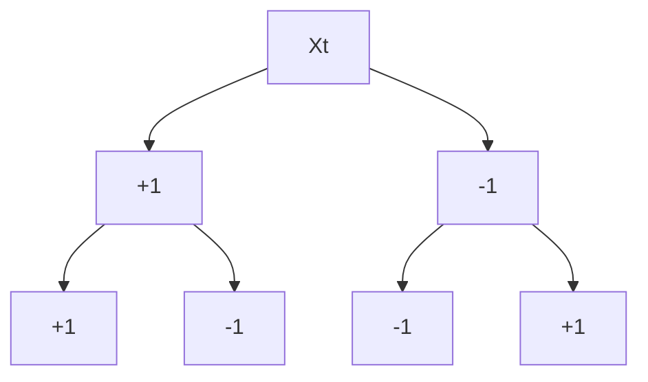

# K-近邻

## 概述

### 假设

相似的输入（数据点）应当有相同输出（标签）。

### 分类准则

对于测试点，从测试集中计算并获取与之最相近的k个数据点。

### 形式化定义

设测试点为$\mathbf{x}$，测试点的$k$个最近邻的集合为$S_{\mathbf{x}}$，我们如下定义k-近邻算法：
$$
\begin{align}
& S_{\mathbf{x}} \sube D \ s.t. \ |S_{\mathbf x}| = k\\
& \forall (\mathbf x',y') \in D - S_{\mathbf x}, \ \operatorname{dist}\left(\mathbf{x}, \mathbf{x}^{\prime}\right) \geq \max _{\left(\mathbf{x}^{*}, y^{\prime \prime}\right) \in S_{\mathbf{x}}} \operatorname{dist}\left(\mathbf{x}, \mathbf{x}^{\prime \prime}\right)\\
& h(\mathbf{x})=\operatorname{mode}\left(\left\{y^{\prime \prime}:\left(\mathbf{x}^{\prime \prime}, y^{\prime \prime}\right) \in S_{\mathbf{x}}\right\}\right)
\end{align}
$$

## K

当$k=n$时，算法退化为求众数，当$k=1$时，算法退化为求最近邻。

当$k$不断增加时，分类边界曲线会慢慢平滑。

当出现$k$个近邻种类个数相同的情况，应当适当减小$k$值，以获取唯一结果。

## 距离

### 闵可夫斯基距离

$$
\operatorname{dist}(\mathbf{x}, \mathbf{z})=\left(\sum_{r=1}^{d}\left|x_{r}-z_{r}\right|^{p}\right)^{1 / p}
$$

$p = 1$时，为曼哈顿距离。

$p=2$时，为欧氏距离。

$p\rightarrow \infin$，为最大值函数。

## 可行性证明

### 贝叶斯最优分类

假设已知数据集的条件分布$P(y|\mathbf x)$，那么可以简单预测与输入最接近的标签：
$$
y^{*}=h_{\mathrm{opt}}(\mathbf{x})=\underset{y}{\operatorname{argmax}} P(y | \mathbf{x})
$$
尽管可以据此预测并得到很好的结果，但仍然存在错误率：
$$
\epsilon_{\text {BayesOpt}}=1-\mathbf{P}\left(h_{\text {opt }}(\mathbf{x}) | \mathbf{x}\right)=1-\mathbf{P}\left(y^{*} | \mathbf{x}\right)
$$

### 证明

设测试点$\mathbf x_{NN}$的最近邻居$\mathbf x_t$，那么显然有：
$$
\text { As } n \rightarrow \infty, \text { dist}\left(\mathbf{x}_{\mathrm{NN}}, \mathbf{x}_{\mathrm{t}}\right) \rightarrow 0, \text { i.e. } \mathbf{x}_{\mathrm{NN}} \rightarrow \mathbf{x}_{t}
$$

进而我们有：
$$
\begin{aligned}
\epsilon_{N N}&=\mathrm{P}\left(y^{*} | \mathbf{x}_{t}\right)\left(1-\mathrm{P}\left(y^{*} | \mathbf{x}_{N N}\right)\right)+\mathrm{P}\left(y^{*} | \mathbf{x}_{N N}\right)\left(1-\mathrm{P}\left(y^{*} | \mathbf{x}_{t}\right)\right) \\
&\leq\left(1-\mathrm{P}\left(y^{*} | \mathbf{x}_{N N}\right)\right)+\left(1-\mathbf{P}\left(y^{*} | \mathbf{x}_{t}\right)\right)=2\left(1-\mathrm{P}\left(y^{*} | \mathbf{x}_{t}\right)=2 \epsilon_{\mathrm{BayesOpt}}\right.
\end{aligned}
$$

## 维度灾难

高维空间中，从概率分布中提取出的点往往很难接近。以单位超立方体$[0,1]^d$为例，我们将数据归一化至该立方体中，取$k=10$，记$\mathcal l$为包含最近邻的正超立方体的边长，可得
$$
\mathcal l^d \approx \frac{k}{n}\Rightarrow \mathcal l \approx (\frac{k}{n})^{\frac{1}{d}}
$$
所以当$n=1000$时，$\mathcal l$等于多少呢？

计算知，$d=10$时，$\mathcal l = 0.63$；$d=100$时，$\mathcal l = 0.955$；$d = 1000$时，$\mathcal l = 0.9954$。$d$越大，$\mathcal l$越接近1。维度越高，所谓的最近邻相比于数据集中的其他点并没有那么近，进而导致分类效果降低。

