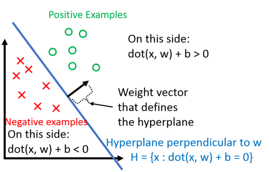
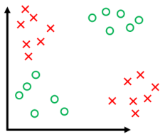

# 感知机

> 假设：
>
> 1. 进行二分类（$y_i\in\{-1,+1\}$）
> 2. 数据线性可分

## 定义与描述

目标函数
$$
h\left(\mathbf x_{i}\right)=\operatorname{sign}\left(\mathbf{w}^{\top} \mathbf{x}_{i}+b\right)
$$
常数$b$作为一个偏移量，在这里很不方便操作，因此我们记
$$
\mathbf{x}_{i} \Rightarrow \left[\begin{array}{c}\mathbf{x}_{i} \\ 1\end{array}\right] \\
\mathbf{w} \Rightarrow \left[\begin{array}{l}\mathbf{w} \\ b\end{array}\right] \\
\left[\begin{array}{l}
\mathbf{x}_{i} \\
1
\end{array}\right]^{\top}\left[\begin{array}{l}
\mathbf{w} \\
b
\end{array}\right] \Rightarrow \mathbf{w}^{\top} \mathbf{x}_{i}+b
$$
所以有
$$
h\left(\mathbf{x}_{i}\right)=\operatorname{sign}\left(\mathbf{w}^{\top} \mathbf{x}\right)
$$
实际上，这是一个升维操作（添加特征），可以将一些低维无法分开的数据分开。

因为这里的定义，对于分类正确的样本，$y_i$与$\mathcal h(\mathbf x_i)$同号，即
$$
y_{i}\left(\mathbf{w}^{\top} \mathbf{x}_{i}\right)>0 \Longleftrightarrow \mathbf{x}_{i} \text { is classified correctly }
$$
基于以上假设与定义，我们给出以下算法：

> 1. 初始化$\vec w = \vec 0 $
> 2. 进入循环：
>    1. 错误分类数$m=0$
>    2. 对于数据集$D$中的每一个样本$(\vec{x_i},y_i)$判断$y_i(\vec w^T \cdot \vec{x_i}) \le 0$，成立则$\vec w \leftarrow \vec w + y_i\vec {x_i}$，$m\leftarrow m + 1$
>    3. 如果$m == 0$那么跳出循环
> 3. 分类完成

## 证明

首先通过平移伸缩等操作可以将数据集$D$中的全部样本点包含于一个单位圆中，即保证
$$
||\mathbf{x_i}|| \le 1, \forall \mathbf x_i \in D
$$
接着因为数据线性可分，那么有以下断言，其中$\mathbf w ^ *$是目标函数$\mathcal h (\mathbf x_i)$所表示的超平面的单位法向量（$||\mathbf w^* || = 1$）
$$
\exist \mathbf w^* \ s.t.\  y_i(\mathbf x^T \mathbf w ^ *) \gt 0 \ \forall (\mathbf x_i, y_i) \in D
$$
记所有样本点到超平面的最近距离为$\gamma$，即
$$
\gamma=\min _{\left(\mathbf{x}_{i}, y_{i}\right) \in D}\left|\mathbf{x}_{i}^{T} \mathbf{w}^{*}\right|
$$
接下来证明，感知机分类错误数不超过$1/\gamma^2$。

评价感知机需要有两方面指标：$\mathbf w ^ T \mathbf w ^ *$和$\mathbf w^T \mathbf w$，前者越大说明当前结果到目标结果距离越小（两个法向量夹角越小），但有可能是法向量的大小变大了，因此这里同时要要求后者越小。

考虑指标$\mathbf w ^ T \mathbf w ^ *$，根据以上的断言可知$y(\mathbf{x^Tw^*})=|\mathbf{x^Tw^*}| \ge \gamma$，因此对于每次更新有
$$
(\mathbf w + y \mathbf x) ^ T \mathbf w ^ * = \mathbf w ^ T \mathbf w ^ * + y(\mathbf {x^Tw^*}) \ge \mathbf w ^ T \mathbf w ^ * + \gamma
$$
考虑指标$\mathbf{w^T w}$，每当存在分类错误有$y(\mathbf{x^Tw})\lt 0$，因此对于每次更新有
$$
(\mathbf{w}+y \mathbf{x})^{\top}(\mathbf{w}+y \mathbf{x})=\mathbf{w}^{\top} \mathbf{w}+\underbrace{2 y\left(\mathbf{w}^{\top} \mathbf{x}\right)}_{<0}+\underbrace{y^{2}\left(\mathbf{x}^{\top} \mathbf{x}\right)}_{0 \leq \ \ \leq 1} \leq \mathbf{w}^{\top} \mathbf{w}+1
$$
这里设经过$M$次更新，而对于上述指标有
$$
\begin{align}
(1)\ &\mathbf{w}^{\top} \mathbf{w}^{*} \geq M \gamma \\
(2)\ &\mathbf{w}^{\top} \mathbf{w} \leq M
\end{align}
$$
继而，有如下推导（$\theta$为$\mathbf w$和$\mathbf w ^ *$的夹角）
$$
\begin{aligned}
M \gamma 
& \leq \mathbf{w}^{\top} \mathbf{w}^{*}=\|\mathbf{w}\| \cos (\theta) \leq\|\mathbf{w}\| &(||\mathbf w^* || = 1)\\
& =\sqrt{\mathbf{w}^{\top} \mathbf{w}}  \leq \sqrt{M} \\
& \Rightarrow M \gamma \leq \sqrt{M} \\
& \Rightarrow M \leq \frac{1}{\gamma^{2}}
\end{aligned}
$$
说明，在假设条件成立下，感知机一定会在有限的更新次数中完成任务，即有时间复杂度为常数的特点。

## 短板——XOR问题

感知机不能解决异或问题。

