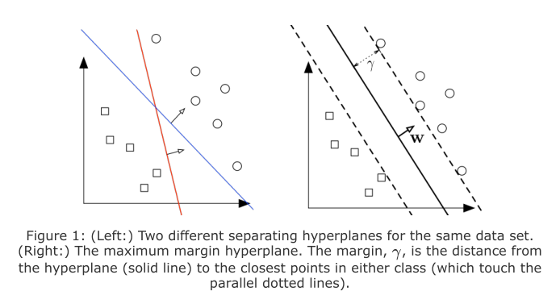

# 支持向量机

支持向量机，如果用来做线性分类器的话，可以看作是感知机的拓展，它的目标是寻找最大间隔分类超平面。

首先，定义针对某个二分类任务线性分类器（设目标标签为$\{+1,-1\}$）。
$$
h(\mathbf{x})=\operatorname{sign}\left(\mathbf{w}^{T} \mathbf{x}+b\right)
$$

如果对于一个线性可分的数据集，一定存在无数个分类超平面，这里自然而然就会有一个问题：哪一个分类超平面最好？支持向量机的答案如上所述。

## 定义

### 间隔

设超平面
$$
\mathcal{H}=\left\{\mathbf{x} | \mathbf{w}^{T} \mathbf{x}+b=0\right\}
$$
样本点到超平面距离
$$
\|\mathbf{d}\|_{2}=\sqrt{\mathbf{d}^{T} \mathbf{d}}=\sqrt{\alpha^{2} \mathbf{w}^{T} \mathbf{w}}=\frac{\left|\mathbf{w}^{T} \mathbf{x}+b\right|}{\sqrt{\mathbf{w}^{T} \mathbf{w}}}=\frac{\left|\mathbf{w}^{T} \mathbf{x}+b\right|}{\|\mathbf{w}\|_{2}}
$$
间隔$\gamma$即为
$$
\gamma(\mathbf{w}, b)=\min _{\mathbf{x} \in D} \frac{\left|\mathbf{w}^{T} \mathbf{x}+b\right|}{\|\mathbf{w}\|_{2}}
$$
感知机部分做了平移与归一化，因此$b=0$且分母为一。

需要指出的是间隔的不变性，即
$$
\gamma(\beta \mathbf{w}, \beta b)=\gamma(\mathbf{w}, b), \forall \beta \neq 0
$$

### SVM

根据以上间隔和描述，可以得到支持向量机的形式化定义，如下：
$$
\underbrace{\max _{\mathbf{w}, b} \underbrace{\frac{1}{\|\mathbf{w}\|_2}  \min _{\mathbf{x}_{i} \in D}\left|\mathbf{w}^{T} \mathbf{x}_{i}+b\right|}_{\gamma(\mathbf{w}, b)}}_{\text {maximize margin }} \text { s. } t . \underbrace{\forall i \ y_{i}\left(\mathbf{w}^{T} x_{i}+b\right) \geq 0}_{\text {separating hyperplane }}
$$
由间隔的不变性可添加系数，得到以下限制条件：
$$
\min _{\mathbf{x} \in D}\left|\mathbf{w}^{T} \mathbf{x}+b\right|=1
$$
进一步间隔最大的目标等价为：
$$
\max _{\mathbf{w}, b} \frac{1}{\|\mathbf{w}\|_{2}} \cdot 1=\min _{\mathbf{w}, b}\|\mathbf{w}\|_{2}=\min _{\mathbf{w}, b} \mathbf{w}^{\top} \mathbf{w}
$$
此时形式化定义为：
$$
\min _{\mathbf{w}, b} \mathbf{w}^{\top} \mathbf{w}\ \text { s.t. } \begin{aligned}
& \forall i\ y_{i}\left(\mathbf{w}^{T} \mathbf{x}_{i}+b\right) \geq 0\\

&\min _{i}\left|\mathbf{w}^{T} \mathbf{x}_{i}+b\right|=1
\end{aligned}
$$
进一步等价于
$$
\begin{array}{l}
\min _{\mathbf{w}, b} \mathbf{w}^{T} \mathbf{w} \\
\text { s.t. } \forall i y_{i}\left(\mathbf{w}^{T} \mathbf{x}_{i}+b\right) \geq 1
\end{array}
$$
