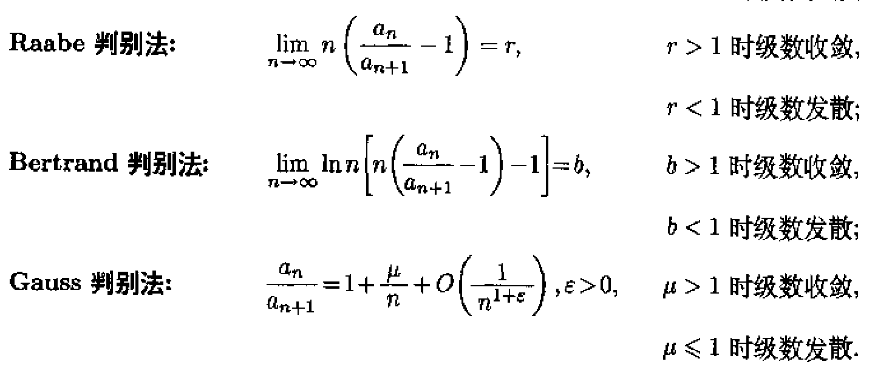
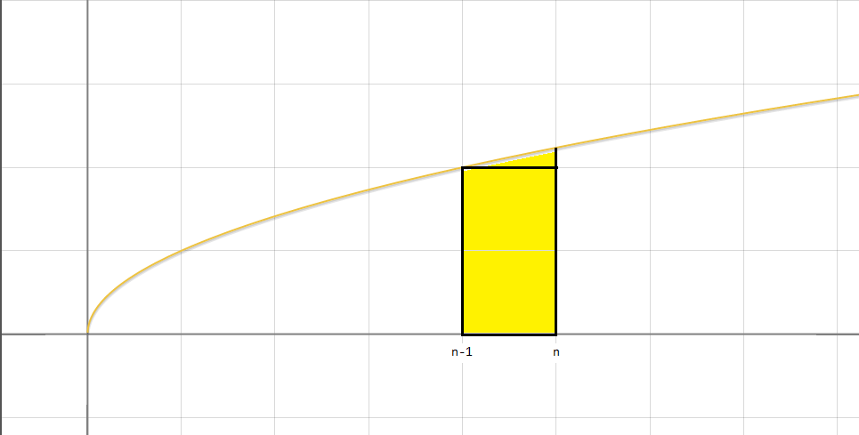

# Series

> 详细的概念和相对简单的作业题见[Sequences and Series](./src/SequencesAndSeries.pdf)，[FourierSeries](./src/FourierSeries.pdf)和[FOURIER SERIES AND INTEGRALS](./src/FOURIER SERIES AND INTEGRALS.pdf)，以下对一些定理进行理解并应用，提高认识！

---

## 数项级数

### 敛散性判断

- 定义判断及一些小推论

  - 数列能求出来和，再判断和是否有极限。

  - 一般来说有裂项相消，等比等特性。

  - 数列收敛------部分和有上界------余项为无穷小量，如下（2）（3）：
  $$
  \sum_{n=1}^{\infin} a_n收敛\begin{align}\Rightarrow &\lim_{n\rightarrow \infin}a_n=0&(1)\\ \Leftrightarrow &\lim_{n\rightarrow \infin}R_n=0&(2) \\ \Leftrightarrow&\lim_{n\rightarrow \infin}S_n=S(-\infin< S <+\infin)&(3)\\ \Rightarrow& 不改变次序加括号得新级数收敛&(4)
  \end{align}
  $$

  - （1）式是必要条件，一般反过来用，证明发散。
  - （4）的实质是级数的部分和数列的子列收敛，因此也是必要条件。若要使之充要，则需满足每个括号内符号一致。

- Cauchy收敛准则
  $$
  \forall \varepsilon > 0, \exists N \in N_+ s.t. 当n > N时,\forall p \in N_+, 恒有|\sum_{k=n+1}^{n+p} a_k|<\varepsilon, 则\sum a_n收敛
  $$
  注意$p$的任意性。
  - **例1**：利用Cauchy收敛准则证明$\sum \frac{(-1)^n}{n}$收敛。

  - 证明：要满足
    $$
    \forall \varepsilon > 0, \exists N \in N_+ s.t. 当n > N时,\forall p \in N_+, 恒有|\sum_{k=n+1}^{n+p} \frac{(-1)^k}{k}|<\varepsilon
    $$
    又考虑到$|\frac{(-1)^k}{k}|$单调递减，故有
    $$
    |\sum_{k=n+1}^{n+p} \frac{(-1)^k}{k}|<\frac{1}{n}<\varepsilon
    $$
    因此只需要取$N>\frac{1}{\varepsilon}$即可，故$\sum \frac{(-1)^n}{n}$收敛。

  - **例2**：利用Cauthy收敛准则判断$\sum\frac{(-1)^{n-1}n^2}{2n^2+1}$的敛散性。

  - 证明：取$\varepsilon_0=\frac{1}{3}$，$p=1$，则
    $$
    \forall N \in N_+,n>N,有|\sum_{k=n+1}^{n+p} \frac{(-1)^{k-1}k^2}{2k^2+1}|>\frac{n^2}{2n^2+1}>\frac{1}{3}=\varepsilon_0
    $$
    故原级数发散。

  - **例3**：设$\lim_{n\rightarrow \infin}a_n$存在，且级数$\sum n(a_n-a_{n-1})$收敛，证明级数$\sum a_n$收敛。

  - 证明：由Cauchy收敛定理知
    $$
    \forall \varepsilon > 0, \exists N \in N_+ s.t. 当n > N时,\forall p \in N_+, 恒有|\sum_{k=n+1}^{n+p} k(a_k-a_{k-1})|<\frac{\varepsilon}{3}
    $$
    又注意到
    $$
    |\sum_{k=n+1}^{n+p} k(a_k-a_{k-1})|=|\sum_{k=n+1}^{n+p}[ka_k-(k-1)a_{k-1}]-\sum_{k=n+1}^{n+p}a_{k-1}|=|(n+p)a_{n+p}-na_n-\sum_{k=n+1}^{n+p}a_{k-1}|
    $$
    同时我们有$ \lim_{n\rightarrow \infin} a_n$存在，设为$A$，即有
    $$
    \begin{align}|(n+p)a_{n+p}-A|<\frac{\varepsilon}{3}\\|na_{n}-A|<\frac{\varepsilon}{3}\end{align}\Rightarrow|(n+p)a_{n+p}-na_n|<\frac{2\varepsilon}{3}
    $$
    故有
    $$
    \frac{\varepsilon}{3}>|\sum_{k=n+1}^{n+p} k(a_k-a_{k-1})|>||\sum_{k=n+1}^{n+p}a_{k-1}|-|(n+p)a_{n+p}-na_n||
    $$
    即
    $$
    |\sum_{k=n+1}^{n+p}a_{k-1}|<\varepsilon
    $$
    故级数$\sum a_n$收敛。

  - **例4**：若数列$\{ a_n \}$单调，且级数$\sum a_n$收敛，级数$\sum n(a_n-a_{n+1})$收敛。

  - 证明：由Cauchy收敛准则有
    $$
    \forall \varepsilon > 0, \exists N \in N_+ s.t. 当n > N时,\forall p \in N_+, 恒有|\sum_{k=n+1}^{n+p} a_k|<\frac{\varepsilon}{5}
    $$
    由数列$\{ a_n \}$单调可得
    $$
    |pa_{n+p}|<|\sum_{k=n+1}^{n+p} a_k|<\frac{\varepsilon}{5}
    $$
    此时不妨取$p=n$，则有
    $$
    |2na_{2n}|<\frac{2\varepsilon}{5}
    $$
    即
    $$
    \lim_{n\rightarrow \infin}a_n=0
    $$
    故进而有
    $$
    \begin{align}|(n+p)a_{n+p}|<\frac{2\varepsilon}{5}\\|(n+1)a_{n+1}|<\frac{2\varepsilon}{5}\end{align}\Rightarrow|(n+p)a_{n+p}-(n+1)a_{n+1}|<\frac{4\varepsilon}{5}
    $$
    所以
    $$
    |\sum_{k=n+1}^{n+p} k(a_k-a_{k+1})|=|\sum_{k=n+1}^{n+p}[ka_k-(k+1)a_{k+1}]+\sum_{k=n+1}^{n+p}a_{k+1}|=|(n+p)a_{n+p}-(n+1)a_{n+1}+\sum_{k=n+1}^{n+p}a_{k+1}|<\frac{4\varepsilon}{5}+\frac{\varepsilon}{5}<\varepsilon
    $$
    即级数$\sum n(a_n-a_{n+1})$收敛。

- 正项级数收敛充要条件------部分和数列有上界。（其他所有判别法的基础）

- 比较判别法

  - 很好记，证明发散，则找一个比它小的发散级数；证明收敛，则找一个比它大的收敛级数。这种思想常用于对原式进行放缩。另一种方式就是做比然后求极限，实质上就是看二者的相对阶数，同阶或等价则同敛散性；高阶无穷小则分子收敛分母收敛，分母发散分子发散。

  - 比较对象常选择p级数和几何级数，同时也会使用等价无穷小。

    - p级数
      $$
      \begin{align}
      &p>1\Rightarrow \sum\frac{1}{n^p} converges\\
      &p\le1 \Rightarrow \sum\frac{1}{n^p} diverges
      \end{align}
      $$

    - 几何级数
      $$
      \begin{align}
      &q < 1 \Rightarrow \sum{q^n} converges\\
      &q \ge 1 \Rightarrow \sum{q^n} diverges
      \end{align}
      $$

- 根式判别法

  - 对数列取n次根号并求其上极限$\alpha$，并与1比较，大于则发散，小于则收敛
  
- 实质上是与几何级数进行比较。
  
- 比式判别法

  - 根据一个极限的性质导出，即

  $$
  \lim_{n\rightarrow\infin}\frac{a_{n+1}}{a_n}=\lambda\Rightarrow \lim_{n\rightarrow\infin}\sqrt[n]{a_n}=\lambda
  $$

- 积分判别法

  - 原级数可以写成反常积分的形式，这样就可以使用反常积分的判别法。比如p级数。
  - 注意函数$f(x)$要求**连续非负单减且定义域值域为$[1,+\infin)\rightarrow[0,+\infin)$**。

- 一些其他的判别法

  

  这些给我们构造更深入的更精细的判别法提供了思路。（待完善）
  - **例1**：判断级数$\sum _ { n = 1 } ^ { \infty } n ! \left( \frac { \alpha } { n } \right) ^ { n } ( \alpha > 0 )$的敛散性。

  - 解：因为
    $$
    \begin{align}
    \lim_{n\rightarrow\infin}\frac{ (n+1)! \left( \frac { \alpha } { n+1 } \right) ^ {n+1} }{n ! \left( \frac { \alpha } { n } \right) ^ { n }}&=\lim_{n\rightarrow\infin}\alpha(\frac{n}{n+1})^n\\
    &=\lim_{n\rightarrow\infin}\alpha(1-\frac{1}{n+1})^n\\
    &=\frac{\alpha}{e}
    \end{align}
    $$
    又根据Stirling公式
    $$
    \lim _ { n \rightarrow + \infty } \frac { n ! } { \sqrt { 2 \pi n } \left( \frac { n } { e } \right) ^ { n } } = 1
    $$
    即$\alpha=e$时原级数和$\sum \sqrt{2\pi n}$敛散性相同，而后者显然发散。

    故当$\alpha\ge e$时原级数发散，当$\alpha<e$时原级数收敛。

  - **例2**：讨论级数$\sum_{n=2}^\infin \frac{1}{n(\ln n)^p}$的敛散性。

  - 解：取函数$f(x)=\frac{1}{x(\ln x)^p}$，满足判别法要求，故考虑
    $$
    \int_2^{+\infin}f(x)dx=\int_2^{+\infin}\frac{dx}{x(\ln x)^p}
    $$
    当$p=1$时，很容易计算
    $$
    \int_2^{+\infin}\frac{dx}{x\ln x}=\ln\ln x \bigg|^{+\infin}_2=+\infin
    $$
    当$p\ne1$时，有
    $$
    \int_2^{+\infin}\frac{dx}{x(\ln x)^p}=\frac{1}{1-p}(\ln x)^{1-p}\bigg|^{+\infin}_2=\begin{cases}
    \frac{(\ln 2)^{1-p}}{p-1}&p>1\\+\infin&p<1
    \end{cases}
    $$
    故原级数在$p\le1$发散，$p>1$收敛。
    
  - **例3**：判断级数$\sum _ { n = 1 } ^ { \infty } \frac { n } { 1 ^ { \alpha } + 2 ^ { \alpha } + \cdots n ^ { \alpha } } ( \alpha > 0 )$的敛散性。
  
  - 解：如图有
  
    
    $$
    (n-1)^{\alpha}<\int_{n-1}^{n}x^{\alpha}dx
    $$
    因此有
    $$
    \frac { n } { 1 ^ { \alpha } + 2 ^ { \alpha } + \cdots n ^ { \alpha } } >\frac{n}{\int_1^2 x^{\alpha} dx+\int_2^3 x^{\alpha} dx+\cdots+\int_n^{n+1} x^{\alpha} dx}=\frac{n(\alpha+1)}{(n+1)^{(\alpha+1)}-1}
    $$
    又知
    $$
    \lim_{n\rightarrow \infin}\frac{\frac{n(\alpha+1)}{(n+1)^{(\alpha+1)}-1}}{\frac{1}{n^\alpha}}=1+\alpha
    $$
    级数$\sum _ { n = 1 } ^ { \infty }\frac{n(\alpha+1)}{(n+1)^{(\alpha+1)}-1}$，级数$\sum _ { n = 1 } ^ { \infty } \frac { n } { 1 ^ { \alpha } + 2 ^ { \alpha } + \cdots n ^ { \alpha } }$和级数$\sum \frac{1}{n^\alpha}$同敛散性。
  
    故$\alpha >1$时原级数收敛，$0<\alpha\le 1$时原级数发散。
  
  - **例4**：判断级数$\sum _ { n = 1 } ^ { \infty } \frac { 1 } { \ln ( n ! ) }$的敛散性。
  
  - 解：因为$n>2$时，有
    $$
    \ln (n!)<n\ln n
    $$
    即
    $$
    \frac{1}{n\ln n}<\frac{1}{ln(n!)}
    $$
    故只需考虑函数$f(x)=\frac{1}{x\ln x}$，则有
    $$
    \int_0^{+\infin} f(x)dx=\ln(\ln x)\bigg|_0^{+\infin}=+\infin
    $$
    故级数$\sum \frac{1}{n\ln n}$发散，则级数$\sum _ { n = 1 } ^ { \infty } \frac { 1 } { \ln ( n ! ) }$发散。
  
- 交错级数--Leibniz判别法

  - 取绝对值后单减趋于零则收敛。
  
  - 注意推论（虽然很简单但是容易忘记）
    1. 和$S$小于$a_1$
    2. 余项$R_n$满足$R_n\le a_{n+1}$
    
  - **例**：证明级数$\sum \frac{(-1)^n}{n^p}(p>0)$收敛
  
  - 解：用一下判别法就好。
  
  - 这里引出了条件收敛和绝对收敛的概念，记住绝对收敛推条件收敛即可。
  
  - **例**：讨论级数$\sum \frac{(-1)^{n-1}}{n^p+(-1)^{n-1}} (p\ge1)$的敛散性。
  
  - 解：易知$p>1$时原级数和$\sum \frac{(-1)^n}{n^p}$等价，故$p>1$时原级数绝对收敛，$p = 1$时原级数可作如下分解
    $$
    \frac{(-1)^{n-1}}{n+(-1)^{n-1}} =\frac{(-1)^{n-1}}{n}-\frac{1}{n(n+(-1)^{n-1})}
    $$
    显然分解后的两个数列都时收敛的，因此原级数也是收敛的，但此时原级数的绝对值时发散的。故此时原级数条件收敛。
  
- Dirichlet判别法和Abel判别法

  - 先记住内容

  > 1. Dirichlet判别法：$\sum_{i=0}^{n}a_n$有界，${b_n}$单调趋于$0$，则级数$\sum a_nb_n$收敛。
  > 2. Abel判别法：$\sum a_n$收敛，$\{b_n\}$单调有界。
  - 首先这俩判别法时充要的。
  
  - 其次我们可以发现Abel判别法和Leibniz判别法都是Dirichlet判别法的特例。
  
  - 最后给几个常见的例子：
  
  - **例1**：设数列$\{a_n \}$单调趋于$0$，则对$x\ne 2k\pi$，级数$\sum a_n \sin nx$和$\sum a_n \cos nx$都收敛。
  
  - 解：当$x\ne 2k\pi$时，
  
    利用和差化积公式
    $$
    \begin{array} { l } {  \sin \alpha + \sin \beta = 2 \sin \frac { \alpha + \beta } { 2 } \cos \frac { \alpha - \beta } { 2 } } \\ { \cos \alpha + \cos \beta = 2 \cos \frac { \alpha + \beta } { 2 } \cos \frac { \alpha - \beta } { 2 } } \\ {  \sin \alpha - \sin \beta = 2 \cos \frac { \alpha + \beta } { 2 } \sin \frac { \alpha - \beta } { 2 }  } \\ { \cos \alpha - \cos \beta = - 2 \sin \frac { \alpha + \beta } { 2 } \sin \frac { \alpha - \beta } { 2 }  } \end{array}
    $$
    有
    $$
    \begin{align}
    &\sin \frac{x}{2} \sin kx= \sin (\frac{2k+1}{4}x-\frac{2k-1}{4}x)\sin (\frac{2k+1}{4}x+\frac{2k-1}{4}x)=-\frac{1}{2}\bigg[ \cos\frac{2k+1}{2}x-\cos \frac{2k-1}{2}x \bigg]\\
    &\sin \frac{x}2 \cos kx= \sin (\frac{2k+1}{4}x-\frac{2k-1}{4}x)\cos (\frac{2k+1}{4}x+\frac{2k-1}{4}x)=\frac{1}{2}\bigg[ \sin\frac{2k+1}{2}x-\sin \frac{2k-1}{2}x \bigg]
    \end{align}
    $$
    故
    $$
    \begin{align}
    &\sum_{k=1}^{n}\sin kx=-\frac{1}{2\sin \frac{x}{2}}\bigg[\cos \frac{2n+1}{2}x -\cos\frac{x}{2}\bigg]\\
    &\sum_{k=1}^{n}\cos kx=\frac{1}{2\sin \frac{x}{2}}\bigg[\sin \frac{2n+1}{2}x -\sin\frac{x}{2}\bigg]
    \end{align}
    $$
    
    因此
    $$
    \bigg|\sum_{k=1}^{n}\sin kx \bigg|\le \frac{1}{2|\sin \frac{x}{2}|}\\
    \bigg|\sum_{k=1}^{n}\cos kx \bigg|\le \frac{1}{2|\sin \frac{x}{2}|}
    $$
    由Dirichlet判别法可知，级数$\sum a_n \sin nx$和$\sum a_n \cos nx$都收敛。

## Cauchy乘积

先给公式
$$
\sum_{n=1}^{\infin} c_n=\sum_{n=1}^{\infin}(a_1b_n+a_2b_{n-1}+\cdots+a_nb_1)
$$
**例1**：计算$(\sum_{n=0}^{+\infin} x^n)(\sum_{n=0}^{+\infin} x^n)$。

解：
$$
\begin{align}
(\sum_{n=0}^{+\infin} x^n)(\sum_{n=0}^{+\infin} x^n)&=(a_1b_1)+(a_1b_2+a_2b_1)+\cdots+(a_1b_n+a_2b_{n-1}+\cdots+a_nb_1)+\cdots\\
&=1+2x+3x^2+\cdots+nx^{n-1}+\cdots\\
&=\sum_{n=1}^{+\infin}nx^{n-1}
\end{align}
$$
**例2**：计算$\left( \sum _ { n = 1 } ^ { \infty } n x ^ { n - 1 } \right) \left( \sum _ { n = 1 } ^ { \infty } ( - 1 ) ^ { n - 1 } n x ^ { n - 1 } \right)$。

解：
$$
\begin{align}
\left( \sum _ { n = 1 } ^ { \infty } n x ^ { n - 1 } \right) \left( \sum _ { n = 1 } ^ { \infty } ( - 1 ) ^ { n - 1 } n x ^ { n - 1 } \right)&=\left( \sum _ { n = 1 } ^ { \infty } n x ^ { n - 1 } \right) \left( \sum _ { n = 1 } ^ { \infty }n ( - x ) ^ { n - 1 }  \right)
\end{align}
$$
又由例1知$(\sum_{n=0}^{+\infin} x^n)(\sum_{n=0}^{+\infin} x^n)=\sum_{n=1}^{+\infin}nx^{n-1}$

而$\sum_{n=0}^{+\infin} x^n=\frac{1}{1-x}$，故我们有
$$
\sum_{n=1}^{+\infin}nx^{n-1}=(\sum_{n=0}^{+\infin} x^n)(\sum_{n=0}^{+\infin} x^n)=\frac{1}{1-x}\frac{1}{1-x}=\frac{1}{(1-x)^2}\\
 \sum _ { n = 1 } ^ { \infty }n ( - x ) ^ { n - 1 } =(\sum_{n=0}^{+\infin} (-x)^n)(\sum_{n=0}^{+\infin} (-x)^n)=\frac{1}{1+x}\frac{1}{1+x}=\frac{1}{(1+x)^2}\\
$$
所以

$$
\left( \sum _ { n = 1 } ^ { \infty } n x ^ { n - 1 } \right) \left( \sum _ { n = 1 } ^ { \infty }n ( - x ) ^ { n - 1 }  \right)=\frac{1}{(1-x)^2}\frac{1}{(1+x)^2}=\frac{1}{(1-x^2)^2}=\sum_{n=1}^{+\infin}nx^{2n-2}
$$
**例3**：计算$\left( \sum _ { n = 0 } ^ { \infty } \frac { 1 } { n ! } \right) \left( \sum _ { n = 0 } ^ { \infty } \frac { ( - 1 ) ^ { n } } { n ! } \right)$。

解：设$I_n=\left( \sum _ { n = 0 } ^ { \infty } \frac { 1 } { n ! } \right) \left( \sum _ { n = 0 } ^ { \infty } \frac { ( - 1 ) ^ { n } } { n ! } \right)$

$n=0$时，有$I_0=1$

$n>0$时，有
$$
I_n=\sum_{k=0}^{n}a_kb_{n-k}=\sum_{k=0}^{n}\frac{1}{k!}\frac{(-1)^{n-k}}{(n-k)!}=\frac{\sum_{k=0}^{n} C_n^k(-1)^{n-k}1^k}{n!}=0
$$
故综上$I_n=0$。

这一部分经常结合幂级数部分，Maclaurin展开式的展开和化归记熟就好。

接下来是少许拓展

1. 如果数列$\{ a_n\}\{b_n\}$满足
   1. 级数$\sum a_n$绝对收敛
   2. $\sum a_n=A,\sum b_n=B$

   则级数$\sum a_n,\sum b_n$的Cauchy乘积$\sum c_n=AB$。

2. 如果级数$\sum a_n,\sum b_n,\sum c_n$分别收敛于$A,B,C$，且$c_n=\sum_{k=0}^n a_kb_{n-k}$，则$C=AB$。

这些加上Cauchy乘积就是我们的级数乘积的理论依据。

## 函数项级数

### 函数列

怎么说呢，因为我们在引入数项级数之前已经对数列的极限什么的性质定理有了初步了解，所以我们这里要对函数列进行一定的介绍。但是这种介绍和紧跟着的函数项级数的性质定理有一定的相似性，也就导致了我们的混淆。

首先，函数列是一列函数，或者说将数列中的数都变成一个个含有未知量的式子，而函数项级数是将这些函数加起来所得的和式。

其次，函数列的极限函数对应数列的极限，函数项级数的和函数对应数项级数的和。

接着，我们可以换一个角度来看函数项级数，当我们对和式中的未知量赋值时，这个和式就“退化”为数项级数，也就有的所谓的收敛，然鹅，我们的未知量是在变化的，未必对于某一个未知量的值，“退化”的数项级数就收敛，因此有了收敛域的概念。同时在收敛域中，我们很难要求当他取值不定时和式能够收敛到同一个值，我们发现这些收敛值可能会满足一定的函数关系，也就是所谓的和函数，所以就自然地将和函数作为函数项级数的“收敛值”。

最后，一致收敛的概念是对逐点收敛的加强，逐点收敛即对未知量的所有取值的“退化”数项级数都收敛，这里收敛的界是与未知量的值有关联的，因此对于不同的未知量的值，收敛速度是不同的，而一致收敛要求存在一个公共的界，使得对于不同的未知量的值，该级数拥有相同或近似的收敛速度。

接着我们引入了函数列的概念，自然需要引入函数的各项操作——求极限求导求积分，故我们希望讨论求和与上述操作的可交换性。

### 基本概念与判别法

推论：

1. 对于函数列$\{ f_n\}$在$D$上收敛于$f$，且数列$\{a_n\}$，有$\lim_{n\rightarrow\infin}a_n=0$，则对$\forall x\in D$都有，对充分大的$n$成立
   $$
   \big|f_n-f \big| \le a_n
   $$
   则$f_n$在$D$上收敛于$f$。

2. 函数列$\{f_n\}$在$D$上一致收敛于$f$的充要条件是对于任意数列$\{x_n\}$，$x_n\in D$，都有
   $$
   \lim_{n\rightarrow\infin}\big|f_n(x_n)-f(x_n)\big|=0
   $$
   **例**：对于函数列$f_n=x^n$，$x\in[0,1)$，极限函数为$f=0$，现取$x_n=1-\frac{1}{n}$有$f_n(x_n)-f(x_n)=(1-\frac{1}{n})^n\rightarrow\frac{1}{e}\ne0(n\rightarrow\infin )$。故不一致收敛。

3. 函数项级数在定义域上一致收敛，则其通项函数列在定义域上一致收敛于0，反之，函数列在定义域上不一致收敛于0，则函数项级数在定义域上不一致收敛。

   **例**：级数$\sum a^n\sin\frac{x}{b^n}，D=(0,+\infin)$，其中$a\ge1,b>0$，取$x_n=b^n\frac{\pi}{2}$，则有$sin\frac{x}{b^n}=1$，而$a_n\nrightarrow0(n\rightarrow\infin)$，故不一致收敛于0，原级数也不一致收敛。

- 极限函数的连续性、可积性和可微性。
  - 前提都有一致收敛，前两者要求原函数列一致收敛，后者要求各项在收敛点的导数连续且一致收敛。
  - 一致收敛加各项连续则极限函数连续，可积。
- 函数项级数的连续性、可积性和可微性。
  
  - 与上类似，不赘述。
  
  

注：

1. 若$\sum a_n$收敛，则$\sum a_nx^n$在$[0,1]$上一致收敛。$\frac{(-1)^n}{n^p}x^n$。
2. 若$\{a_n\}$单调趋于0，则$\sum a_n \sin nx$与$\sum b_n \cos nx$在$(0,2\pi)$的任意子闭区间上已知收敛，即内闭一致收敛，但在$[0,2\pi]$上不一致收敛。

### 幂级数

相关的就是收敛半径吧，记得就是根式判别法或比式判别法所求得的极限的倒数，注意判断端点值，然后就是Maclaurin展开式，详见[document](./src/taylor-series-formulas.pdf)。
$$
\begin{align}
&1. &e^x&=\sum\frac{x^n}{n!} &x\in R\\
&2. &\sin x&=\sum(-1)^n\frac{x^{2n+1}}{(2n+1)!} &x\in R\\
&3. &\cos x&=\sum(-1)^n\frac{x^{2n}}{(2n)!} &x\in R\\
&4. &\frac{1}{1+x}&=\sum(-1)^nx^n & x\in(-1,1)\\
&5. &\frac{1}{1-x}&=\sum x^n & x\in(-1,1)\\
&6. &\ln (1+x)&=\sum\frac{(-1)^n}{n+1}x^{n+1} & x\in(-1,1]\\
&7. &\ln (1-x)&=-\sum\frac{1}{n+1}x^{n+1} & x\in[-1,1)\\
&8. &\sqrt{(1+x)}&=1+\frac{x}{2}+\sum_{n=2}^{\infin}(-1)^{n-1}\frac{(2n-3)!!}{(2n)!!}x^n& x\in[-1,1]\\
&9. &\frac{1}{\sqrt{(1+x)}}&=1+\sum_{n=1}^{\infin}(-1)^{n-1}\frac{(2n-1)!!}{(2n)!!}x^n& x\in(-1,1]\\
&10. &\arctan x&=\sum(-1)^n\frac{x^{2n+1}}{2n+1}&x\in[-1,1]\\
&11. &\arcsin x&=x+\sum_{n=1}^{\infin}\frac{1}{2n+1}\frac{(2n-1)!!}{(2n)!!}x^{n+1}&x\in[-1,1]\\
\end{align}
$$

### 傅里叶级数

- 系数的计算

  - $$
    \left\{ \begin{array} { l } { a _ { n } = \frac { 1 } { \pi } \int _ { - \pi } ^ { \pi } f ( x ) \cos n x \mathrm { d } x , n = 0,1,2 , \cdots } \\ { b _ { n } = \frac { 1 } { \pi } \int _ { - \pi } ^ { \pi } f ( x ) \sin n x \mathrm { d } x , n = 1,2 , \cdots } \end{array} \right.
    $$
- 任意区间$[a,b]$展开
    $$
    \begin{aligned} a _ { n } & = \frac { 2 } { b - a } \int _ { a } ^ { b } f ( x ) \cos \frac { 2 n \pi x } { b - a } \mathrm { d } x , \quad n \in \mathbf { N } \\ b _ { n } & = \frac { 2 } { b - a } \int _ { a } ^ { b } f ( x ) \sin \frac { 2 n \pi x } { b - a } \mathrm { d } x , \quad n \in \mathbf { N } _ { + }\\
    f ( x ) &\sim \frac { a _ { 0 } } { 2 } + \sum _ { n = 1 } ^ { \infty } \left( a _ { n } \cos \frac { 2 n \pi x } { b - a } + b _ { n } \sin \frac { 2 n \pi x } { b - a } \right)
    \end{aligned}
    $$
- Dirichlet收敛定理

  - 

- 奇偶延拓

  - $$
    f ( x ) \sim \frac { a _ { 0 } } { 2 } + \sum _ { n = 1 } ^ { \infty } a _ { n } \cos n x\\
    f ( x ) \sim \sum _ { n = 1 } ^ { \infty } b _ { n } \sin n x
    $$

- Bessel不等式和Parseval等式

  - $$
    \frac { a _ { 0 } ^ { 2 } } { 2 } + \sum _ { k = 1 } ^ { \infty } \left( a _ { k } ^ { 2 } + b _ { k } ^ { 2 } \right) \le \frac { 1 } { \pi } \int _ { - \pi } ^ { \pi } f ^ { 2 } \langle x ) d x\\
    \frac { a _ { 0 } ^ { 2 } } { 2 } + \sum _ { k = 1 } ^ { \infty } \left( a _ { k } ^ { 2 } + b _ { k } ^ { 2 } \right) = \frac { 1 } { \pi } \int _ { - \pi } ^ { \pi } f ^ { 2 } \langle x ) d x
    $$
    
  - Bessel不等式的证明：
  
    记
    $$
    s_n=\frac{a_0}{2}+\sum_{n=1}^{n}(a_k\cos kx+b_k\sin kx)
    $$
    计算
    $$
    \begin{align}
    \int_{-\pi}^{\pi}(f(x)-s_n)^2dx&=\int_{-\pi}^{\pi}f^2(x)-2\int_{-\pi}^{\pi}s_nf(x)dx+\int_{-\pi}^{\pi}s_n^2dx\\
    &=\int_{-\pi}^{\pi}f^2(x)-2\pi\bigg[\frac{a_0^2}{2}+\sum_{k=1}^{n}a_k^2+b_k^2\bigg]+\pi\bigg[\frac{a_0^2}{2}+\sum_{k=1}^{n}a_k^2+b_k^2\bigg]\\
    &=\int_{-\pi}^{\pi}f^2(x)-\pi\bigg[\frac{a_0^2}{2}+\sum_{k=1}^{n}a_k^2+b_k^2\bigg]
    \end{align}
    $$
    左侧非负，故有
    $$
    \frac { a _ { 0 } ^ { 2 } } { 2 } + \sum _ { k = 1 } ^ { \infty } \left( a _ { k } ^ { 2 } + b _ { k } ^ { 2 } \right) \le \frac { 1 } { \pi } \int _ { - \pi } ^ { \pi } f ^ { 2 } \langle x ) d x
    $$
    

