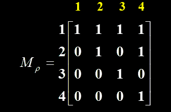
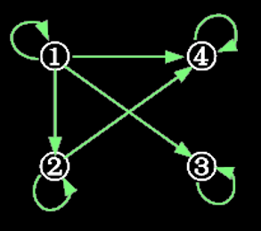

# 集合论基础

### 集合

#### 定义
一般来说，集合是一个很难精确定义的基本概念，这里我们使用如下定义：

> A *set* is an **unordered** collection of objects, called *elements* or *members* of the set. A set is said to *contain* its elements, which are **well-defined** and **distinct**. We write $a\in A$ to denote that $a$ is an element of the set $A$. The notation $a\notin A$ denotes that $a$ is not an element of the set $A$.

定义中指出集合具有的三大性质：无序性(unordered)、唯一性(distinct)、确定性(well-defined)。

可以看出这些性质都是来约束一个集合内的元素，这也引出了我们表示集合的方法：列举法(roster method)和描述法(set builder)。前者将集合内所有元素一一列出，后者依据集合内元素所具有的一致特征或唯一确定集合元素的某一规则对集合进行描述。

Example:

- $ \{a,b,c,d\}$
- $ \{1,2,3,...,99\}$
- $O = \{x ∈ Z ^+\ |\ x\ is\ odd\ and\ x < 10\}$

一些常见的特殊集合这里不再详述：$N,Z,Z^+,Q,R,R^+,C$。

#### 外延性原理

两个集合是相等的，当且仅当二者具有相同的元素。

#### 子集（包含关系）

$$
\begin{array} \
A \subseteq B \Leftrightarrow \forall x(x\in A\rightarrow x\in B)\\
自反性：A \sube A\\
传递性：(A \sube B) \and (B \sube C) \rightarrow (A \sube C)
\end{array}
$$

#### 判定集合相等

两个集合相等的充分必要条件是这两个集合互为子集。

**证明：**

- 充分性：若集合$A$，$B$相等，则依据外延性原理$\forall x(x\in A\rightarrow x\in B)$和$\forall x(x\in B\rightarrow x\in A)$都显然成立，即$A\sube B$和$B \sube A$。
- 必要性：若$A\sube B$和$B \sube A$成立，这里我们假设$A \neq B$，因此有$\exist x(( x \in A) \bigwedge (x\notin B))$，这与$\forall x(x\in A\rightarrow x\in B)$矛盾；同理$\exist x(( x \in B) \bigwedge (x\notin A))$与$\forall x(x\in B\rightarrow x\in A)$矛盾，因此$A\ =\ B$。

#### 真子集

$$
A \sub B \Leftrightarrow (\forall x)(x \in A \rightarrow x \in B) \and( \exist x)(x \in B \and x \notin A)\\
A \sub B \Leftrightarrow A \sube B \and A \neq B
$$

#### 空集

不包含任何元素的集合，记做$\varnothing $。

对于任意集合$A$，$\varnothing \sub A$。（这里我们将之视作定义而非定理）

#### 全集

$E=\{ x|p(x)\bigvee \neg p(x) \}$，其中$p(x)$为任意谓词。

全集的概念相当于论域，它定义在研究问题一定的确定情况下。

#### 幂集

$$
2^A=\{B\ |\ (\forall B)(B\sube A) \}
$$

Example:

- $A=\{ 0,1,2\}\ \ \ \ 2^A= \{\varnothing,\{ 0\},\{ 1\},\{ 2\},\{ 0,1\},\{ 0,2\},\{ 1,2\},\{ 0,1,2\} \}$

对于具有$n$个元素的有限集合$A$，它的幂集$2^A$有$2^n$个元素。

证明利用组合数公式即可。

此处我们引入一种编码方式，来**唯一地**表示有限集幂集的元素：（之后我们会证明这种编码方式是一种双射）
$$
S为一具有n个元素的集合
2^S = \{S_0,S_1,..,S_{2^n-1} \} = \{S_i\ |\ i \in J \}\\
其中J = \{i\ |\ 是二进制数且i满足\ \underbrace{000...000}_{n} < i < \underbrace{111...111}_{n} \}
$$

注：
$$
2^{A\cap B}=2^A\cap 2^B\\
2^{A\cup B}\ne 2^A\cup 2^B\\
$$

### 运算

以下证明皆很平凡，略去。

#### 交

$$
S=A\cap B=\{ x \ | \ (x\in A)\and (x\in B) \}
$$

- 性质：

  > $$
  > \begin{array} \\ A\cap  A = A \\ A\cap \varnothing = A \\ A\cap E = A \\ A\cap B = B \cap A (交换性)\\ (A\cap B)\cap C = A\cap (B\cap C)(结合性) \\ A\cap B \sube A \\ A\cap B \sube B \end{array}
  >  $$

#### 并

$$
S=A\cup B=\{ x \ | \ (x\in A)\or (x\in B) \}
$$

- 性质：

  > 
  > $$
  > \begin{array} \ A\cup  A = A \\ A\cup \varnothing = A \\ A\cup E = E \\ A\cup B = B \cup A (交换性) \\ (A\cup B)\cup C = A\cup (B\cup C)(结合性) \\ A\sube A\cup B \\ B \sube A\cup B \end{array}
  > $$

#### 分配律

$$
A \cup (B \cap C)=(A \cap B)\cup(A \cap c)\\
A \cap (B \cup C)=(A \cup B)\cap(A \cup c)
$$

#### 吸收律

$$
A\cup(A\cap B)=A\\
A\cap(A\cup B)=A
$$

#### 包含关系等价条件

$$
A\sube B\ iff\ (A\cup B =B)\ or\ (A\cap B = A)
$$

#### 补

##### 相对补

$$
S=A-B=\{x | x \in A \wedge x \notin B\}=\{x | x \in A \wedge \neg (x \in B) \}
$$

- 性质：

  > $$
  > \begin{array}{l}{A-B=A \cap \sim B}\\ 
  > {A-B=A-(A \cap B)}\\
  > \\
  > {(A-B)-C=A-(B \cup C)}\\ 
  > {(A-B)-C=(A-C)-B}\\ 
  > {(A-B)-C=(A-C)-(B-C)}\\
  > \\
  > {A \cap(B-C)=(A \cap B)-(A \cap C)}\\
  > \\
  > 注：{A \cup(B-C)=(A \cup B)-(A \cup C)}不成立
  > \end{array}
  > $$
  >

##### 绝对补

$$
\sim A=E-A=\{x | \alpha \in K \wedge x \notin A\}
$$

- 性质：

  > $$
  > \begin{array}{l}
  > {\sim(\sim A)=A} \\ 
  > {\sim E=\emptyset}\\
  > {\sim \emptyset=E}\\
  > {A \cup A=E}\\
  > {A \cap \sim A=\emptyset}
  > \end{array}
  > $$
  >

#### 对称差

$$
S=A\oplus B=(A-B) \cup(B-A)=\{x | x \in A \oplus x \in B\}
$$

- 性质：

  > $$
  > \begin{array}{l}{A \oplus B=B \oplus A}\\
  > {A \oplus \emptyset=A}\\ 
  > {A \oplus A=\emptyset}\\
  > {A \oplus B=(A \cap \sim B) \cup(\sim A \cap B)}\\
  > {(A \oplus B) \oplus C=A \oplus(B \oplus C)}\\
  > {A \cup B=(A \cap \sim B) \cup(B \cap \sim A) \cup(A \cap B)} \\ 
  > {A \cup B=(A \oplus B) \cup(A \cap B)}(后三条最好的证明方法是Venn图)\\
  > \end{array}
  > $$
  >

#### 基数
- 集合$A$中不同元素的个数称为集合$A$的基数。记作$|A|$。
- $|2^A|=2^{|A|}$
- $\left| A _ { 1 } \cup A _ { 2 } \right| \leqslant \left| A _ { 1 } \right| + \left| A _ { \mathrm { 2 } } \right|$
- $\left| A _ { 1 } \cap A _ { 2 } \right| \leqslant \min \left( \left| A _ { 1 } \right| , \left| A _ { 2 } \right| \right)$
- $\left| A _ { 1 } - A _ {2 } \right| \geqslant \left| A _ { 1 } \right| - \left| A _ { 2 } \right|$
- $|A_1\oplus A_2|=|A_1|+|A_2|-2|A_1\cap A_2|$

#### 集合的同基

设有集合$A,B$，如果存在一个双射函数$f:A\rightarrow B$，则称$A$和$B$同基，即具有相同的基数，或称二者等势。记作$A\sim B$。

同基关系是等价关系。

如果一个集合与集合$N_m=\{1,2,3,\ldots,m\}(m<+\infin)$同基，则称这种集合为有限集，否则为无限集。

如果集合$A\sim N$，则称$A$是可数集。如果集合是无限集但不是可数集，则称其为不可数集。

证明：实数集不是可数集。

证明：

定义函数$f:R_1\rightarrow R$，其中$R_1=\{x|x\in R\wedge0<x<1\}$。
$$
f(x)=\begin{cases}
\frac{1}{2x}-1,&0<x\le\frac{1}{2}
\\
\frac{1}{2(x-1)}+1,&\frac{1}{2}<x<1
\end{cases}
$$
可证明的是$R_1\sim R$，故我们只需证明$R_1$不可数即可。

假设$R_1$是可数的，则$R_1$可记作$R_1=\{a_1,a_2,\ldots,a_n\}$，对于$a_i$我们有
$$
a_i=0.a_{i1}a_{i2}a_{i3}\ldots\\
a_{ij}\in\{0,1,2,3,4,5,6,7,8,9\}
$$
接着我们构造一个数$b=0.b_1b_2b_3\ldots \in R_1$满足以下约束：
$$
b_k=\begin{cases}
1，&a_{kk}\ne 1\\
2, &a_{kk}=1
\end{cases}
$$
显然$b$与$a_i$都不同，因此说明$b\notin R_1$，即出现矛盾。

故$R_1$不可数，进而$R$也不可数。

我们将$|R|$记作$\aleph_1$，将$|N|$记作$\aleph_0$。

#### 包含容斥原理

$$
\left| A _ { 1 } \cup A _ { 2 } \right| = \left| A _ { 1 } \right| + \left| A _ { 2 } \right| - \left| A _ { 1 } \cap A _ { 2 } \right|
$$

$$
\left| \bigcup _ { i = 1 } ^ { n } A _ { i } \right| = \sum _ { k = 1 } ^ { n } ( - 1 ) ^ { k - 1 } \sum _ { 1 \leq i _ { 1 } < i _ { 2 } < \cdots < i _ { k } \leq n } \left| A _ { i _ { 1 } } \cap A _ { i _ { 2 } } \cap \cdots \cap A _ { i _ { k } } \right|
$$

### 分划与覆盖

#### 分划

设有非空集合$A$，$H={A_1,A_2,\ldots,A_m}$，其中$A_i\sube A$，且$A_i\ne \empty$，$i=1,2,3,\ldots,m$，若满足以下条件

1. $A_i\cap A_j=\empty ,(i\ne j)$
2. $\bigcup_{i=1}^m A_i=A$

此时我们称$H$是集合$A$的一个分划，每一个$A_i$称为$A$的这样一个分划的一个分块。

#### 覆盖

设有非空集合$A$，$H={A_1,A_2,\ldots,A_m}$，其中$A_i\sube A$，且$A_i\ne \empty$，$i=1,2,3,\ldots,m$，若满足$\bigcup_{i=1}^m A_i=A$，此时我们称$H$是集合$A$的一个覆盖。

### 关系

#### 有序$n$元组

由$n$个具有给定次序的个体$a _ { 1 } , a _ { 2 } , \cdots , a _ { n }$组成的序列称为有序$n$元组，记作$(a _ { 1 } , a _ { 2 } , \cdots , a _ { n })$。

两个元组相等的充要条件是对应位置对应相等。

#### 笛卡尔积

设$A$，$B$为任意集合，$A$和$B$的笛卡尔积用表示$A\times B$，定义$A\times  B =\{(a,b)|a\in A,b\in B\}$。

注意到元组的顺序，因此有$A\times B\ne B\times A$。

对于笛卡尔积的级数，如果参与的集合都是有限集则其笛卡尔积为有限集且有$|A\times B|=|A|\times|B|$，若存在一个集合是无限集则其笛卡尔积必为无限集。
$$
\begin{array} { l } { A \times ( B \cup C ) = ( A \times B ) \cup ( A \times C ) } \\ { ( B \cup C ) \times A = ( B \times A ) \cup ( C \times A ) } \\ { A \times ( B \cap C ) = ( A \times B ) \cap ( A \times C ) } \\ { ( B \cap C ) \times A = ( B \times A ) \cap ( C \times A ) } \end{array}
$$
以上等式的证明方法就直接转化为命题的证明就好了。

#### 关系

笛卡尔积$A\times B$的任意一个子集$\rho$称为$A$到$B$的一个二元关系，当$A=B$时，称$\rho$是$A$上的二元关系。

若$(a,b)\in \rho$则称$a$与$b$有关系$\rho$，记作$a\rho b$。

若$(a,b)\notin \rho$则称$a$与$b$没有关系$\rho$，记作$a\rho' b$。

几种特殊的关系

- 空关系：对于任意集合$A,B$，都有$\empty \sube A\times B$，所以$\empty$是由$A$到$B$的关系，称为空关系。
- 全域关系：对于任意集合$A,B$，都有$A\times B\sube A\times B$，所以$A\times B$是由$A$到$B$的关系，称为全域关系。
- 恒等关系：定义集合$A$上的恒等关系$I_A=\{(a,a)|a\in A\}$。

关系的定义域和值域定义如下

$D_{\rho}={a|(a\in A)\wedge(\exist b ( b\in B))\Rightarrow a\rho b}$

$R_{\rho}={b|(b\in B)\wedge(\exist a ( a\in A))\Rightarrow a\rho b}$

显然$D_{\rho}\sube A,R_{\rho}\sube B$。

#### 关系的表示

- 集合表示（笛卡尔积的列举表示）

- 矩阵表示

  - 设$A,B$都是有限集，$A=\{a_1,a_2,\ldots,a_n\},B=\{b_1,b_2,\ldots,b_m\}$，由$A$到$B$的关系$\rho$可以用一个$n\times m$的矩阵$M_{\rho}$来表示，取值如下
    $$
    r_{ij}=\begin{cases}
    1,&a_i\rho b_j\\
    0,&a_i\rho'b_j
    \end{cases}
    $$
    $M_\rho$称为$\rho$的关系矩阵

- 关系图表示

- 例：$A = \{ 1,2,3,4 \}$上的关系$\rho=\{(x,y)|y是x的整数倍\}$则有

  1. $$
     \rho = \{ ( 1,1 ) , ( 1,2 ) , ( 1,3 ) , ( 1,4 ) , ( 2,2 ) , ( 2,4 ) , ( 3,3 ) , ( 4,4 ) \}
     $$

  2. 
  3. 

  

#### 关系的运算

- 交、并、补：这些与集合的一样，因为关系也是集合嘛，此处略去。
- 逆：$\tilde \rho =\{(b,a)|(a,b)\in \rho\}$——关系矩阵转置
- 复合：设$\rho_1$是由$A$到$B$的关系，$\rho_2$是由$B$到$C$的关系，则$\rho_1$和$\rho_2$的复合关系是一个由A到C的关系，用$\rho_1\cdot\rho2$表示，定义为，当且仅当存在元素$b\in B$，使得$a\rho_1 b$，$b\rho_2 c$时，有$a(\rho_1\cdot\rho_2)c$。
  - $I_A\cdot \rho=\rho \cdot I_B=\rho$（$\rho$是$A$到$B$的关系）
  - $\rho_1\cdot(\rho_2\cdot\rho_3)=(\rho_1\cdot\rho_2)\cdot\rho_3$
  - 求法
    1. 定义
    2. 关系矩阵
       - 复合的过程等价于关系矩阵之间进行乘法（各元素间进行布尔运算）。
       - $M_{\rho_1\rho_2}=M_{\rho1}M_{\rho_2}$
    3. 关系图
       - 适用于$\rho^n$。
       - 具体思想是在关系图$\rho$中寻找长度为$n$的路径。

#### 关系的性质

以下讨论都是建立在$A\times A$上的关系$\rho$上

- 自反：$(\forall x)(x\in A\rightarrow x\rho x)$
- 反自反：$(\forall x)(x\in A\rightarrow x\rho’ x)$
- 传递：$(\forall x)(\forall y)(\forall z)(x\in A\wedge y\in A\wedge z\in A\wedge x\rho y\wedge y\rho z\rightarrow x\rho z)$
- 对称：$(\forall x)(\forall y)(x\in A\wedge y\in A\wedge x\rho y\rightarrow y\rho x)$
- 反对称：$(\forall x)(\forall y)(x\in A\wedge y\in A\wedge x\rho y\wedge y\rho x\rightarrow x=y)$

注：

- 存在关系既不是自反的，也不是反自反的。
- 存在关系既是对称的，也是反对称的。
- 设$A=\{0,1,2,3\}$
    - $\{ ( 0,0 ) , ( 1,1 ) , ( 2,2 ) , ( 3,3 ) \}$——自反
    - $\{ ( 0,0 ) , ( 1,2 ) , ( 3,3 ) , ( 2,2 ) , ( 1,1 ) , ( 2,3 ) \}$——自反
    - $\{ ( 2,1 ) , ( 0,0 ) , ( 3,3 ) \}$——非自反
    - $\{ ( 0,1 ) , ( 2,3 ) , ( 1,2 ) \}$——反自反
    - $\{ ( 1,1 ) , ( 1,2 ) , ( 2,1 ) , ( 2,3 ) , ( 3,2 ) \}$——对称，非反对称
    - $\{ ( 1,2 ) , ( 1,1 ) , ( 0,2 ) , ( 3,1 ) \}$——非对称，反对称
    - $\{ ( 1,2 ) , ( 2,2 ) , ( 2,3 ) , ( 3,2 ) \}$——非对称，非反对称
    - $\{ ( \mathbf { 0 } , \mathbf { 0 } ) , ( 2,2 ) , ( \mathbf { 1 } , \mathbf { 1 } ) \}$——对称，反对称
    - $\{ ( 0,0 ) , ( 0,2 ) , ( 2,3 ) , ( 0,3 ) \}$——可传递
    - $\{ ( 1,1 ) , ( 1,2 ) , ( 2,1 ) , ( 2,3 ) \}$——不可传递
    - $\{ ( 1,2 ) , ( 3,0 ) , ( 3,2 ) \}$——可传递

#### 闭包运算（待完善）

闭包运算的统一定义：

设$\rho $是$A$上的二元关系，如果有另一个关系$\rho^\sim$满足：

1. $\rho^\sim$是自反的（对称的，可传递的）
2. $\rho\sube\rho^\sim$
3. 对于任何自反（对称，可传递）关系$\rho^{\sim \sim}$，如果有$\rho\sube\rho^{\sim \sim}$，就有$\rho^\sim\sube\rho^{\sim \sim}$

则我们称$\rho^\sim$是$\rho$的自反（对称，可传递）闭包。记作$r(\rho)(s(\rho),t(\rho))$。

- 构造方法
  - $r(\rho)=\rho\cup I_A$——$M_{r(\rho)}=M_\rho+M_{I_A}$
  - $s(\rho)=\rho\cup \tilde  \rho$——$M_{r(\rho)}=M_\rho+M_{\tilde \rho}$
  - $t(\rho)=\bigcup_{i=1}^{\infin}\rho^i$——$M_r(\rho)=\sum_{i=1}^{\infin}M_{\rho^i}=\sum_{i=1}^{\infin}(M_\rho)^i$
- 注：当$A$为有限集时，$\exist m\in N+$，使得$t(\rho)=\bigcup_{i=1}^m \rho^i$，进一步可以证明$m=|A|$。
- 闭包的性质都在统一定义中出现。
- 闭包可以理解为集合上关系的一个界定范围的集合

#### 等价关系

集合$A$上的关系$\rho$，如果$\rho$是自反的，对称的且可传递的，称$\rho$是$A$上的等价关系。

若对于$a,b\in A$，有$a\rho b$，则称元素$a$与$b$等价。

将$A$中所有等价于元素$a$的元素构成的集合称为$a$生成的等价类，用$[a]_\rho$表示，即
$$
[a]_\rho=\{b|b\in A\wedge a\rho b\}
$$

- 等价类的性质
  - $\forall a\in A,[a]_\rho\ne \empty$
  - $\forall a,b\in A,a\rho b \Rightarrow [a]_\rho=[b]_\rho$
  - $\forall a,b\in A,a\rho'b\Rightarrow [a]_\rho\cap[b]_\rho=\empty$

- 等价关系与集合的分划

- 由等价类的定义我们可以构造如下集合
  $$
  \{[a]_\rho |a\in A\}
  $$
  对该集合的元素进行考量，发现其满足集合分划的条件：

  1. $\forall a\in A,[a]_\rho\ne \empty,[a]_\rho\sube A$
  2. $\forall a,b \in A,[a]_\rho=[b]_\rho \oplus[a]_\rho\cap[b]_\rho =\empty$
  3. $\bigcup_{a\in A}[a]_\rho = A$（两方面证明）

  显然该集合构成了集合$A$的一个分划，我们称其为$A$上由$\rho$导出的等价分划 ，记为$\Pi_\rho^A$。

  反之，假使我们已知集合$A$的一个分划$\Pi$，则一定存在一个$A$上的等价关系$\rho$，使得$\Pi_\rho^A=\Pi$。

  依据以上理论，我们可以求给定集合的等价关系个数，求给定分划的等价关系

#### 相容关系

集合$A$上的关系$\rho$，如果$\rho$是自反的，对称的，称$\rho$是$A$上的相容关系。

- 最大相容类

考虑**有限集合**$A$的非空子集$C$，即$C$满足$C\sube A\wedge C\ne \empty$，且有如下条件：

1. $\forall a,b\in C,a\rho b$
2. $\forall x\in A-C,\exist c(x\rho' c)$

则称$C$是相容关系$\rho$的最大相容类。

- 相容关系与集合的覆盖

- 设$\rho$是有限集合$A$上的一个相容关系，$|A|=n$，则对于$\forall a\in A$，必定存在一个最大相容类$C$，使得$a\in C$。

  因此我们考虑如下的集合
  $$
  \{C_i|C_i是\rho在A上的最大相容类(i=1,2,3,\ldots,m)\}
  $$
  显然$\bigcup_{i=1}^mC_i\sube A$，又对$\forall x\in A$有$x\in C_j$，因此$x\in \bigcup_{i=1}^mC_i$，故$A\sube \bigcup_{i=1}^mC_i$，故$A=\bigcup_{i=1}^mC_i$，因此该集合是集合$A$的一个覆盖。常记作$S_\rho(A)$。

  设$S={A_1,A_2,\ldots,A_m}$是$A$的一个覆盖，则根据定义可得$A$上一个相容关系
  $$
  \rho=(A_1\times A_1)\cup(A_2\times A_2)\cup\cdots\cup(A_m\times A_m)
  $$

#### 偏序关系

集合$A$上的关系$\rho$，如果$\rho$是自反的，反对称的且可传递的，称$\rho$是$A$上的偏序关系。

若对于$A$上的偏序关系$\rho$，满足$\forall a,b\in A$，$a\rho b \or b\rho a$，则称其为$A$上的一个全序。

### 函数

设有集合$A,B$，$f$是一个由$A$到$B$的关系，如果对于每一个$a\in A$，均存在唯一的$b\in B$，使得$afb$，则称关系$f$是由$A$到$B$的一个函数，记作$f:A\rightarrow B$。$A$被称为$f$的定义域，$B$被称为$f$的值域。

函数的相等，要求定义域值域相同，对任意定义域中的元素$x$，其函数值都相等。

#### 类型

设函数$f:A\rightarrow B$

- 内射：若$a_i\ne a_j$，有$f(a_i)\ne f(a_j)$，则称$f$是由$A$到$B$的内射。
- 满射：若$\forall b\in B$，必有$a\in A$，使得$f(a)=b$，则称$f$是由$A$到$B$的满射。
- 双射：$f$即使内射也是双射。

#### 复合函数

设有函数$f:A \rightarrow B$和$g:B\rightarrow C$，$f$和$g$的复合函数是一个由$A$到$C$的函数，记为$g\cdot f$。其定义为：对于任一$a\in A$，$(g\cdot f)(a)=g(f(a))$。即如果集合$B$中的元素$b$是$a$在$f$作用下的像，且集合$C$中的元素$c$是$b$在$g$作用下的像，那么$c$就是$a$在函数$g\cdot f$作用下的像。

- 设函数$f:A\rightarrow B$，$I_A,I_B$分别是集合$A,B$上的恒等函数，则有$f\cdot I_A=I_B\cdot f=f$。

- 设函数$f:A\rightarrow B,g:B\rightarrow C,h:C\rightarrow D$，则$h\cdot (g\cdot f)=(h\cdot g)\cdot f$。

- 设函数$f:A\rightarrow B,g:B\rightarrow C$

  1. 如果$f$和$g$都是内射，则$g\cdot f$也是内射。

  2. 如果$f$和$g$都是满射，则$g\cdot f$也是满射。

  3. 如果$f$和$g$都是双射，则$g\cdot f$也是双射。

  4. 如果$g\cdot f$是内射，则$f$是内射。

  5. 如果$g\cdot f$是满射，则$g$是满射。

  6. 如果$g\cdot f$是双射，则$g$是满射而$f$是内射。

  7. 以上命题的例子

     

     

     

#### 逆函数

设函数$f:A\rightarrow B$是一个双射，定义函数$g:B\rightarrow A$，使得对于每一个元素$b\in B,g (b)=a$,其中$a$是使得$f (a)=b$的$A$中的元素，称$g$为$f$的逆函数， 记作$f^{-1}$，并称$f$是可逆的。

逆函数也是双射。

$(f^{-1})^{-1}=f$

$f^{-1}\cdot f=I_A,f\cdot f^{-1}=I_B$