# 计算机网络笔记

[TOC]

# 计算机网络和因特网

## 因特网基本描述

### 基本构成描述

主机（host）端系统（end system）：计算机网络（Computer Network）中的设备

通信链路（communication link）分组交换机（packet switch）：连接端系统

传输速率（transmission rate）（bit/s bps）：链路传输速率

路由器（router）链路层交换机（link-layer switch）：交换机的两种主要类型，转发分组（数据块）

服务提供商（ISP Internet Service Provider）：连接端系统到因特网

因特网工程任务组（IETF Internet Engineering Task Force）：研发因特网标准（Internet Standard），其标准文档为请求评论（RFC Request For Comments）

### 服务描述

向应用程序提供服务的基础设施和编程接口。

套接字接口（socket interface）：规定了运行在一个端系统上的程序请求因特网基础设施向运行在另一个端系统上的特定目的地程序交付数据的方式。

### 协议

协议（protocol）：定义了在两个或多个通信实体之间交换的报文的格式和顺序，以及报文发送和/或接收一条报文或其他事件所采取的动作。

## 网络边缘

网络边缘——端系统

### 通信模型

1. 客户/服务器模型（C/S）。
2. 对等模型（P2P）：所有主机同时承担服务器和客户机的双重身份。

### 接入网

1. 家庭接入：
   - Modem拨号：通过本地电话回路点对点连接ISP的拨号池（通常是路由器）。
     - 速度最高可达56kbps。
     - 无法实现在上网的同时拨打电话。
   - ADSL（Asymmetric Digital Subscriber Line）拨号：DSL（Digital Subscriber Line）数字用户线。ISP是本地电话公司，每个用户使用DSL调制解调器与电话公司本地中心局的数字用户线接入复用器（DSLAM）交换数据。ASDL拨号是常用的方式，这种非对称体现在上下行速率不同。
     - 下行/上行速率最高可达55Mbps/15Mbps。
     - 采用频分复用（FDM）技术，可以边上网边打电话。
       - 0kHz—4kHz：语音
       - 4kHz—50kHz：上行
       - 50kHz—1MHz：下行
     - 带宽独享
   - 电缆因特网接入（cable Internet access）：利用的是有线电视公司现有的有线电视基础设施。该系统中使用了光线和同轴电缆，因此也叫混合光纤同轴网络（HFC Hybrid Fiber Coax）。这里使用的是电缆调制解调器（cable modem），而有线电视公司则使用的是电缆调制解调器端接系统（CMTS Cable Modem Termination System），和上述的DSLAM具有类似的功能。
     - 下行/上行速率最高可达40Mbps/30Mbps。
     - 带宽共享。
   - 光纤到户（FTTH Fiber To The Home）：从本地中心局到每户设置一根光纤，实际上许多家庭共享一根光纤，共有两种有竞争性的光纤分布体系结构：有源光纤网络（AON Active Optical Network）、无源光纤网络（PON Passive Optical Network）。
2. 局域网接入：
   - 公司/大学的局域网（LAN） 将端系统连接到边缘路由器。
   - 以太网：通过共享或专用的链路来连接端系统和路由器，有10Mbps、100Mbps、1000Mbps、10Gbps等。
3. 无线接入：
   - 共享的无线接入网络连接端系统和路由器（通过基站）。
   - 无线局域网WiFi：802.11（最高1Gbps（802.11ac））。
   - 广域无线接入：由电信运营商提供，如3G、4G、5G，802.16(WiMAX)。

### 物理媒体

- 导引型媒体：信号沿着固体媒体被导引。
  - 双绞线：两根互相绝缘的铜导线。
    - 3类线：传统的电话线， 10Mbps以太网。
    - 5类线：100Mbps以太网。
    - 6类线：1Gbps以太网。
  - 同轴电缆：两根同心铜导体。
    - 双向传输。
    - 导引型共享媒体。
    - 基带：电缆上单信道，以太网。
    - 宽带：电缆上多信道，HFC。
  - 光缆：在玻璃光纤传播光脉冲，每一个脉冲一比特。
    - 高速，低误码率，衰减率低，不受电磁干扰，不易窃听。
    - 长途导引型传输媒体。
  
- 非导引型媒体：无线电，信号自由传播
  
  - 特性
    - 通过电磁频谱传播信号，没有物理“线路”。
    - 双向传输。
    - 传播环境影响（反射、障碍物、干扰）。
  
  - 地面微波：可达45Mbps
  - 无线局域网：2/11/54Mbps
  - 无线广域网：如3G/4G
  - 卫星（同步卫星vs低纬度卫星）：可达45Mbps的信道（或多个较小的信道），270毫秒的端到端延迟。

## 网络核心

网络核心是由互联因特网端系统的分组交换机和链路构成的网状网络。

### 电路交换

过程：

1. 建立连接
2. 交换数据
3. 释放连接

特征：

- 数据交换前需建立起一条从发端到收端的**物理**通路。
- 在数据交换的全部时间内用户**始终占用**端到端的固定传输信道。
- 交换双方可实时进行数据交换而不会存在任何延迟（？这里指排队时延）。

复用：

1. 时分复用（TDM Time Division multiplexing）：类似与操作系统的分时技术，就是将线路的使用时间划分成时间片，循环分配给各个用户。
2. 频分复用（FDM Frequency Division Multiplexing）：将线路中的通信按频率划分，分配给各个用户。

问题：

1. 计算机之间的数据交换往往具有突发性和间歇性特征，而对电路交换而言，用户支付的费用则是按用户占用线路的时间来收费的。
2. 不够灵活。只要在通话双方建立的通路中的任何一点出了故障，就必须重新拨号建立新的连接，这对紧急和重要通信是很不利的。
3. 电路交换不能够利用全部带宽。

### 分组交换

过程：

1. 在发送端，先把较长的报文划分成较短的、固定长度的数据段。
2. 每一个数据段前面添加上首部构成分组。
3. 分组交换网以“分组”作为数据传输单元。
4. 依次把各分组发送到接收端。
5. 接收端收到分组后剥去首部还原成报文。
6. 最后，在接收端把收到的数据恢复成为原来的报文。

首部的重要性：

- 每一个分组的首部都含有地址等控制信息。
- 分组交换网中的结点交换机根据收到的分组的首部中的**地址信息**，把分组转发到下一个结点交换机，用此种**存储转发**方式，最后分组就能到达最终目的地。

特征：

- 被传送的数据分成若干分组分别传送。
- 数据传输前不必预先确定分组的传输路径。
- 网络核心中的每个交换结点均为共享结点,并且都具有分组的存储/转发以及选择合适路由的能力。
- 在数据通信的过程中，网络核心断续(动态)分配传输带宽，使得通信线路的利用率得以大大提高。
- 为了提高分组交换网的可靠性，网络核心常采用网状拓扑结构，使得当发生网络拥塞或少数中间交换结点、链路出现故障时，可灵活地改变路由而不致引起通信的中断或全网的瘫痪。
- 通信网络的主干线路往往由一些高速链路构成。

转发：通过路由器将分组从源主机移动到到目的主机。

转发方式：

- 数据报网络：
  - 分组内的目的地址决定下一跳。
  - 在会话过程中路由可能改变。

- 虚电路网络
  - 每个分组携带一个标识（虚电路号），该标识决定下一跳。
  - 在呼叫建立时决定固定的路径，并在整个呼叫过程中保持不变。
  - 路由器保持每个呼叫连接的状态。

优点：

- 在相同条件下，分组交换能够比电路交换支持更多的用户。
- 当用户数较少时，分组交换能够获得比电路交换更好的性能。

问题：

- 分组在各结点存储转发时因要排队总会造成一定的时延。当网络通信量过大时，这种时延可能会很大。
- 各分组必须携带一定的控制信息（说明信息），从而带来额外开销。
- 整个分组交换网的管理和控制比较复杂。

## 网络的网络

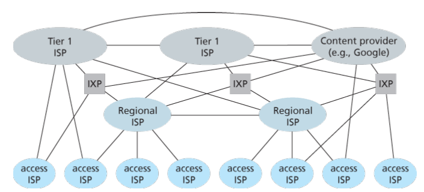

- 网络结构1：各种端系统使用上述的各种方式接入本地的ISP，并经过该ISP接入因特网，因此该ISP称为接入ISP（access ISP）。在第一种网络结构中，我们使用单一的全球传输ISP将所有接入ISP进行互联，其中接入ISP向全球传输ISP付费，故前者被认为是客户，后者被认为是提供商。

- 网络结构2：在网络结构1中全球传输ISP显然是过于理想化的，在网络结构2中，全球传输ISP被拆分为多个。

网络结构3：上述的两种结构都是两层结构，但是还是很理想化的，因为没有哪个ISP能够无处不在，相反，在任何给定的区域，可能有一个区域有一个区域ISP（regional ISP），区域中的接入ISP与之连接。而进一步每一个区域ISP与第一层ISP（tier-1 ISP）连接，全球范围内大约有十几个第一层ISP。

- 网络结构4：在网络结构3这样一个等计划的网络结构上添加部分额外的结构：
  - 存在点（Point of Presence PoP）：存在于等级结构的所有层次，但底层的接入ISP除外。一个PoP只是提供商网络中的一台或多台路由器（在相同位置）的群组，客户ISP能够在这里与提供商ISP连接。
  - 多宿（multi-home）：规定了任何ISP，除第一层以外，可以选择与两个或者更多提供商ISP连接，这种设置可以保障一个ISP出现故障时，它仍然能够继续发送和接受分组。
  - 对等（peer）：规定了位于同一等级结构层次的相邻一对ISP能够直接将它们的网络连接在一起，使它们之间的所有流量直接连接而不是通过上游的中间ISP传输。
  - 网络交换点（IXP Internet Exchange Point）：作为一个汇合点，多个ISP能够在这里一起对等。

- 网络结构5：在网络结构4之上增加内容提供商网络（Context Provider Network）构成了网络结构5。内容提供商能够使用专用网络与较低层的ISP对等，绕过较高层ISP。

## 时延、丢包与吞吐量

时延和丢包产生原因：

1. 分组到达输入链路的速率超出了输出链路的能力。
2. 分组队列，等待转发，因此产生了四种分组时延（下详）。

### 时延

1. 节点处理时延d~proc~
   - 检查比特错误。
   - 确定输出链路。
   - 通常是低于毫秒级别。
2. 排队时延d~queue~
   - 输出链路等待传输的时间。
   - 取决于路由器的拥塞程度。
3. 传输时延d~trans~
   - 分组长度L，链路带宽R，d~trans~=L/R。
4. 传播时延d~prop~
   - 物理链路长度d，媒体中的传播速度s，d~prop~=d/s。

### 排队时延的进一步讨论

设链路带宽为R（bps），分组长度L（bits），平均分组到达速率（a），则定义流量强度k=La/R。

- k~0：平均排队时延很小，甚至为0；
- k<1：时延较小，且会随着时间推延而变小；
- k=1：时延不会变化，具体数值取决于当时队列长度；
- k>1：平均时延较大，且随着时间推延而趋于无穷。

### 丢包

原因：缓存中队列的容量有限。当分组到达队列已满时，则分组被丢弃，即丢包。

丢失的分组可能会被前一个节点、源端系统重新传输，或者根本不重传。

- 吞吐量：在发送方与接收方之间传输比特的速率（bps）。
  - 瞬时吞吐量：接收方收到文件的瞬时速率。
  - 平均吞吐量：设接收方收到一个大小为F（bit）的文件，耗时T（s），则平均吞吐量为F/T（bps）。
- 瓶颈链路一般就是通路上上吞吐量最小的那一段链路，他限制了端到端平均吞吐量。

## 协议层次和服务模型

### 基本概念

- 实体（Entity）：实体是任何可以发送和接收信息的硬件和软件进程。通常是一个特定的软件模块。
- 对等体（Peer）：不同机器上包含对应层的实体称为对等体。
- 协议（Protocol）：
  - 语法，即数据与控制信息的结构或格式。
  - 语义，即需发现何种控制信息，完成何种动作以及做出何种应答。
  - 同步，即事件实现顺序的详细说明。
- 服务（Service）：为保证上层对等体之间能互相通信，下层向上层提供的功能。
- 服务原语（Service Primitive）：服务原语是指网络相邻层间进行交互时所要交换的一些**必要**命令。
- 服务访问点（SAP Service Access Point）：服务访问点是同一系统中相邻两层的实体进行交互的地方。
- 协议数据单元（PDU Protocol Data Unit）：协议数据单元是对等层次上传送数据的单位。
- 服务数据单元（SDU Service Data Unit）：服务数据单元是层与层之间交换数据的单位（通俗讲，当前层SDU就是上层PDU）。
- 网络体系结构（Network Architecture）：网络体系结构就是层和协议的集合。
- 协议栈（Protocol Stack）：一个特定的系统所使用的一组协议（每层一个协议）称为协议栈。

### 因特网的协议栈

- 应用层：支持网络应用（FTP，SMTP，FTTP）。
- 运输层：应用进程间数据传输（TCP，UDP）。
- 网络层：将数据包从源主机传到目标主机（网际协议IP，路由选择协议）。
- 链路层：数据在网络相邻结点之间传输（PPP，以太网协议）。
- 物理层：在线路上传输比特流。

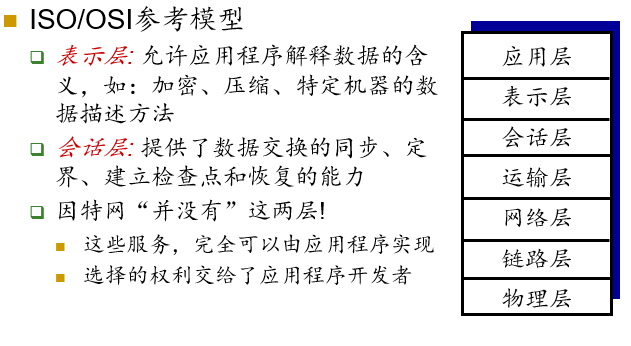

分层的理由：

- 显式的结构使得复杂系统的问题定位和不同组成部分之间的关联讨论成为可能，分层的参考模型(reference model) 可用于讨论。
- 模块化简化了系统的维护和升级，某个层次服务实现的改变对系统的其余部分是透明的。

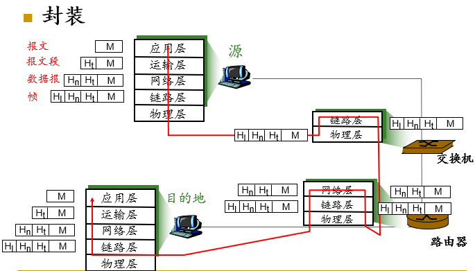

# 应用层

## 体系结构

### 客户机/服务器体系结构（C/S）

- 存在一个能够向客户机提供服务的服务器
- 存在一个或者多个主动连接服务器，试图从服务器那里获取所需服务的客户机
- 客户机之间不能互相通信
- 为提高服务器的处理能力，通常采用服务器群集

### P2P体系结构

- 任何一方既提供服务又享受服务
- 结点之间可以直接通信
- 结点的地址以及他们之间的连接可能随时发生变化
- 非常容易扩展，但也特别难以管理

### 混合体系结构

上述结构的混合

## 应用层协议

功能（定义了什么）：

- 交换的报文类型
- 各种报文类型的语法
- 字段的语义
- 进程何时、如何发送报文及对报文进行响应

网络应用需要的服务

1. 可靠传输
2. 吞吐量（带宽敏感应用与弹性应用）
3. 定时保证
4. 安全

可以使用的两种运输层服务

- TCP
  - 面向连接：在客户端和服务器进程之间需要建立连接
  - 可靠传输：在发送和接受进程之间
  - 流量控制：发送数据的速度决不超过接收的速度 
  - 拥塞控制：当网络超负荷时，束紧发送端口，减缓发送速度
  - 不提供：实时性, 最小带宽承诺

- UDP
  - 在客户端和服务器进程之间实现“不可靠的”数据传输
  - 不提供：连接建立, 可靠性保证，流量控制，拥塞控制，实时性，最小带宽承诺

安全性的保证：SSL安全套接字层

- 提供加密的TCP连接
- 数据的完整性检查
- 端点身份鉴别
- 位于应用层和TCP之间

## 套接字（Socket）

每个网络应用进程都有一个属于自己的套接字，该套接字在整个因特网上独一无二

- 主机地址：标识该网络应用进程运行在因特网上哪一台主机上，通常使用32位的IP地址进行标识

- 端口地址：在该主机上标识该网络应用进程，通常使用16位的端口号进行标识

- 套接字的长度为48位
- 进程通过套接字来接收和发送报文
- 套接字相当于一个通道
  - 发送进程将报文交给套接字
  - 套接字将这些报文传输到接收进程的套接字

## HTTP

- HTTP1.0——非持久性连接

  - 取对象需要2 RTTs

    - TCP 连接，服务器端口一般是80

    - 对象请求/传送

  - 总时间=2RTT+文件传输时间

  - 许多浏览器同时打开多个并行的连接来改善性能

- HTTP1.1——持久连接

  - 服务器在发送响应后，不再断开TCP连接，而是保持该连接，用于后续对象的传送，直至该连接“休息”了一个较长的时间后，方断开该连接
  - 减少了对服务器端连接数的需要，从而减少了对服务器端套接字资源的占用，提高了服务器的负载能力

- 持久连接又可以分为

  - 非流水线方式：一个对象传输完成方能传输下一个

  - 流水线方式：可以一次性发送所有请求，慢慢接收

### HTTP请求报文

#### HTTP1.0 定义的方法

- GET
  - 向服务器请求指定URL的对象

- POST
  - 用于向服务器提交表单数据
  - 也可以同时请求一个WEB页面
  - 特别注意：可以不使用POST方法，而使用GET方法发送表单数据以获取新的WEB页面。e.g. 搜索引擎

- HEAD
  - 请求服务器返回一个响应报文，但是该报文中并不包含请求的对象。该方法常常用来进行故障跟踪。

#### HTTP1.1 新定义的方法

- PUT
  - 上传的文件放在实体主体字段中，目标路径由URL字段标明
- DELETE
  - 删除URL字段中指定的文件
- 另一种上传数据的方式
  - 使用GET方法
  - 将需要上传的数据放到URL中
  - www.somesite.com/animalsearch?monkeys&banana

### HTTP相应报文

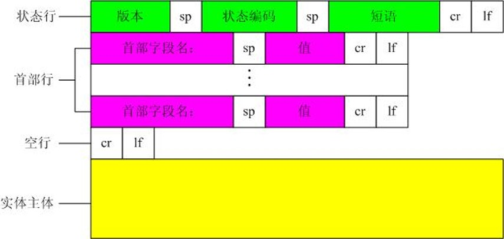

#### HTTP响应状态码

- 200 OK
  - 请求成功, 被请求的对象在报文中

- 301 Moved Permanently
  - 被请求的对象被移动过, 新的位置在报文中有说明 (Location:)
- 400 Bad Request
  - 服务器不懂请求报文
- 404 Not Found
  - 服务器上找不到请求的对象
- 505 HTTP Version Not Supported
  - 服务器不支持请求报文使用的HTTP协议版本

### Cookie

- WEB站点使用Cookie的目的
  - 限制用户的访问
  - 把内容和用户身份关联起来

- Cookie技术的组成部分:
  - 在HTTP响应报文中有一个Cookie首部行
  - 在HTTP请求报文中也有一个Cookie首部行
  - 在用户的端系统中保留了一个Cookie文件，由用户浏览器负责管理
  - 在Web站点有一个后端数据库

### SMTP（Simple Mail Transmission Protocol）

==（TODO）==

## 获取邮件

==（TODO）==

## DNS（Domain Name Sever）

==（TODO）==

## P2P

==（TODO）==

## CDN（Content Deliver Network）

==（TODO）==

# 运输层

[课件](./img/运输层.pdf)

# 网络层

## 概述

目标：实现主机到主机的通信。

服务：为运输层提供支持。

功能：

- 选路：确定分组从源到目的地所采取的端到端路径的网络范围处理过程。在全局范畴为主机之间的通信进行选路，结果反映为分组交换机上的转发表。

- 转发：将分组从一个输入链路接口转移到适当输出链路接口的路由器本地动作。分组交换机上的网络层根据转发表以及分组头部的信息，将分组向适当的链路进行转发。（接口：主机与物理链路之间的边界）

- 状态通知：通过控制消息感知网络是否发生故障（如网络是否畅通，主机是否可达，路由是否可用）。

分组交换机分类：

- 链路层交换机：根据链路层首部信息进行转发。
- 路由器：根据网络层首部信息进行转发。

### 网络服务模型

可能的服务：

- 确保交付
- 具有时延上界的确保交付
- 有序分组交付
- 确保最小带宽
- 安全性

### 实际使用的网络层服务模型

| 网络体系结构 | 服务模型                  | 带宽保证     | 无丢失保证 | 排序 | 定时   | 拥塞指示 |
| ------------ | ------------------------- | ------------ | ---------- | ---- | ------ | -------- |
| 因特网       | 尽力而为                  | 无           | 无         | 无   | 不维持 | 无       |
| ATM          | CBR（Constant Bit Rate）  | 保证恒定速率 | 是         | 有序 | 维持   | 无拥塞   |
| ATM          | ABR（Available Bit Rate） | 保证最小速率 | 无         | 有序 | 维持   | 提供指示 |

## 虚电路与数据报

### 虚电路
目标：使收发双方之间的路径表现得如同电话线路一般。

工作机制：

- 数据开始流动之前，呼叫建立；流动结束后要断开。

- 每一个分组携带虚电路的标识 (而不是目的主机的地址)。

- 路径上的每一个路由器必须为进行中的连接维持连接状态信息。
  - 传输层的连接仅涉及到两个端系统（end system）。

- 链路，路由器资源 (带宽、缓冲区) 可以分配给虚电路。
  - 目的：为了达到类似线路交换的性能，路由器维持连接状态信息。

组成：

- 从源到目的主机的路径。
- VC号，沿该路径的每端链路的一个号码。
- 沿该路径的每台路由器的转发表。

信令协议：

- 用于建立、维护以及断开虚电路。
- 用于ATM（Asynchronous Transfer Mode）异步传输模式，帧中继，X.25网络。
- **今天的因特网已经不再使用**。

### 数据报
特点：

- 网络层没有连接建立过程。
- 路由器不再维护连接状态信息。
- 传输报文时，使用该目的主机地址信息，同一对主机间的数据报可能会走不同的路径。
- 互联不同类型的网络更加容易。
- 启用新的服务的速度更快，更简单。

## 路由器的结构

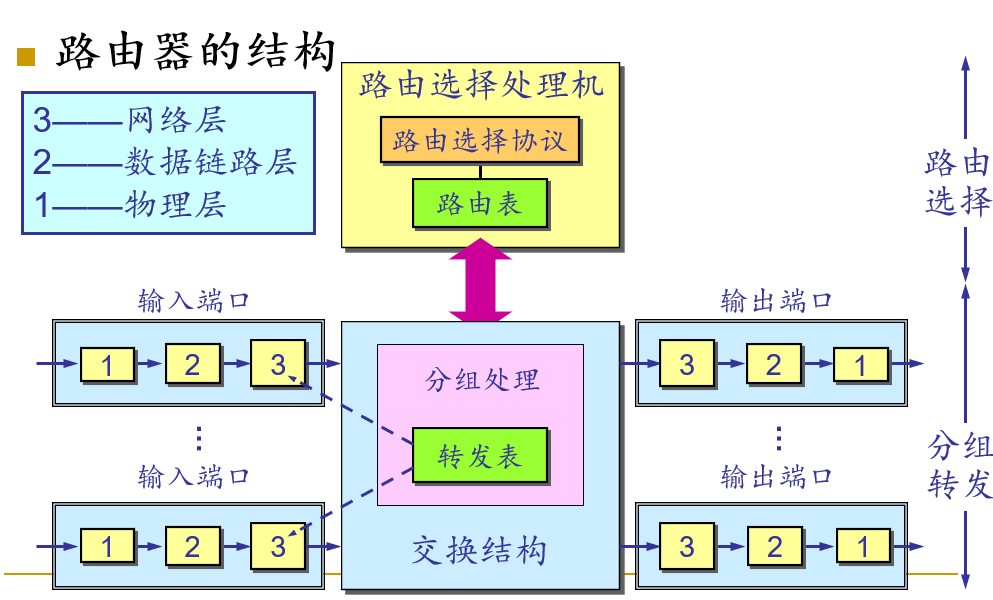

==（TODO）==

## 网际协议——转发与编址
### IP地址

#### IPv4

- 32bit主机或路由器的接口标志符，只与接口有关。

- 表示方法：点分十进制

- 分类编址：

  

- 面临的问题：
  - 地址空间消耗完了。
  - 首部长度不定，中间结点需要消耗相当的资源用于分组处理。
  - 缺少QoS（Quality of Service）。
  - 安全性不高。

#### IPv6

- 128bit
- 定长首部，40字节
- 流标签。
- ==（TODO）==

#### 从IPv4到IPv6的迁移

1. 宣布标志日，统一迁移
2. 双栈技术。
   - 新加入的设备支持双协议栈，一段链路如果源和目标均支持IPv6，则使用IPv6；任意一方不支持，则用IPv4。
   - 存在信息丢失的可能性。
3. 隧道技术。

### IPv4数据报格式

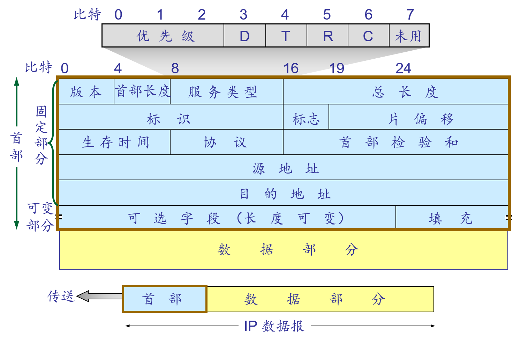

版本：4bit，如IPv4、IPv6。

服务类型：8bit，用于保证服务质量。

生存时间：分组寿命管理，每当一台路由器处理数据报时，该字段的值减1；减到0，则该分组必须丢弃。

首部检验和：16bit，只检查首部。

协议：8bit，用于标识运输层或网络层协议。

源地址、目的地址：32bit。

首部长度：4bit，单位4字节，取值范围5-15，即20-60字节。

总长度：16bit，取值范围0-65535，故理论最大长度为65535字节，但与链路层的支持相关，以太网链路MTU为1500字节。实际报文数据长度为总长度减去首部长度。

标识：16bit，网络层服务的上层传输层的同一次报文，使用相同标记，相当于每次会话使用相同标识。

标志：3bit，第1位保留，第2位标识是否能分片，第3位标识分片是否结束（1为未结束，0为结束）。

片偏移：13bit，单位8字节，该分片在分组中的偏移。

### 数据报分片实例

注：IPv6不允许路由器对分组分片。

假设有4000字节的数据报（数据字段含3980字节，首部20字节），MTU=1500字节，则分片如下：

1. 总长度：1500 = 20 + 1480，标识：x，标志：1，片偏移：0
2. 总长度：1500 = 20 + 1480，标识：x，标志：1，片偏移：185 = 1480 / 8
3. 总长度：1040 = 20 + 1020，标识：x，标志：0，片偏移：370 = 2960 / 8

### 子网划分

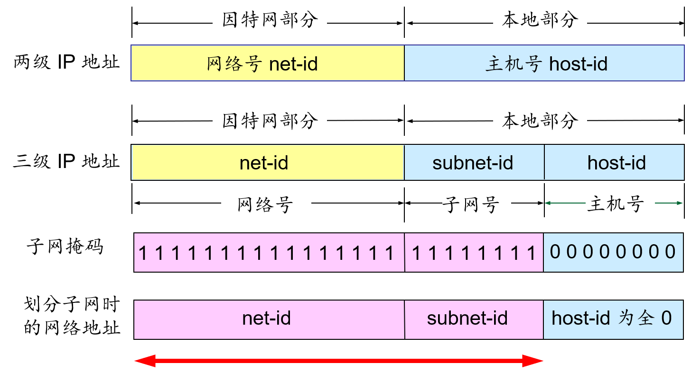

IP地址与子网掩码按位与即可得到网络地址。

#### 地址聚合

使用单个网络前缀通告多个网络的能力。

地址聚合针对层次型分配的IP地址极为有效。

### CIDR（Classless InterDomain Routing）

格式：`IP Addr ::= {<Net-Prefix>, <Host-ID>}`

表示法：

- 斜线记法：`192.168.0.1/24`
- 简写记法：`10.0.0.0/10 -> 10/10`

最长前缀匹配：

- 使用 CIDR 时，路由表中的每个项目由“网络前缀”和“下一跳地址”组成。在查找路由表时可能会得到不止一个匹配结果。

- 应当从匹配结果中选择具有最长网络前缀的路由：最长前缀匹配(longest-prefix matching)。

- 网络前缀越长，其地址块就越小，因而路由就越具体。

### DHCP（Dynamic Host Configuration Protocol）

- 即插即用-零配置
- 步骤：
  - DHCP服务器发现
  - DHCP服务器提供
  - DHCP请求
  - DHCP ACK
- 注意：每一步目标地址都是广播地址。
- ==（TODO）==

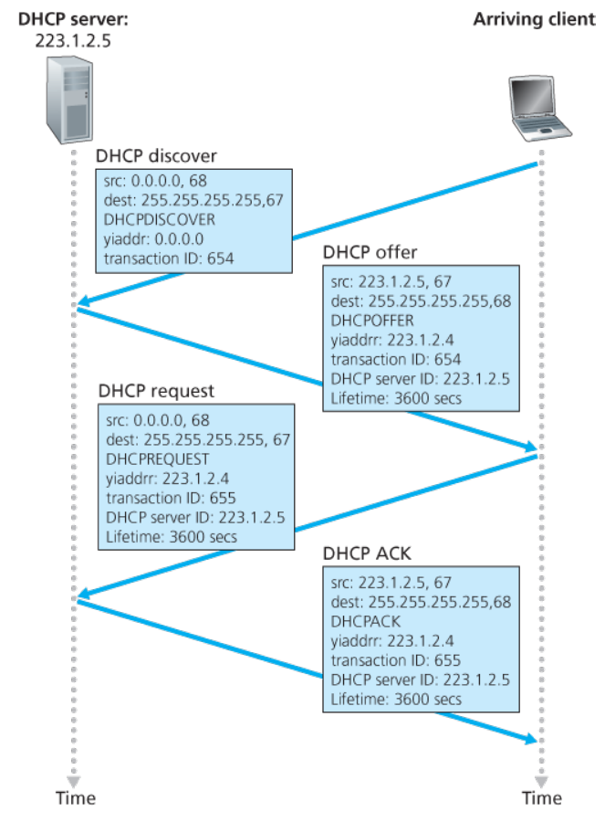

### NAT（Network Address Translation）

- 本地网络只要使用一个IP地址就可以和外部网络相连，包含两类地址：本地地址和全球地址。
  - 不需要从ISP处获得大批IP地址：所有设备可以使用同一个 IP地址。
  - 可以在不通知外部网络的情况下改变内网主机的IP地址。
  - 即使改变了ISP也无须改变内网主机的IP地址。

  - 内网主机对外网主机而言是不可见的、不可寻址的。（这也算是一项安全措施）。

- 实现：
  - 发送数据报：将每个外出报文的源IP地址，源端口号替换为NAT的IP地址以及新的端口号。记住每一个地址转换对（记录在 NAT 转换表中），即`<src IP Addr, src Port> -----> <NAT IP Addr, NAT Port>`
  - 接收数据报：根据NAT转换表将每个进入报文的`<NAT IP Addr, NAT Port>`替换为相应的`<src IP Addr, src Port>`

- 争议：

  - 端口号是用于进程编址的，而不是用于主机编址的。

  - 路由器应当仅处理高达第三层的分组。

  - NAT协议违反了端到端原则，即主机彼此应相互直接对话，节点不应介入修改IP地址和端口号。

  - 应使用IPv6来解决IP地址短缺问题。

- 转换方式：
  - 静态：一个本地地址对应一个全球地址。
  - 动态：一个全球地址对应多个本地地址。
  - 端口：一个本地地址的端口对应一个全球地址的端口。

- 外网主机访问内网主机的解决方案：
  - 使用端口NAT：在路由器中静态地为内网主机配置一条记录。
  - 通用即插即用（UPnP）：==（TODO）==
  - 中继：如Skype

### ICMP（Internet Control Message Protocol）

- 用于主机、路由器、网关之间交换网络层信息。
  - 错误报告：如主机、网络、端口、协议不可达等。
  - 回声请求/回答（用于**ping**应用程序）。

- 从体系结构而言，位于IP层之上，ICMP报文封装在IP分组中。

- ICMP消息：包括一个类型字段和一个编码字段。

- ICMP报文的种类有两种，即ICMP差错报告报文和ICMP询问报文。

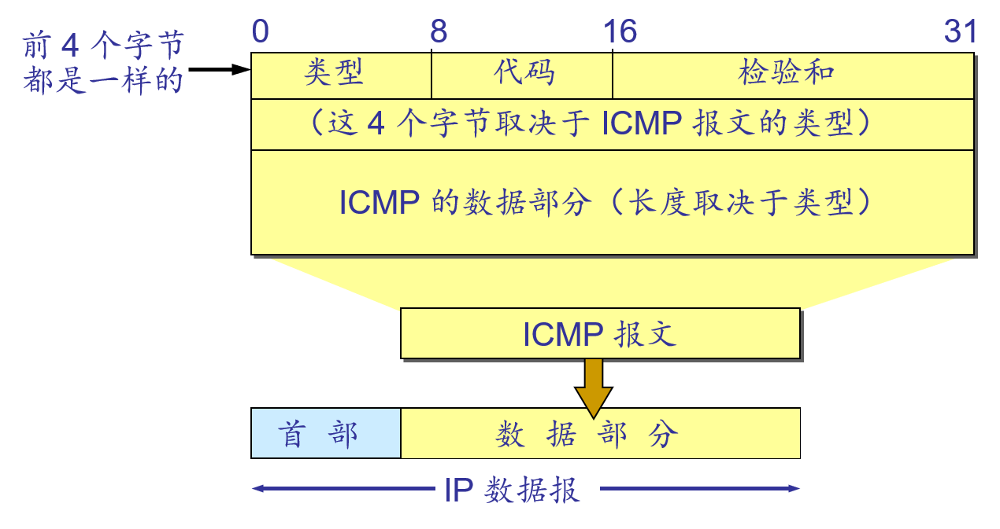

==（TODO）==

### SDN（Software-Defined Networking）

==（TODO）==

## 路由协议

### 选路算法

给定一组路由器以及连接路由器的链路，从中找到一条从源路由器到目标路由器“好的”路径，“好的”通常指具有最低费用的路径。

- 全局选路算法
  - 所有路由器都知道整个网络拓扑图以及链路的费用信息
  - 链路状态算法

- 分散式选路算法
  - 每个路由器仅有与其相连链路的费用信息
  - 通过迭代计算过程与相邻节点交换信息
  - 距离向量算法

- 静态选路算法
  - 随着时间的流逝，路由的变化非常缓
- 动态选路算法
  - 路由信息可以更快地发生变化
  - 周期性的更新
  - 可以响应拓扑或链路费用的变化
- 负载敏感算法
  - 链路费用会动态地变化以反映出链路的当前状况

- 负载迟钝算法
  - 链路费用不明显地反映链路的当前状况

### 链路状态（link state）选路算法

#### Dijkstra算法

- 所有节点都知道网络拓扑和链路费用
  - 通过链路状态广播获得信息
  - 所有节点具有该网络的同一个完整的视图

- 计算从某节点到网络中所有其他节点的最低费用
  - 为该节点提供转发表
- 迭代：经算法的K次迭代后，可知道到K个目的节点的最低费用路径

- O(n^2^)-------O(nlogn)
- 问题：当链路费用依赖于流量时，容易产生震荡。
- 解决方案：
  - 强制链路费用不依赖于所承载的流量
    - 无法解决高拥塞的问题，不可接受
  - 确保所有的路由器不同时运行LS算法
    - 因特网上的路由器能够自同步
    - 随机化路由器发送链路通告的时间

#### OSPF协议

- 一种分布式链路状态协议
- 洪泛链路状态信息和Dijkstra最低开销路径算法
- 发送的信息就是与本路由器相邻的所有路由器的链路状态
- 每当链路状态发生变化时，路由器才用洪泛法向所有路由器发送此信息  
- 更新过程收敛得快

- 不强制如何设置链路权值的策略，但提供对给定链路权值集合确定最低费用路径的机制

- 即使链路状态未发生变化，每30分钟广播一次链路状态

- 链路状态以OSPF通告的形式封装在OSPF报文中，由IP分组承载（协议号：89）

- OSPF路由器之间的交换都是经过鉴别的（简单的、MD5的），以确认OSPF通告的真实性，防止伪造和篡改

- OSPF通告都是有序列号的，以防止重放攻击

- OSPF中支持多条具有相同费用的路径

- OSPF支持多播选路和层次路由

### 距离向量（Distance Vector）选路算法

#### 距离向量算法

- 主要特点：迭代式、异步、分布式、自我终止式

- Bellman-Ford公式

$$
d_x(y) = \min_v\{c(x,v) + d_v(y)\}
$$

- 每个路由器中都有一张路由表，包含三个内容：目的网络号、经过的邻居路由器、距离。路由器定期向其邻居路由器传送路由表的拷贝

- 路由表的更新算法：
  - 路由器X得到相邻路由器Y的路由表，从而得知：Y到网络Z的最短距离为N
  - 如果路由器X没有到网络Z的路由条目，则添加一条经由路由器Y到网络Z距离N+1的路由条目
  - 如果路由器X已有到网络Z的路由条目，其距离为M，如果M>N+1，则更新该条目为经由路由器Y到网络Z距离N+1，否则不更新

- 特点：好消息传得快，坏消息传的慢。
- 问题：无穷计数、路由环路
- 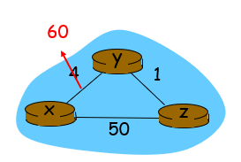

- 解决方案：毒性逆转
  - 对于坏消息，直接将距离置为无穷大。
  - 但毒性逆转不能解决无穷计数问题。

#### RIP协议

- 相邻两点间链路上的费用定义为1，即只考虑源到目标经过多少个路由器，或多少“跳”

- 一条路径的最大费用限制为15

- 选路更新消息每30s在邻居之间以RIP响应报文（RIP通告）的形式进行交换

- 路由器经过180s没有收到来自某个邻居的RIP通告，则认为该邻居已离线，修改选路表，向其它邻居广播

- RIP是一个运行在UDP上的应用层协议（端口520）

### 比较

- 报文的复杂性
  - LS：需要发送 O(|V||E|)个报文 
  - DV：只在直连的邻居之间交换报文
- 收敛速度
  - 算法收敛时间依赖于许多因素，因而是可变的
  - LS：是一个要求O(nE)个报文的O(n^2^) 算法
    - 可能有震荡
  - DV：收敛时间不确定
    - 可能会遇到选路环路
    - 记数到无穷问题
- 健壮性
  - LS：
    - 节点能够向其连接的链路广播不正确费用
    - 每个节点只计算自己的转发表
  - DV：
    - 一个节点可向任意或所有目的节点通告其不正确的最低费用路径
    - 每个节点的计算都会传递给它的邻居
      - 错误会通过网络进行传播

### 层次路由

问题背景：

- 因特网规模过大——数亿个目标网络
  - 路由器无法存储每台主机的选路信息
  - 路由表更新的报文广播将导致无剩余带宽供发送数据使用

- 管理自治
  - 因特网 = 网络的网络
  - 每个网络管理员可能希望能够按照自己的愿望运行和管理其网络

解决方法：

- 将路由器聚合到一个区域，“自治系统”，Autonomous System
- 在相同AS内的路由器可全部运行同样的选路算法
  - 自治系统内部选路协议（intra-autonomous system routing protocol）
    - 内部网关协议 IGP (Interior Gateway Protocol)  目前这类路由选择协议使用得最多，如 RIP 和 OSPF 协议。
  - 在不同AS内的路由器可以运行不同的自治系统内部选路协议

#### 层次OSPF

- 为了使 OSPF 能够用于规模很大的网络，OSPF 将一个自治系统再划分为若干个更小的范围，叫作区域

- 每一个区域都有一个 32 bit 的区域标识符

- 区域也不能太大，在一个区域内的路由器最好不超过 200 个
- 划分区域的好处就是将利用洪泛法交换链路状态信息的范围局限于每一个区域而不是整个的自治系统，这就减少了整个网络上的通信量。
- 在一个区域内部的路由器只知道本区域的完整网络拓扑，而不知道其他区域的网络拓扑的情况。
- OSPF 使用层次结构的区域划分。在上层的区域叫作主干区域(backbone area)。主干区域的标识符规定为0.0.0.0。主干区域的作用是用来连通其他在下层的区域。 

### BGP（Broder Gateway Protocol）

==（TODO）==

# 链路层

## 概述

数据链路层负责将数据报通过链路从一个节点传输到物理上相邻的下一个节点。

- 节点：主机和路由器

- 链路：沿着通信路径连接相邻节点的通信信道
  - 有线链路
  - 无线链路

- 帧：数据链路层的分组单元

注：

- 数据报在不同链路上可能由不同的链路层协议进行处理
  - 例如：第一段链路上由PPP处理，最后一段链路上由以太网处理，中间链路上由广域链路层协议处理

- 不同的链路层协议可能提供不同的服务
  - 例如：可靠传递、不可靠传递

### 服务

- 成帧 、链路访问
  - 将数据加上头部和尾部，封装成数据帧
  - 共享介质的信道访问
  - 帧头部用MAC地址标识源和目的（不同于IP地址）

- 可靠传递
  - 很少用于误码率低的链路（光纤、双绞线链路）
  - 用于误码率高的链路（无线链路）

- 流量控制
  - 在相邻的收发节点间限制流量

- 差错检测

  - 信号衰减和电磁干扰噪声导致出错

  - 接收方检测到错误存在：给发送方发送信号要求重传或丢弃该数据帧

- 差错纠正

  - 接收方检测和纠正帧中错误，不用重传

- 半双工和全双工

  - 半双工时，链路两端的节点都能传输分组，但不能同时传输

### 实现

- 在每一台设备上（主机、交换机、路由器）

- 链路层在“适配器”（网卡NIC）或者芯片上实现

- 直接与主机的系统总线相连

- 是硬件、软件和固件的结合体

### 链路

- 点到点链路
  - PPP/以太网交换机和主机之间的点到点链路

- 广播链路（共享线路或介质）
  - 传统以太网/HFC/802.11无线LAN

### 适配器通信

- 发送方
  - 在一个帧内封装数据报
  - 增加差错检测位，可靠交付，流量检测等

- 接收方
  - 查找错误,可靠交付, 流量控制等
  - 取出数据报，交给网络层

- 适配器是半自治单元
  - 帧的接收和发送、检错、丢弃均是自主进行
  - 向上提交数据时，需要节点干预
  - 最终受控于节点

## 差错检测

### 因特网检查和

- 发送方
  - 将数据段的内容作为16比特的整数序列
  - 校验和：累加求和，计算和的1的补码
  - 发送方将得到的校验和值放入PDU校验和字段

- 接收方
  - 计算收到的数据段的校验和
  - 检查计算出的校验和与校验和字段中的值是否相同:
  - NO – 检测到错误
  - YES – 没有错误

- 特别注意：仅用于TCP、UDP和IPv4协议中

### CRC

略。

## 多路访问链路和协议

- 广播链路的特点
  - 单个共享广播信道
  - 两个或多个节点同时传输：相互干扰
    - 碰撞：一个节点同时收到两个或多个信号

- 多址访问协议
  - 分布式算法决定节点如何共享信道，如节点何时可以传输数据
  - 特别注意：有关共享信道的通信（协商）需使用信道本身
    - 没有额外的信道来进行协调

- 理想的多址访问协议
  - 假定：信道为速率为R b/s的广播信道
  - 当只有一个节点有数据发送时，该节点的吞吐量为R
  - 当M个节点有数据发送时，每个节点吞吐量为R/M
  - 全分散控制
  - 没有特定节点用于调整传输
  - 没有时钟同步
  - 简单

- 多址访问协议分类
  - 信道划分协议
    - 将信道划分成小的“片”（时隙、频率、编码）
    - 将“片”分配给节点使用
  - 随机访问协议
    - 信道没有被分割，允许碰撞
    - 碰撞恢复
  - 轮流协议
    - 节点轮流传送，但数据量大的节点轮流更长时间

### 信道划分协议

- TDMA(Time Division Multiple Access)
  - 循环访问信道
  - 每个节点在每次循环中得到固定长度的时隙（时隙长度＝传输单个分组时间）
  - 没有数据发送的时隙空闲

- FDMA(Frequence Division Multiple Access)
  - 信道按频谱分成若干频段
  - 每个节点分配固定频段
  - 在频段不用时该部分信道被闲置和浪费

### 随机访问协议

- 当节点有数据发送时
  - 以信道全部速率R传输
  - 没有主节点起协调作用

- 两个或多个节点传送时——碰撞

- 随机访问协议解决

  - 如何检测碰撞

  - 如何从碰撞中恢复（如：延时后重传）

- ALOHA
  - 网络拓扑采用了星型结构
  - 为节省费用和易于组网，网络中各站点的通信采用了无线传输介质。
  - 采用无线电信道，考虑到无法申请更多的频率点，因而所有站点都使用统一的频率通过主机交换信息。
  - P（给定节点发送成功概率） = 1/2e = 0.18
- 时隙ALOHA
  - P（给定节点发送成功概率） = 1/e = 0.37

- CSMA（Carrier Sense Multiple Access）
  - 传输前监听，如果信道空闲，传送整个帧；如果信道忙，推迟传送
  - 非坚持
    - 一旦监听到信道忙（即发现有其他站在发送数据），就不再坚持听下去，而是根据协议的算法延迟一个随机的时间后重新再监听。若进行载波监听时发现信道空闲，则将准备好的帧发送出去。
    - 不能充分利用信道刚刚转入空闲期的这段时间。
  - 时隙非坚持
    - 采用划分时隙的随机接入CSMA协议，协议规定只能在每个时隙开始时才能发送帧。
  - 1坚持
    - 当一个站点要传送数据时，首先侦听信道，看是否有其他站点正在传送。如果信道正忙，它就持续等待直到它侦听到信道空闲时，便将数据送出。若发生冲突，站点就等待一个随机长的时间，然后重新开始。
    - 容易在上述这段时间产生冲突。
  - P坚持
    - 当一个站点要传送数据时，首先侦听信道，看是否有其他站点正在传送。如果信道正忙，它就持续等待直到它侦听到信道空闲时，以概率P发送数据，而以概率（1－P）延迟一段时间τ(网络中最远的端到端的传播时延)，重新监听信道。若发生冲突，站点就等待一个随机长的时间，然后重新开始。
    - 可以在一定程度上克服这些缺点，但却很难选择一个能用于各种通信量强度的P值。所以在实际网络中常选择1坚持。

- CSMA/CD

  - 在短时间内碰撞被检测

    - 在有线LANs中比较容易：测量信号强度，比较收、发的信号
    - 在无线LANs中比较困难：传输时接收器是关闭的

  - 碰撞后停止传输，减少信道浪费

  - 强化碰撞

    - 当发送数据的站一旦发现发生了碰撞时，除了立即停止发送数据外，还要再继续发送若干比特的人为干扰信号(jamming signal)，以便让所有用户都知道现在已经发生了碰撞。

  - 争用期

    - 最先发送数据帧的站，在发送数据帧后至多经过时间 2*t* （两倍的端到端时延）就可知道发送的数据帧是否遭受了碰撞。

    - 以太网的端到端往返时延 2*t* 称为争用期，或碰撞窗口。

    - 经过争用期这段时间还没有检测到碰撞，才能肯定这次发送不会发生碰撞。

### 轮流协议

- 轮询协议
  - 主节点邀请从节点轮流传输
  - 关注
    - 轮询开销
    - 等待时间
    - 单点失效（主节点）

- 令牌传递协议
  - 控制令牌一次通过各个节点
  - 令牌报文
  - 关注
    - 令牌开销
    - 等待时间
    - 单点失效（token）

## MAC地址

作用：在数据链路层标识每块网络适配器，使得能够在广播信道上寻址目标节点

构成：48bit（e.g.: 1A-2F-BB-76-09-AD）

- 前24bit由IEEE分配管理——OUI号

- 后24bit由厂商自行分配

特别注意：MAC地址烧入网络适配器的ROM中，不可更改

## 地址解析协议（ARP Address Resolution Protocol）

目标：根据目标的IP地址获取其MAC地址

ARP高速缓存：局域网结点的IP/MAC地址映射：`<IP, MAC, TTL>`（TTL，Time To Live：超过TTL的地址映射会被删除）。

## 以太网

类型：总线式和交换式

服务：

- 无连接服务：在送适配器和接收适配器之间不需要握手
- 不可靠服务：接收适配器不发送确认帧或否认帧给发送方

### 帧结构

- 数据字段：（46字节+1500字节）

- 

- 前同步码：

  - 总共8字节，前7 字节的格式为 10101010 ，最后一个字节格式为10101011

  - 用于同步发送方与接收方时钟

- 地址

  - 6字节，若适配器收到以太网帧，目的地址为自己的MAC地址或广播地址（如ARP包），就将帧中的数据传给网络层。否则，适配器丢弃该帧

- 类型：

  - 上层协议类型（大多为IP协议，也支持其它协议如Novell IPX 和AppleTalk）

- CRC：

  - 由接收方检查，若检测到错误，就将该帧丢弃

### 以太网使用的CSMA/CD

- 特点
  - 没有时隙
  - 当适配器侦听到其它适配器在传输，则它不传输帧，即载波侦听
  - 正在传输的适配器若检测到其它适配器也在传输，则它中止自己的传输，即碰撞检测
  - 在重新传输之前，适配器要等待一段随机时间，即随机回退

- 算法
  - 适配器收到来自网络层的数据报，创建帧
  - 若适配器检测到信道空闲，则开始传输帧；若检测到信道忙，就开始等待，直到信道空闲再开始传输该帧
  - 若适配器传输了整个帧而没有检测到其它适配器的传输，则该适配器完成该帧的传输
  - 若适配器在传输时检测到其它适配器也在传输，则停止传输，发送拥塞信号
  - 中止传输后，适配器进入指数回退阶段，在经历第m次碰撞后，适配器随机从{0,1,2,…,2^m^-1}中选择K值。适配器在等待 K·512比特时间后，返回第2步

- 拥塞信号：用来确保所有传输者都能检测到碰撞而传输的信号；48比特长

- 比特时间：传输1比特所需时间。在10Mbps的以太网中，当K=1023时，等待时间大约为50ms

- 指数回退算法：

  - 目的：适配器重传时试图估计正确的负载
  - 重载：随机等待的时间可能会更长

  - 第一次碰撞: 从 {0,1}中选择K; 延迟是 K· 512 比特传输时间

  - 第二次碰撞后: 从 {0,1,2,3}中选择K
  - 第十次碰撞后: 从 {0,1,2,3,4,…,1023}中选择K

- 重要特性
  - 使用 CSMA/CD 协议的以太网不能进行全双工通信而只能进行双向交替通信（半双工通信）。
  - 每个站在发送数据之后的一小段时间内，存在着遭遇碰撞的可能性。这种发送的不确定性使整个以太网的平均通信量远小于以太网的最高数据率。
  - 争用期长度
    - 以太网取 51.2 $\mu s$ 为争用期的长度。
    - 对于 10 Mb/s 以太网，在争用期内可发送512 bit，即 64 字节。
    - 以太网在发送数据时，若前 64 字节没有发生碰撞，则后续的数据就不会发生碰撞。
  - 最短有效帧长
    - 如果发生碰撞，就一定是在发送的前 64 字节之内。
    - 由于一检测到碰撞就立即中止发送，这时已经发送出去的数据一定小于 64 字节。
    - 以太网规定了最短有效帧长为 64 字节，凡长度小于 64 字节的帧都是由于冲突而异常中止的无效帧。

## 交换机和集线器

==（TODO）==

# 无线网络

## 概述

- 无线主机

  - 可以是便携机，PDA，IP 电话
  - 能运行程序
  - 本身既可能是固定，也可能是移动的

- 无线链路

  - 典型的作用是用于连接无线主机和基站
  - 也可以用于骨干链路

  - 与链路访问相匹配的多址访问协议

  - 多种数据传输速率和传输距离

- 基站

  - 典型的作用是用于连接无线网络
  - 负责向其覆盖范围内的主机发送和接收分组，在无线网络和无线主机之间起链路层中继作用。如：蜂窝塔、802.11 接入点

- 基础设施模式

  - 无线局域网可分为两大类：有固定基础设施和自组网络(ad hoc 网络) 。
  - 基础设施模式是指预先建立起来的、能够覆盖一定地理范围的一批固定基站
  - 移动主机通过基站接入有线网络

- 关联

  - 无线主机位于某个基站的无线通信覆盖范围内

  - 该主机使用该基站中继它与更大网络之间的数据

- 切换

  - 当一台移动主机移动范围超出一个基站的覆盖范围而到达另一个基站的覆盖范围后，它将改变其接入更大网络的连接点

- Ad hoc 网络
  - 无基站
  - 节点（移动主机）仅仅能够在其覆盖范围内向其他节点传送数据
  - 节点之间相互通信组成的临时网络:在它们内部进行选路和地址分配。

## 无线链路

特征

- 递减的信号强度

- 来自其他源的干扰

- 多径传播

无线链路中的比特差错比有限链路中更为常见，因此采用CRC进行帧校验，采用ARQ协议进行重传。

- SNR——信噪比
- BER——比特差错率
- 对于给定的调制方案，SNR越高，BER越低
- 对于给定的SNR，具有较高比特传输率的调制技术将具有较高的BER

无线链路中的问题：

- 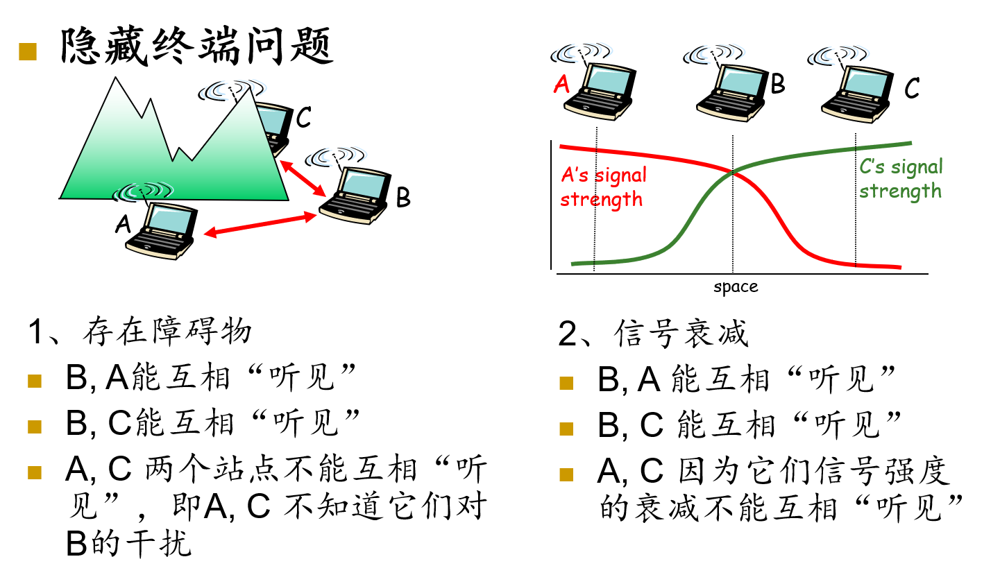

## CDMA

- 每个用户可以在同样的时间内用相同的频带进行通信。由于各用户使用经过特殊挑选的不同码型，因此不会造成干扰。这种通信信号具有很高的抗干扰能力。

- 每个用户被指派一个惟一的m bit码片序列

- 所有用户共享相同的频道，但每个用户用自己的“码片”序列对数据编码

- 当站点发送比特“1”时，就发送指定给该站点的m bit码片序列；发送比特“0”时，发送此m bit码片序列的二进制反码
  - 习惯上，将码片序列中的“0”写成“-1”，“1”写成“+1”

- 允许多个用户共存和发送信号,且相互的干扰极小

- CDMA码片序列的特点：每一个站的码片序列各不相同，互相正交。
  - 任何两个站点（如S和T站点）的码片向量的规格化内积为0。
  - 任何码片向量和自己的规格化内积为1。
  - 任何码片向量和其反码的规格化内积为-1。

## 802.11协议簇

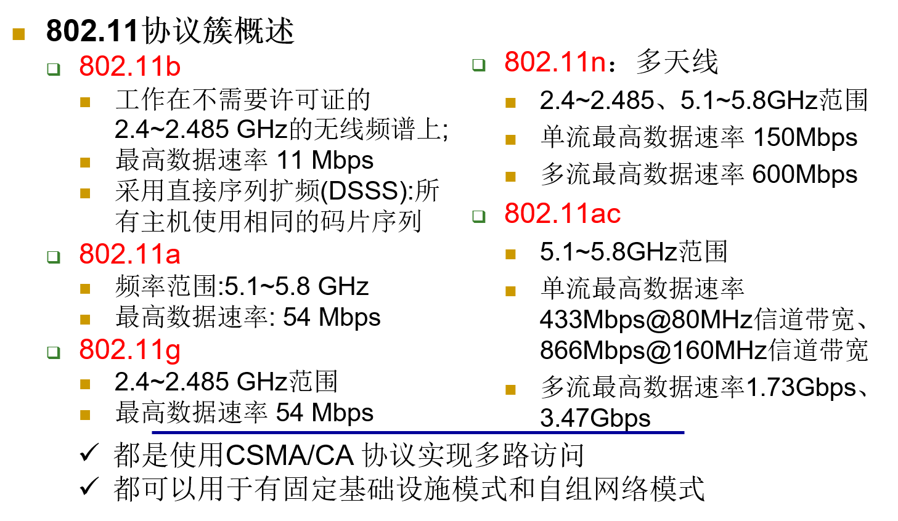

- 802.11体系结构
  - 无线终端通过基站（AP）进行通信
  - 基本服务集BSS包括
    - 无线终端
    - 基站AP
    - Ad hoc模式下只有终端

- 802.11b的信道划分
  - 2.4GHz—2.485GHz，共85MHz，划分为11个部分重叠的信道集
  - 两个信道仅当中间相隔4个及以上的信道时，无重叠
  - 1、6、11三个信道不重叠，可同时工作

- 802.11b中主机关联AP的过程
  - 每个AP周期性发送信标帧，包括AP的SSID和MAC
  - 主机对11个信道进行扫描，获取所有可用的AP的信标帧
  - 主机选择其中一个AP进行关联，加入其所属子网
  - 主机向关联AP发送DHCP发现报文，获取IP地址
  - 可能需要身份鉴别
- 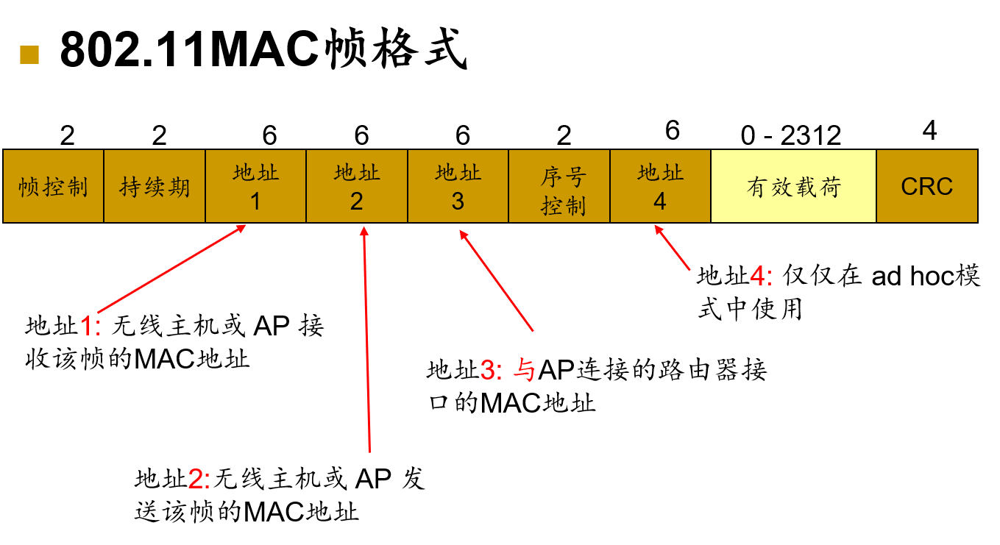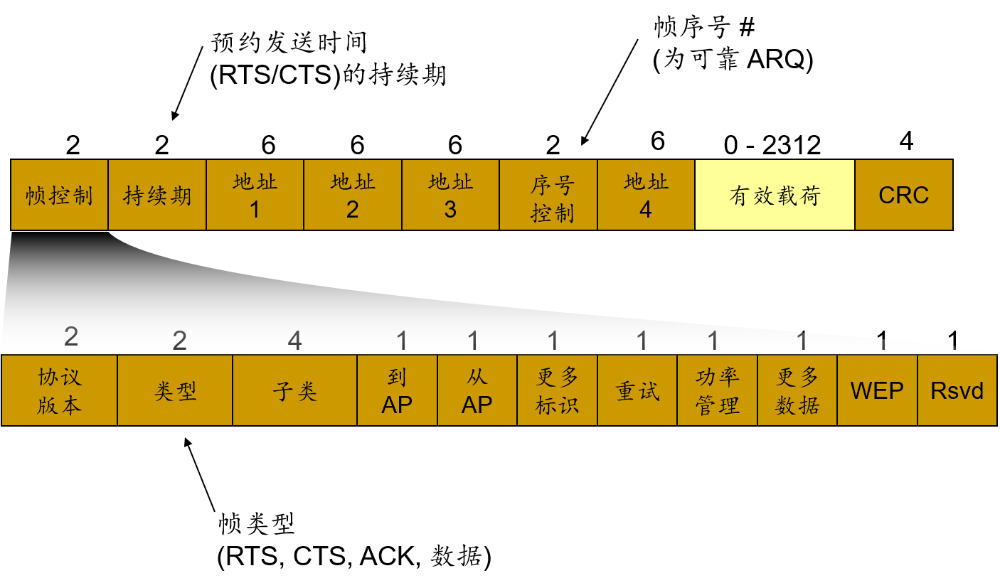
- 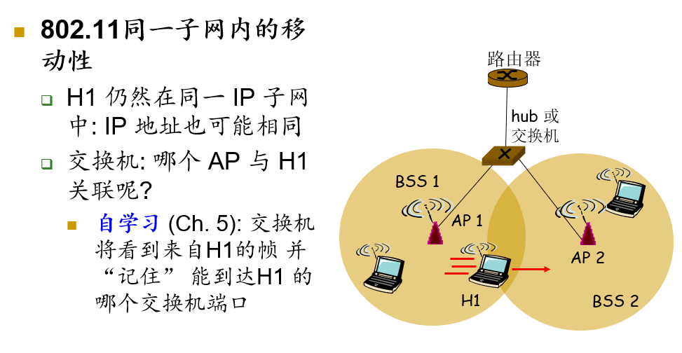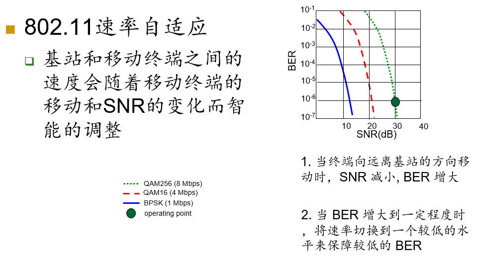
- 功率管理
  - node-to-AP: “我将保持睡眠状态直到下一个信标帧”
    - AP 知道不应当向这个节点发送任何帧
    - AP缓存所有需要发送给该节点的帧
    - 节点在下一个信标帧前唤醒
  - 信标帧: 包含了帧被缓存在AP中的节点的列表
    - 如果有帧，待发送节点会保持活动状态，请求这些帧，再转入睡眠状态
    - 如果没有帧，重新进入睡眠状态直到下一个信标帧前

## CSMA/CA

- 802.11不采用冲突检测的原因
  - 检测碰撞的能力要求站点具有同时发送和接收的能力。而802.11适配器上，接收信号的强度可能远远小于发送信号的强度，从而被淹没，无法检测到，如果一定要实现，则硬件代价会非常大
  - 即使站点具备同时发送和监听的能力，也会由于隐蔽终端和衰减的问题无法检测到所有的碰撞

- 发送方
  - 如果侦听到信道闲置了DIFS秒，则传输整个帧（无冲突检测）
  - 如果侦听到信道忙，则选择一个随机避退值作为定时器的定时时间，并在侦听信道闲置时递减该值
  - 定时时间一到且信道空闲就发送数据
  - 如果收到确认，且站点要继续发送数据，则执行第2步
  - 如果没有收到确认（ ACK），则在更大范围内选取随机值, 重复第2步

- 接收方
  - 如果帧收到则OK，等待SIFS秒后返回ACK（ACK是必须的因为隐蔽站问题）

- 冲突避免
  - 思路：允许发送方“预约”信道而非随机访问从而避免长的数据帧冲突
  - 发送方在发送数据帧之前首先使用 CSMA协议发送一个短的请求发送RTS（Request To Send）帧给AP：
  - RTS也可能仍会相互冲突 （但时间很短）
  - AP广播一个允许发送 CTS（Clear To Send）帧响应 RTS
  - RTS 被所有节点侦听到
  - 发送方发送数据帧，其他站点推迟发送

