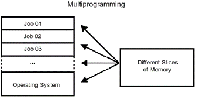

[TOC]

# 操作系统笔记（复习）

# Chapter1

## 操作系统的发展

- 手工操作阶段
  - 特点
    - 无软件
    - 人工干预
    - 独占性
    - 串行性
  - 问题
    - CPU速度提高导致人机矛盾
- 联机批处理
  - 特点
    - 监督程
    - 作业自动过渡
  - 问题
    - 高速CPU与低速IO设备的矛盾
  - 解决办法
    - 使用卫星机负责IO
- 脱机批处理
  - 特点
    - 主机与卫星机并行操作
  - 问题
    - 调度不灵活
    - 保护问题
  - 解决方法
    - 通道技术
    - 中断技术
- 执行系统
  - 定义
    - 借助于通道与中断技术，由主机控制IO工作。原有的监督程序不仅要负责调度作业自动地运行，而且还要提供IO控制功能。它常驻内存，称为执行系统。
  - 特定
    - 主机、外设并行操作
    - 增强了保护能力
  - 基本功能
    - IO控制
    - 调度
  - 问题
    - 主机与外设的并行是有限度的，还依赖于程序运行的特征。
- 多道程序设计技术
  - 定义
    - 在计算机主存中同时存放几道相互独立的程序，在操作系统的控制之下，相互穿插地运行。当某道程序因某种原因不能继续运行时（如等待IO完成），操作系统将另一道程序投入运行。（提高吞吐量和资源利用率）
  - 特征
    - 多道
    - 宏观上并行
    - 微观上串行
  - 图例
    -  

- 分时技术
  - 定义
    - 把处理机时间划分成很短的时间片（如几十、几百毫秒）轮流地分配给各个程序使用，如果某个程序在分配的时间片用完之前计算还未完成，则该程序暂停执行，等待下一轮继续计算，此时处理机让给另一程序使用。
  - 分时处理
    - 一台计算机和多个终端设备连接，终端用户以联机方式使用计算机。
  - 实时处理
    - 计算机对外来信息能够在被控对象允许的截止期限内做出反应。（实时性和可预测性）

## 操作系统概述

- 资源共享
  - 多个计算任务对计算机系统资源的共同享用
- 资源竞争
  - 多个计算任务对计算机系统资源的争夺
- 定义
  - 操作系统是一个大型的程序系统，它负责计算机系统软、硬件资源的分配；控制和协调并发活动；提供用户接口，使用户获得良好的工作环境。
- 特征
  - 并发，能处理多个同时性活动的能力。
  - 共享，即资源共享。
  - 不确定性，能处理大量的、随机的事件序列，使各用户的计算任务正确地完成。

- 功能
  - 对系统资源实施管理和调度
  - 控制和协调并发活动
  - 对外提供用户接口
- 资源管理功能
  - 处理机管理
    - 提出进程调度策略
    - 给出进程调度算法
    - 进行处理机的分派
  - 存储器管理
    - 存储分配和存储无关性
    - 存储保护
    - 存储扩充
  - 设备管理
    - 设备无关性
    - 设备分配
    - 设备传输控制
  - 信息管理（文件系统）
    - 信息组织
    - 存取方法
    - 文件共享
    - 文件安全
    - 文件完整性
    - 磁盘空间分配

- 分类
  - 批量操作系统
    - 定义
      - 批量操作系统是操作系统的一种类型。该系统把用户提交的程序组织成作业形式。作业成批送入计算机，然后由作业调度程序自动选择作业，在系统内多道运行。
    - 特点
      - 系统吞吐率高（脱机操作，多道运行）
      - 作业周转时间长
  - 分时操作系统
    - 定义
      - 分时操作系统是操作系统的另一种类型。它一般采用时间片轮转的办法，使一台计算机同时为多个终端用户服务。该系统对每个用户都能保证足够快的响应时间，并提供交互会话功能。
    - 特点
      - 并行
      - 独占
      - 交互
  - 实时操作系统
    - 定义
      - 实时操作系统对外部输入的信息，能够在规定的时间内处理完毕并作出反应。
    - 特点
      - 可靠和安全
      - 及时响应
    - 类型
      - 实时控制
      - 实时信息处理
    - 实时系统
      - 硬实时：系统必须满足应用程序对截止期限的要求，若错过了截止期限，将导致灾难性后果。
      - 软实时：系统中截止期限被错过的情况下，只造成系统性能下降而不会带来严重后果。
  - 个人计算机
  - 分布式系统