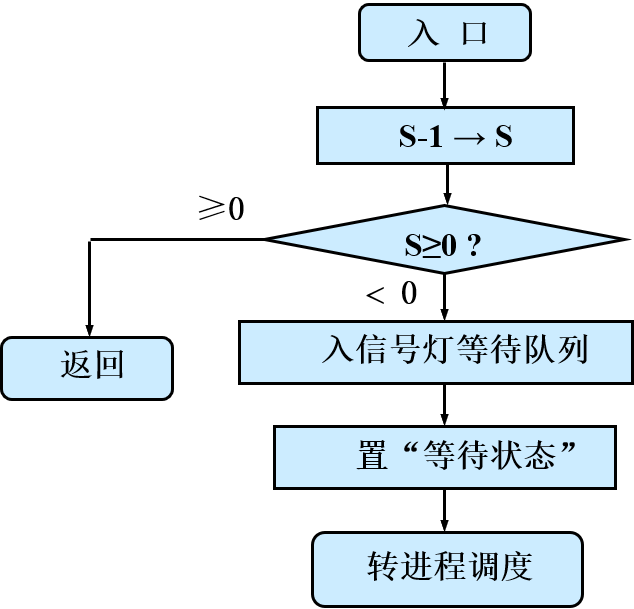
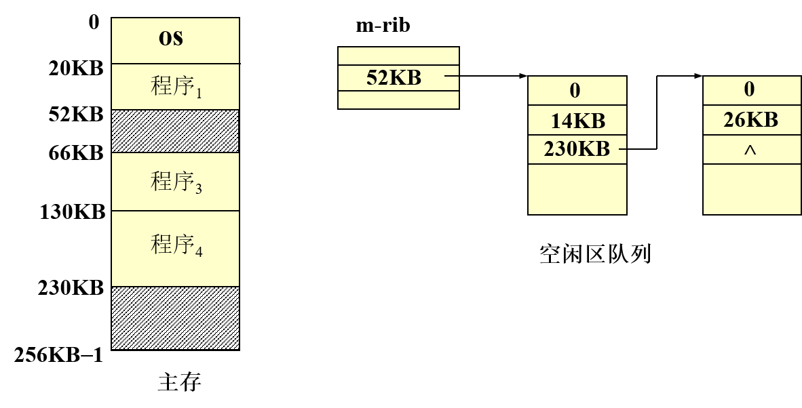
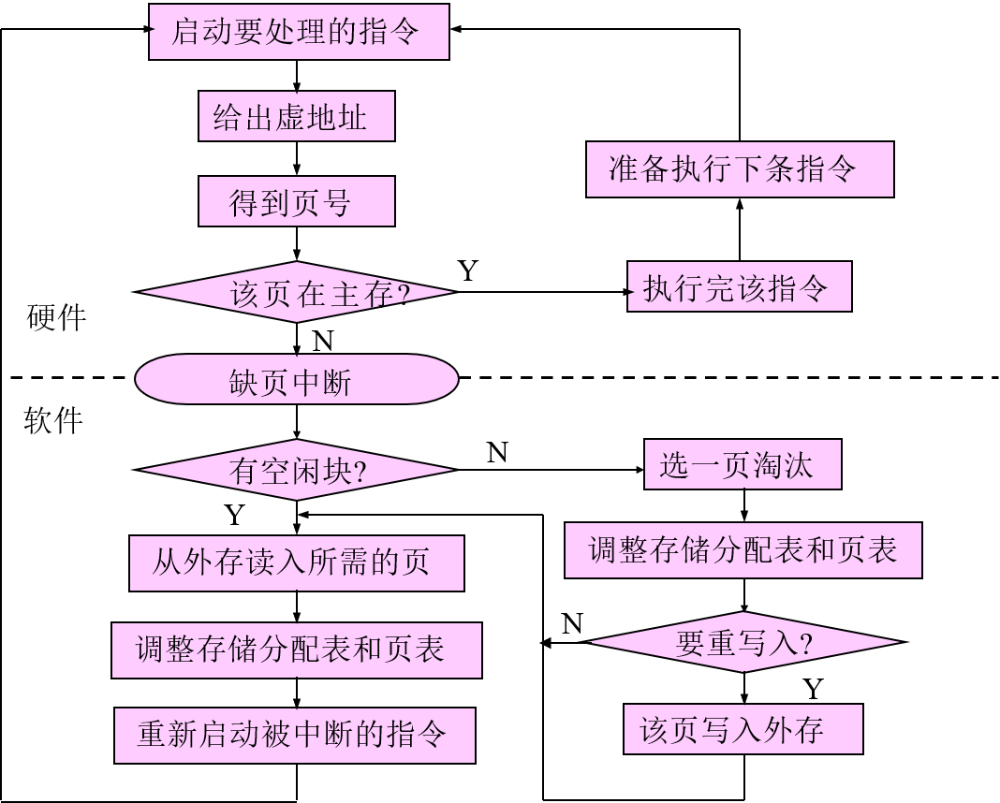
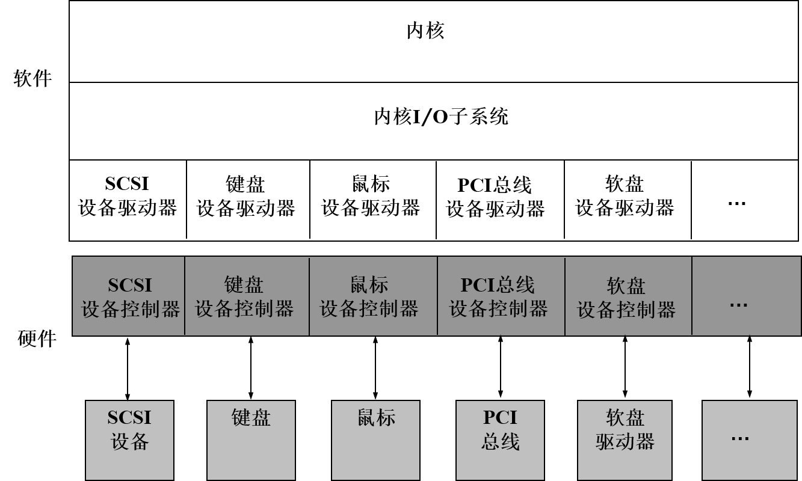
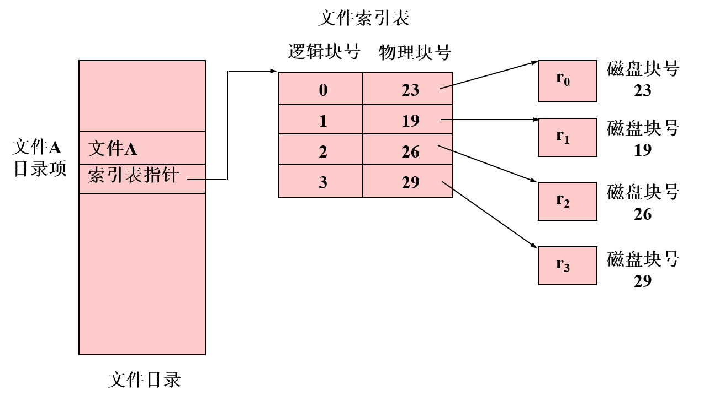
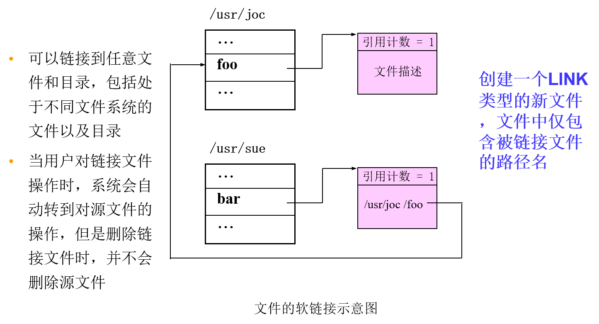

[TOC]

# 操作系统笔记（复习）

# Chapter1

## 操作系统的发展

- 存储程序式计算机
  - 基本部件
    - CPU：运算器，控制器，寄存器
    - 存储其：存储程序与数据
    - IO设备：输入数据，输出计算结果
  - 特点
    - 过程性：模拟人工
    - 集中控制：CPU集中管理
    - 顺序性：顺序执行


- 手工操作阶段
  - 特点
    - 无软件
    - 人工干预
    - 独占性
    - 串行性
  - 问题
    - CPU速度提高导致人机矛盾
- 联机批处理
  - 特点
    - 监督程序
    - 作业自动过渡
  - 问题
    - 高速CPU与低速IO设备的矛盾
  - 解决办法
    - 使用卫星机负责IO
- 脱机批处理
  - 特点
    - 主机与卫星机并行操作
  - 问题
    - 调度不灵活
    - 保护问题
  - 解决方法
    - 通道技术
    - 中断技术
- 执行系统
  - 定义
    - 借助于通道与中断技术，由主机控制IO工作。原有的监督程序不仅要负责调度作业自动地运行，而且还要提供IO控制功能。它常驻内存，称为执行系统。
  - 特定
    - 主机、外设并行操作
    - 增强了保护能力
  - 基本功能
    - IO控制
    - 调度
  - 问题
    - 主机与外设的并行是有限度的，还依赖于程序运行的特征。
- 多道程序设计技术
  - 定义
    - 在计算机主存中同时存放几道相互独立的程序，在操作系统的控制之下，相互穿插地运行。当某道程序因某种原因不能继续运行时（如等待IO完成），操作系统将另一道程序投入运行。（提高吞吐量和资源利用率）
  - 特征
    - 多道
    - 宏观上并行
    - 微观上串行
  - 图例
    -  

- 分时技术
  - 定义
    - 把处理机时间划分成很短的时间片（如几十、几百毫秒）轮流地分配给各个程序使用，如果某个程序在分配的时间片用完之前计算还未完成，则该程序暂停执行，等待下一轮继续计算，此时处理机让给另一程序使用。
  - 分时处理
    - 一台计算机和多个终端设备连接，终端用户以联机方式使用计算机。
  - 实时处理
    - 计算机对外来信息能够在被控对象允许的截止期限内做出反应。（实时性和可预测性）

## 操作系统概述

- 资源共享
  - 多个计算任务对计算机系统资源的共同享用
- 资源竞争
  - 多个计算任务对计算机系统资源的争夺
- 定义
  - 操作系统是一个大型的程序系统，它负责计算机系统软、硬件资源的分配；控制和协调并发活动；提供用户接口，使用户获得良好的工作环境。
- 特征
  - 并发，能处理多个同时性活动的能力。
  - 共享，即资源共享。
  - 不确定性，能处理大量的、随机的事件序列，使各用户的计算任务正确地完成。

- 功能
  - 对系统资源实施管理和调度
  - 控制和协调并发活动
  - 对外提供用户接口
- 资源管理功能
  - 处理机管理
    - 提出进程调度策略
    - 给出进程调度算法
    - 进行处理机的分派
  - 存储器管理
    - 存储分配和存储无关性
    - 存储保护
    - 存储扩充
  - 设备管理
    - 设备无关性
    - 设备分配
    - 设备传输控制
  - 信息管理（文件系统）
    - 信息组织
    - 存取方法
    - 文件共享
    - 文件安全
    - 文件完整性
    - 磁盘空间分配

- 分类
  - 批量操作系统
    - 定义
      - 批量操作系统是操作系统的一种类型。该系统把用户提交的程序组织成作业形式。作业成批送入计算机，然后由作业调度程序自动选择作业，在系统内多道运行。
    - 特点
      - 系统吞吐率高（脱机操作，多道运行）
      - 作业周转时间长
  - 分时操作系统
    - 定义
      - 分时操作系统是操作系统的另一种类型。它一般采用时间片轮转的办法，使一台计算机同时为多个终端用户服务。该系统对每个用户都能保证足够快的响应时间，并提供交互会话功能。
    - 特点
      - 并行
      - 独占
      - 交互
  - 实时操作系统
    - 定义
      - 实时操作系统对外部输入的信息，能够在规定的时间内处理完毕并作出反应。
    - 特点
      - 可靠和安全
      - 及时响应
    - 类型
      - 实时控制
      - 实时信息处理
    - 实时系统
      - 硬实时：系统必须满足应用程序对截止期限的要求，若错过了截止期限，将导致灾难性后果。
      - 软实时：系统中截止期限被错过的情况下，只造成系统性能下降而不会带来严重后果。
  - 个人计算机
  - 分布式系统

# Chapter2

## 操作系统结构类型

- 单体结构
- 模块化结构
- 可扩展内核结构
- 层次结构

- 1. Monolithic Kernel
     1. Entire operating system is placed in kernel space.
     2. All OS code runs in privileged mode (ring 0 on x86).
     3. Different functions of the OS are divided into subsystems.
     4. Higher performance at the expanse of poorer modularity and separation of components.

  2. Micro-Kernel
     1. Bare minimum of code runs in kernel space.
     2. Basic addressing, IPC, and scheduling.
     3. Under 10,000 LOC as a rule of thumb.
     4. Rest of the OS is divided into a collection of servers running in userspace, generally with lower privileges.
     5. Excellent modularity, but performance suffers.

  3. Hybrid Kernel

- 

- 层次结构
  - UNIX
    - 
  - Linux
    - 
  - Windows
    - 

## 特权级

- 定义
  - 处理机的态，又称处理机的特权级，是中央处理机的工作状态。当前运行的程序决定处理机的态。
  - 程序的类别
    - 管理程序：管理系统资源；控制程序运行
    - 用户程序：使用资源，提出申请；被控制
- 特权级分类
  - 管态：操作系统的管理程序执行时机器所处的状态。在此状态下处理机可使用全部指令（包括一组特权指令）；使用全部系统资源（包括整个存储区域）。
  - 用户态：用户程序执行时机器所处的状态称为用户态。在此状态下禁止使用特权指令，不能直接取用资源与改变机器状态，并且只允许用户程序访问自己的存储区域。

- 特权级划分的目的
  - 保护操作系统
- 特权指令
  - 涉及外部设备的IO指令
  - 修改特殊寄存器的指令
  - 改变机器状态的指令

## 中断

- i386的异常和中断的定义：
  - Exceptions and interrupts are both "==protected control transfers==", which cause the processor to switch from user to kernel mode (CPL=0) ==without giving the user-mode code any opportunity to interfere with the functioning of the kernel or other environments==. In Intel's terminology, an interrupt is a protected control transfer that is caused by an ==asynchronous== ==event== usually ==external== to the processor, such as notification of external device I/O activity. An exception, in contrast, is a protected control transfer caused ==synchronously== by the ==currently running code==, for example due to a divide by zero or an invalid memory access.
  - 异常（Exception）在i386中与trap是一个意思，但中文翻译的时候往往翻译成异常、陷阱或俘获，其实是一个意思。
  - 异常是由于程序的行为（如除0错、缺页等）导致的同步事件，必须由计算机立刻处理。处理完成后，回到程序发生异常处继续执行。
  - 中断是指某个事件（例如键盘输入、I/O传输结束等）发生时，系统中止现行程序的运行，引出处理事件程序对该事件进行处理，处理完毕后返回现行程序的下一条指令，继续执行。
  - 中断处理的时机在指令的间隙，当前指令执行完毕后会检测是否有中断到达，并由系统决定是否进入中断处理。
- 中断源：引起中断的事件称中断源，如打印完成中断，其中断源是打印机。
- 断点：发生中断时正在运行的程序被暂时停止，程序的暂停点称为断点。例如，某程序正在执行0200地址的指令被中断，那么，0200地址就是断点， 在中断返回时就执行0200的下一条指令。
- 中断响应：处理机发现有中断请求时，暂停现运行程序的执行并自动引出中断处理程序的过程。（实质：交换指令地址及处理机的状态信息）
  - 
- 现场
  - 中断的那一时刻可能确保程序继续运行的有关信息。
    - 后继指令所在主存的单元号
    - 程序运行所处的状态
    - 指令执行情况
    - 程序执行的中间结果等
  - 保护现场
    - 当中断发生时，必须立即把现场信息保存在主存中。
  - 恢复现场
    - 程序重新运行之前，把保留的该程序现场信息从主存中送至相应的指令计数器、通用寄存器或一些特殊的寄存器中。
- 程序状态字
  - 反应程序执行时机器所处的现行状态的代码。
  - 内容：指令地址，指令执行情况，处理机状态，中断屏蔽字等
- 中断装置：指发现中断，响应中断的硬件。
- 中断处理程序：由软件来完成。
- 中断由软硬件协同处理，中断系统 = 中断装置 + 中断处理程序
- 分类
  - 中断
    - 外部中断（非通道设备，如时钟中断）
    - IO中断（外部设备或通道设备）
  - 异常
    - 机器故障
    - 程序性错误或非法操作（运算溢出及错误、越界、非法操作，用户态使用管态指令）
    - 访管中断（系统功能调用）：操作系统提出某种需求（IO请求，创建进程等）

## 硬件

- 存储器
  - 内存（主存）
    - 处理机能直接访问的存储器称为主存储器，用来存放正在或将要执行的系统和用户程序和数据以及程序执行时要求的临时存储空间。
    - ROM、RAM
  - 外存（辅存）
    - 处理机不能直接访问的存储器，如磁盘、磁带、光盘等，用来存放大量的数据信息。
- DMA
  - 
- 时钟硬件
  - 
  - 实时时钟（Real Time Clock，RTC）
    - 在PC机断电后仍能保存时间
    - 通过主板上的电池供电；通常与CMOS RAM集成到一块芯片上，也称为 CMOS Timer
    - 可在系统初启时读入并转换为相对于某一基准时间的时钟滴答数
    - 操作系统提供实用程序可以设置系统时钟和RTC并在二者之间同步
  - 可编程间隔定时器（Programmable Interval Timer，PIT）
    - 工作模式
      - One-shot mode
      - Square-wave mode
    - 时钟滴答（Clock tick）
    - 周期性地发生时钟中断（可编程设置间隔）
  - 时间戳计数器（Time Stamp Counter，TSC）
    - Pentium之后的CPU中包含的64位的寄存器
    - 在每一个振荡信号到达时，该计数器递增
    - 可为操作系统提供更准确的时间度量

# Chapter3

## 系统引导

- 将操作系统的必要部分装入主存并对系统进行初始化工作，最终使系统处于命令接收状态。
- 方式
  - 现场独立引导：OS核心文件存储在系统本身的存储设备中，由系统自己将OS核心程序读入主存并运行，建立一个操作环境。
    1. 初始引导
       1. 系统加电
       2. 执行初始引导程序，对系统硬件和配置进行自检，保证系统没有硬件错误
       3. 从硬盘中读入操作系统引导程序，并将控制权交给该程序模块
    2. 引导程序执行，将操作系统核心文件读入内存，并将控制交给核心的初始化程序
    3. 核心初始化，初始化系统数据结构和参数
       1. 系统加电建立进程有关的数据结构
       2. 获得自由存储空间的容量，建立存储管理的数据结构
       3. 建立系统设备和文件系统的数据结构
       4. 初始化时钟
    4. 系统初始化
       1. 完善OS的操作环境，装载命令处理程序 (或图形用户界面)，并初始化
       2. 在多用户系统中，为每个终端建立命令解释进程，使系统处于命令接收状态
  - 辅助下装
    - OS主要文件不放在系统本身的存储设备中，在系统启动后执行下装操作，从另外的计算机系统中将操作系统常驻部分传送到该计算机中，使它形成一个操作环境。
- 举例：Linux
  1. 系统加电或复位
     1. 对主存中所有数据清零，进行校验，无错则将程序计数器指向BIOS入口。
  2. BIOS启动
     1. 上电自检
     2. 对硬件设备进行检测和连接，并将测得的数据送入BIOS数据区
     3. 读入Boot Loader引导程序（对MBR启动方式，则是启动零柱面零磁道1扇区的MBR（Master Boot Record），将控制权交给Boot Loader）
  3. 引导程序
     1. 将OS读入内存，并将控制权交给OS初始化程序
  4. 系统核心初始化（Setup.s）
     1. Setup
        1. 检查调入内存中的代码
        2. 获取内存容量信息，设置设备模式
        3. 屏蔽中断，准备进入保护模式
        4. 设置中断描述符表（idt），全局描述符表（gdt）
        5. 控制权交给Heads
     2. Heads
        1. 对中断向量表作准备工作
        2. 检查CPU类型
        3. 调用Setup_paging进行页面初始化
        4. 调用main.c中的`Start_kernel()`。
     3. `Start_kernel()`
        1. 对与CPU、内存等最基本硬件相关部分进行初始化
        2. 对中断向量表进行初始化
        3. 为进程调度程序作准备
        4. 设置基准时钟
        5. 内核的内存分配
        6. 对文件系统进行初始化
        7. 建立init进程
     4. init进程：对每一个联机终端建立“getty”进程，getty在终端上显示“login”，等待用户登录

## 应用程序处理


- 链接类型

  - 静态链接

    - 一个源程序经编译后，生成一个可重定位的目标模块，并产生内部符号表和外部符号表，供连接程序（Link）使用。
    - 内部符号表：本模块可以被其他程序调用的入口点。（全局符号表）

    - 外部调用表：本模块要调用的外部的程序模块名。
    - 连接需要做的工作
      1. 将各模块连接成为一个整体
      2. 构造符号表，在其中填写模块的逻辑地址
      3. 查找各程序段的外部调用表，填入对应调用函数的地址
    - 缺点：静态连接将所需的外部函数链接到目标文件中形成为一个可执行文件。若多个应用程序都调用了同一个库中的外部函数，那么，多个应用程序的目标文件中都会包含这个外部函数对应的代码

  - 动态连接

    - 不需要将外部函数链接到目标文件中，而是在应用程序中需要调用外部函数的地方作记录，说明要使用的外部函数名和引用入口。

## 系统功能调用

- 用户界面
  - 命令接口（操作界面）
    - 用户使用操作界面来组织工作流程和控制程序的运行。
      - 作业控制语言
      - 键盘命令
      - 图形化用户界面
  - 程序接口（系统功能服务界面）
    - 用户程序在其运行过程中，使用系统功能调用来请求操作系统的服务。

- 系统功能调用
  - 操作系统提供实现各种功能的例行子程序，其中的每一个功能对应访管指令的一个功能号。调用方法：访管指令+访管中断
  - 系统功能调用是用户在程序一级请求操作系统服务的一种手段，它是带有一定功能号的访管指令。其功能是由操作系统中的程序完成的，即由软件方法实现的。
  - 

# Chapter4

- 程序的一次执行过程被称为一个计算，它由许多简单操作所组成。
- 顺序程序
  - 一个计算的若干操作必须按照严格的先后次序顺序地执行，这类计算过程就是程序的顺序执行过程。
  - 特点
    - 顺序性：处理机严格按照程序所规定的顺序执行
    - 封闭性：程序开始执行后，结果不受外界因素影响
    - 可再现性：程序执行的结果和它执行的速度无关（与时间无关），只与初始条件有关

- 并发程序
  - 若干个程序段同时在系统中运行，这些程序段的执行在时间上是重叠的，一个程序段的执行尚未结束，另一个程序段的执行已经开始，即使这种重叠是很小的一部分，也称这几个程序段是并发执行的。
  - 特点
    - 失去了程序的封闭性和可再现性：若一程序可以修改另一个程序中的变量（公共变量），则后者的输出可能有赖于各个程序运行的相对速度。
    - 程序与计算不再一一对应：一个程序可能对应多个计算。
    - 程序并发执行的相互制约：资源共享和公共变量。
- 与时间有关的错误
  - 程序并发执行时，若共享了公共变量，其执行结果与各个并发程序之间的相对速度有关，即给定初始条件，若不加控制，也可能得到不同的结果，这就是与时间有关的错误。

## 进程

- 定义
  - 一个程序在给定的活动空间和初始环境下，在一个处理机上的一次执行过程。
- 与程序的区别
  1. 程序是静态概念，进程是动态概念
  2. 进程是一个独立运行的活动单位
  3. 进程是竞争系统资源的基本单位
  4. 一个程序可以对应多个进程，一个进程至少包含一个程序
- 基本状态
  - 运行：进程已经获取运行所必需的资源，正在处理机上执行
  - 等待：进程正在等待某一时间的发生而暂停执行，这时，即使给予其CPU的控制权，它也无法执行。
  - 就绪：进程已经获取除CPU以外的全部必需资源，一旦得到CPU的控制权，它可以立即执行。
  - 
- 进程控制块（Process Control Block）
  - 描述进程与其他进程、系统资源的关系以及进程在各个不同时期所处的状态的*数据结构*，称为进程控制块。
  - 进程的组成：程序+数据+PCB
  - 主要内容：
    1. 进程标识符（PID）
    2. 进程当前状态（处于等待态，需要说明原因）
    3. 当前队列指针（next，队列中即处于同一状态的下一个PCB的地址）
    4. 进程优先级（由用户预先指定或由OS指定）
    5. CPU现场保护区（上下文，现场保护）
    6. 通信信息
    7. 家族联系（子进程，父进程标识符）
    8. 占有资源清单

## 进程控制

- 控制原语
  - 创建：`create(name, priority)`
    - 创建一个指定标识符的进程，并构建其PCB数据结构。
    - 
  - 撤销：`kill / exit`
    - 当进程完成任务后希望终止自己时使用进程撤消原语。 
    - 撤消当前运行的进程。将该进程的PCB结构归还到PCB资源池，所占用的资源归还给父进程，从总链队列中摘除它，然后转进程调度程序。
    - 
  - 等待：`susp(chan)`
    - 当进程需要等待某一事件完成时，它可以调用等待原语挂起自己。
    - 中止调用进程的执行，并加入到等待`chan`的等待队列中，最后使控制权转向进程调度。
    - 
  - 唤醒：`wakeup(chan)`
    - 当处于等待状态的进程所期待的事件来到时，由发现者进程使用唤醒原语叫唤醒它。
    - 

## 制约关系

- 临界资源：同一时刻即一次仅允许一个进程占用的资源叫做临界资源
- 临界区：进程中对公共变量（或存储区）进行访问和修改的程序段，称为相对于该公共变量的临界区。进程进入临界区必须互斥。
  - 针对某一临界资源而言
  - 某一临界资源的临界区数等于共享该临界资源的进程数
  - 互斥进入。

- 互斥

  - 在操作系统中，当某一进程正在访问某一存储区域时，不允许其他进程来读出或者修改该存储区的内容，否则就会发生后果无法估计的错误。进程之间的这种相互制约关系被称为互斥。

- 同步

  - 并发进程在一些关键点上需要互相等待和互通消息，这种相互制约的等待和互通信息称为进程同步。

- 同步机构

  - 锁：用锁位表示一个资源（被占用）的状态。

    - 

    - 上锁原语

      ```c
      test:
      	if (w == 1) goto test;  // 轮询
          else w = 1;				// 上锁
      ```

    - 开锁原语

      ```c
      	w = 0; // 开锁
      ```

  - 信号灯：信号灯是一个确定的二元组`(s, q)`，s是一个具有非负初值的整型变量，q是一个初始状态为空的队列。

    - 注：创建信号灯时，要准确说明其初值（不能为负）和意义。
    - P操作
      - 对信号灯s的 p操作记为 p(s)。p(s)是一个不可分割的原语操作，即取信号灯值减1，若相减结果为负，则调用p(s)的进程被阻，并插入到该信号灯的等待队列中，否则可以继续执行。
      - 
    - V操作
      - 对信号灯s的 v操作记为 v(s)。v(s)是一个不可分割的原语操作，即取信号灯值加1，若相加结果大于零，进程继续执行，否则，要帮助唤醒在信号灯等待队列上的一个进程。
      - 

## 通信

- 定义
  - 进程通信是指进程之间直接以较高的效率传递较多数据的信息交互方式。
- 分类
  - 消息缓存通信
    - 发送双方有明确的协议与消息格式。
    - 包括消息缓冲、发送原语和接收原语。
  - 信箱通信
    - 需要定义信箱结构，包括发送模块和接收模块，提供发送原语和接收原语。
    - 可以放在用户空间，作为接收进程地址空间的一部分，也可以放在内核空间。

## 线程

- 定义
  - 线程是比进程更小的活动单位，是进程中的一条执行路径。
  - 可以拥有私用的堆栈和处理机执行环境。
  - 与父进程共享分配给父进程的主存。
  - 单个进程可以创建多个线程。
- 

# Chapter5

- 资源描述器
  - 描述描述各类资源的最小分配单位的数据结构称为资源描述器rd。
  - 
  - 

- 资源分配策略
  - 先请求先服务
    - 每一个新产生的请求均排在队尾；当资源可用时，取队首元素，满足其需求。
    - 排序原则：按请求的先后次序。
  - 优先调度
    - 对每一个进程指定一个优先级；每一个新产生的请求，按其优先级的高低插入到相应的位置；当资源可用时，取队首元素，满足其需求。
    - 排序原则：按优先级的高低排序。
  - 针对设备特性设置调度策略
    - 例如针对大容量的存储设备（磁盘）而言，存在几种调度算法
      - 移臂调度：总是选取与当前移动臂前进方向上最近的请求。
      - 旋转调度：总是选取与当前读写头旋转方向上最近的请求。
      - SSTF算法（最短寻道时间优先）：总是从等待访问者中挑选寻找时间最短，即距离当前磁头最近的请求
      - SCAN算法（扫描算法，电梯调度算法）：磁头前进方向上的最短查找时间优先算法，从当前移动臂的位置开始，沿着臂的移动方向去选择离当前移动臂最近的那个柱面访问者，如果没有请求，则改变移动方向。
      - CSCAN算法（循环扫描算法）：磁头只做单向移动。

## 死锁

- 定义
  - 在两个或多个并发进程中，如果每个进程持有某种资源而又都等待着别的进程释放它或它们现在保持着的资源，否则就不能向前推进。此时称这一组进程产生了死锁。
- 原因
  1. 系统资源不足
  2. 进程推进顺序非法
- 必要条件
  - 互斥条件：涉及到的资源是非共享的，即临界资源
  - 不剥夺条件：进程所获得的资源在未使用完毕之前，不能被其他进程强行夺走。
  - 部分分配：进程每次申请它所需要的一部分资源。在等待新资源的同时，进程继续占用已分配得到的资源。
  - 环路条件：存在一种进程的循环链，链中的每一个进程已获得的资源同时被链中下一个进程所请求。
- 安全状态
  - 指至少有一个资源分配序列使得进程不会死锁。

- 解决死锁的策略
  - 静态资源分配
    - 在作业调度时为选中的作业分配它所需要的所有资源，当资源一旦分配给该作业后，在其整个运行期间这些资源为它独占。
  - 有序资源分配法
    - 系统中所有资源都给定一个唯一的编号，所有分配请求必须以上升的次序进行。当遵守上升次序的规则时，若资源可用，则予以分配；否则，请求者等待。
  - 银行家算法
    - 申请者事先说明对各类资源的最大需求量。在进程活动期间动态申请某类资源时，由系统审查现有该类资源的量是否满足，同时分配后是否处于安全状态，如能满足就予以分配，否则拒绝。

# Chapter6

- 处理机调度的功能
  - 确定数据结构、指定调度策略、给出调度算法、具体地实施处理机分派

## 作业调度

- 功能
  - 建立作业控制块（JCB），记录进入系统的作业情况（类型、状态、资源请求与分配）
  - 确定调度策略和算法
  - 分配资源，为被选中的作业创建进程，并且为其申请系统资源
  - 善后处理，收回作业占用的全部资源，撤销作业控制块以及与该作业有关的全部进程
- 调度性能的衡量
  - 周转时间：各作业提交给计算机系统到该作业的结果返回给用户所需要的时间。
    - $T_i = T_{C_i} - T_{S_i}$，$T_i$为作业周转时间，$T_{C_i}$为作业完成时间，$T_{S_i}$为作业提交时间。
    - 说明作业在系统中停留的时间长短。
  - 平均周转时间：$T = \frac{1}{n}\sum_{i=1}^nT_i$
  - 带权周转时间：一个作业的周转事件与其运行时间的比值
    - $W_i = \frac{T_i}{T_r}$，$T_r$为作业实际运行时间。
    - 说明作业在系统中的相对等待时间。
  - 平均带权周转时间：$W = \frac{1}{n}\sum_{i=1}^nW_i$
- 调度算法
  - 先来先服务调度
    - 按照作业到来的先后次序进行调度
    - 特点：
      - 每次选择等待时间最久的作业，而不考虑作业运行时间的长短
      - 实现简单，效率较低。
  - 短作业优先调度
    - 考虑作业的运行时间，每次总选择一个请求运行时间最小的作业
    - 特点：
      - 易实现，系统吞吐量高
      - 只考虑短作业，没有考虑长作业的利益
      - 如果作业的到来顺序及运行时间不合适，会出现饿死现象
  - 响应比高者优先调度
    - 响应比：$R = 1 + \frac{T_w}{T_r}$，$R$为响应比，$T_w$为等待时间，$T_r$是运行时间。
    - 每调度一个作业时，计算后备作业表中每个作业的响应比，挑选响应比高者投入运行。
    - 特点：
      - 理论上比较完备
      - 需要统计等待时间和用户估计的运行时间，同时需要进行浮点运算，浪费大量时间
  - 优先数调度
    - 综合考虑各方面因素（作业等待时间、运行时间、缓急程度，系统资源使用等），给每个作业设置一个优先数，调度程序总是选择一个优先数最大（或者最小）的作业调入（系统）内存。
    - 困难在于如何综合考虑。

## 进程调度

- 调度：组织和维护就绪进程队列。包括确定调度算法、按调度算法组织和维护就绪进程队列。
- 分派：当处理机空闲时，从就绪队列队首中移一个PCB，并将该进程投入运行。
- 
- 功能
  - 记录和保持系统中所有进程的有关情况和状态特征
  - 决定分配（处理机）策略
  - 实施处理机的分配和回收
- 方式
  - 非剥夺式
    - 当“重要而紧迫”的进程来到时，让正在执行的进程继续执行，直到该进程完成或发生某事件而进入“完成”或“阻塞”状态时，才把处理机分配给“重要而紧迫”的进程。
    - 实现简单，系统开销小；难以满足紧急任务的要求。
  - 剥夺方式
    - 当“重要而紧迫”的进程来到时，便暂停正在执行的进程，立即把处理机分配给优先级更高的进程。
    - 及时响应紧急任务；增加系统开销。

- 调度算法

  - 进程优先数调度

    - 目前操作系统广泛采用的一种进程调度算法，按照某种原则由系统（或用户、或系统与用户结合）赋予每个进程一个优先数，在处理机空闲时，进程调度程序就从就绪进程中选择一个优先数最大（或者最小）的进程占用CPU（进程从就绪状态转换成运行状态）。
    - 采用这种调度算法的关键是如何确定进程的优先数、一个进程的优先数确定之后是固定的，还是随着该进程运行的情况的变化而变化。
    - 优先数的确定
      - 静态方法：进程优先数在进程创建时确定后就不再变化
        - 系统确定：（运行时间、使用资源，进程的类型）
        - 用户确定：（紧迫程度，计费与进程优先数有关）
      - 动态方法：系统运行过程中，根据系统的设计目标，不断调整进程的优先数，其优点是能比较客观地反映进程的实际情况和保证达到系统设计目标。

  - 循环轮转调度

    - 系统的响应时间分成大小相等（或不等）的时间片。每个进程被调度到后，占用一个时间片，时间片用完后，该进程让出CPU，排在就绪队列的队尾。多个进程循环轮转。

    - $T = N * q$，$T$为响应时间，$N$为进程数，$q$为时间片。

    - 简单循环轮转调度

      - 实现简单、系统开销小

      - 不灵活，当系统中进程较多时，系统开销变大

    - 可变时间片轮转调度
      - 根据系统当前的进程数动态确定时间片的大小

  - 举例：优先调度与时间片调度相结合

  - 

    - 优先照顾IO量大的进程；适当照顾计算量大的进程。

# Chapter7

- 程序的逻辑组织
  - 一维地址结构
    - 一个程序是一个的连续线性的地址结构。
    - 确定线性地址空间中的指令地址或操作数地址只需要一个信息。
  - 二维地址结构
    - 一个程序由若干个分段组成，每一个分段是一个连续的地址区。
    - 确定线性地址空间中的指令地址或操作数地址需要两个信息，一是该信息所在的分段，另一个是该信息在段内的偏移量。
- 物理地址
  - 物理地址是计算机主存单元的真实地址（绝对地址，实地址）
- 主存空间
  - 物理地址的集合所对应的空间
- 逻辑地址
  - 用户的程序地址（指令地址或操作数地址）均为逻辑地址（相对地址，虚地址）
- 程序地址空间
  - 用户程序所有的逻辑地址集合对应的空间。
- 主存管理功能
  - 实现逻辑地址到物理主存地址的映射
  - 主存分配
  - 存储保护
  - 主存扩充

## 地址映射

- 定义
  
  - 将程序地址空间中使用逻辑地址变换成主存中的物理地址的过程
- 映射时机
  - 编程或编译时确定地址映射关系
    
    - 在程序编写或程序编译时确定虚、实地址之间的对应关系，结果是一个不能浮动的程序模块。
  - 在程序装入时确定地址映射关系
    - 静态地址映射
      - 在程序装入过程中随即进行的地址变换方式
      - 依赖：重定位过程
      - 
      
    - 动态地址映射
      - 在程序执行期间，随着每条指令和数据的访问自动地连续地进行地址映射
      - 依赖：重定位寄存器
      - 
      
    - 比较

      | 静态                         | 动态                                 |
      | ---------------------------- | ------------------------------------ |
      | 在程序装入过程中进行地址映射 | 在程序执行期间                       |
      | 需要重定位装入程序           | 需要重定位寄存器（硬件地址变换机构） |
      | 需要花费较多CPU时间          | 地址变换快                           |
      | 不灵活                       | 灵活                                 |

## 主存分配

- 功能
  - 构造分配用的数据结构：主存资源信息块（等待队列；空闲区队列；主存分配程序）
  - 制定策略
    - 分配策略：在众多个请求者中选择一个请求者的原则
    - 放置策略：在可用资源中，选择一个空闲区的原则
    - 调入策略：决定信息装入主存的时机
      - 预调策略：预先将信息调入主存
      - 请调策略：当需要时，将信息调入主存
    - 淘汰策略：在主存中没有可用的空闲区 (对某一程序而言)时，决定哪些信息从主存中移走，即确定淘汰已占用的内存区的原则。
  - 实施主存的分配与回收

### 动态分区分配

- 在处理程序的过程中，建立分区，依据用户请求的大小分配分区

- 分配过程

  1. 寻找空闲块：依申请者所要求的主存区的大小，分区分配程序在自由主存队列中找一个满足用户需要的空闲块
  2. 若找到了所需的空闲区：
     1. 空闲区与要求的大小相等，将该空闲区分配并从队列中摘除
     2. 空闲区大于所要求的的大小，将空闲区分为两部分：一部分成为已分配区，建立已分配区的描述器；剩下部分仍为空闲区。返回所分配区域的首址
  3. 没有找到，告之不能满足要求

  

- 回收过程

  1. 检查释放分区（即为回收分区）在主存中的邻接情况，若上、下邻接空闲区，则合并，成为一个连续的空闲区。
  2. 若回收分区不与任何空闲区相邻接建立一个新的空闲区，并加入到空闲区队列中。

  

- 数据结构

  1. 主存资源信息块（M_RIB）：等待队列头指针+空闲区队列头指针+主存分配程序入口地址。
  2. 分区描述器（PD）：分配标志`flag`（0为空闲区，1为已分配区），分区大小`size`，勾链字`next`（仅对空闲区有效，指向下一个空闲区）。

  

### 放置策略

- 首次适应算法（First Fit）
  - 首次适应算法是将输入的程序放置到主存里第一个足够装入它的地址最低的空闲区中。
  - 空闲区队列结构：依据空闲区起始地址由低到高排序
  - 特点
    - 尽可能利用存储器中低地址空闲区，尽量保存高地址空闲区
    - 当需要一个较大分区时，有较大希望能找到足够大的空闲区以满足要求
- 最佳适应算法（Best Fit）
  - 最佳适应算法是将输入的程序放置到主存中与它所需大小最接近的空闲区中。
  - 空闲区队列结构：依据空闲区大小由小到大排序
  - 特点
    - 尽可能利用存储其中小的空闲区，尽量保存大的空闲区
    - 如果存储空间中具有正好是所要求大小的空闲区，则必然被选中
    - 如果不存在这样的空闲区，则选中的也只是比要求稍大的空闲区
    - 容易产生较多的非常小的空闲区，造成主存空间的浪费
- 最坏适应算法（Worst Fit）
  - 最坏适应算法是将输入的程序放置到主存中与它所需大小差距最大的空闲区中。
  - 空闲区队列结构：依据空闲区大小由大到小排序
  - 特点
    - 尽可能地利用存储器中大的空闲区。
    - 不易产生非常小的空闲区
    - 分配快，可以很快得知是否存在满足要求的空闲区
- 

### 碎片问题及拼接技术

- 碎片问题：在已分配区之间存在着的一些没有被充分利用的空闲区。
- 拼接技术：所谓拼接技术是指移动存储器中某些已分配区中的信息，使本来分散的空闲区连成一个大的空闲区。
  - 方案一：在某一分区回收时立即进行拼接，主存中总有一个连续的空闲区而无碎片，但拼接频率过高，系统开销大。
  - 方案二：当找不到足够大的空闲区时，空闲区的总存储容量却可以满足程序需要时进行拼接，频率比方案一小，但空闲区的管理较为复杂。

- 拼接技术的缺点：
  - 消耗系统资源
  - 拼接时，系统必须停止所有其他工作
  - 上两条的开销大于收益

## 存储保护

- 定义
  - 在多用户环境中，主存储器按区分配给各用户程序使用。为了互不影响，必须由硬件 (软件配合)保证各用户程序只能在给定的存储区域内活动，这种措施叫做存储保护。
- 实现方法
  - 界地址保护
    - 上下界保护：针对物理地址
    - 判断物理地址是否大于等于下界寄存器的值，是否小于上界寄存器的值
    - 
    - 基地址、限长保护
    - 判断逻辑地址是否小于限长寄存器的值
    - 
  - 存储键保护

## 主存扩充

- 可行性：局部性特征
- 实现方法：
  - 程序的全部代码和数据存放在辅存中
  - 将程序当前执行所涉及的那部分程序代码放入主存中
  - 程序执行时，当所需信息不在主存，由操作系统和硬件相配合来完成主存从辅存中调入信息，程序继续执行

- 依赖：虚拟存储器

### 虚拟存储器

- 定义
  - 由操作系统和硬件相配合来完成主存和辅存之间的信息的动态调度。这样的计算机系统好像为用户提供了一个其存储容量比实际主存大得多的存储器，这个存储器称为虚拟存储器。
- 核心功能
  - 逻辑地址与物理地址分开
  - 虚地址空间与存储空间分开
  - 提供地址变换机构
- 实现基础
  - 有相当容量的辅存，足以存放应用程序的虚地址空间
  - 有一定容量的主存，存放多进程的信息
  - 地址变换机构

## 页式存储管理

- 页面（page）：程序的地址空间被等分成大小相等的片，称为页面，又称为虚页。

- 主存块（block）：主存被等分成大小相等的片，称为主存块，又称为实页。

- 页表（pagetable）：为了实现从地址空间到物理主存的映象，系统建立的记录页与内存块之间对应关系的地址变换的机构称为页面映像表，简称页表。

  

### 页式地址变换

- 虚地址结构：

  

  虚地址（VA）位宽由虚地址空间大小决定，页内偏移（VPO）长度由页面大小决定，页号（PPN）长度由前两者决定。

- 过程：

  

- 联想存储器（TLB Translation Lookaside buffer）

  - 高速、小容量半导体存储器件

  - 快表：在TLB中存放正在运行的进程当前用到的页号对应的块号

    

### 请调页面机制

- 对于简单页式系统，一个程序运行的条件是全部页面都被装入

- 对于请求页式系统，转入部分页面，程序即可运行，而它需要解决的页面未装入的问题（缺页异常）

- 扩充页表功能

  - 加入中断位：标识页是否在主存（1表示不在，0表示在）
  - 加入辅存地址：表示该页面在辅存的位置

- 缺页处理

  

### 淘汰机制与策略

- 扩充页表功能
  - 加入引用位：表示页面最近是否被访问（0为未被访问，1为已被访问）
  - 加入改变位：表示该页是否被修改（0为未被修改，1为已被修改）
- 颠簸（抖动）（thrashing）
  
- 简单地说，导致系统效率急剧下降的主存和辅存之间的频繁页面置换现像称为“抖动”
  
- 缺页中断率
  
- $f' = \frac{f}{s + f}$，成功访问次数$s$，不成功访问次数$f$
  
- 最佳算法

  - 当要调入一新页而必须先淘汰一旧页时，所淘汰的那一页应是以后不再要用的，或者是在最长的时间以后才会用到的那页。

- 先进先出淘汰算法

  - 总是选择在主存中居留时间最长（即最早进入主存）的一页淘汰。

  - 实现

    - 建立一个页面进入主存的先后次序表
    - 建立一个替换指针，指向最早进入主存的页面；当需要置换一页时，选择替换指向的那一页，然后调整替换指针的内容。

    

- 最久未使用淘汰算法（LRU）

  - 总是选择最长时间未被使用的那一页淘汰。

  - 实现

    - 用引用位考察页面的使用情况
    - 当访问页面时，将引用位置1，并记时
    - 当要淘汰一页时，选择时间最长的一页淘汰
    - 硬件：计数器
    - 软件：页号栈    

  - 页号栈实例：访问顺序$4-5-1-2-6$

    

- LRU近似淘汰算法

  

  

## 段式地址管理

- 分段是程序中自然划分的一组逻辑意义完整的信息集合。
- 对于一个分段而言，它是一个连续的地址区。

- 段式地址结构：

  

- 

### 段式地址变换


### 比较

- 页式存储管理的用户地址空间：一维地址空间

- 段式存储管理的用户地址空间：二位地址空间

- | 分段                       | 页面                       |
  | -------------------------- | -------------------------- |
  | 信息的逻辑划分             | 信息的物理划分             |
  | 段长可变                   | 页的大小固定               |
  | 用户可见                   | 用户不可见                 |
  | 段内位移溢出将产生越界中断 | 页内偏移溢出将进位到页号中 |

## 段页式存储管理

- 
- 

# Chapter8

- 设备分类
  - 存储设备（块设备）
  - 输入输出设备（字符设备）
  - 通信设备

## 设备管理

- 目标
  - 提高设备利用率（合理分配，提高设备与CPU、各个外部设备之间的并行性）
  - 方便用户使用（提供使用方便、统一的、独立于设备的界面）
- 功能
  - 状态跟踪：动态记录各个设备的状态
  - 设备分配与回收
    - 静态分配：程序进入系统时进行分配，退出系统时收回。
    - 动态分配：进程提出设备申请时分配，使用完毕立即收回。
  - 设备控制：实施设备驱动和中断处理的工作

## 设备独立性

- 定义
  - 用户在程序中使用的设备与实际使用的设备无关，用户程序中仅使用设备逻辑名。
  - 设备逻辑名是用户自己指定的设备号，是暂时的、可更改的。
  - 物理设备名是系统提供的设备的标准名称，是永久的、不可更改的。
- 类型
  - 一个程序独立于分配给它的某种类型的具体设备。
    - 系统可以根据设备的使用情况，动态地分配给程序某类设备中的任一台物理设备，程序都能正确地执行。
  - 程序尽可能与它所使用的IO设备类型无关。
    - 在输入（或输出）信息时，信息可以从不同类型的输入（或输出）设备上输入（或输出），若要改变输入（或输出）设备的类型，程序只需进行最少的修改。 

- 实现
  - 高级语言中使用软通道实现
  - 批处理系统中使用联结说明语句来定义
  - 交互系统中使用指派命令来定义
- 优点
  - 方便
  - 改善设备利用率
  - 提高系统的可扩展性和可适应性

- 设备控制块（DCB）

  - 系统为每一台设备都配置了一个用来记录设备的硬件特性、连接和使用情况的一组数据，称为设备控制块。

  - 内容：

    - 设备名：物理设备名
    - 设备属性：描述设备现行状态的一组属性
    - 命令转换表：报含设备特定的IO例程地址，不具备则置-1

    

  

## 缓冲技术

- 定义
  - 缓冲是两种不同速度的设备之间传输信息时平滑传输过程的常用手段
- 类别
  - 缓冲器，一种用来暂时存放数据的存储装置，容量较小，存取数据快。
  - 软件缓冲，在IO操作期间用来临时存放IO数据的一块存储区域。
- 使用缓冲技术的原因
  - 处理数据流的生产者和消费者的速度差异
  - 协调传输数据大小不一致的设备
  - 应用程序的拷贝语义
- 常见技术
  - 双缓冲
  - 环形缓冲
  - 缓冲池
- 注意缓冲技术中的同步关系。

## UNIX缓冲区管理

- 目的

  - 加快系统响应、提高系统吞吐量
  - 减少对磁盘的IO操作次数

- 思路

  - 预先缓存：当进程要从磁盘读数据时，首先考虑从高速缓冲中读
  - 延迟发送：当进程要写数据到磁盘时，先写入高速缓冲中

- 缓冲区组成

  - 缓存数组：含有磁盘上的数据的存储器数组

  - 缓存首部：描述缓冲区特性的数据结构

    

  - `flag`状态：
  
    - 忙标志BUSY：缓冲区当前正“忙”
  
    - 有效位AVE：缓冲包含的数据有效
    - 延迟写DELWR ：核心在某缓冲区重新分配出去之前必须把缓冲区内容写到磁盘上
    - 写标志WRITE： 核心当前正把缓冲区的内容写到磁盘
    - 读标志READ：核心当前正从磁盘往缓冲区写信息
    - 等待位WAIT： 一个进程当前正在等候缓冲区变为空闲
  
- 缓冲区队列结构

  - 设备缓冲区队列：与某类设备有关的所有缓冲区组成的队列称为设备缓冲区队列，简称b链。

  - 空闲缓冲区队列：可供重新分配使用的缓冲区组成的队列称为空闲缓冲区队列，简称av链。

    

    

- 缓冲区管理算法：
  1. 一个buf被分配用于读/写某设备上的块时，置B_ BUSY=1，位于该设备的b链上，不在av链上
  2. 当某设备的读/写操作结束时，释放该buf，置B_BUSY=0，仍留在该设备b链上，并送入av链尾。
     1. 在av链上的缓存，只要还没重新分配，一定保持器原有内容不变。因此如果需要，只需要从av链中移除，就可以重新使用。
     2. 如果将av链上的缓存重新分配，则只需从av链和原设备的b链中同时移除，送入信设备的b链即可。
  3. 对av链的处理：当需要一个空闲buf时，总是取av链首元素；一个使用过的buf释放时，插入到av链尾。
  4. 对延迟写的处理：当一个具有延迟写标记的buf移到av链首，要用于分配时，立即进行写操作，即从av链上摘除，写完成后又送入av链首。

## 设备分配

- 独享分配
  - 独占设备
    - 让一个作业在整个运行期间独占使用的设备
    - 特点
      - 临界资源
      - IO操作耗时或需人工干预
  - 在一个作业执行前，将它所需要的设备分配给他；当它结束时，将分配给它的设备收回。

- 共享分配
  - 共享设备
    - 由多个作业、进程共同使用的设备
    - 特点
      - 可直接或随机访问
      - 共享，转接简单，耗费小
  - 在一个作业执行并发出设备申请时，将它所要使用的设备分配给它；当作业释放设备或结束撤离时，将分配给它的设备收回。
- 虚拟分配
  - 虚拟技术：是在一类物理设备上模拟另一类物理设备的技术，是将独占设备转化为共享设备的技术。
  - 虚拟设备：通常把用来代替独占型设备的那部分外存空间（包括有关的控制表格）称为虚拟设备。
  - 虚拟分配：当进程需要与独占型设备交换信息时，系统将分配磁盘空间，并建立相应的数据结构，这种分配方法称为设备的虚拟分配。
  - 
- SPOOLING系统
  - 设计思想
    - 预输入：在应用程序需要数据前，OS已将所需数据预先输入到辅存输入井存放。当应用程序（或进程）需要数据时，可直接从辅存中读入主存。
    - 缓输出：在应用程序执行时，将输出数据写入辅存输出井中。当应用程序（或进程）执行完毕（或需要数据时），由操作系统将数据输出。
  - 利用通道和中断技术，在主机控制之下，由通道完成输入输出工作。系统提供一个软件系统 (包括预输入程序、缓输出程序、井 管理程序、预输入表、缓输出表)。它提供输入收存和输出发送的功能，使外部设备可以并行操作。这一软件系统称为SPOOLING系统。
  - 优点
    - 提供虚拟设备
    - 外围设备同时联机操作
    - 加快作业处理速度
  - 实现基础
    - 大容量辅存空间：输入井和输出井
    - 硬件基础：通道和中断
    - 数据结构：预输入表和缓输出表（描述辅存输入井和输出井的状态变化）
    - 软件程序
      - 输入程序：控制信息从独占设备输入到辅存
      - 缓输出程序：控制信息从辅存输出到独占设备
      - 井管理程序：控制用户程序和辅存之间的信息交换

## 设备控制

- CPU通过I/O控制器与物理设备打交道。按照I/O控制器智能化程度的高低，将I/O设备的控制方式分为四类：
  - 循环测试I/O方式（轮询）
  - I/O中断方式
  - DMA方式
  - 通道方式                

- IO子系统

  
  - 在应用层次为用户提供IO应用接口
  - 每个通用设备类型都通过一组标准函数（接口）来访问
  - 功能
    - 解释用户的IO系统调用
    - 设备驱动
    - 中断处理

- 设备驱动程序

  - 设备驱动程序是能直接控制设备运转的程序，它根据各类设备的特点和性能来编写。每一类设备有一个相应的设备驱动程序，能控制同类中多台物理设备同时工作。
  - 方式：
    - 以设备处理进程的方式，为每一类设备设置一个设备处理进程。有IO请求到来则唤醒该进程，进行设备驱动工作；没有则进入等待。
    - 将设备与文件同等对待，使用文件系统的系统调用命令进行设备IO。


`ldev`设备逻辑名，`mode`操作类型，`amount`传送数据数目，`addr`传输数据地址

# Chapter9

## 文件系统

- 文件
  - 文件是在逻辑上具有完整意义的信息集合
  - 基本单位：信息项、记录
  - 文件名：每个文件有一个给定的名字，这个名字是由串描述且由文件内容来表示，包括文件符号名和内部标识符。
  - 文件扩展：文件扩展表示文件的使用特征
  - 文件属性：文件的属性字，表示文件类别、保护级等信息。
- 文件系统
  - 文件系统是操作系统中负责管理和存取文件信息的软件机构。
  - 组成
    - 数据结构：目录表、文件控制块、存储分配表
    - 管理程序
    - 一组操作
  - 功能
    - 按名存取
    - 辅存空间管理（文件块和空闲块，分配算法）
    - 文件集合管理（构造文件结构，文件存取，文件共享和访问）
    - 文件保护（数据可靠和安全）
- 文件的组织结构
  - 逻辑文件：从用户角度看到的文件面貌，即用户对信息进行逻辑组织形成的文件结构。
  - 物理文件：文件的物理结构是信息在物理存储器上的存储方式，是数据的物理表示和组织。
  - 逻辑记录：文件中按信息在逻辑上的独立含义来划分的信息单位，逻辑记录是对文件进行存取操作的基本单位。
  - 物理记录：在存储介质上，由连续信息所组成的一个区域称为块，也叫物理记录。

## 文件的逻辑结构

- 流式文件
  - 流式文件是相关的有序字符的集合，是无结构的。
  - 流式文件是按信息的个数或以特殊字符为界进行存取的。
- 记录式文件
  - 记录式文件是一种有结构的文件。这种文件在逻辑上总是被看成一组连续顺序的记录的集合。
  - 定长记录和变长记录
- 存取方法
  - 顺序存取
  - 随机存取

## 文件的物理结构

- 连续文件：连续文件结构是由一组分配在磁盘连续区域的物理块组成的

  

  - 特点
    - 结构简单，实现容易，连续存取速度较快
    - 创建文件时要给出大小，动态增加和修改不易
    - 存储空间利用率不高

- 串联文件：串联文件结构是按顺序由串联的块组成的，即文件的信息存于若干块物理块中，每个物理块的最末一个字作为链接字，它指出后继块的物理地址。文件的最后一块的链接字为结束标记“^”，它表示文件至本块结束。

  

  - 特点
    - 能较好地利用辅存空间，提高利用率
    - 不必事先知道文件长度，易于对文件进行修改和扩充
    - 连续存取时速度较快，随机存取效率太低
    - 链接指针占用一定空间
    - 可靠性问题，指针容易出错

- 文件分配表（FAT）：把链接指针按顺序集中存放，构成盘文件映射表/文件分配表，整个磁盘设置一张FAT表，每个盘块对应一个表目，存放连接文件各物理块的指针。

  

- 索引文件：系统为每个文件建立逻辑块号与物理块号的对照表。这张表称为该文件的索引表。文件由数据文件和索引表构成。这种文件称为索引文件。

  

  - 特点

    - 易于文件增删
    - 直接读写任意记录
    - 没有碎片
    - 索引表带来额外开销

  - 多级索引

    - 直接索引

      

    - 一级间接索引

      

    - 二级间接索引

      

## 文件目录

- 文件目录是记录文件的名字、存放地址及其他有关文件的说明信息和控制信息的数据结构。
- 文件目录项
  - 文件名
  - 文件逻辑结构：说明该文件的记录是否定长、记录长度及记录个数等。 
  - 文件物理结构
    - 连续文件——指出文件第一块的物理地址、文件所占块数
    - 串联文件——指出该文件第一块的物理地址
    - 索引文件——指出索引表地址
  - 存取控制信息：不同用户具有的存取权限、核准的其他用户及其相应的存取权限 
  - 管理信息：文件建立日期、时间，上一次存取时间、要求文件保留的时间
  - 文件类型

### 一级文件目录

- 所有文件都放在一张表中

  

- 实现了按名存取的功能，比较简单；

- 文件多时，目录检索时间长

- 要求文件名和文件之间有一一对应的关系，即：不允许两个文件有相同的名字。

### 树型文件目录

在多级目录系统中（除最末一级外），任何一级目录的目录项可以描述一个目录文件，也可以描述一个非目录文件（数据文件），而数据文件一定在树叶上。这样，就构成了一个树形层次结构。


- 文件路径名
  - 多级目录中，文件的路径名是由根目录到该文件的通路上所有目录文件符号名和该文件的符号名组成的字符串，相互之间用分隔符分隔。 

### 链接技术

所谓“链接”，就是在相应目录表目之间进行链接，即一个目录中的表目直接指向另一个目录表目所在的物理位置。注意，这种链接不是直接指向文件，而是指向相应的目录表目。这种办法也称为连访，被共享的文件称为连访文件。


- UNIX中的链接文件

  - 硬链接

  

  - 软链接

  

## 文件存储空间管理

- 空闲文件目录
  - 为所有空闲文件单独建一个目录
- 空闲块链
  - 把所有空闲块链在一起
- 位示图
  - 通过位示图反映整个存储空间的分配情况
  - 利用二进制的一位来表示磁盘中的一个盘块的使用情况：0表示空闲，1表示已分配。占用空间小，可保存在内存中，从而实现高速的物理块的分配和回收。

## 文件共享与安全

- 文件共享：文件共享是指某一个或某一部分文件可以让事先规定的某些用户共同使用。共享的目的：节省存储空间、进程间交换信息。
- 文件安全：所谓文件安全，就是文件的保护问题。文件的保护是指文件本身不得被未经文件主授权的任何用户存取，而对于授权用户也只能在允许的存取权限内使用文件。
  - 访问控制矩阵
  - 存取控制表
  - 用户权限表
  - 口令
  - 密码

## 文件操作与备份

- 常见操作：`create`，`delete`，`rename`，`open`，`close`，`write`，`read`
- 打开文件：所谓打开文件就是把该文件的有关目录表目复制到主存中约定的区域，建立文件控制块，建立用户和这个文件的联系。
- 关闭文件：所谓关闭文件就是用户宣布这个文件当前不再使用，系统将其在主存中的文件控制块删去，因而也就切断了用户同这个文件的联系。
- 文件备份：为了能在软、硬件失效的意外情况下恢复文件，保证文件的完整性、数据的连续可利用性，文件系统提供适当的机构，以便复制备份。
  - 周期性转储
  - 增量性转储

## UNIX文件系统

- 树型文件目录结构
- 可安装拆卸的文件系统
- 文件定义为无结构的字符流式文件
- 将外部设备与文件一样对待

### 文件索引结点

- UNIX系统把文件目录项中除了名字以外的信息全部存放到一个磁盘的数据块上，这种数据块就是文件索引节点（indexnode），简称i节点，又称为磁盘索引节点。在目录项中只有文件的名字和对应i节点的编号。

- 结构

  

  - 文件所有者表示：定义对一个文件具有存取权的用户集合。
  - 文件类型
  - 文件存取许可权：按文件所有者、文件的用户组所有者及其他用户三个类别对文件施行保护。每类都具有读、写、执行该文件的存取权，并且能分别地设置。
  - 文件联结数目：表示在文件目录结构中，有多少个文件名指向该文件。每当增加一个名字时，i_ilink值加1，减少一个名字时其值减1。当其值减为0时，该文件才能真正删除。
  - 地址索引表：文件数据的磁盘地址明细表，即地址索引表，在UNIX第七版本用 i_addr[8]来描述。在UNIX systemⅤ中用i_addr[13]来描述。

### UNIX 7文件索引结构

- 小型文件

  

  
  - 在文件i节点中使用一个具有8个数据项的数组i_addr[]来描述文件物理结构构造小型文件时，数组i_addr[ ]作为直接索引表。文件的大小： 8×512B

- 大型文件

  

  - 数组i_addr[ ]用于一级间接索引，只使用 i_addr[0] - addr[6]，系统支持的文件最大可为： 7×256×512B 

- 巨型文件

  

  
  - i_addr[0] - i_addr[6]用于一级间接索引，i_addr[7]用于二级间接索引，系统支持的文件最大可为（7×256 + 256^2^）× 512B

### UNIX system V文件索引结构


小型文件采用直接索引，大型文件采用间接索引，最大可支持文件大小：(10+256+256^2^+256^3^)×512B

UNIX系统采用多级间接索引结构，对小型文件采用直接索引，对大型文件采用间接索引，从而，既保证绝大多数的文件有高的存取效率，又能适应存取一些大型文件（既保证了文件系统的高效率，又使其有很宽的适应面）。

### 文件目录结构

- 目录项：目录项包含16个字节（UNIX系统老版本）。在目录项中，第1、2字节为相应文件的辅存i节点号；后14个字节为文件名。一个辅存磁盘块（512B）包含32个目录项。
- 目录文件：由目录项组成。

- 每个文件系统都有一个根目录文件，它的辅存i节点是相应文件存储设备上辅存索引区中的第一个。
- 打开某个文件时，从根目录的i节点可以找到根目录文件的索引结构，得到根目录文件的每个数据块。
- 将待打开文件的路径信息与目录文件中的目录项逐一比较，可以得到下级目录的i节点号，并最终得到目标文件的i节点号。从i节点号中的索引表，得到数据文件的存储块号，实现对目标文件的随机存取。 


### Unix文件存储空间管理

- 文件卷

  一个文件系统就是逻辑设备，每个逻辑设备占用一片连续的磁盘存储空间。 文件卷上存放UNIX文件系统。文件卷结构图如下。

  
  - 引导块：大小为一个磁盘块，包含引导程序
  - 索引结点区：索引结点结构组成
  - 数据区：数据文件占用的区域

- 管理块

  ```c
  struct filsys
  {
      int  s_isize；                /* i节点区总块数 */
      int  s_fsize；                /* 文件卷总块数 */
      int  s_nfree；                /* 直接管理的空闲块数 */
      int  s_free［100］；    /* 空闲块号栈 */
      int  s_ninode；             /* 直接管理的空闲i节点数 */
      int  s_inode［100］； /* 空闲i节点号栈 */
      char  s_flock；             /* 空闲块操作封锁标记 */
      char  s_ilock；             /* 空闲i节点分配封锁标记 */
      char  s_fmod；             /* 文件卷修改标记 */
      char  s_ronly；             /* 文件卷只读标记 */
      int  s_time；                 /* 文件卷最近修改时间 */
  }
  ```

- 成组链接法

  

  ```c
  alloc() {
      s_nfree --;
      if(s_nfree = = 0) {
          if(s_free[0] = “∧”)
            sleep(pri,s_flock);
         a = s_free[0];
         将s_free[0]块读到filsys;
         return(a);
      } else
           return(s_free[s_nfree]);
  }
  
  free() {   
         if(s_nfree  < 100) {
             s_free[s_nfree] = 释放磁盘块号；
             s_nfree++;
         } else { 
             将s_free[]写到释放磁盘块中；
             s_nfree =  1;
             s_free[0] = 释放磁盘块号；
         }
         return;
  }
  ```

### 打开文件机构

为了提高系统效率，减少主存空间的占用，系统设置了打开文件和关闭文件操作。当打开一个文件时，建立用户与该文件的联系。

文件系统中管理这一工作的机构称为打开文件机构。打开文件机构由活动i节点表、打开文件表和用户文件描述符表组成。 

- 活动i结点表

  - 当执行打开文件操作时，将文件辅存i节点的有关信息拷贝到主存，该文件称为活动文件，读入主存的i结点形成活动i节点，若干个活动i节点组成活动i结点表。

- 系统打开文件表

  - 一个文件可以被同一进程或不同进程，用同一或不同路径名，相同的或互异的操作要求 （读、写）同时打开。为了记录打开文件所需的附加信息，文件系统设置了一个全程核心结构——系统打开文件表。 

    

- 用户文件描述符表
  - 用户进程扩充控制块user中的一个数组u_ofile[NOFILE]，其中每一项（指针）指向系统打开文件表的一个表项。一个打开文件在用户文件描述表中所占的位置就是它的文件描述符（或称打开文件号）。进程可以打开不同的文件，也可以对同一文件以不同的操作方式打开。

