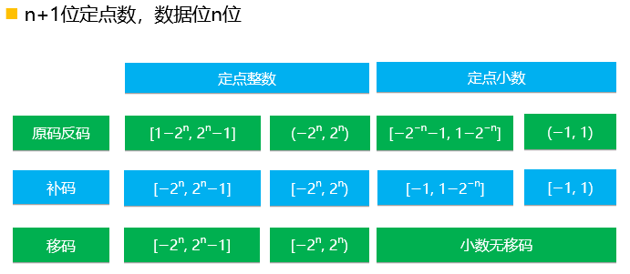
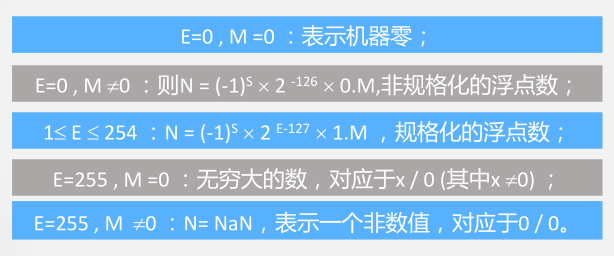
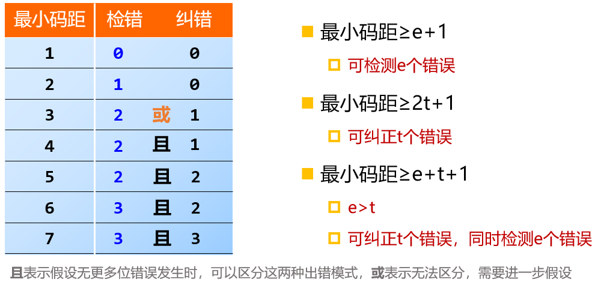

[toc]

# 计算机组成原理

## 冯·诺依曼结构计算机工作原理及层次结构分析

### 工作原理

存储程序：将程序存放在计算机的存储器中（存储系统构建与快速访问）

程序控制：按指令地址访问存储器并取出指令，经译码依次产生指令执行所需的控制信号，实现对计算的控制，完成指令的功能（指令系统、控制器设计等）

### 组成

#### 硬件

- 运算器：完成算术运算、逻辑运算、基本结构为ALU+寄存器+连接通路。
- 控制器：产生指令执行过程所需要的所有控制信号，控制相关功能部件执行相应操作
  - 产生控制信号的依据：指令、状态、时序
  - 控制信号产生方式：微程序、硬布线

- 存储器：存储原程序、原数据、运算中间结果
  - 工作模式：读/写。
  - 工作原理：按地址访问，读/写数据。
- 输入、输出设备：向计算机输入数据、输出处理结果。

#### 软件

- 核心：算法
- 表现形式：程序和数据
- 可运行的思想和内容的数字化

#### 关系

- 相互依存
- 逻辑等效性（某些功能可以用硬件实现，也可以用软件实现。）
- 协同发展

### 层次结构

- 透明性概念（举例理解：硬件的特性对C语言程序设计者而言就具有透明性。）
- 上图中的蓝色矩形为软硬件的分界线。

## 计算机系统性能评价

### 非时间指标

#### 机器字长

- 指机器一次能处理的二进制位数
- 由加法器、寄存器的位数决定
-  一般与内部寄存器的位数相等（字长）
- 字长越长，表示数据的范围就越大，精确度越高
- 目前常见的有32位和64位字长 

#### 总线宽度

- 数据总线一次能并行传送的最大信息的位数
- 一般指运算器与存储器之间的数据总线位数
- 有些计算机内部与外部数据总线宽度不一致
  - 8086、80286、80386内外数据总线等宽
  - 8088、80386SX 外部总线宽度8位内部总线宽度16位
  - Pentium外总线64位，内总线32位（两条32位流水线）

#### 主存容量与存储带宽

- 主存容量：是指一台计算机主存所包含的存储单元总数
- 存储带宽： 指单位时间内与主存交换的二进制信息量，常用单位Byte/s（字节/秒）。（影响存储带宽的指标包括数据位宽和数据传输速率）。

### 时间指标

#### 主频f/时钟周期T , 外频、倍频

- 主频f：CPU工作的时钟频率，与CPU运算能力之间不是唯一的、直接关系
- 时钟周期T=1/f：计算机中最基本的、最小的时间单位。在一个时钟周期内，CPU仅完成一个最基本的动作
- 外频：指CPU与主板之间同步的时钟频率(系统总线的工作频率)
- 倍频：CPU主频与外频之间的倍数
- 主频=外频×倍频
- 超频方法：调节倍频

#### CPI

- 执行一条指令(平均)需要的时钟周期数(即T周期的个数)(Clock cycles Per Instruction)
  - 单条指令CPI 、一段程序中所有指令的CPI、指令系统CPI
- CPI=程序中所有指令的时钟周期数之和/程序指令总数=（程序中各类指令的CPI*程序中该类指令的比例）之和

#### IPC

- 每个时钟周期内执行的指令条数(强调并行)(Clock cycles Per Instruction)
- 实际上频率和IPC在真正影响CPU性能。
  - 准确的CPU性能判断标准应该是：CPU性能=IPC(CPU每一时钟周期内所执行的指令多少)*频率(MHz时钟速度)

#### MIPS

- 每秒钟CPU能执行的指令总条数 (单位：百万条/秒)(Million Instructions Per Second)
  - 

#### MFLOPS

- 计算机每秒钟执行浮点操作的次数(Million Floating-Point Operations Per Second) 
-  MFLOPS = 程序中的浮点运算次数/(执行时间×10^6^)

#### CPU时间

- 执行一段程序所需的时间(CPU时间+ I/O时间 + 存储访问时间+ 各类排队时延等)
- CPU时间 = 程序中所有指令的时钟周期数之和 * T = 程序中所有指令的时钟周期数之和 / f
- 

#### 关键

- 实际上频率和IPC真正决定CPU性能
- CPU性能 = IPC × 频率 (MHz时钟速度)

## 字符

### ASCII

- 使用7bit表示128个字符（MSB = 0）

### 汉字

#### GB2312

- 16bit表示，94*94矩阵，其行列下标即区位码
- 机内码 = 区位码 + 0xA0A0
- MSB = 1

#### 字模码

- 用点阵表示的汉字字型代码，是汉字的输出形式。字模点阵信息量大，占用存储空间大，只能用来构成汉字库，不能用于机内存储。

### Unicode

- 为所有语言中的字符分配唯一的代码
- 16 bit 字符集，65536 Unicode 字符
- UCS 
  - ISO 10646 
  - UCS-2 UCS-4
- UTF (Unicode Transform format)
  - UTF-7
  - UTF-8
  - UTF-16

## 机器数

- 数据编码需要考虑的因素：

1. 支持的数据类型
2. 能表示的数据范围
3. 能表示的数据精度
4. 存储和处理的代价
   1. 少量简单的基本符号表示大量复杂的信息
   2. 状态简单，电路实现简单
   3. 运算处理方便
5. 是否有利于软件的移植等

- 表示方法：

1. 真值：符号用“+“、“-”表示的数据表示方法。
2. 机器数：符号数值化的数据表示方法，用0、1表示符号。（原码、反码、补码）（以下不详细介绍定义，仅讨论性质，如有需要则参考[CSAPP第二章](../CSAPP/Chapter2.md)）。
3. 注：我们不能说用01表示正负，而是01用来表示符号。

### 常见机器数

#### 原码

1. 表示简单
2. 运算复杂：符号位不参与运算，加减运算不统一，需要单独设计减法器
3. 0的表示不唯一
4. 用于表示浮点数的尾数

#### 反码

1. 表示相对原码更复杂，但求反用逻辑门容易实现
2. 运算相对原码更简单：符号位参与运算（符号位进位要加到最低位），无需设计减法器，但还是要将符号位的进位位加到LSB上。
3. 0的表示不唯一

#### 补码

1. 表示相对原码更复杂
2. 运算简单：只需要设计加法器
3. 0的表示唯一
4. 补码的模：符号位的进位位的权值
5. 当X为负数时，补码等于反码末位加1
6. 简单求法：从最右侧开扫描找到第一个1，该数位左侧所有数据位取反，其他数据位不变
7. 非对称区间，左侧多一个数，补码相对原码少一个负零，多一个负一

#### 移码

1. 移码用来表示浮点数的阶码，如IEEE754中的阶码。

2. 具体实现：数值位与真值的补码相同，符号位相反。

3. 保持数据原有大小顺序，便于进行比较操作。

#### 比较

| n位  | $-2^n \le x \le 0$ | $-1\le x \le 0$    | $x\ge 0$  |
| ---- | ------------------ | ------------------ | --------- |
| 原码 | $2^n - x$          | $1-x$              | $x$       |
| 反码 | $2^{n+1}-1+x$      | $2 - 2 ^ {-n} + x$ | $x$       |
| 补码 | $2^{n+1}+x$        | $2 + x$            | $x$       |
| 移码 | $2^n + x$          |                    | $2^n + x$ |

### 定点数

- 可表示定点小数和整数
- 表示形式（X~0~为符号位）
  - 定点小数：X~0~==.==X~1~X~2~X~3~...X~n~
  - 定点整数：X~0~X~1~X~2~X~3~...X~n~==.==
- 不足：
  - 数据表示范围受限
  - 只能表示纯小数和纯整数
- 

### 浮点数

- 把数的范围和精度分别表示的一种数据表示方法。
- 规格化数：尾数最高有效位为1的数为规格化数。
  - 保障数据表示的唯一性，方便交换数据
  - 简化浮点运算算法
  - 提升表示精度，去掉左侧多余的零。
- 一般表示形式：阶码加尾数
- 一般表示形式的不足：阶码和尾数无法区分（因为连接在一起）

#### IEEE754格式

- 阶码和尾码的位数的分配实际是表示范围和精度的折衷

  

- 

- 阶码越长，表示范围越大，精度越高 (规格化)

- 阶码相同，尾数越长，数据精度越高

- 浮点数扩大了数值表示的范围， 未增加表示数值的个数

- 绝对值越大，浮点数分布越稀疏，浮点数是离散空间

- 浮点运算不满足结合律

  (2^-126^+10^20^)-10^20^ = ?    2^-126^ + (10^20^ - 10^20^) =?

## 数据校验

必要性：

- 受元器件的质量、电路故障或噪音干扰等因素的影响，数据在被处理、传输、存储的过程中可能出现错误
- 设计硬件层面的错误检测机制，可以减少基于软件检错的代价（系统观）

基本原理：增加冗余码（校验位）

### 码距

- 同一编码中，任意两个**合法**编码之间不同二进数位数的最小值。

- 校验码中增加冗余项的目的就是为了增大码距。

- 码距越大，抗干扰能力越强，纠错能力越强，数据冗余越大，编码效率低，编码电路也相对复杂

- 选择码距必须考虑信息发生差错的概率和系统能容许的最小差错率

### 奇偶校验

- 增加校验位（1位）
  - 奇校验：$P=\overline{D_1\oplus D_2\oplus \cdots\oplus D_n}$
  - 偶校验：$P=D_1\oplus D_2\oplus\cdots\oplus D_n$
- 检错码：
  - 奇校验：$G=\overline{P\oplus D_1\oplus D_2\oplus\cdots\oplus D_n}$
  - 偶校验：$G = P\oplus D_1\oplus D_2\oplus\cdots\oplus D_n$

- 特点：
  - 编码和检错都很简单
  - 编码效率高
  - 不能检测偶数位错误，无错结论不可靠，是一种错误检测码
  - 不能定位错误，不能纠错
  - 最小码距：2
- 改进：双向奇偶校验（方块校验、垂直水平校验）
  - 可以纠正一位错误
  - 可以检测出某行（列）上的奇数位错误
  - 可以检出一部分偶数位错误
  - 不能检测出错码分布在矩形四个点上的错误

- 用途：
  - 内存条
  - 一般在同步传输方式中常采用奇校验，异步传输方式中常采用偶校验

### CRC校验码

- 增加冗余码（校验位）

  - 有效信息$k$位，校验信息$r$位，则满足$N = k + r \le 2 ^ r -1$

- 生成多项式$G(x)$

  - 收发双方约定的一个$(r + 1)$位二进制数，发送方利用$G(X)$对信息多项式做模2除运算，生成校验码。接收方利用$G(X)$对收到的编码多项式做模2除运算检测差错及错误定位。
  - 最高位和最低位必须为1
  - 当被传送信息任何一位发生错误时，被生成多项式做除之后应该使余数不为0
  - 不同位发生错误时，模2除运算后余数不同
  - 对不为0余数继续进行模2除运算应使余数循环

- 

- 模2运算：加减均为按位异或，模2除法则是按模2减，不借位：

  

- 编码过程：

  - 设待编码的$k$位有效信息位组表达为多项式$M(x)$：
    $$
    M(x) = b_{k-1}x^{k-1}+b_{k-2}x^{k-2}+\cdots+b_1x+b_0
    $$

  - 将数据左移$r$位，空出校验位（冗余位），即$M(x)\cdot x^r$

  - 将$M(x)\cdot x^r$除以生成多项式$G(x)$，得到商$Q(x)$和余数$R(x)$，即
    $$
    M(x)\cdot x^r = Q(x)\cdot G(x) + R(x)
    $$

  - 将余数填充在校验位，即
    $$
    M(x)\cdot x^r + R(x) = Q(x)\cdot G(x) + R(x) + R(x) = Q(x)\cdot G(x)
    $$

- 

- 编码优化：

  - **模2除法余数运算满足结合律**，即：
    $$
    ( D(x) \% G(x) ) \oplus (D'(x)\% G(x)) = (D(x) \oplus D'(x))\% G(x)
    $$
    据此，我们可以将输入数据按位分解成2的幂次，然后分别计算其与生成多项式的模2除法的余数，最后一并相异或即可

    改进后并行编码步骤如下：

    - 首先提前计算好每一位对生成多项式的模2除法余数即$2^i\% G(x)$，作为常量置于电路中
    - 然后将输入数据的各位作为选择端接入各自的多路选择器，被选择的两个输入分别为相应的余数和0
    - 最后将所有选择器输出全部异或所得即为校验位，按照CRC编码组合方式即可获得最终编码
    - 为了能够区分奇数位错和偶数位错，加入了总偶校验码，生成和解码方式同偶校验码

- 检错过程：

  - 将收到的编码对多项式进行模2除法，结果为0则说明大概率无错，不为0则一定有错

- 纠错过程：

  - CRC一位错的纠错方法很简单，只需要将编码的电路复制一份即可，需要修改的一点是，数据位异或所得结果要与校验位组成的二进制数进行异或，这样才能得到错误的位数，原理如下：

    设数据为$D$，生成多项式为$G$，$D$模2除$G$所得余数为$R$，按照编码规则可知，编码为$C = D\cdot 2^r + R$，其中$r$为余数位数。那么假设原数据的第$i$位出错，出错数据为$D'$，则有$D'\%G = (D\oplus2^i)\%G=D\%G\oplus 2^i\%G=R\oplus 2^i\% G\Rightarrow 2^i\%G = D'\%G\oplus R$，比对结果与哪一个2的幂次与生成多项式的模2除法相等，则说明哪一位出错

- 一个需要注意的点：
  - （7，4）码能判两位错==或==纠一位错
  - （7，3）码能判两位错==且==纠一位错
  - 因为前者的余数存在重叠

### 海明校验码

- 十六位数据的海明编码表格如下：

| 编码位 | H1   | H2   | H3   | H4   | H5   | H6   | H7   | H8   | H9   | H10  | H11  | H12  | H13  | H14  | H15  | H16  | H17  | H18  | H19  | H20  | H21  | H22  |
| ------ | ---- | ---- | ---- | ---- | ---- | ---- | ---- | ---- | ---- | ---- | ---- | ---- | ---- | ---- | ---- | ---- | ---- | ---- | ---- | ---- | ---- | ---- |
| 校验位 | P1   | P2   | D1   | P3   | D2   | D3   | D4   | P4   | D5   | D6   | D7   | D8   | D9   | D10  | D11  | P5   | D12  | D13  | D14  | D15  | D16  | P6   |
| G1     | 1    |      | 1    |      | 1    |      | 1    |      | 1    |      | 1    |      | 1    |      | 1    |      | 1    |      | 1    |      | 1    |      |
| G2     |      | 1    | 1    |      |      | 1    | 1    |      |      | 1    | 1    |      |      | 1    | 1    |      |      | 1    | 1    |      |      |      |
| G3     |      |      |      | 1    | 1    | 1    | 1    |      |      |      |      | 1    | 1    | 1    | 1    |      |      |      |      | 1    | 1    |      |
| G4     |      |      |      |      |      |      |      | 1    | 1    | 1    | 1    | 1    | 1    | 1    | 1    |      |      |      |      |      |      |      |
| G5     |      |      |      |      |      |      |      |      |      |      |      |      |      |      |      | 1    | 1    | 1    | 1    | 1    | 1    |      |
| G6     |      |      |      |      |      |      |      |      |      |      |      |      |      |      |      |      |      |      |      |      |      | 1    |

- 编码步骤：

  - 首先海明编码的2的幂次的位置，即$H_{2^n}, n = 0,1,2,\ldots$，作为海明校验码

  - 然后剩余的位置依次填进数据位，如上表格所示，最终编码序列为$H_1H_2H_3H_4H_5H_6H_7H_8H_9\ldots=P_1P_2D_1P_3D_2D_3D_4P_4D_5\ldots$

  - 接着像上面表格中显示的一样，由低到高竖着写出下标的二进制表示

  - 根据每一位的二进制表示，则有：
    $$
    P_i=\sum_k H_k(H_k\ne P_k,k\&2^i=2^i,\&表示按位与,\sum表示连续异或)\\
    G_i=\sum_k H_k(k\&2^i=2^i)
    $$

  - 为了能够区分奇数位错和偶数位错，这里加入了总偶校验码，生成和解码方式同偶校验码

- 检错机制：

  - 当检错码不为全0时，一定有错；检错码全0，高概率无错

- 纠错机制：

  - 一位错纠错方法：

    由海明校验码的生成可知，其校验码角码由低至高排列获取的二进制数即为出错位，因此只需要使用解码器生成相应的掩码，并于原海明码相异或即可纠错成功。

