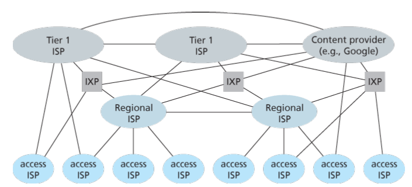
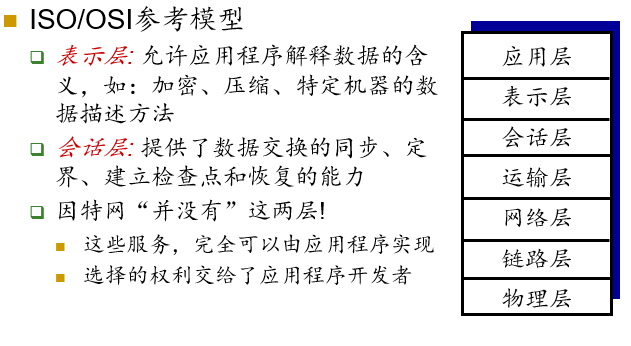
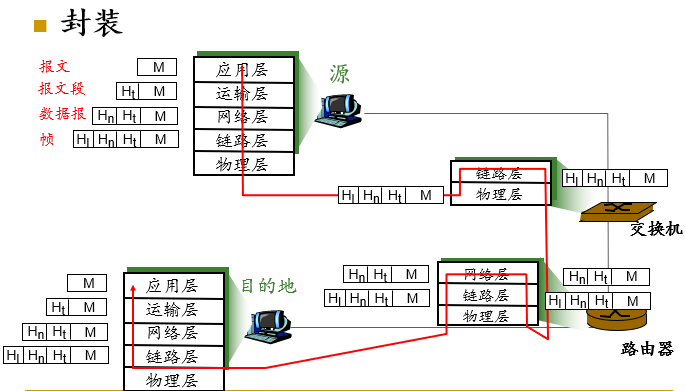
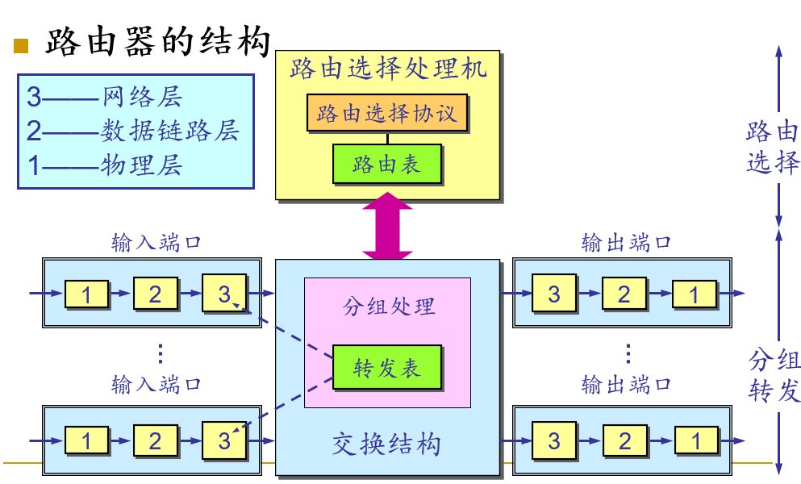
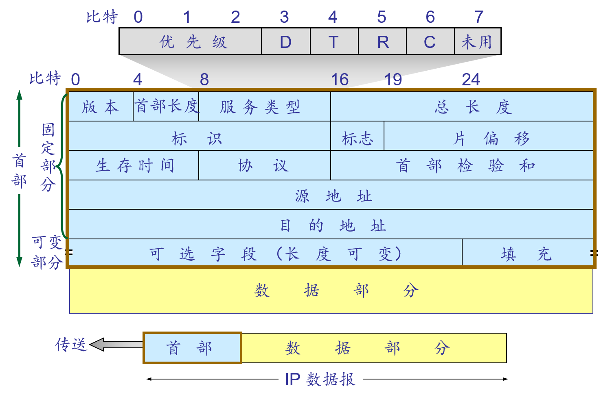
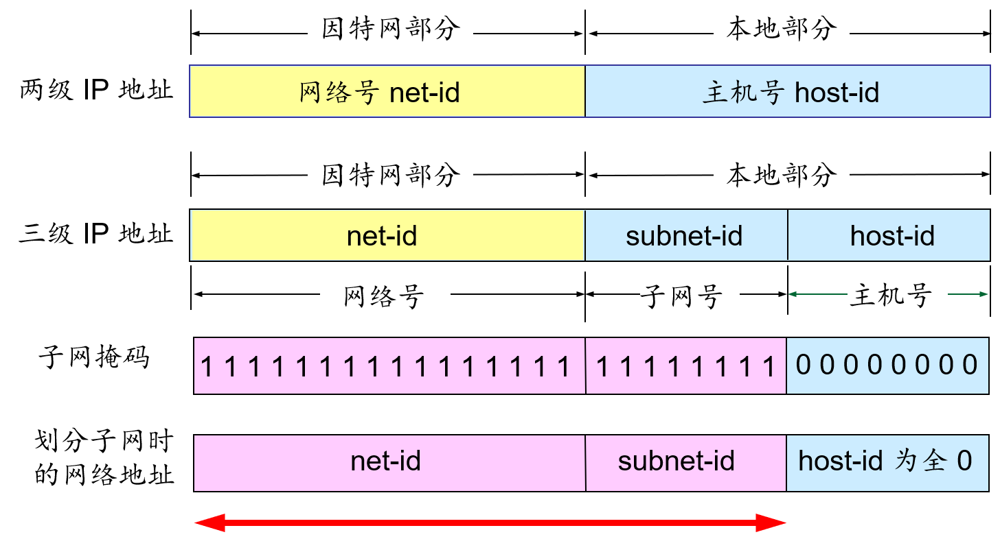
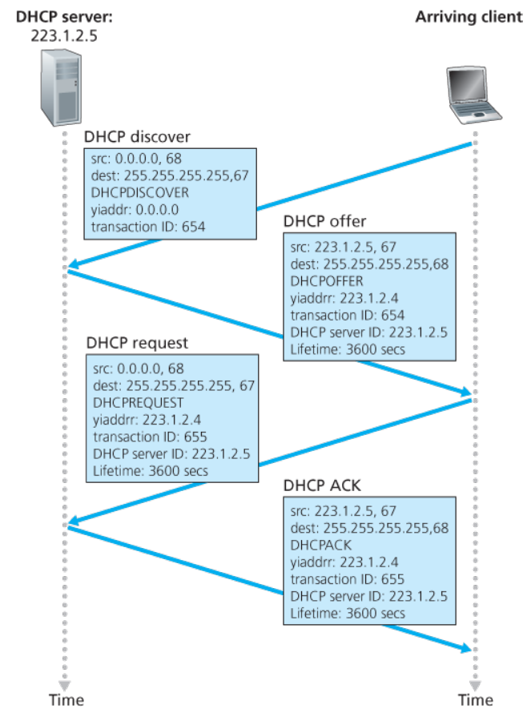
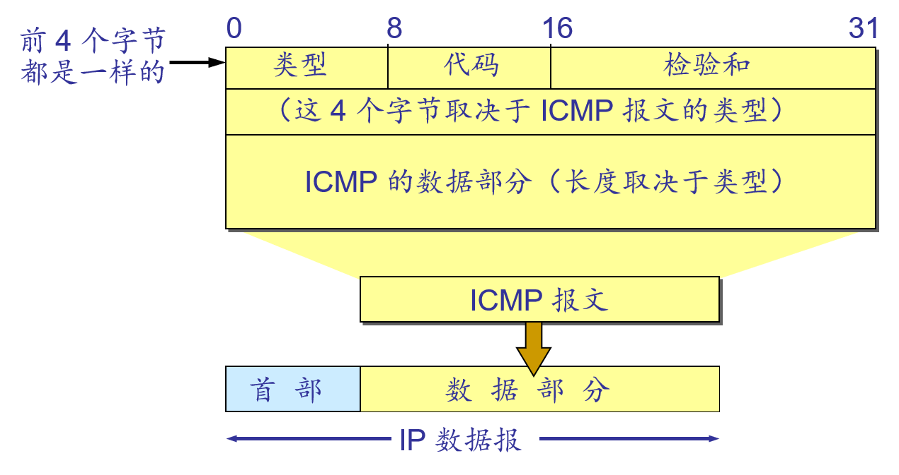
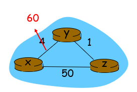

# 计算机网络笔记

[TOC]

# 计算机网络和因特网

## 因特网基本描述

### 基本构成描述

主机（host）端系统（end system）：计算机网络（Computer Network）中的设备

通信链路（communication link）分组交换机（packet switch）：连接端系统

传输速率（transmission rate）（bit/s bps）：链路传输速率

路由器（router）链路层交换机（link-layer switch）：交换机的两种主要类型，转发分组（数据块）

服务提供商（ISP Internet Service Provider）：连接端系统到因特网

因特网工程任务组（IETF Internet Engineering Task Force）：研发因特网标准（Internet Standard），其标准文档为请求评论（RFC Request For Comments）

### 服务描述

向应用程序提供服务的基础设施和编程接口。

套接字接口（socket interface）：规定了运行在一个端系统上的程序请求因特网基础设施向运行在另一个端系统上的特定目的地程序交付数据的方式。

### 协议

协议（protocol）：定义了在两个或多个通信实体之间交换的报文的格式和顺序，以及报文发送和/或接收一条报文或其他事件所采取的动作。

## 网络边缘

网络边缘——端系统

### 通信模型

1. 客户/服务器模型（C/S）。
2. 对等模型（P2P）：所有主机同时承担服务器和客户机的双重身份。

### 接入网

1. 家庭接入：
   - Modem拨号：通过本地电话回路点对点连接ISP的拨号池（通常是路由器）。
     - 速度最高可达56kbps。
     - 无法实现在上网的同时拨打电话。
   - ADSL（Asymmetric Digital Subscriber Line）拨号：DSL（Digital Subscriber Line）数字用户线。ISP是本地电话公司，每个用户使用DSL调制解调器与电话公司本地中心局的数字用户线接入复用器（DSLAM）交换数据。ASDL拨号是常用的方式，这种非对称体现在上下行速率不同。
     - 下行/上行速率最高可达55Mbps/15Mbps。
     - 采用频分复用（FDM）技术，可以边上网边打电话。
       - 0kHz—4kHz：语音
       - 4kHz—50kHz：上行
       - 50kHz—1MHz：下行
     - 带宽独享
   - 电缆因特网接入（cable Internet access）：利用的是有线电视公司现有的有线电视基础设施。该系统中使用了光线和同轴电缆，因此也叫混合光纤同轴网络（HFC Hybrid Fiber Coax）。这里使用的是电缆调制解调器（cable modem），而有线电视公司则使用的是电缆调制解调器端接系统（CMTS Cable Modem Termination System），和上述的DSLAM具有类似的功能。
     - 下行/上行速率最高可达40Mbps/30Mbps。
     - 带宽共享。
   - 光纤到户（FTTH Fiber To The Home）：从本地中心局到每户设置一根光纤，实际上许多家庭共享一根光纤，共有两种有竞争性的光纤分布体系结构：有源光纤网络（AON Active Optical Network）、无源光纤网络（PON Passive Optical Network）。
2. 局域网接入：
   - 公司/大学的局域网（LAN） 将端系统连接到边缘路由器。
   - 以太网：通过共享或专用的链路来连接端系统和路由器，有10Mbps、100Mbps、1000Mbps、10Gbps等。
3. 无线接入：
   - 共享的无线接入网络连接端系统和路由器（通过基站）。
   - 无线局域网WiFi：802.11（最高1Gbps（802.11ac））。
   - 广域无线接入：由电信运营商提供，如3G、4G、5G，802.16(WiMAX)。

### 物理媒体

- 导引型媒体：信号沿着固体媒体被导引。
  - 双绞线：两根互相绝缘的铜导线。
    - 3类线：传统的电话线， 10Mbps以太网。
    - 5类线：100Mbps以太网。
    - 6类线：1Gbps以太网。
  - 同轴电缆：两根同心铜导体。
    - 双向传输。
    - 导引型共享媒体。
    - 基带：电缆上单信道，以太网。
    - 宽带：电缆上多信道，HFC。
  - 光缆：在玻璃光纤传播光脉冲，每一个脉冲一比特。
    - 高速，低误码率，衰减率低，不受电磁干扰，不易窃听。
    - 长途导引型传输媒体。
  
- 非导引型媒体：无线电，信号自由传播
  
  - 特性
    - 通过电磁频谱传播信号，没有物理“线路”。
    - 双向传输。
    - 传播环境影响（反射、障碍物、干扰）。
  
  - 地面微波：可达45Mbps
  - 无线局域网：2/11/54Mbps
  - 无线广域网：如3G/4G
  - 卫星（同步卫星vs低纬度卫星）：可达45Mbps的信道（或多个较小的信道），270毫秒的端到端延迟。

## 网络核心

网络核心是由互联因特网端系统的分组交换机和链路构成的网状网络。

### 电路交换

过程：

1. 建立连接
2. 交换数据
3. 释放连接

特征：

- 数据交换前需建立起一条从发端到收端的**物理**通路。
- 在数据交换的全部时间内用户**始终占用**端到端的固定传输信道。
- 交换双方可实时进行数据交换而不会存在任何延迟（？这里指排队时延）。

复用：

1. 时分复用（TDM Time Division multiplexing）：类似与操作系统的分时技术，就是将线路的使用时间划分成时间片，循环分配给各个用户。
2. 频分复用（FDM Frequency Division Multiplexing）：将线路中的通信按频率划分，分配给各个用户。

问题：

1. 计算机之间的数据交换往往具有突发性和间歇性特征，而对电路交换而言，用户支付的费用则是按用户占用线路的时间来收费的。
2. 不够灵活。只要在通话双方建立的通路中的任何一点出了故障，就必须重新拨号建立新的连接，这对紧急和重要通信是很不利的。
3. 电路交换不能够利用全部带宽。

### 分组交换

过程：

1. 在发送端，先把较长的报文划分成较短的、固定长度的数据段。
2. 每一个数据段前面添加上首部构成分组。
3. 分组交换网以“分组”作为数据传输单元。
4. 依次把各分组发送到接收端。
5. 接收端收到分组后剥去首部还原成报文。
6. 最后，在接收端把收到的数据恢复成为原来的报文。

首部的重要性：

- 每一个分组的首部都含有地址等控制信息。
- 分组交换网中的结点交换机根据收到的分组的首部中的**地址信息**，把分组转发到下一个结点交换机，用此种**存储转发**方式，最后分组就能到达最终目的地。

特征：

- 被传送的数据分成若干分组分别传送。
- 数据传输前不必预先确定分组的传输路径。
- 网络核心中的每个交换结点均为共享结点,并且都具有分组的存储/转发以及选择合适路由的能力。
- 在数据通信的过程中，网络核心断续(动态)分配传输带宽，使得通信线路的利用率得以大大提高。
- 为了提高分组交换网的可靠性，网络核心常采用网状拓扑结构，使得当发生网络拥塞或少数中间交换结点、链路出现故障时，可灵活地改变路由而不致引起通信的中断或全网的瘫痪。
- 通信网络的主干线路往往由一些高速链路构成。

转发：通过路由器将分组从源主机移动到到目的主机。

转发方式：

- 数据报网络：
  - 分组内的目的地址决定下一跳。
  - 在会话过程中路由可能改变。

- 虚电路网络
  - 每个分组携带一个标识（虚电路号），该标识决定下一跳。
  - 在呼叫建立时决定固定的路径，并在整个呼叫过程中保持不变。
  - 路由器保持每个呼叫连接的状态。

优点：

- 在相同条件下，分组交换能够比电路交换支持更多的用户。
- 当用户数较少时，分组交换能够获得比电路交换更好的性能。

问题：

- 分组在各结点存储转发时因要排队总会造成一定的时延。当网络通信量过大时，这种时延可能会很大。
- 各分组必须携带一定的控制信息（说明信息），从而带来额外开销。
- 整个分组交换网的管理和控制比较复杂。

## 网络的网络

- 网络结构1：各种端系统使用上述的各种方式接入本地的ISP，并经过该ISP接入因特网，因此该ISP称为接入ISP（access ISP）。在第一种网络结构中，我们使用单一的全球传输ISP将所有接入ISP进行互联，其中接入ISP向全球传输ISP付费，故前者被认为是客户，后者被认为是提供商。

- 网络结构2：在网络结构1中全球传输ISP显然是过于理想化的，在网络结构2中，全球传输ISP被拆分为多个。

网络结构3：上述的两种结构都是两层结构，但是还是很理想化的，因为没有哪个ISP能够无处不在，相反，在任何给定的区域，可能有一个区域有一个区域ISP（regional ISP），区域中的接入ISP与之连接。而进一步每一个区域ISP与第一层ISP（tier-1 ISP）连接，全球范围内大约有十几个第一层ISP。

- 网络结构4：在网络结构3这样一个等计划的网络结构上添加部分额外的结构：
  - 存在点（Point of Presence PoP）：存在于等级结构的所有层次，但底层的接入ISP除外。一个PoP只是提供商网络中的一台或多台路由器（在相同位置）的群组，客户ISP能够在这里与提供商ISP连接。
  - 多宿（multi-home）：规定了任何ISP，除第一层以外，可以选择与两个或者更多提供商ISP连接，这种设置可以保障一个ISP出现故障时，它仍然能够继续发送和接受分组。
  - 对等（peer）：规定了位于同一等级结构层次的相邻一对ISP能够直接将它们的网络连接在一起，使它们之间的所有流量直接连接而不是通过上游的中间ISP传输。
  - 网络交换点（IXP Internet Exchange Point）：作为一个汇合点，多个ISP能够在这里一起对等。

- 网络结构5：在网络结构4之上增加内容提供商网络（Context Provider Network）构成了网络结构5。内容提供商能够使用专用网络与较低层的ISP对等，绕过较高层ISP。

## 时延、丢包与吞吐量

时延和丢包产生原因：

1. 分组到达输入链路的速率超出了输出链路的能力。
2. 分组队列，等待转发，因此产生了四种分组时延（下详）。

### 时延

1. 节点处理时延d~proc~
   - 检查比特错误。
   - 确定输出链路。
   - 通常是低于毫秒级别。
2. 排队时延d~queue~
   - 输出链路等待传输的时间。
   - 取决于路由器的拥塞程度。
3. 传输时延d~trans~
   - 分组长度L，链路带宽R，d~trans~=L/R。
4. 传播时延d~prop~
   - 物理链路长度d，媒体中的传播速度s，d~prop~=d/s。

### 排队时延的进一步讨论

设链路带宽为R（bps），分组长度L（bits），平均分组到达速率（a），则定义流量强度k=La/R。

- k~0：平均排队时延很小，甚至为0；
- k<1：时延较小，且会随着时间推延而变小；
- k=1：时延不会变化，具体数值取决于当时队列长度；
- k>1：平均时延较大，且随着时间推延而趋于无穷。

### 丢包

原因：缓存中队列的容量有限。当分组到达队列已满时，则分组被丢弃，即丢包。

丢失的分组可能会被前一个节点、源端系统重新传输，或者根本不重传。

- 吞吐量：在发送方与接收方之间传输比特的速率（bps）。
  - 瞬时吞吐量：接收方收到文件的瞬时速率。
  - 平均吞吐量：设接收方收到一个大小为F（bit）的文件，耗时T（s），则平均吞吐量为F/T（bps）。
- 瓶颈链路一般就是通路上上吞吐量最小的那一段链路，他限制了端到端平均吞吐量。

## 协议层次和服务模型

### 基本概念

- 实体（Entity）：实体是任何可以发送和接收信息的硬件和软件进程。通常是一个特定的软件模块。
- 对等体（Peer）：不同机器上包含对应层的实体称为对等体。
- 协议（Protocol）：
  - 语法，即数据与控制信息的结构或格式。
  - 语义，即需发现何种控制信息，完成何种动作以及做出何种应答。
  - 同步，即事件实现顺序的详细说明。
- 服务（Service）：为保证上层对等体之间能互相通信，下层向上层提供的功能。
- 服务原语（Service Primitive）：服务原语是指网络相邻层间进行交互时所要交换的一些**必要**命令。
- 服务访问点（SAP Service Access Point）：服务访问点是同一系统中相邻两层的实体进行交互的地方。
- 协议数据单元（PDU Protocol Data Unit）：协议数据单元是对等层次上传送数据的单位。
- 服务数据单元（SDU Service Data Unit）：服务数据单元是层与层之间交换数据的单位（通俗讲，当前层SDU就是上层PDU）。
- 网络体系结构（Network Architecture）：网络体系结构就是层和协议的集合。
- 协议栈（Protocol Stack）：一个特定的系统所使用的一组协议（每层一个协议）称为协议栈。

### 因特网的协议栈

- 应用层：支持网络应用（FTP，SMTP，FTTP）。
- 运输层：主机间数据传输（TCP，UDP）。
- 网络层：将数据包从源端传到目的端（网际协议IP，路由选择协议）。
- 链路层：数据在网络相邻结点之间传输（PPP，以太网协议）。
- 物理层：在线路上传输比特流。

分层的理由：

- 显式的结构使得复杂系统的问题定位和不同组成部分之间的关联讨论成为可能，分层的参考模型(reference model) 可用于讨论。
- 模块化简化了系统的维护和升级，某个层次服务实现的改变对系统的其余部分是透明的。

# 网络层

## 概述

目标：实现主机到主机的通信。

服务：为运输层提供支持。

功能：

- 选路：确定分组从源到目的地所采取的端到端路径的网络范围处理过程。在全局范畴为主机之间的通信进行选路，结果反映为分组交换机上的转发表。

- 转发：将分组从一个输入链路接口转移到适当输出链路接口的路由器本地动作。分组交换机上的网络层根据转发表以及分组头部的信息，将分组向适当的链路进行转发。（接口：主机与物理链路之间的边界）

- 状态通知：通过控制消息感知网络是否发生故障（如网络是否畅通，主机是否可达，路由是否可用）。

分组交换机分类：

- 链路层交换机：根据链路层首部信息进行转发。
- 路由器：根据网络层首部信息进行转发。

### 网络服务模型

可能的服务：

- 确保交付
- 具有时延上界的确保交付
- 有序分组交付
- 确保最小带宽
- 安全性

### 实际使用的网络层服务模型

| 网络体系结构 | 服务模型                  | 带宽保证     | 无丢失保证 | 排序 | 定时   | 拥塞指示 |
| ------------ | ------------------------- | ------------ | ---------- | ---- | ------ | -------- |
| 因特网       | 尽力而为                  | 无           | 无         | 无   | 不维持 | 无       |
| ATM          | CBR（Constant Bit Rate）  | 保证恒定速率 | 是         | 有序 | 维持   | 无拥塞   |
| ATM          | ABR（Available Bit Rate） | 保证最小速率 | 无         | 有序 | 维持   | 提供指示 |

<<<<<<< HEAD
<<<<<<< Updated upstream
## 虚电路与数据报

### 虚电路
=======
### 虚电路与数据报网络

#### 虚电路
>>>>>>> Stashed changes
=======
## 虚电路与数据报

### 虚电路
>>>>>>> 2f897d6a475c7351f4353680290ea26784d3ede6

目标：使收发双方之间的路径表现得如同电话线路一般。

工作机制：

- 数据开始流动之前，呼叫建立；流动结束后要断开。

- 每一个分组携带虚电路的标识 (而不是目的主机的地址)。

- 路径上的每一个路由器必须为进行中的连接维持连接状态信息。
  - 传输层的连接仅涉及到两个端系统（end system）。

- 链路，路由器资源 (带宽、缓冲区) 可以分配给虚电路。
  - 目的：为了达到类似线路交换的性能，路由器维持连接状态信息。

组成：

- 从源到目的主机的路径。
- VC号，沿该路径的每端链路的一个号码。
- 沿该路径的每台路由器的转发表。

信令协议：

- 用于建立、维护以及断开虚电路。
- 用于ATM（Asynchronous Transfer Mode）异步传输模式，帧中继，X.25网络。
- **今天的因特网已经不再使用**。

<<<<<<< HEAD
<<<<<<< Updated upstream
### 数据报
=======
#### 数据报
>>>>>>> Stashed changes
=======
### 数据报
>>>>>>> 2f897d6a475c7351f4353680290ea26784d3ede6

特点：

- 网络层没有连接建立过程。
- 路由器不再维护连接状态信息。
- 传输报文时，使用该目的主机地址信息，同一对主机间的数据报可能会走不同的路径。
- 互联不同类型的网络更加容易。
- 启用新的服务的速度更快，更简单。

## 路由器的结构

==（TODO）==

<<<<<<< HEAD
<<<<<<< Updated upstream
## 网际协议——转发与编址
=======
## 网际协议
>>>>>>> Stashed changes
=======
## 网际协议——转发与编址
>>>>>>> 2f897d6a475c7351f4353680290ea26784d3ede6

### IP地址

#### IPv4

- 32bit主机或路由器的接口标志符，只与接口有关。

- 表示方法：点分十进制

- 分类编址：

  

- 面临的问题：
  - 地址空间消耗完了。
  - 首部长度不定，中间结点需要消耗相当的资源用于分组处理。
  - 缺少QoS（Quality of Service）。
  - 安全性不高。

#### IPv6

- 128bit
- 定长首部，40字节
- 流标签。
- ==（TODO）==

#### 从IPv4到IPv6的迁移

1. 宣布标志日，统一迁移
2. 双栈技术。
   - 新加入的设备支持双协议栈，一段链路如果源和目标均支持IPv6，则使用IPv6；任意一方不支持，则用IPv4。
   - 存在信息丢失的可能性。
3. 隧道技术。

### IPv4数据报格式

版本：4bit，如IPv4、IPv6。

服务类型：8bit，用于保证服务质量。

生存时间：分组寿命管理，每当一台路由器处理数据报时，该字段的值减1；减到0，则该分组必须丢弃。

首部检验和：16bit，只检查首部。

协议：8bit，用于标识运输层或网络层协议。

源地址、目的地址：32bit。

首部长度：4bit，单位4字节，取值范围5-15，即20-60字节。

总长度：16bit，取值范围0-65535，故理论最大长度为65535字节，但与链路层的支持相关，以太网链路MTU为1500字节。实际报文数据长度为总长度减去首部长度。

标识：16bit，网络层服务的上层传输层的同一次报文，使用相同标记，相当于每次会话使用相同标识。

标志：3bit，第1位保留，第2位标识是否能分片，第3位标识分片是否结束（1为未结束，0为结束）。

片偏移：13bit，单位8字节，该分片在分组中的偏移。

### 数据报分片实例

注：IPv6不允许路由器对分组分片。

假设有4000字节的数据报（数据字段含3980字节，首部20字节），MTU=1500字节，则分片如下：

1. 总长度：1500 = 20 + 1480，标识：x，标志：1，片偏移：0
2. 总长度：1500 = 20 + 1480，标识：x，标志：1，片偏移：185 = 1480 / 8
3. 总长度：1040 = 20 + 1020，标识：x，标志：0，片偏移：370 = 2960 / 8

### 子网划分

IP地址与子网掩码按位与即可得到网络地址。

#### 地址聚合

使用单个网络前缀通告多个网络的能力。

地址聚合针对层次型分配的IP地址极为有效。

### CIDR（Classless InterDomain Routing）

格式：`IP Addr ::= {<Net-Prefix>, <Host-ID>}`

表示法：

- 斜线记法：`192.168.0.1/24`
- 简写记法：`10.0.0.0/10 -> 10/10`

最长前缀匹配：

- 使用 CIDR 时，路由表中的每个项目由“网络前缀”和“下一跳地址”组成。在查找路由表时可能会得到不止一个匹配结果。

- 应当从匹配结果中选择具有最长网络前缀的路由：最长前缀匹配(longest-prefix matching)。

- 网络前缀越长，其地址块就越小，因而路由就越具体。

### DHCP（Dynamic Host Configuration Protocol）

- 即插即用-零配置
- 步骤：
  - DHCP服务器发现
  - DHCP服务器提供
  - DHCP请求
  - DHCP ACK
- 注意：每一步目标地址都是广播地址。
- ==（TODO）==

### NAT（Network Address Translation）

- 本地网络只要使用一个IP地址就可以和外部网络相连，包含两类地址：本地地址和全球地址。
  - 不需要从ISP处获得大批IP地址：所有设备可以使用同一个 IP地址。
  - 可以在不通知外部网络的情况下改变内网主机的IP地址。
  - 即使改变了ISP也无须改变内网主机的IP地址。

  - 内网主机对外网主机而言是不可见的、不可寻址的。（这也算是一项安全措施）。

- 实现：
  - 发送数据报：将每个外出报文的源IP地址，源端口号替换为NAT的IP地址以及新的端口号。记住每一个地址转换对（记录在 NAT 转换表中），即`<src IP Addr, src Port> -----> <NAT IP Addr, NAT Port>`
  - 接收数据报：根据NAT转换表将每个进入报文的`<NAT IP Addr, NAT Port>`替换为相应的`<src IP Addr, src Port>`

- 争议：

  - 端口号是用于进程编址的，而不是用于主机编址的。

  - 路由器应当仅处理高达第三层的分组。

  - NAT协议违反了端到端原则，即主机彼此应相互直接对话，节点不应介入修改IP地址和端口号。

  - 应使用IPv6来解决IP地址短缺问题。

- 转换方式：
  - 静态：一个本地地址对应一个全球地址。
  - 动态：一个全球地址对应多个本地地址。
  - 端口：一个本地地址的端口对应一个全球地址的端口。

- 外网主机访问内网主机的解决方案：
  - 使用端口NAT：在路由器中静态地为内网主机配置一条记录。
  - 通用即插即用（UPnP）：==（TODO）==
  - 中继：如Skype

### ICMP（Internet Control Message Protocol）

- 用于主机、路由器、网关之间交换网络层信息。
  - 错误报告：如主机、网络、端口、协议不可达等。
  - 回声请求/回答（用于**ping**应用程序）。

- 从体系结构而言，位于IP层之上，ICMP报文封装在IP分组中。

- ICMP消息：包括一个类型字段和一个编码字段。

- ICMP报文的种类有两种，即ICMP差错报告报文和ICMP询问报文。

==（TODO）==

### SDN（Software-Defined Networking）

<<<<<<< HEAD
<<<<<<< Updated upstream
==（TODO）==
=======
==（TODO）==

## 路由协议

### 选路算法

给定一组路由器以及连接路由器的链路，从中找到一条从源路由器到目标路由器“好的”路径，“好的”通常指具有最低费用的路径。

- 全局选路算法
  - 所有路由器都知道整个网络拓扑图以及链路的费用信息
  - 链路状态算法

- 分散式选路算法
  - 每个路由器仅有与其相连链路的费用信息
  - 通过迭代计算过程与相邻节点交换信息
  - 距离向量算法

- 静态选路算法
  - 随着时间的流逝，路由的变化非常缓
- 动态选路算法
  - 路由信息可以更快地发生变化
  - 周期性的更新
  - 可以响应拓扑或链路费用的变化
- 负载敏感算法
  - 链路费用会动态地变化以反映出链路的当前状况

- 负载迟钝算法
  - 链路费用不明显地反映链路的当前状况

### 链路状态（link state）选路算法

#### Dijkstra算法

- 所有节点都知道网络拓扑和链路费用
  - 通过链路状态广播获得信息
  - 所有节点具有该网络的同一个完整的视图

- 计算从某节点到网络中所有其他节点的最低费用
  - 为该节点提供转发表
- 迭代：经算法的K次迭代后，可知道到K个目的节点的最低费用路径

- O(n^2^)-------O(nlogn)
- 问题：当链路费用依赖于流量时，容易产生震荡。
- 解决方案：
  - 强制链路费用不依赖于所承载的流量
    - 无法解决高拥塞的问题，不可接受
  - 确保所有的路由器不同时运行LS算法
    - 因特网上的路由器能够自同步
    - 随机化路由器发送链路通告的时间

#### OSPF协议

- 一种分布式链路状态协议
- 洪泛链路状态信息和Dijkstra最低开销路径算法
- 发送的信息就是与本路由器相邻的所有路由器的链路状态
- 每当链路状态发生变化时，路由器才用洪泛法向所有路由器发送此信息  
- 更新过程收敛得快

- 不强制如何设置链路权值的策略，但提供对给定链路权值集合确定最低费用路径的机制

- 即使链路状态未发生变化，每30分钟广播一次链路状态

- 链路状态以OSPF通告的形式封装在OSPF报文中，由IP分组承载（协议号：89）

- OSPF路由器之间的交换都是经过鉴别的（简单的、MD5的），以确认OSPF通告的真实性，防止伪造和篡改

- OSPF通告都是有序列号的，以防止重放攻击

- OSPF中支持多条具有相同费用的路径

- OSPF支持多播选路和层次路由

### 距离向量（Distance Vector）选路算法

#### 距离向量算法

- 主要特点：迭代式、异步、分布式、自我终止式

- Bellman-Ford公式

$$
d_x(y) = \min_v\{c(x,v) + d_v(y)\}
$$

- 每个路由器中都有一张路由表，包含三个内容：目的网络号、经过的邻居路由器、距离。路由器定期向其邻居路由器传送路由表的拷贝

- 路由表的更新算法：
  - 路由器X得到相邻路由器Y的路由表，从而得知：Y到网络Z的最短距离为N
  - 如果路由器X没有到网络Z的路由条目，则添加一条经由路由器Y到网络Z距离N+1的路由条目
  - 如果路由器X已有到网络Z的路由条目，其距离为M，如果M>N+1，则更新该条目为经由路由器Y到网络Z距离N+1，否则不更新

- 特点：好消息传得快，坏消息传的慢。
- 问题：无穷计数、路由环路
- 

- 解决方案：毒性逆转
  - 对于坏消息，直接将距离置为无穷大。
  - 但毒性逆转不能解决无穷计数问题。

#### RIP协议

- 相邻两点间链路上的费用定义为1，即只考虑源到目标经过多少个路由器，或多少“跳”

- 一条路径的最大费用限制为15

- 选路更新消息每30s在邻居之间以RIP响应报文（RIP通告）的形式进行交换

- 路由器经过180s没有收到来自某个邻居的RIP通告，则认为该邻居已离线，修改选路表，向其它邻居广播

- RIP是一个运行在UDP上的应用层协议（端口520）

### 比较

- 报文的复杂性
  - LS: n 个节点, E 条链路,需要发送 O(nE)个报文 
  - DV: 只在直连的邻居之间交换报文
- 收敛速度
  - 算法收敛时间依赖于许多因素，因而是可变的
  - LS: 是一个要求O(nE)个报文的O(n^2^) 算法
    - 可能有震荡
  - DV: 收敛时间不确定
    - 可能会遇到选路环路
    - 记数到无穷问题
- 健壮性
  - LS：
    - 节点能够向其连接的链路广播不正确费用
    - 每个节点只计算自己的转发表
  - DV：
    - 一个节点可向任意或所有目的节点通告其不正确的最低费用路径
    - 每个节点的计算都会传递给它的邻居
      - 错误会通过网络进行传播

### 层次路由

问题背景：

- 因特网规模过大——数亿个目标网络
  - 路由器无法存储每台主机的选路信息
  - 路由表更新的报文广播将导致无剩余带宽供发送数据使用

- 管理自治
  - 因特网 = 网络的网络
  - 每个网络管理员可能希望能够按照自己的愿望运行和管理其网络

解决方法：

- 将路由器聚合到一个区域，“自治系统”，Autonomous System
- 在相同AS内的路由器可全部运行同样的选路算法
  - 自治系统内部选路协议（intra-autonomous system routing protocol）
    - 内部网关协议 IGP (Interior Gateway Protocol)  目前这类路由选择协议使用得最多，如 RIP 和 OSPF 协议。
  - 在不同AS内的路由器可以运行不同的自治系统内部选路协议

#### 层次OSPF

- 为了使 OSPF 能够用于规模很大的网络，OSPF 将一个自治系统再划分为若干个更小的范围，叫作区域

- 每一个区域都有一个 32 bit 的区域标识符

- 区域也不能太大，在一个区域内的路由器最好不超过 200 个
- 划分区域的好处就是将利用洪泛法交换链路状态信息的范围局限于每一个区域而不是整个的自治系统，这就减少了整个网络上的通信量。
- 在一个区域内部的路由器只知道本区域的完整网络拓扑，而不知道其他区域的网络拓扑的情况。
- OSPF 使用层次结构的区域划分。在上层的区域叫作主干区域(backbone area)。主干区域的标识符规定为0.0.0.0。主干区域的作用是用来连通其他在下层的区域。 

### BGP（Broder Gateway Protocol）

==（TODO）==

>>>>>>> Stashed changes
=======
==（TODO）==
>>>>>>> 2f897d6a475c7351f4353680290ea26784d3ede6
