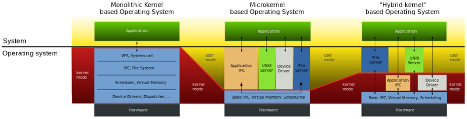
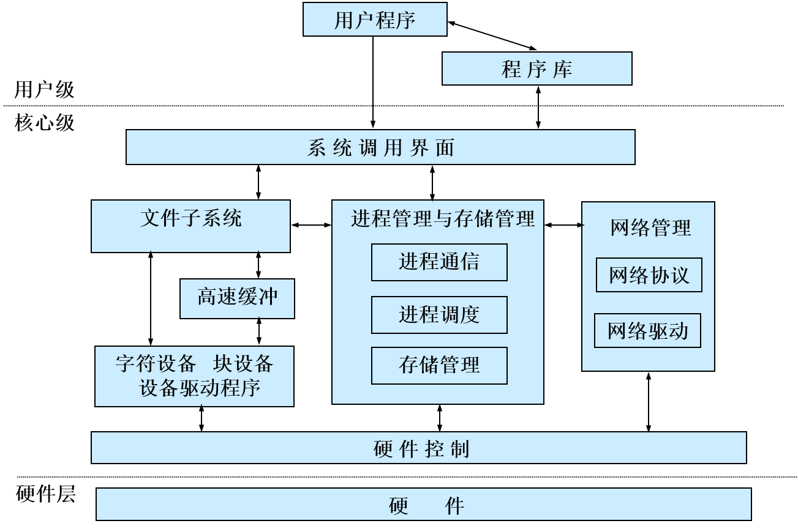
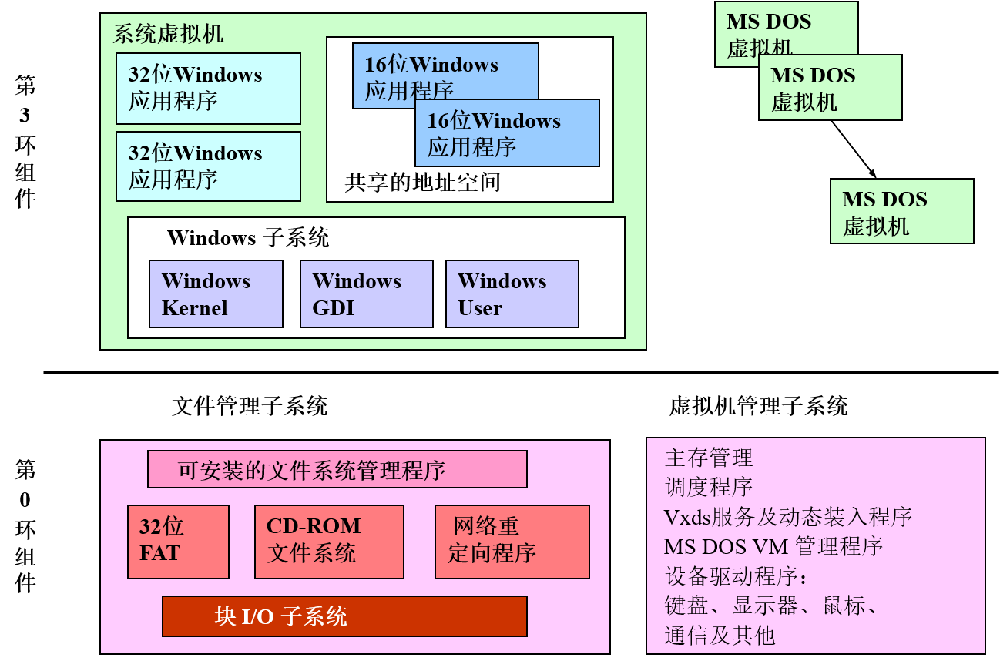
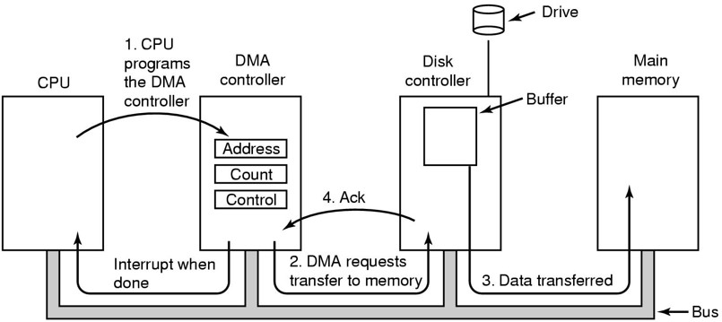
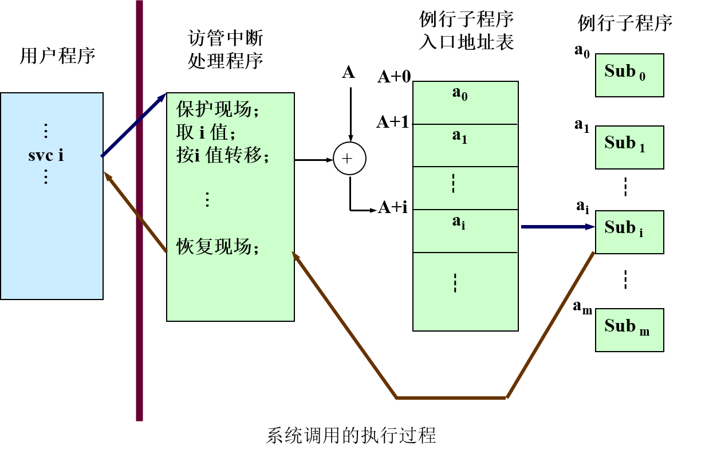

[toc]

# 操作系统

## 操作系统概述

### 计算机系统中的位置及作用

- 位置：介于裸机和应用程序之间。
- 作用：
  - 硬件：控制CPU、访问存储器、设备驱动、中断处理
  - 软件：控制、管理、提供方便的用户界面和优质服务

### 存储程序式计算机的结构与特点

- 基本部件：CPU、存储器、IO设备
- 特点：集中顺序过程控制
  - 过程性： 模拟人们手工操作
  - 集中控制：由CPU集中管理
  - 顺序性：程序计数器
- 与操作系统的矛盾：
  - 计算机系统结构是顺序计算模型
  - 操作系统是并行计算模型
- 解决方法：
  - 多道程序设计技术
  - 分时技术
  - 资源分配与调度

### 形成过程

- 手工操作阶段
  - 无任何软件
  - 人工干预
  - 独占性
  - 串行性
- 批处理阶段
  - 联机批处理
    - 监督程序&作业自动过渡
    - 问题：高速CPU与低速IO的矛盾
    - 解决办法：卫星机负责IO
  - 脱机批处理
    - 主机与卫星机并行操作
    - 问题：调度不灵活&保护问题
    - 解决办法：通道技术与中断技术
- 执行系统
  - 借助于通道与中断技术，由主机控制I/O工作。原有的监督程序不仅要负责调度作业自动地运行，而且还要提供I/O控制功能。它常驻主存，称为执行系统。
  - 主机与外设并行操作，增强了保护能力
  - 基本功能：IO控制功能与调度功能
  - 问题：主机与外设的并行是有限度的，还依赖于程序运行的特征。

### 定义与特征

- 资源共享：多个计算任务对计算机系统资源的共同享用
- 资源竞争：多个计算任务对计算机系统资源的争夺

#### 定义

操作系统是一个大型的程序系统，它负责计算机系统软、硬件资源的分配；控制和协调并发活动；提供用户接口，使用户获得良好的工作环境。

#### 特征

- 并发：能处理多个同时性活动的能力
- 共享：多个计算任务对系统资源的共同享用
- 不确定性：操作系统能处理大量的、随机的事件序列，使各用户的计算任务正确地完成

### 基本功能（资源管理功能）

- 处理机管理
  - 提出进程调度策略
  - 给出进程调度算法
  - 进行处理机的分派
- 存储器管理
  - 存储分配和存储无关性：确定各应用程序在主存中的位置及所占区域大小；应用程序无需关注存储细节，有存储管理模块提供地址重定位能力。
  - 存储保护：系统提供基址、界限寄存器等存储保护方法，使各应用程序相互隔离。
  - 存储扩充：系统提供虚拟存储技术，扩大逻辑主存。
- 设备管理
  - 设备无关性：设备无关性是指用户向系统申请和使用的设备与实际操作的设备无关，以达到方便用户、提高设备利用率的目的。
  - 设备分配：操作系统为各应用程序和运行实体分配各种设备。设备分配通常采用三种基本技术：独享、共享及虚拟技术。
  - 设备传输控制：设备的传输控制包括：启动设备、中断处理、结束处理三个方面。
- 信息管理（文件系统）
  - 信息组织
  - 存取方法
  - 文件共享
  - 文件安全
  - 文件完整性
  - 磁盘空间分配

### 基本技术

#### 多道程序设计技术

在计算机主存中同时存放几道相互独立的程序。这些程序在管理程序控制之下，相互穿插地运行。当某道程序因某种原因不能继续运行下去时(如等待外部设备传输数据)，管理程序便将另一道程序投入运行。

特征：

1. 多道
2. 宏观上并行
3. 微观上串行

#### 分时技术

所谓分时技术，是把处理机时间划分成很短的时间片(如几百毫秒)轮地分配给各个应用程序使用，如果某个程序在分配的时间片用完之前计算还未完成，该程序就暂时中断，等待下一轮继续计算。

分时处理：一台计算机与许多终端设备连接，终端用户以联机方式使用计算机。　

实时处理：计算机对于外来信息能够在被控对象允许的截止期限(deadline)内作出反应。实时处理以快速反应为特征，对实时信号能在截止期限之内处理并作出反应。实时处理具有实时性和可预测性。

### 基本类型

#### 批量操作系统

批量操作系统是操作系统的一种类型。该系统把用户提交的程序组织成作业形式。作业成批送入计算机，然后由作业调度程序自动选择作业，在系统内多道运行。早期计算机一般都配置批量操作系统。

特点：

1. 吞吐率高，多道运行，合理搭配作业
2. 作业周转时间长，用户使用不方便

#### 分时操作系统

分时操作系统是操作系统的另一种类型。它一般采用时间片轮转的办法，使一台计算机同时为多个终端用户服务。该系统对每个用户都能保证足够快的响应时间，并提供交互会话功能。

特点：

1. 并行性
2. 独占性
3. 交互性

#### 实时操作系统

实时操作系统对外部输入的信息，能够在规定的时间内处理完毕并作出反应。

特点：

1. 可靠性和安全性
2. 及时响应

类型：

1. 实时控制：生产过程控制、作战指挥
2. 实时信息处理：订机票、情报检索

- 实时系统：配置了实时操作系统的系统。
  - 分类
    - 硬实时系统：系统必须满足应用程序对截止期限的要求，若错过了截止期
      限，将导致灾难性后果。
    - 软实时系统：系统中截止期限被错过的情况下，只造成系统性能下降而不会带来严重后果。

#### 个人计算机操作系统

略

#### 多处理机系统

多处理机系统也称并行系统或紧耦合系统。

定义：

1. 包含两个或多个功能相当的处理器
2. 所有处理器共享一个公共内存
3. 所有处理器共享I/O通道、控制器和外围设备
4. 由一个操作系统控制

特点：

1. 具有并行处理能力
2. 紧耦合、存在瓶颈、可扩展性差
3. 不支持大规模并行计算、不支持分布处理

#### 网络操作系统

网络操作系统除了具备一般操作系统应具有的功能模块外 (如系统核心、设备管理、存储管理、文件系统等)，还要增加一个网络通信模块。该模块由通信接口中断处理程序、通信控制程序以及各级网络协议软件组成。 

特点：

1. 多个处理部件
2. 无公共内存
3. 具备消息通信机制

局限性：

1. 不能支持透明的资源存取
2. 不能对网络资源进行有效、统一的管理
3. 不能支持合作计算         

#### 分布式系统

定义：

1. 包含多个通用资源部件
2. 这些资源是分布的，并经过通信网络相互作用
3. 有一个分布式操作系统对资源进行全局和动态的管理控制
4. 系统对用户是透明的
5. 所有资源高度自治地工作，而又相互配合

特点：

1. 可扩展性
2. 增加性能
3. 高可靠性

## 结构与硬件支持

### 操作系统虚拟机

- 在裸机上配置了操作系统程序后就构了操作系统虚拟机。操作系统的核心在裸机上运行；用户程序在扩充后的机器上运行。

- 裸机的指令系统：机器指令

- 操作系统的指令系统：
  1. 操作命令：作业控制语言、键盘命令、图形化用户界面（命令接口）
  2. 系统功能调用（程序接口）

### 结构

1. 单体结构
2. 模块化结构
3. 可扩展内核结构
4. 层次结构

1. Monolithic Kernel
   1. Entire operating system is placed in kernel space.
   2. All OS code runs in privileged mode (ring 0 on x86).
   3. Different functions of the OS are divided into subsystems.
   4. Higher performance at the expanse of poorer modularity and separation of components.
2. Micro-Kernel
   1. Bare minimum of code runs in kernel space.
      1. Basic addressing, IPC, and scheduling.
      2. Under 10,000 LOC as a rule of thumb.
   2. Rest of the OS is divided into a collection of servers running in userspace, generally with lower privileges.
   3. Excellent modularity, but performance suffers.

1. Hybrid Kernel

### 层次结构

基本结构如下：

- 裸机
- 初级中断处理，进程控制与进程通信，处理机分派
- 存储管理
- IO处理
- 文件存取
- 资源分配和调度

#### UNIX

- 硬件
- 核心层：处理机管理、存储管理、设备管理、文件系统
- 实用层
- 其他应用程序

#### Linux

#### Windows

### 处理机特权级

- 系统中两类程序：
  - 管理程序：管理系统资源、控制程序运行。
  - 用户程序：提出申请使用资源，被管理程序控制。

- 处理机状态的意义：保护操作系统

- 处理机状态：也称为处理机特权级，是中央处理机的工作状态。当前处理机正在执行哪类程序，决定处理机的态。
  - 管态（Supervisor mode）：操作系统的管理程序执行时机器所处的状态。在此状态下处理机可使用全部指令(包括一组特权指令)；使用全部系统资源(包括整个存储区域)。
  - 用户态（User mode）：用户程序执行时机器所处的状态称为用户态。在此状态下禁止使用特权指令，不能直接取用资源与改变机器状态，并且只允许用户程序访问自己的存储区域。
- 处理机状态的特权指令集：
  - 涉及外部设备的输入输出指令
  - 修改特殊寄存器的指令
  - 改变机器状态的指令

- 实例：
  - DOS：不分态
  - Windows：用户态（Ring 3）、系统态（Ring 0）、Ring 1&2预留
  - Unix/Linux：核态（00）、管态（01）、用户态（11）

### 中断与异常

- 中断——Interrupt ReQuest (IRQ)

- 异常——Exception

- i386中对异常和中断的描述：

  Exceptions and interrupts are both "**protected control transfers**," which cause the processor to switch from user to kernel mode (CPL=0) **without giving the user-mode code any opportunity to interfere with the functioning of the kernel or other environments**. In Intel's terminology, an interrupt is a protected control transfer that is caused by an **asynchronous event** usually **external** to the processor, such as notification of external device I/O activity. An exception, in contrast, is a protected control transfer caused **synchronously** by the **currently running code**, for example due to a divide by zero or an invalid memory access.

- 异常是由于程序的行为（如除0错、缺页等）导致的同步事件，必须由计算机立刻处理。处理完成后，回到程序发生异常处继续执行。

- 软中断是由处理机内部事件引起的中断，一般叫trap，是一种同步事件，处理机将在引起该中断的指令后，跳转到处理程序，处理完后，回到下一条指令继续运行。

- 中断是指某个事件（例如键盘输入、I/O传输结束等）发生时，系统中止现行程序的运行、引出处理事件程序对该事件进行处理，处理完毕后返回现行程序的下一条指令，继续执行。中断处理的时机在指令的间隙，当前指令执行完毕后会检测是否有中断到达，并由系统决定是否进入中断处理。

- 中断源：引起中断的事件称中断源，如打印完成中断，其中断源是打印机。

- 断点：发生中断时正在运行的程序被暂时停止，程序的暂停点称为断点。例如，某程序正在执行0200地址的指令被中断，那么，0200地址就是断点， 在中断返回时就执行0200的下一条指令。

- 中断响应：是处理机发现有中断请求时，中止现运行程序的执行并自动引出中断处理程序的过程。

- 中断装置：指发现中断，响应中断的硬件。

- 中断处理程序：由软件来完成。

- 中断系统 = 中断装置 + 中断处理程序。

- 中断由软硬件协同处理。

- 中断分类
  - 功能分类
    - 输入输出中断：输入输出中断时当外部设备或通道操作正常结束或发生某种错误时发生的中断。如IO传输结束或出错中断。
    - 外中断：对某中央处理机而言，他的外部非通道式装置所引起的中断称为外部中断。如时钟中断、操作员控制台中断、通信中断等
    - 机器故障中断：当机器发生故障时所产生的中断叫硬件故障中断。如电源故障、主存取指令错等
    - 程序性中断： 在现行程序执行过程中，发现了程序性的错误或出现了某些程序的特定状态而产生的中断称为程序性中断。这些程序性错误有定点溢出、十进制溢出、十进制数错、地址错、用户态下用核态指令、越界、非法操作等。程序的特定状态包括逐条指令跟踪、指令地址符合跟踪、转态跟踪、监视等。
    - 访管中断：对操作系统提出某种需求（如请求I/O传输、建立进程等）时所发出的中断
  - 方式分类
    - 强迫性中断：不是正在运行的程序所期待的中断。如：输入输出中断、外中断、机器故障中断、程序性中断
    - 自愿中断：是运行程序所期待的事件。如：访管中断
  - 可屏蔽性
    - 不可屏蔽中断
    - 可屏蔽中断

#### 中断响应

- 保护现场和恢复现场
  - 现场：在中断的那一时刻能确保程序继续运行的有关信息。
    - 后继指令所在主存单元号
    - 程序运行所处的状态
    - 指令执行情况
    - 程序执行的中间结果等
  - 保护现场：当中断发生时，必须立即把现场信息保存在主存中，这一工作称之为保护现场。
  - 恢复现场：程序重新运行之前，把保留的该程序现场信息从主存中送至相应的指令计数器、通用寄存器或一些特殊的寄存器中。完成这些工作称为恢复现场。
- 程序状态字（psw）
  - 反映程序执行时机器所处的现行状态的代码。
  - 内容包括指令地址、指令执行情况、处理机状态、应屏蔽的中断。
- 中断响应是当中央处理机发现已有中断请求时，中止现行程序执行，并自动引出中断处理程序的过程。
- 中断响应所需的硬件支持：指令计数器+处理机状态寄存器+系统堆栈+中断向量表
- 中断响应过程：
  1. 保留程序断点及处理机有关信息
  2. 自动转入相应的中断处理程序执行
- 中断相应的实质：交换指令地址及处理机的状态信息

#### 中断的必要硬件支持

##### 存储器

1. 主存/内存：处理机能直接访问的存储器称为主存储器，用来存放正在或将要执行的系统和用户程序和数据以及程序执行时要求的临时存储空间。

   - 只读存储器ROM(Read-only memory)： ROM称为BIOS，用来存放基本的I/O程序。

   - 随机访问存储器 RAM(random access memory)

2. 辅存/外存：处理机不能直接访问的存储器，如磁盘、磁带、光盘等，用来存放大量的数据信息。

##### DMA（Direct Memory Access）

##### 时钟硬件

1. 实时时钟（Real Time Clock，RTC）
   - 在PC机断电后仍能保存时间
   - 通过主板上的电池供电：通常与CMOS RAM集成到一块芯片上，也称为CMOS Timer
   - 可在系统初启动时读入
   - 操作系统提供实用程序可以设置系统时钟和RTC并在二者之间同步
2. 可编程间隔定时器（Programmable Interval Timer，PIT）
   - 工作模式：One-shot mode 和 Square-wave mode
   - 时钟滴答
   - 周期性地发生时钟中断（可编程设置间隔）
3. 时间戳计数器（Time Stamp Counter，TSC）
   - Pentium之后的CPU中包含的64位的寄存器
   - 在每一个震荡信号到达时，该计数器递增
   - 可为操作系统提供更准确的时间度量

## 用户接口

### 用户工作环境

1. 系统提供各种硬件、软件资源
2. 设计并提供使用方便的命令集合
3. 将OS装入计算机并初始化，形成可供使用的工作环境

### 操作系统的启动（引导）

- 将操作系统的必要部分装入主存并对系统进行初始化工作，最终使系统处于命令接收状态。
- 引导方式：现场独立引导方式（滚雪球方式）和辅助下装方式 
  - 现场独立引导方式：OS核心文件存储在系统本身的存储设备中，由系统自己将OS核心程序读入主存并运行，建立一个操作环境。适用于微机和大多数系统。
    - 初始引导
      1. 系统加电
      2. 执行初始引导程序，对系统硬件和配置进行自检，保证系统没有硬件错误
      3. 从硬盘中读入操作系统引导程序，并将控制权交给该程序模块
    - 引导程序执行
      1. 引导程序执行，将操作系统核心文件读入内存，并将控制交给核心的初始化程序
    - 核心初始化（初始化系统数据结构及参数）
      1. 系统加电建立进程有关的数据结构
      2. 获得自由存储空间的容量，建立存储管理的数据结构
      3. 建立系统设备和文件系统的数据结构
      4. 初始化时钟
    - 系统初始化
      1. 完善OS的操作环境，装载命令处理程序（或图形用户界面），并初始化
      2. 在多用户系统中，为每个终端建立命令解释进程，使系统处于命令接收状态
  - 辅助下装方式：OS主要文件不放在系统本身的存储设备中，在系统启动后执行下装操作，从另外的计算机系统中将操作系统常驻部分传送到该计算机中，使它形成一个操作环境。适用于多计算机系统、由主控机与前端机构成的系统以 及分布式系统。
- 举例：Linux系统启动过程（滚雪球方式）
  - 系统加电或复位
    - 对主存中所有的数据清零，对内存进行校验，若无错，则`CS:IP -> BIOS入口`
  - BIOS启动
    - 在ROM中的引导程序放在固定位置`FFFF:0000`，CPU从这里开始执行
      - 上电自检
      - 对硬件设备进行检测和连接，并将测得的数据送入BIOS数据区
      - 从盘中读入Boot Loader，从硬盘启动时，读入零柱面零磁道1扇区MBR（Master Boot Record），将控制权交给Boot Loader
  - Loader（引导程序）
    - 将OS读入内存，并将控制权交给OS的初始化程序
  - 系统核心初始化（Setup.s）
    - Setup
      - 检查调入内存的代码
      - 获取内存容量信息，设置设备模式
      - 屏蔽中断，准备进入保护模式
      - 设置中断描述符表（idt），全局描述符表（gdt）
      - 控制权交给Heads
    - Heads
      - 对中断向量表作准备工作
      - 检查CPU类型
      - 调用Setup_paging进行页表初始化
      - 调用main.c中的`Start_kernel()`
    - `Start_kernel()`
      - 对与CPU、内存等最基本硬件相关部分进行初始化
      - 对中断向量表进行初始化
      - 为进程调度程序作准备
      - 设置基准时钟
      - 内核的内存分配
      - 对文件系统进行初始化
      - 建立init进程（init进程对每一个联机终端建立“getty”进程，getty在终端上显示“login”，等待用户登录。）

### 处理应用程序的步骤

编辑——编译——链接——运行

### 链接类型

#### 静态链接

在生成可执行文件的时候(链接阶段)，把所有需要的函数的二进制代码都包含到可执行文件中去。因此，链接器需要知道参与链接的目标文件需要哪些函数，同时也要知道每个目标文件都能提供什么函数，这样链接器才能知道是不是每个目标文件所需要的函数都能正确地链接。如果某个目标文件需要的函数在参与链接的目标文件中找不到的话，链接器就报错了。目标文件中有两个重要的接口来提供这些信息：一个是符号表，另外一个是重定位表。
优点：

1. 在程序发布的时候就不需要的依赖库，也就是不再需要带着库一块发布，程序可以独立执行。

缺点：

1. 程序体积会相对大一些。

2. 如果静态库有更新的话，所有可执行文件都得重新链接才能用上新的静态库。

#### 动态链接

在编译的时候不直接拷贝可执行代码，而是通过记录一系列符号和参数，在程序运行或加载时将这些信息传递给操作系统，操作系统负责将需要的动态库加载到内存中，然后程序在运行到指定的代码时，去共享执行内存中已经加载的动态库可执行代码，最终达到运行时连接的目的。

优点：

1. 多个程序可以共享同一段代码，而不需要在磁盘上存储多个拷贝。

缺点：

2. 由于是运行时加载，可能会影响程序的前期执行性能。

### 用户接口

操作系统的用户界面 (或称接口) 是操作系统提供给用户与计算机打交道的外部机制。用户能够借助这种机制和系统提供的手段来控制用户所在的系统。        

1. 命令接口：用户使用操作界面来组织工作流程和控制程序的运行。
2. 程序接口：用户程序在其运行过程中，使用系统功能调用来请求操作系统的服务。

### 系统功能调用

操作系统提供实现各种功能的例行子程序为用户提供服务。

系统功能调用是用户在程序一级请求操作系统服务的一种手段，它是带有一定功能号的“访管指令”。其功能是由操作系统中的程序完成的，即由软件方法实现的。

调用方法：

1. 采用统一进管方式——系统提供
2. 访管指令`svc n`，`svc`表示机器访管指令的操作码记忆符，n为地址码（功能号）
3. 访管中断：当处理机执行到访管指令时发生中断，该中断称为访管中断，它表示正在运行的程序对操作系统的某种需求。 操作系统提供实现各种功能的例行子程序，其中的每一个功能对应访管指令的一个功能号。

